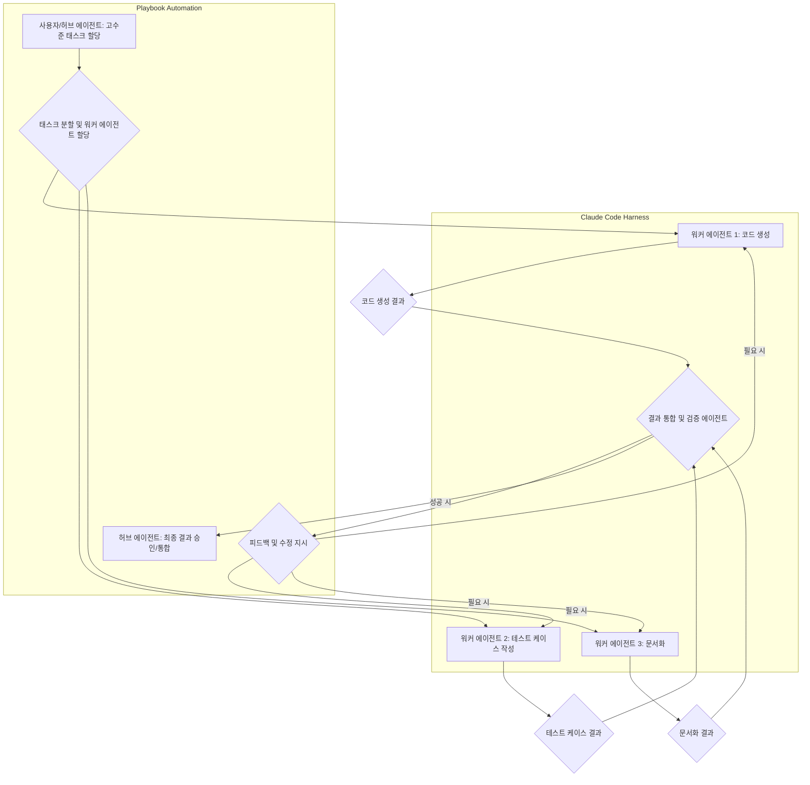

Agentic Coding은 단일 개발자 팀이 복잡한 소프트웨어 프로젝트를 효율적으로 수행할 수 있도록 지원하는 방법론입니다. 이는 LLM (Large Language Model) 에이전트가 코드 생성, 수정, 테스트 등 개발 주기의 다양한 단계에 자율적으로 참여하게 하여 마치 '코드 공장'처럼 작동하는 환경을 구축합니다. 특히 Anthropic의 Claude Code와 같은 강력한 LLM을 하네스(harness) 형태로 통합하면, 개발자는 고수준의 지시를 내리고 에이전트가 세부 구현을 담당하는 복리 자동화(compounding automation) 시스템을 구축할 수 있습니다. 본 문서에서는 이러한 Agentic Coding 방법론을 Playbook의 Claude Code 하네스 개발에 적용하여 워크플로를 최적화하는 전략을 탐구합니다.

Agentic Coding의 핵심 원칙은 다음과 같습니다.
### 자율성 (Autonomy)
에이전트는 단순히 프롬프트에 응답하는 것을 넘어, 주어진 목표를 달성하기 위해 스스로 계획을 수립하고, 중간 단계를 실행하며, 필요한 경우 계획을 수정할 수 있어야 합니다. 이는 개발 작업의 반복적인 부분을 자동화하여 개발자가 더 창의적이고 전략적인 작업에 집중할 수 있도록 합니다.
### 도구 활용 (Tool Use)
에이전트는 코드 편집기, 터미널, 버전 관리 시스템(Git), 테스트 프레임워크 등 실제 개발 환경에서 사용되는 다양한 도구들을 효과적으로 호출하고 활용할 수 있어야 합니다. Claude Code는 이러한 도구 활용을 위한 강력한 기반을 제공하며, 특히 외부 API나 시스템과의 연동을 위한 하네스 설계가 중요합니다.
### 피드백 루프 (Feedback Loops)
생성된 코드나 수행된 작업의 결과는 반드시 검증되고, 그 결과가 다음 에이전트 작업 또는 동일 에이전트의 다음 사이클에 피드백되어야 합니다. Ralph Loop는 이러한 반복적 개선의 중요성을 강조하며, OpenClaw와 같은 도구는 피드백 루프를 시스템적으로 통합하는 데 기여합니다. 효과적인 피드백 메커니즘 없이는 에이전트의 드리프트(drift)나 비효율적인 반복이 발생할 수 있습니다.

Playbook 시스템에서 Claude Code 하네스는 중앙 허브 에이전트와 여러 워커 에이전트 간의 상호작용을 중재하며, 개발 워크플로의 핵심 구성요소가 됩니다. '허브-워커 복리 자동화' 패턴은 큰 개발 태스크를 작은 서브 태스크로 분할하고, 각 서브 태스크를 전담하는 워커 에이전트에게 할당하여 병렬적이고 효율적인 처리를 가능하게 합니다.

### Claude Code 하네스 설계 원칙
1.  **모듈성(Modularity)**: 각 하네스 컴포넌트는 명확한 단일 책임을 가지며, 다른 컴포넌트와 독립적으로 개발 및 테스트될 수 있어야 합니다. 이는 유지보수성을 높이고 에이전트의 기능을 확장하기 용이하게 합니다.
2.  **컨텍스트 관리(Context Management)**: 에이전트 간의 효율적인 협업을 위해서는 이전 작업의 컨텍스트를 정확하게 전달하고 관리하는 메커니즘이 필수적입니다. `context-engineering/claude-code-ctx-plugin-context-persistence`와 같은 접근 방식은 LLM의 컨텍스트 윈도우 한계를 극복하고 장기 세션을 유지하는 데 중요합니다.
3.  **결과 검증 및 조정(Result Validation & Orchestration)**: 워커 에이전트가 생성한 코드는 자동화된 테스트, 린트(lint) 검사, 심지어 다른 검증 에이전트(critique agent)를 통해 검증되어야 합니다. 허브 에이전트는 이러한 검증 결과를 바탕으로 다음 단계를 조율하고, 필요한 경우 재시도(retry)를 지시합니다.

다음은 Playbook의 Claude Code 하네스 기반 Agentic Workflow를 간략하게 나타낸 Mermaid 다이어그램입니다.



### 코드 예시: Playbook 내 Claude Code 워커 통합 (Node.js/TypeScript)
Playbook의 워커 시스템에 Claude Code 에이전트를 통합하는 기본적인 구조입니다.
```typescript
import { Anthropic } from "@anthropic-ai/sdk";
import { ToolUseAgent } from "./tool-use-agent"; // 가상의 도구 사용 에이전트 클래스

interface AgentTask {
  id: string;
  objective: string;
  context: Record<string, any>;
  tools: string[];
}

interface AgentResult {
  taskId: string;
  output: string;
  status: "success" | "failure";
  log: string[];
}

// Claude Code 하네스 초기화
const anthropic = new Anthropic({ apiKey: process.env.ANTHROPIC_API_KEY });

// 허브 에이전트로부터 태스크를 받아 워커 에이전트를 실행하는 함수
async function executeWorkerAgentTask(task: AgentTask): Promise<AgentResult> {
  console.log(`Executing task ${task.id}: ${task.objective}`);

  const agent = new ToolUseAgent(anthropic, task.tools); // Claude Code를 활용하는 에이전트
  let currentContext = { ...task.context };
  const logs: string[] = [];

  try {
    const maxIterations = < 5; // 무한 루프 방지
    for (let i = 0; i < maxIterations; i++) {
      const response = await agent.run(task.objective, currentContext);
      logs.push(`Iteration ${i}: ${response.log}`);
      currentContext = { ...currentContext, ...response.updatedContext };

      if (response.isComplete) {
        return {
          taskId: task.id,
          output: response.finalOutput,
          status: "success",
          log: logs,
        };
      }
      // 필요 시, response.needsHumanIntervention 로직 추가
    }
    return {
      taskId: task.id,
      output: "Task reached max iterations without completion.",
      status: "failure",
      log: logs,
    };
  } catch (error: any) {
    logs.push(`Error during task execution: ${error.message}`);
    return {
      taskId: task.id,
      output: `Failed to complete task: ${error.message}`,
      status: "failure",
      log: logs,
    };
  }
}

// 실제 Playbook 워크플로에서 이 함수를 호출
/*
const hubTask: AgentTask = {
  id: "feat-auth-001",
  objective: "Implement user authentication module with JWT.",
  context: {
    project_root: "/app/src",
    framework: "Next.js",
    database: "PostgreSQL",
  },
  tools: ["file_system", "git", "terminal", "jwt_library_docs"],
};

executeWorkerAgentTask(hubTask).then(result => {
  console.log("Task result:", result);
});
*/
```
### Claude Code 하네스 개발을 위한 Playbook 최적화
'코드 공장의 구성요소'에서 제시된 Agentic Coding의 핵심은 Ralph Loop와 OpenClaw를 통해 에이전트의 작업을 효율적으로 관리하고 조정하는 것입니다. Playbook은 이러한 개념을 실질적인 자동화 워크플로로 구현하는 데 중점을 둡니다.
1.  **Ralph Loop 구현**: 에이전트가 목표를 달성할 때까지 '계획 -> 실행 -> 검증 -> 피드백' 단계를 반복하도록 설계합니다. 각 사이클에서 에이전트는 이전 시도의 결과와 피드백을 바탕으로 다음 행동을 개선합니다.
2.  **OpenClaw 기반 도구 통합**: Claude Code 에이전트가 파일 시스템 접근, Git 명령어 실행, API 호출 등 외부 도구와 상호작용할 수 있도록 견고한 인터페이스(OpenClaw 유사)를 구축합니다. 이는 에이전트의 '손과 발'이 되어 실제 코드베이스에 변경 사항을 적용할 수 있게 합니다.
3.  **컨텍스트 스냅샷 및 복원**: 에이전트 루프의 각 단계에서 현재 상태와 컨텍스트를 스냅샷으로 저장하여, 에이전트가 실패하더라도 이전 상태로 쉽게 롤백하고 재시도할 수 있도록 합니다. 이는 장기 실행 에이전트 태스크의 안정성을 높입니다.

## 트레이드오프 (Trade-offs)

### 1. 생산성 vs. 제어 (Productivity vs. Control)
*   **언제 좋은가**: 반복적이고 정형화된 작업, 빠른 프로토타이핑, 1인 개발 팀의 워크로드 감소에 탁월합니다. 에이전트가 코드를 자동 생성하고 테스트하여 전반적인 개발 속도를 크게 향상시킬 수 있습니다.
*   **언제 나쁜가**: 고도의 창의성, 미묘한 비즈니스 로직, 복잡한 시스템 아키텍처 설계 등 인간의 직관과 심층적인 도메인 지식이 필요한 작업에는 에이전트에게 전적으로 맡기기 어렵습니다. 디버깅이나 문제 발생 시 에이전트의 내부 로직을 파악하고 직접 개입하는 데 더 많은 시간이 소요될 수 있습니다.

### 2. 초기 설정 복잡성 vs. 장기적 효율성 (Initial Setup Complexity vs. Long-term Efficiency)
*   **언제 좋은가**: 장기적으로 반복될 작업이 많고, 여러 프로젝트에 걸쳐 재사용 가능한 패턴이 존재할 때 초기 투자 대비 높은 ROI를 기대할 수 있습니다. 한 번 구축된 하네스와 Playbook은 지속적으로 복리적인 효율 증대를 가져옵니다.
*   **언제 나쁜가**: 일회성 또는 매우 짧은 기간의 프로젝트, 혹은 요구사항이 자주 변경되어 워크플로 자체가 안정적이지 않은 경우에는 초기 하네스 구축 및 에이전트 학습에 드는 비용과 시간이 비효율적일 수 있습니다.

### 3. 에이전트 드리프트 vs. 적응성 (Agent Drift vs. Adaptability)
*   **언제 좋은가**: 에이전트가 새로운 도구나 API 변화에 유연하게 적응하고, 지속적인 피드백을 통해 스스로 개선해 나가는 적응형 시스템을 구축할 수 있습니다.
*   **언제 나쁜가**: 에이전트가 의도치 않은 방향으로 행동(드리프트)하거나, 예측 불가능한 결과를 도출할 수 있습니다. 특히 복잡한 상황에서 미묘한 오류를 발생시킬 경우, 이를 감지하고 수정하는 데 상당한 노력이 필요할 수 있으며, 이는 `harness-engineering/silent-drift-family-pattern`과 같은 문제를 야기할 수 있습니다.

### 4. 비용 효율성 vs. 성능 (Cost Efficiency vs. Performance)
*   **언제 좋은가**: LLM API 호출을 최적화하고, 불필요한 재시도나 긴 컨텍스트 사용을 줄여 비용을 효율적으로 관리할 수 있습니다. 특히 반복 작업에서 인간 개발자의 인건비를 대체하여 전체 비용을 절감할 수 있습니다.
*   **언제 나쁜가**: 복잡한 태스크를 해결하기 위해 많은 에이전트 상호작용과 긴 컨텍스트 윈도우를 사용하게 되면 LLM API 호출 비용이 급증할 수 있습니다. 또한, 실시간에 가까운 응답 속도가 필요한 경우, 에이전트의 처리 지연이 사용자 경험에 부정적인 영향을 미칠 수 있습니다.

## 실전 체크리스트 (Practical Checklist)

- [ ] Claude Code 하네스가 예상 출력에 대해 **90% 이상의 정확도**를 보이는가? (정확도 지표 정의 및 측정)
- [ ] 각 워커 에이전트가 **명확한 단일 책임 원칙**을 따르며, 불필요한 역할 오버랩이 없는가? (설계 문서 및 코드 리뷰를 통해 확인)
- [ ] 에이전트 간의 **컨텍스트 전달 메커니즘**이 견고하게 작동하며, 정보 손실이나 오염 없이 다음 단계로 정확하게 전달되는가? (`context-engineering/claude-code-ctx-plugin-context-persistence` 패턴 적용 확인)
- [ ] 에이전트의 작업 결과에 대한 **자동화된 검증(테스트, 린트, 스캔 등) 시스템**이 구축되어 있으며, 실패 시 적절한 피드백을 제공하는가?
- [ ] 비정상적인 에이전트 행동(드리프트)을 **감지하고 알림을 발생시키는 모니터링 시스템**이 있는가? (`harness-engineering/drift-detection-methodology` 적용)
- [ ] LLM API 호출 **비용과 성능 지표(latency, token usage)**를 지속적으로 추적하고 최적화 계획이 수립되어 있는가?
- [ ] 사용자 또는 허브 에이전트가 **에이전트의 진행 상황을 투명하게 확인**하고, 필요 시 개입하거나 중단할 수 있는 인터페이스를 제공하는가? (`frontend-ai/claude-code-session-web-mobile-monitoring-implementation`와 같은 대시보드 존재 여부)
