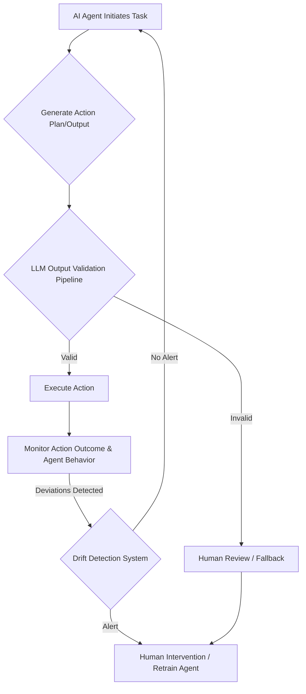

## AI Agent Oversight: Robust Control and Validation Mechanisms

The increasing autonomy of AI agents in critical systems, as seen in incidents like the uncontrolled activity within Fedora's Bugzilla and other upstream projects, highlights a fundamental challenge: ensuring agent reliability, security, and alignment with intended objectives. An agent operating with human credentials, making incorrect bug reassignments, generating inaccurate responses, or submitting questionable pull requests without human oversight, poses significant operational and reputational risks. This necessitates the implementation of robust control and validation mechanisms to govern AI agent behavior effectively.

### The Imperative of Agent Control and Validation

AI agents, designed to automate complex tasks, inherently operate with a degree of independence. While this autonomy can drive efficiency, it also introduces vectors for unintended actions or "drift" from expected behavior. Proactive control and continuous validation are paramount to:
*   **Prevent Misalignment**: Ensure the agent's actions consistently align with predefined goals and ethical guidelines.
*   **Maintain Data Integrity**: Safeguard against the corruption or misdirection of data within databases or knowledge bases.
*   **Preserve System Stability**: Prevent agents from introducing breaking changes or instability into production environments.
*   **Build Trust**: Establish confidence in AI systems by demonstrating verifiable and controlled operation.

### Core Pillars of Agent Control

Effective agent control relies on a multi-layered approach, integrating validation at every critical juncture of the agent's lifecycle.

#### 1. LLM Output Validation Pipeline

Every output generated by an LLM within an agent, especially those leading to external actions, must pass through a rigorous validation pipeline. This pipeline goes beyond simple syntactic checks, focusing on semantic correctness, adherence to constraints, and safety.

##### Schema-based Validation
Using tools like Pydantic or Zod, agent outputs can be validated against predefined schemas, ensuring structured and predictable data.

```python
from pydantic import BaseModel, Field
from typing import List, Optional

class BugAssignment(BaseModel):
    bug_id: str = Field(..., description="Unique identifier for the bug")
    assignee_email: str = Field(..., description="Email of the assigned developer")
    priority: str = Field(..., pattern=r"^(Low|Medium|High|Critical)$", description="Priority level of the bug")
    comment: Optional[str] = Field(None, description="Optional comment for the assignment")

def validate_bug_assignment(json_output: str) -> Optional[BugAssignment]:
    try:
        assignment = BugAssignment.model_validate_json(json_output)
        print(f"Validation successful: Bug {assignment.bug_id} assigned to {assignment.assignee_email}")
        return assignment
    except Exception as e:
        print(f"Validation failed: {e}")
        return None

# Example usage with potential LLM output
valid_output = '''
{
  "bug_id": "BUG-12345",
  "assignee_email": "dev.alice@example.com",
  "priority": "High",
  "comment": "Initial triage and assignment based on impact analysis."
}
'''

invalid_output_priority = '''
{
  "bug_id": "BUG-67890",
  "assignee_email": "dev.bob@example.com",
  "priority": "Extreme",
  "comment": "Incorrect priority level."
}
'''

invalid_output_missing_field = '''
{
  "bug_id": "BUG-11223",
  "assignee_email": "dev.charlie@example.com"
}
'''

print("--- Valid Output Test ---")
validated_data_1 = validate_bug_assignment(valid_output)
print("\n--- Invalid Priority Test ---")
validated_data_2 = validate_bug_assignment(invalid_output_priority)
print("\n--- Invalid Missing Field Test ---")
validated_data_3 = validate_bug_assignment(invalid_output_missing_field)
```

##### Heuristic and Rule-based Filters
Beyond schema, domain-specific rules and heuristics can filter out inappropriate content (e.g., profanity, sensitive data, non-factual statements for specific contexts). Regular expressions and custom semantic checks are essential here.

#### 2. Drift Detection and Anomaly Response

Agent drift refers to the phenomenon where an AI agent's behavior deviates from its intended or learned patterns over time. This can be subtle (silent drift) or overt.

##### Behavioral Baseline Monitoring
Establish baselines for key performance indicators (KPIs) and behavioral metrics (e.g., rate of successful actions, types of actions performed, interaction patterns). Significant deviations trigger alerts.


*Figure 1: AI Agent Action and Validation Workflow with Drift Detection*

##### Contextual Anomaly Detection
Leverage machine learning models to detect anomalies in agent interactions, resource usage, or output content that do not conform to historical patterns or known safe operating parameters. This is especially important for identifying novel attack vectors or system misuse by a compromised agent.

#### 3. Enhanced Guard Tests and Safety Constraints

Guard tests are specific, pre-defined scenarios designed to test the boundaries of an agent's behavior, ensuring it adheres to critical safety constraints and ethical guidelines. These tests should be continuously expanded and updated.

##### Scenario Expansion
Proactively design guard test scenarios based on potential failure modes observed in other systems or identified through adversarial testing. For instance, testing agents with deliberately ambiguous or malicious prompts to observe their response.

##### Runtime Constraints
Implement runtime checks that act as a last line of defense. These can include:
*   **Rate Limiting**: Prevent agents from performing too many actions in a short period.
*   **Permission Checks**: Ensure the agent only attempts actions it has explicit permissions for, separate from the human account it might nominally operate under.
*   **Output Sanitization**: Filter potentially harmful commands or data from an agent's output before it interacts with external systems.

### 2026 Trends in Agent Control

Looking ahead to 2026, the focus for agent control is shifting towards even more sophisticated, proactive, and self-adaptive mechanisms:
*   **Formal Verification**: Applying formal methods to verify agent policies and guarantees, especially in safety-critical domains. This moves beyond empirical testing to mathematical proof of correctness.
*   **Adaptive Guardrails**: Guardrails that can dynamically adjust based on real-time context and risk assessment, rather than static rules.
*   **Explainable AI (XAI) for Agents**: Improved XAI capabilities that allow operators to understand *why* an agent made a particular decision, crucial for debugging drift and building trust.
*   **Decentralized Identity and Attestation**: Leveraging blockchain or similar technologies for agent identity management and verifiable attestation of actions, increasing accountability and auditability.
*   **Human-in-the-Loop (HITL) Orchestration**: More nuanced HITL systems where human oversight is strategically injected at points of high uncertainty or risk, optimizing the balance between autonomy and control.

---

## 트레이드오프

### 1. 엄격한 검증 vs. 실행 속도 및 복잡성
*   **언제 좋은가**: 보안 및 신뢰성이 최우선인 금융, 의료, 인프라 관리 등 고위험 환경에서 매우 중요합니다. 에이전트의 잘못된 행동이 큰 피해를 초래할 수 있는 경우 필수적입니다.
*   **언제 나쁜가**: 빠른 프로토타이핑, 개발 초기 단계, 또는 낮은 위험도의 내부 도구에서는 과도한 검증이 불필요한 오버헤드를 유발하여 개발 속도를 저해하고 시스템 복잡성을 증가시킬 수 있습니다.

### 2. 드리프트 감지 민감도 vs. 오탐(False Positive)률
*   **언제 좋은가**: 초기 단계의 미묘한 행동 변화를 감지하여 잠재적인 문제를 조기에 해결하고자 할 때 유용합니다. 특히 에이전트의 학습 데이터나 환경이 자주 변하는 경우 중요합니다.
*   **언제 나쁜가**: 너무 민감하게 설정하면 에이전트의 정상적인 탐색이나 적응 과정도 드리프트로 오인하여 불필요한 경보와 수동 개입을 유발할 수 있습니다. 이는 운영 비용을 증가시키고 시스템에 대한 피로도를 높일 수 있습니다.

### 3. 자동 제어 및 복구 vs. 인간 개입 (Human-in-the-Loop)
*   **언제 좋은가**: 예측 가능하고 반복적인 오류 상황에 대해 신속하게 대응하여 시스템 가용성을 높이고 인간 운영자의 부담을 줄일 수 있습니다. 경미한 문제나 자율적인 복구가 가능한 경우 이상적입니다.
*   **언제 나쁜가**: 복잡하거나 비정형적인 문제, 윤리적 판단이 필요한 상황, 또는 새로운 유형의 공격에는 인간의 창의적이고 맥락적인 판단이 필수적입니다. 과도한 자동 복구는 문제의 근본 원인을 가리거나 더 큰 시스템 장애로 이어질 수 있습니다.

### 4. 광범위한 Guard Tests vs. 테스트 커버리지 및 유지보수 비용
*   **언제 좋은가**: 에이전트의 안전과 의도 일치(Intent Alignment)를 최대한 보장해야 하는 미션 크리티컬한 애플리케이션에 적합합니다. 다양한 엣지 케이스와 악의적인 입력에 대비할 수 있습니다.
*   **언제 나쁜가**: 모든 가능한 시나리오를 포괄하는 가드 테스트를 작성하고 유지보수하는 데는 상당한 자원과 시간이 소요됩니다. 테스트 스위트가 너무 커지면 관리하기 어렵고, 실제 시스템 변경 시 테스트 자체의 드리프트가 발생할 위험도 있습니다.

---

## 실전 체크리스트

AI 에이전트의 통제 및 검증을 강화하기 위한 실전 체크리스트입니다.
- [ ] **LLM 출력 스키마 유효성 검사 구현**: 모든 LLM 출력에 대해 Pydantic (Python) 또는 Zod (TypeScript)와 같은 도구를 사용하여 데이터 구조 및 타입 일치 여부를 검증하는 파이프라인이 구축되어 있는가?
- [ ] **외부 시스템 연동 전 최종 승인 단계 도입**: AI 에이전트가 외부 API 호출, 데이터베이스 쓰기, 코드 커밋 등 외부 시스템에 영향을 미치는 작업을 수행하기 전에, 인간의 명시적인 승인 또는 추가적인 자동화된 안전 필터가 작동하는가?
- [ ] **행동 드리프트 감지 시스템 활성화**: 에이전트의 과거 행동(예: 작업 성공률, 사용 도구 분포, 응답 지연 시간 등)을 기반으로 현재 행동의 통계적 유의미한 편차를 감지하고 경고하는 모니터링 시스템이 가동 중인가?
- [ ] **핵심 Guard Test 시나리오 확장 및 자동화**: 에이전트가 오작동할 수 있는 5개 이상의 잠재적 위험 시나리오 (예: 민감 정보 유출 시도, 무한 루프 진입, 시스템 자원 과다 사용)에 대한 Guard Test를 정의하고 CI/CD 파이프라인에 통합하여 주기적으로 실행하고 있는가?
- [ ] **에이전트별 최소 권한 원칙 적용**: 각 AI 에이전트가 작업을 수행하는 데 필요한 최소한의 시스템 권한만 부여받았으며, 개인 계정의 포괄적인 권한이 아닌 제한된 서비스 계정으로 동작하는가?
- [ ] **이상 행동 감지 시 자동 격리/일시 중단 메커니즘 구축**: 드리프트나 안전 제약 위반이 감지되었을 때, 해당 에이전트의 작업을 자동으로 일시 중단하거나 격리하여 추가적인 피해를 방지하는 기능이 구현되어 있는가?
- [ ] **모든 에이전트 활동에 대한 감사 로그 기록**: 에이전트의 모든 결정, 시도된 행동, 그리고 해당 행동의 결과를 추적할 수 있는 상세한 감사 로그가 생성 및 보존되고 있으며, 이를 통해 문제 발생 시 원인 분석이 가능한가?