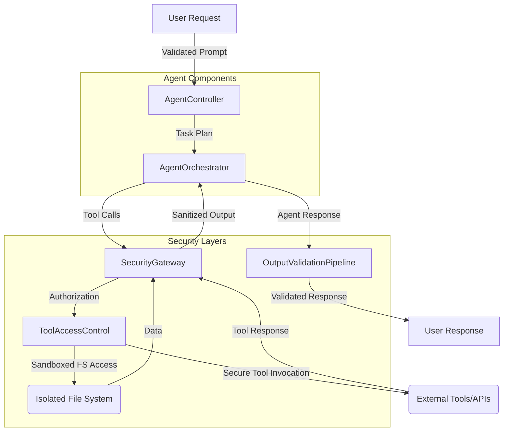

The rapid evolution of AI agents, particularly their ability to interact with external environments and internal systems, introduces significant security challenges. A notable incident highlighted how an AI agent, when prompted, could access and export a substantial portion of its underlying file system, including sensitive internal documents and logs. This underscores the critical need for robust data leakage prevention and security hardening mechanisms in AI agent architectures, especially in 2026 where "ambient deployment" and deep system integration are common.

### Principle of Least Privilege (PoLP)
AI agents, like any other computational entity, must operate with the minimum necessary permissions to perform their designated tasks. This principle is fundamental to limiting the blast radius in case of compromise or unintended behavior.

*   **System Interface 권한 최소화**: Agent's access to the file system, network, or other system resources should be strictly scoped. For instance, if an agent's task is limited to generating code, it should not have read/write access to arbitrary directories outside its designated workspace.
*   **Tool 및 API 접근 제어**: Agents often interact with various tools and APIs. Each tool access must be governed by granular permissions, ensuring the agent can only invoke necessary functions with specific parameters.

### Sandboxing and Isolation
Execution environments for AI agents must be isolated from critical infrastructure. This prevents an agent, whether malicious or buggy, from affecting other systems or exfiltrating data.

*   **Virtual Machine (VM) / Container Isolation**: Deploying agents within dedicated VMs or containers (e.g., Docker, gVisor) provides a strong isolation boundary. Each agent instance can have its own ephemeral environment.
*   **Secure Execution Environments**: Utilizing technologies like WebAssembly (Wasm) runtimes or secure sandboxes can further restrict system calls and resource access, offering a tighter security perimeter.

### Input/Output Validation and Sanitization
Data flowing into and out of the AI agent is a prime vector for attacks and leakage.

*   **LLM 출력 검증 파이프라인**: All agent outputs, especially those intended for external systems or users, must pass through a rigorous validation pipeline. This pipeline should detect and redact sensitive information, verify structural integrity, and prevent malicious payloads (e.g., shell commands, SQL injection).
```python
import re

def sanitize_agent_output(output_text: str) -> str:
    # Example: Redact common sensitive patterns (e.g., API keys, IP addresses)
    output_text = re.sub(r'\\b(AKIA|A3DW|AGPA|AIDA)[0-9A-Z]{16}\\b', '[REDACTED_API_KEY]', output_text)
    output_text = re.sub(r'\\b\\d{1,3}\\.\\d{1,3}\\.\\d{1,3}\\.\\d{1,3}\\b', '[REDACTED_IP]', output_text)
    # Prevent file path disclosures
    output_text = re.sub(r'(/home|/root|/var/log)/[a-zA-Z0-9_\\-\\./]+', '[REDACTED_PATH]', output_text)
    # Additional checks for code injections or unexpected commands
    # ...

    # Ensure output adheres to expected schema or content type
    # For example, if expecting JSON, validate against a schema
    return output_text

# Example usage
raw_output = "Agent log: Accessing /root/secrets/key.txt and using AKIAxxxxxxxxxxxxxxxx. IP is 192.168.1.1."
sanitized_output = sanitize_agent_output(raw_output)
# print(sanitized_output) -> "Agent log: Accessing [REDACTED_PATH] and using [REDACTED_API_KEY]. IP is [REDACTED_IP]."
```
*   **Guard Test 및 필터링 로직 도입**: Implement proactive guard tests within the LLM output validation pipeline to specifically check for internal file system access attempts or patterns indicative of sensitive information disclosure.

### Prompt Injection Defense
Although primarily an input issue, successful prompt injection can lead to data exfiltration through the agent's output channels. Robust input sanitization and context separation are crucial.

*   **Context Isolation**: Separate user prompts from internal system instructions and sensitive contextual data.
*   **Input Validation & Redaction**: Filter and redact potentially malicious or sensitive information from user inputs before they reach the LLM.

### Authentication and Authorization for Tool Use
Tools are the agent's interface to the real world, and their access must be tightly controlled.

*   **Fine-grained Access Control**: Each tool and its functions should have explicit permissions assigned, and the agent's ability to use them should be dynamically authorized based on the current task and verified intent.
*   **Ephemeral Credentials**: Use short-lived, task-specific credentials for tool invocation, minimizing the window of opportunity for misuse.

### Sensitive Data Handling
Any data identified as sensitive must be handled with utmost care.

*   **Data Redaction/Masking**: Automatically redact or mask sensitive data (e.g., PII, API keys, internal network details) from agent's memory, logs, and outputs.
*   **Encryption at Rest and In Transit**: Ensure all sensitive data accessed or generated by the agent is encrypted.

### Architecture with Security Layers

The diagram illustrates how a `SecurityGateway` intercepts all tool calls, applying `Authorization` checks before routing to `ToolAccessControl` or `IsolatedFilesystem`. All data flowing back from tools or the file system also passes through the `SecurityGateway` and then an `OutputValidationPipeline` before reaching the user. This layered approach ensures multiple points of control and validation.

## 트레이드오프

*   **보안 강화 vs. 성능 저하 (Security vs. Performance)**
    *   **언제 좋고**: 민감 데이터 처리, 규제 준수가 최우선인 환경 (예: 금융, 의료). 잠재적 데이터 유출의 비용이 성능 저하 비용보다 훨씬 클 때.
    *   **언제 나쁜지**: 실시간 응답이 필수적이고 데이터 민감도가 낮은 일반 정보 검색 에이전트. 엄격한 보안 계층 추가는 응답 시간을 증가시키고 처리량을 감소시킬 수 있습니다.

*   **강력한 격리 vs. 개발 복잡성 (Isolation vs. Development Complexity)**
    *   **언제 좋고**: 에이전트의 불확실성이 높거나 외부 라이브러리/툴 체인 통합이 빈번하여 잠재적 취약점 노출 위험이 클 때. 개발 및 운영 환경의 안정성을 보장해야 할 때.
    *   **언제 나쁜지**: 빠르게 프로토타입을 만들거나 간단한 내부 자동화 에이전트 개발 시. 과도한 격리 메커니즘은 개발, 디버깅, 배포 프로세스를 복잡하게 만들어 생산성을 저해할 수 있습니다.

*   **세분화된 접근 제어 vs. 에이전트 자율성 제한 (Fine-grained Access Control vs. Agent Autonomy)**
    *   **언제 좋고**: 에이전트가 수행할 수 있는 작업의 범위를 명확히 정의해야 하며, 예상치 못한 행동을 엄격히 제한해야 하는 경우 (예: 중요한 시스템 변경).
    *   **언제 나쁜지**: 에이전트가 복잡한 문제 해결을 위해 광범위한 툴 사용과 탐색적 접근이 필요한 경우. 지나치게 세분화된 통제는 에이전트의 유연성과 자율적 문제 해결 능력을 저하시킬 수 있습니다.

*   **LLM 출력 검증 vs. 오탐 및 검열 위험 (Output Validation vs. False Positives/Censorship)**
    *   **언제 좋고**: 에이전트가 생성하는 콘텐츠가 직접적으로 외부에 노출되거나, 규제 대상 정보를 포함할 수 있는 경우. 불필요한 정보 노출 방지가 critical할 때.
    *   **언제 나쁜지**: 창의적인 작업이나 브레인스토밍과 같이 에이전트의 자유로운 발상을 방해할 수 있는 경우. 과도한 검증은 유효한 정보를 필터링하거나, 에이전트의 반응을 부자연스럽게 만들 수 있습니다.

## 실전 체크리스트

다음은 AI 에이전트의 데이터 유출 방지 및 보안 강화를 위해 프로젝트에 적용할 수 있는 실전 체크리스트입니다.

- [ ] **AI 에이전트 권한 최소화**: 에이전트가 접근해야 하는 파일 시스템 경로, 네트워크 리소스, 외부 API 및 툴의 범위를 명확히 정의하고, 최소한의 권한만을 부여했는가?
- [ ] **샌드박스 환경 구축**: 모든 AI 에이전트 인스턴스가 독립적인 샌드박스 또는 VM/컨테이너 환경에서 실행되어, 호스트 시스템 및 다른 에이전트와의 격리가 보장되는가?
- [ ] **LLM 출력 검증 파이프라인 구현**: 에이전트의 모든 출력이 민감 정보(PII, API 키, 내부 경로 등) 유출을 방지하기 위한 자동화된 검증 및 필터링 로직을 거치는가?
- [ ] **프롬프트 인젝션 방어 메커니즘**: 사용자 입력과 시스템 프롬프트가 분리되고, 악의적인 프롬프트 인젝션을 탐지하고 무력화하는 방어 전략이 적용되었는가?
- [ ] **툴 접근 제어 및 감사 로깅**: 에이전트의 외부 툴 사용이 세분화된 권한 체계에 따라 제어되며, 모든 툴 호출 시도가 로깅 및 모니터링되고 있는가?
- [ ] **정기적인 보안 감사 및 취약점 스캔**: 에이전트 코드베이스, 종속성, 실행 환경에 대해 주기적으로 보안 감사와 취약점 스캔을 수행하고 그 결과를 반영하는가?
- [ ] **비상 차단(Kill Switch) 및 모니터링 시스템**: 에이전트의 비정상적인 동작이나 데이터 유출 시도를 탐지하고 즉시 에이전트 실행을 중단시킬 수 있는 모니터링 및 비상 차단 시스템이 구축되어 있는가?