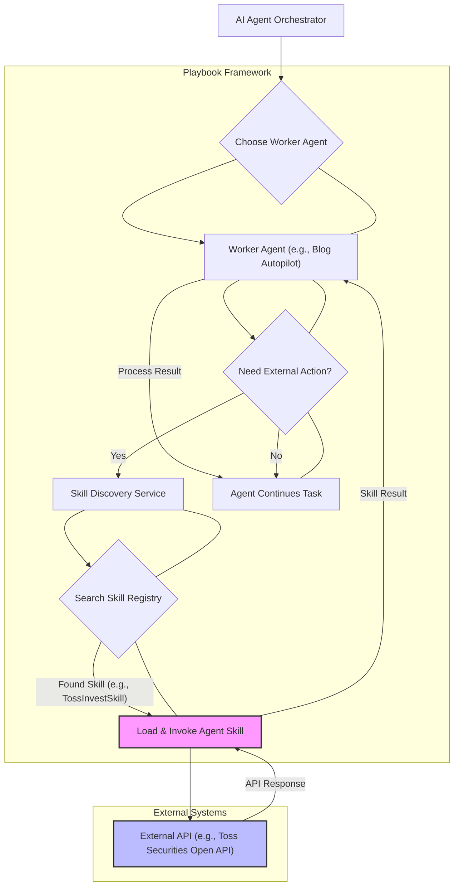

AI 에이전트가 복잡한 태스크를 수행하려면 외부 시스템과의 상호작용이 필수적입니다. 단순히 LLM이 외부 API를 직접 호출하는 방식은 비효율적이며 예측 불가능성을 높입니다. 이를 해결하기 위해 'Agent Skill'이라는 개념이 부상하고 있습니다. Agent Skill은 특정 외부 API나 시스템 기능을 AI 에이전트가 이해하고 사용할 수 있는 표준화된 형태로 추상화한 모듈입니다. 이는 에이전트의 기능을 확장하고, 동작의 일관성을 보장하며, 개발 및 관리를 용이하게 합니다.

## Agent Skill의 핵심 개념과 중요성

Agent Skill은 에이전트가 복잡한 외부 도구를 마치 자체 기능처럼 활용할 수 있도록 돕는 인터페이스입니다. 토스증권 Open API용 Agent Skill 사례처럼, 에이전트는 복잡한 API 호출 규약이나 인증 절차에 대해 직접적으로 알 필요 없이, 정의된 스킬을 호출하여 비즈니스 로직을 수행할 수 있습니다. 이는 다음과 같은 이점을 제공합니다:

*   **모듈성 및 재사용성 (Modularity and Reusability):** 각 스킬은 독립적인 기능 단위로 개발되어 여러 에이전트 또는 다른 프로젝트에서 재사용될 수 있습니다.
*   **정확성 및 신뢰성 (Accuracy and Reliability):** LLM의 환각 (hallucination) 현상을 줄이고, API 호출의 파라미터 유효성 검사, 오류 처리 등을 스킬 내부에서 구현하여 신뢰성을 높입니다.
*   **관리 용이성 (Manageability):** 외부 시스템 변경 시 스킬만 업데이트하면 되므로, 에이전트 로직 전체를 수정할 필요가 없습니다.
*   **확장성 (Extensibility):** 새로운 API나 서비스가 추가될 때마다 새로운 스킬을 개발하여 에이전트의 기능을 쉽게 확장할 수 있습니다.

## Agent Skill 개발 패턴 분석

효과적인 Agent Skill을 개발하기 위해서는 몇 가지 핵심 패턴을 고려해야 합니다.

### 1. 스킬 인터페이스 및 스키마 정의 (Skill Interface and Schema Definition)

스킬은 에이전트가 호출할 함수명, 인자, 반환 값 등에 대한 명확한 스키마를 가져야 합니다. 일반적으로 OpenAPI Specification이나 JSON Schema를 활용하여 스킬의 기능을 정의합니다. 이는 에이전트 프레임워크가 스킬을 동적으로 발견하고 올바르게 호출하는 데 필수적입니다.

```python
# Python 예시: 토스증권 주식 매수 스킬 정의
class TossInvestSkill:
    @tool
    def buy_stock(self, symbol: str, quantity: int, price: float) -> str:
        """
        지정된 가격으로 특정 주식을 매수합니다.
        symbol: 주식 티커 (예: 'AAPL', '005930')
        quantity: 매수할 주식 수량
        price: 매수 희망 가격
        """
        # 실제 토스증권 Open API 호출 로직
        # 인증, API 호출, 응답 처리, 에러 핸들링 등
        try:
            # simulated_api_call은 실제 API 호출을 대신합니다.
            response = self._simulated_api_call(
                "tossinvest/v1/buy-stock",
                {"symbol": symbol, "quantity": quantity, "price": price}
            )
            if response["status"] == "success":
                return f"{symbol} {quantity}주를 {price}원에 성공적으로 매수했습니다. 거래 ID: {response['transaction_id']}"
            else:
                return f"주식 매수 실패: {response['message']}"
        except Exception as e:
            return f"API 호출 중 오류 발생: {e}"

    def _simulated_api_call(self, endpoint: str, payload: dict) -> dict:
        import time
        time.sleep(0.5) # Simulate network latency
        if endpoint == "tossinvest/v1/buy-stock" and payload["price"] > 1000:
            return {"status": "error", "message": "지정가 매수 가격이 너무 높습니다."}
        return {"status": "success", "transaction_id": f"TXN-{int(time.time())}"}

# 에이전트가 스킬을 사용하도록 설정 (예: LangChain)
# from langchain.agents import AgentExecutor, create_react_agent
# from langchain_openai import ChatOpenAI
# from langchain import hub

# llm = ChatOpenAI(temperature=0, model="gpt-4o")
# tools = [TossInvestSkill().buy_stock]
# prompt = hub.pull("hwchase17/react")

# agent = create_react_agent(llm, tools, prompt)
# agent_executor = AgentExecutor(agent=agent, tools=tools, verbose=True)
# agent_executor.invoke({"input": "삼성전자 주식 10주를 80000원에 매수해줘."})
```

### 2. 견고한 요청 및 응답 처리 (Robust Request and Response Handling)

외부 API는 네트워크 오류, 속도 제한, 예기치 않은 응답 형식 등 다양한 문제를 발생시킬 수 있습니다. 스킬은 재시도 로직 (retry logic), 서킷 브레이커 (circuit breaker), 타임아웃 (timeout) 등을 포함하여 이러한 상황에 유연하게 대응해야 합니다. 또한, API 응답 데이터를 에이전트가 이해하기 쉬운 형태로 파싱하고 필요한 정보만 추출하는 과정이 중요합니다.

### 3. 상태 관리 및 컨텍스트 통합 (State Management and Context Integration)

일부 스킬은 이전 호출의 결과나 에이전트의 현재 상태에 따라 다르게 동작할 수 있습니다. 스킬이 에이전트의 장기 기억 (long-term memory)이나 대화 컨텍스트 (conversational context)에 접근하거나, 특정 상태를 업데이트할 수 있도록 설계해야 합니다. 이는 에이전트가 더 복잡하고 연속적인 작업을 수행하는 데 기여합니다.

### 4. 보안 및 권한 관리 (Security and Authorization)

외부 API 연동 시 API 키, OAuth 토큰 등 민감한 자격 증명 관리가 필수적입니다. 스킬은 이러한 정보를 안전하게 저장하고, 최소 권한 원칙 (principle of least privilege)에 따라 필요한 권한만 사용하도록 구현되어야 합니다. 또한, 에이전트 입력에 대한 유효성 검사 (input validation)를 통해 잠재적인 악용을 방지해야 합니다.

## Playbook 적용 검토: AI 에이전트 하네스 통합

'AI 에이전트 하네스'는 다양한 AI 에이전트 워커들의 동작을 표준화하고 관리하는 프레임워크입니다. Agent Skill은 이 하네스 내에서 `moneyballscore`나 `blog-autopilot` 같은 워커들이 외부 기능을 활용하는 표준화된 방법론이 될 수 있습니다. 이식 계획에 따르면, 토스증권 Open API용 Agent Skill의 구현 방식과 Agent Skill 프레임워크를 분석하여 기존 플레이북에 통합하는 방안을 검토합니다.

### Skill 등록 및 발견 (Skill Registration and Discovery)

플레이북은 중앙 스킬 레지스트리를 통해 사용 가능한 모든 Agent Skill을 관리할 수 있습니다. 각 스킬은 메타데이터 (설명, 스키마, 사용 예시)와 함께 등록되며, 워커 에이전트는 이 레지스트리에서 필요한 스킬을 검색하고 동적으로 로드할 수 있습니다.



### 워커 에이전트 오케스트레이션 (Worker Agent Orchestration)

플레이북의 오케스트레이션 레이어는 워커 에이전트가 스킬을 호출하는 과정을 관리합니다. 여기에는 스킬 실행 순서 결정, 병렬 실행, 결과 통합, 오류 발생 시 대체 스킬 제안 등의 로직이 포함됩니다. 이는 `agents/multi-tool-ai-agent-design-patterns-orchestration` 엔트리에서 다루는 멀티 툴 에이전트 디자인 패턴과 밀접하게 연관됩니다.

### 스킬 버전 관리 및 배포 (Skill Versioning and Deployment)

Agent Skill도 소프트웨어 컴포넌트이므로, 버전 관리 시스템 (Git)과 CI/CD 파이프라인을 통해 관리되어야 합니다. 새로운 버전의 스킬이 배포될 때, 플레이북은 하위 호환성을 보장하거나, 특정 워커 에이전트에게 특정 버전의 스킬을 할당하는 기능을 제공할 수 있습니다. 이는 `harness-engineering/agentic-skill-evolution-convergence-maturity-signal`에서 제시된 스킬 진화 관리와도 연결됩니다.

## 트레이드오프

### 1. 스킬 개발 및 유지보수 오버헤드 vs. 에이전트 신뢰성 및 확장성
*   **언제 좋음:** 복잡한 외부 시스템과의 연동이 많고, 에이전트의 안정성과 예측 가능성이 중요할 때 (예: 금융 거래, 민감한 데이터 처리). 스킬을 통해 API의 복잡성을 캡슐화하고 오류 처리 로직을 중앙 집중화하여 에이전트 개발 비용은 줄이고 신뢰성은 높일 수 있습니다.
*   **언제 나쁨:** 단순한 일회성 API 호출이거나, 외부 시스템 변경 주기가 매우 빠르며 에이전트의 유연한 즉흥성이 더 중요할 때. 스킬 정의 및 유지보수 자체가 불필요한 부담이 될 수 있습니다.

### 2. 표준화된 스킬 프레임워크 vs. 커스텀 통합의 유연성
*   **언제 좋음:** 대규모 에이전트 시스템에서 다양한 워커들이 동일한 외부 자원에 접근해야 할 때. 표준화된 프레임워크는 스킬 재사용을 촉진하고, 개발자 온보딩을 가속화하며, 일관된 보안 및 거버넌스를 적용할 수 있게 합니다.
*   **언제 나쁨:** 특정 에이전트나 워커가 매우 특수하고 최적화된 방식으로 외부 시스템과 연동해야 할 때. 표준 프레임워크의 제약이 성능 병목을 일으키거나, 불필요한 추상화 계층으로 인해 개발 복잡성을 증가시킬 수 있습니다.

### 3. 중앙 집중식 스킬 관리 vs. 분산형 스킬 생태계
*   **언제 좋음:** 보안 및 컴플라이언스가 엄격한 환경에서 모든 스킬의 가시성, 감사 가능성, 일관된 정책 적용이 필요할 때. 중앙 집중식 관리는 스킬 품질을 보장하고, 의존성 관리를 용이하게 합니다.
*   **언제 나쁨:** 빠르게 변화하는 요구사항에 맞춰 스킬을 신속하게 개발하고 배포해야 하며, 다양한 팀이 각자의 방식으로 스킬을 기여하는 오픈 생태계를 지향할 때. 중앙 집중식 관리는 병목 현상을 유발하고 혁신을 저해할 수 있습니다.

## 실전 체크리스트

Agent Skill 개발 패턴을 실제 프로젝트에 적용할 때 다음 항목들을 확인합니다:

*   [ ] **API 스키마 정의 명확성:** 각 Agent Skill이 사용하는 외부 API의 입력 및 출력 스키마가 OpenAPI 또는 JSON Schema로 명확하게 정의되어 있는지 검증합니다.
*   [ ] **강건한 오류 처리 로직:** 스킬 내부에 재시도 (retry), 서킷 브레이커 (circuit breaker), 타임아웃 (timeout) 등 네트워크 및 API 오류에 대한 견고한 처리 로직이 구현되어 있는지 확인합니다.
*   [ ] **보안 자격 증명 관리:** API 키, 토큰 등 민감한 자격 증명이 환경 변수나 보안 볼트 (vault)를 통해 안전하게 관리되며, 하드코딩되지 않았는지 점검합니다.
*   [ ] **스킬 레지스트리 통합:** 개발된 스킬이 중앙 스킬 레지스트리 (또는 플레이북의 스킬 관리 모듈)에 메타데이터와 함께 올바르게 등록되고, 동적으로 검색 및 로드 가능한지 테스트합니다.
*   [ ] **성능 및 지연 시간 (Latency) 최적화:** 스킬 호출 시 발생하는 외부 API 지연 시간을 측정하고, 필요한 경우 캐싱 (caching)이나 비동기 처리 (async processing)를 통해 최적화되었는지 확인합니다.
*   [ ] **버전 관리 및 하위 호환성:** 스킬의 변경 사항이 버전 관리 시스템으로 관리되며, 새로운 버전 배포 시 기존 에이전트 워커들과의 하위 호환성이 유지되는지 또는 마이그레이션 전략이 수립되었는지 확인합니다.
*   [ ] **모니터링 및 로깅:** 각 스킬의 실행 성공/실패 여부, 호출 횟수, 처리 시간 등에 대한 모니터링 및 로깅 시스템이 구축되어 운영 상태를 지속적으로 추적할 수 있는지 확인합니다.
