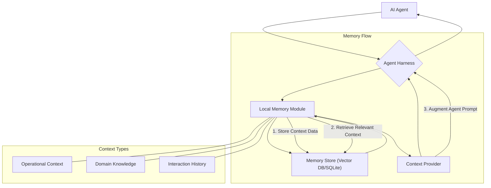

AI 에이전트는 복잡한 태스크를 수행하며 다양한 정보를 학습하고 활용합니다. 그러나 기존의 많은 에이전트 시스템은 세션이 종료되면 학습한 모든 컨텍스트를 잃어버리는 한계가 있었습니다. 서비스 포트, 특정 라이브러리 선택 이유, 이미 해결된 버그의 재발 방지책 등 핵심적인 지식들을 매번 다시 설명해야 하는 비효율은 에이전트의 생산성과 사용자 경험을 저해하는 주요 요인입니다. 이러한 문제를 해결하기 위해 에이전트 하네스(harness) 내에 세션 컨텍스트를 지속적으로 유지하는 로컬 메모리 모듈(Local Memory Module) 구현이 필수적입니다. 이 모듈은 에이전트가 다른 도구로 전환되거나 세션이 재시작되어도 과거의 학습과 경험을 '기억'하게 함으로써 재학습 비용을 절감하고, 더욱 지능적이고 일관된 작업을 수행할 수 있도록 지원합니다.

## 로컬 메모리 모듈의 필요성

2026년 현재, AI 에이전트는 점점 더 복잡한 코드 생성, 버그 수정, 시스템 설계 등 장기적인 프로젝트에 투입되고 있습니다. 이러한 환경에서 에이전트가 매번 초기화되는 것은 다음과 같은 문제를 야기합니다:

*   **비효율성 증대**: 에이전트가 이전에 수행했던 작업의 세부 사항, 의사결정 과정, 특정 문제 해결 패턴 등을 다시 학습해야 합니다. 이는 개발 시간과 비용을 불필요하게 증가시킵니다.
*   **일관성 저하**: 세션마다 다른 의사결정을 내릴 가능성이 커지며, 이는 프로젝트 전체의 일관성을 해칠 수 있습니다.
*   **사용자 피로도**: 사용자는 에이전트에게 동일한 정보를 반복적으로 제공해야 하므로, 에이전트와의 상호작용에 대한 피로도가 높아집니다.

로컬 메모리 모듈은 이러한 문제를 해결하고, 에이전트가 연속적인 작업을 수행하고 점진적으로 지식을 축적할 수 있는 기반을 마련합니다.

### 컨텍스트 분류 및 저장 전략

로컬 메모리 모듈은 다양한 유형의 컨텍스트를 효과적으로 관리해야 합니다. 주요 컨텍스트 분류와 저장 전략은 다음과 같습니다:

*   **운영 컨텍스트 (Operational Context)**: 현재 작업 중인 코드베이스의 구조, 서비스 포트, 설정 파일 경로, 사용 중인 개발 환경 변수 등 에이전트의 즉각적인 작업 수행에 필요한 정보입니다. 이는 주로 key-value 형태로 빠르고 정확하게 조회되어야 합니다.
*   **도메인 지식 (Domain Knowledge)**: 프로젝트의 아키텍처 원칙, 선호하는 라이브러리/프레임워크, 팀 내 코딩 컨벤션, 자주 발생하는 버그의 해결 패턴 등 장기적으로 에이전트의 의사결정에 영향을 미치는 지식입니다. 이는 단순한 텍스트뿐만 아니라 코드 스니펫, 문서 링크, Mermaid 다이어그램 정의 등으로 저장될 수 있으며, Semantic Search를 위한 벡터 임베딩이 유용합니다.
*   **상호작용 이력 (Interaction History)**: 사용자와 에이전트 간의 대화 기록, 에이전트가 수행했던 명령어 및 결과, 발생했던 오류와 그 해결 과정 등 과거의 경험 데이터입니다. 이는 미래의 유사한 상황에서 더 나은 의사결정을 내리는 데 활용됩니다.

## 로컬 메모리 모듈 아키텍처

로컬 메모리 모듈은 에이전트 하네스 내에 통합되어 에이전트의 컨텍스트 관리를 전담합니다. 아래 Mermaid 다이어그램은 기본적인 흐름을 보여줍니다.



### 구현 예제: Python 기반 로컬 메모리 모듈

다음은 Python을 사용한 간단한 `LocalMemoryModule` 구현 예제입니다. SQLite를 사용하여 영속성을 확보하고, 기본적인 key-value 저장을 제공합니다. Semantic Search를 위한 벡터 데이터베이스 통합은 더 복잡한 설계가 필요하지만, 여기서는 핵심 개념을 보여줍니다.

```python
import sqlite3
import json
from datetime import datetime

class LocalMemoryModule:
    def __init__(self, db_path='agent_memory.db'):
        self.conn = sqlite3.connect(db_path)
        self._init_db()

    def _init_db(self):
        cursor = self.conn.cursor()
        cursor.execute("""
            CREATE TABLE IF NOT EXISTS memory (
                key TEXT PRIMARY KEY,
                value TEXT NOT NULL,
                timestamp TEXT NOT NULL
            )
        """)
        self.conn.commit()

    def store_context(self, key: str, value: any):
        """Context를 key-value 형태로 저장합니다."""
        serialized_value = json.dumps(value)
        timestamp = datetime.now().isoformat()
        cursor = self.conn.cursor()
        cursor.execute("""
            INSERT OR REPLACE INTO memory (key, value, timestamp)
            VALUES (?, ?, ?)
        """, (key, serialized_value, timestamp))
        self.conn.commit()
        print(f"Stored context for key: {key}")

    def retrieve_context(self, key: str) -> any:
        """지정된 key에 해당하는 컨텍스트를 조회합니다."""
        cursor = self.conn.cursor()
        cursor.execute("SELECT value FROM memory WHERE key = ?", (key,))
        result = cursor.fetchone()
        if result:
            return json.loads(result[0])
        print(f"No context found for key: {key}")
        return None

    def delete_context(self, key: str):
        """지정된 key에 해당하는 컨텍스트를 삭제합니다."""
        cursor = self.conn.cursor()
        cursor.execute("DELETE FROM memory WHERE key = ?", (key,))
        self.conn.commit()
        print(f"Deleted context for key: {key}")

    def close(self):
        """데이터베이스 연결을 닫습니다."""
        self.conn.close()

# --- Usage Example ---
if __name__ == "__main__":
    memory = LocalMemoryModule()

    # Store operational context
    memory.store_context("service_port", 8080)
    memory.store_context("chosen_library", "FastAPI")

    # Store domain knowledge (more complex structure)
    project_arch = {
        "frontend": "React",
        "backend": "Python/FastAPI",
        "database": "PostgreSQL",
        "auth_strategy": "JWT"
    }
    memory.store_context("project_architecture", project_arch)

    # Store interaction history
    bug_fix_details = {
        "bug_id": "GH-123",
        "description": "API rate limit issue",
        "solution": "Implemented token bucket algorithm",
        "timestamp": datetime.now().isoformat()
    }
    memory.store_context("last_bug_fix:GH-123", bug_fix_details)

    # Retrieve context
    port = memory.retrieve_context("service_port")
    print(f"Retrieved service port: {port}")

    arch = memory.retrieve_context("project_architecture")
    print(f"Retrieved project architecture: {arch['backend']}")

    non_existent_key = memory.retrieve_context("non_existent_key")

    # Update context
    memory.store_context("service_port", 9000) # Update existing key
    updated_port = memory.retrieve_context("service_port")
    print(f"Updated service port: {updated_port}")

    memory.close()
```

## 트레이드오프

로컬 메모리 모듈을 구현할 때 고려해야 할 주요 트레이드오프는 다음과 같습니다.

*   **메모리 스토어의 복잡성 vs. 성능**: SQLite와 같은 경량 관계형 데이터베이스는 구현이 쉽고 안정적이지만, 대규모 비정형 데이터에 대한 Semantic Search나 고성능 읽기/쓰기에는 한계가 있습니다. 반면, Vector DB (예: Faiss, HNSWLib)를 사용하면 Semantic Search가 가능해지지만, 추가적인 임베딩 모델 관리와 인덱싱 오버헤드가 발생합니다. (언제 좋고/언제 나쁜지: 단순 Key-Value 저장 및 검색에는 SQLite가 좋고, 자연어 질의를 통한 컨텍스트 검색에는 Vector DB가 좋습니다. 초기 프로토타이핑 또는 소규모 컨텍스트에는 SQLite가 적합하고, 복잡한 지식 기반 에이전트에는 Vector DB가 필수적입니다.)
*   **데이터 일관성 vs. 접근 용이성**: 모든 에이전트가 중앙화된 메모리를 공유하고 엄격한 일관성(consistency)을 유지하면 데이터 무결성은 높아지지만, 네트워크 오버헤드와 단일 장애점(single point of failure)이 발생할 수 있습니다. 로컬 메모리는 에이전트별로 분리되어 접근이 빠르지만, 여러 에이전트 간의 지식 공유나 동기화 메커니즘이 필요할 수 있습니다. (언제 좋고/언제 나쁜지: 단일 에이전트의 세션 지속성에는 로컬 메모리가 적합하고, 협업하는 멀티 에이전트 시스템에서는 중앙 집중식 또는 분산 캐싱/동기화 전략이 필요합니다.)
*   **컨텍스트 스코프(Scope) vs. 메모리 사용량**: 저장하는 컨텍스트의 범위가 넓을수록 에이전트의 '기억력'은 좋아지지만, 메모리(디스크) 사용량이 증가하고 관련 컨텍스트를 검색하는 데 필요한 처리 시간이 늘어납니다. 불필요한 컨텍스트를 걸러내지 않으면 성능 저하로 이어질 수 있습니다. (언제 좋고/언제 나쁜지: 에이전트가 광범위한 도메인 지식을 필요로 하는 경우 넓은 스코프가 좋고, 특정 태스크에만 집중하는 에이전트에게는 최소한의 스코프가 성능에 유리합니다.)
*   **캐싱 전략 vs. 데이터 신선도**: 로컬 메모리 모듈에 캐싱 계층을 도입하여 자주 접근하는 컨텍스트의 로딩 속도를 높일 수 있습니다. 하지만 원본 데이터가 변경되었을 때 캐시가 무효화되지 않으면 stale data 문제가 발생합니다. (언제 좋고/언제 나쁜지: 읽기 위주로 자주 변경되지 않는 컨텍스트에는 캐싱이 효과적이며, 실시간으로 변경될 수 있는 운영 컨텍스트에는 캐시 무효화 전략이나 직접 조회가 더 안전합니다.)

## 실전 체크리스트

AI 에이전트의 로컬 메모리 모듈을 프로젝트에 적용할 때 다음 항목들을 검증해야 합니다.

- [ ] **컨텍스트 스키마 정의**: 에이전트가 저장하고 활용할 모든 컨텍스트 유형(operational, domain, interaction history)에 대한 명확한 스키마를 JSON 또는 유사한 형태로 정의했는가?
- [ ] **영속성 메커니즘 검증**: SQLite, 파일 시스템, 혹은 Vector DB 등 선택된 메모리 스토어가 세션 종료 후에도 컨텍스트를 정확히 유지하는지 확인했는가?
- [ ] **성능 벤치마킹**: 주요 컨텍스트 저장 및 검색 작업에 대한 Latency, Throughput 벤치마킹을 수행하여 에이전트의 목표 성능 지표를 충족하는지 확인했는가?
- [ ] **데이터 관리 정책**: 오래되거나 더 이상 필요 없는 컨텍스트를 자동으로 삭제하거나 보관하는 정책(TTL, LRU 등)을 구현하고 테스트했는가?
- [ ] **동시성 및 데이터 무결성**: 여러 에이전트 인스턴스가 동시에 메모리에 접근할 때 데이터 손상이나 불일치가 발생하지 않도록 잠금(locking) 또는 트랜잭션(transaction) 처리를 고려했는가?
- [ ] **보안 및 접근 제어**: 민감한 컨텍스트(API 키, 사용자 데이터 등)가 로컬 메모리에 평문으로 저장되지 않도록 암호화(encryption) 또는 접근 제어 메커니즘을 적용했는가?
- [ ] **마이그레이션 및 버전 관리**: 메모리 스키마 변경 시 기존 데이터를 안전하게 마이그레이션할 수 있는 전략과 메모리 데이터의 버전을 관리하는 방안을 수립했는가?