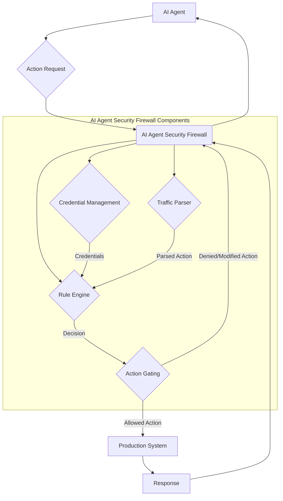

## AI 에이전트 보안 방화벽: 프로덕션 접근 제어 메커니즘

AI 에이전트의 활용이 확대됨에 따라, 이들이 프로덕션 환경에 직접 접근하여 작업을 수행하는 시나리오가 증가하고 있습니다. 이는 막대한 효율성을 제공하지만 동시에 심각한 보안 위험을 수반합니다. 기존 권한 관리 시스템은 인간 사용자를 중심으로 설계되어 있어, 자율적으로 동작하며 예측 불가능한 경로로 새로운 액션을 수행할 수 있는 AI 에이전트의 특성을 충분히 반영하지 못합니다. AI 에이전트 보안 방화벽(AI Agent Security Firewall)은 이러한 격차를 해소하고, 에이전트가 프로덕션 시스템에 접근할 때 안전성과 통제력을 확보하기 위한 핵심적인 보안 레이어입니다.

이 방화벽은 에이전트의 자격 증명(credentials)을 안전하게 관리하고, 에이전트가 수행하려는 모든 액션의 트래픽을 와이어 레벨에서 파싱(parsing)하며, 사전에 정의된 사용자 정의 규칙(user-defined rules)에 따라 해당 액션의 허용 여부를 결정하는 게이팅(gating) 메커니즘을 제공합니다. 이를 통해 에이전트의 오작동, 의도치 않은 행위, 또는 악의적인 공격으로부터 시스템을 보호할 수 있습니다.

### 핵심 구성 요소 및 작동 원리

AI 에이전트 보안 방화벽은 다음 세 가지 핵심 구성 요소로 이루어집니다.

1.  **자격 증명 관리 (Credential Management)**: 에이전트가 직접 민감한 프로덕션 자격 증명을 소유하는 대신, 방화벽이 이를 안전하게 보관하고 에이전트의 요청에 따라 필요한 권한을 일시적으로 위임합니다. 이는 최소 권한 원칙(Principle of Least Privilege)을 에이전트 환경에 적용하는 효과적인 방법입니다. 예를 들어, 에이전트가 데이터베이스 쿼리를 수행해야 할 때, 방화벽은 해당 쿼리의 유효성을 검증한 후 제한된 권한의 일회용 토큰(ephemeral token) 또는 서비스 계정(service account)을 제공할 수 있습니다.

2.  **트래픽 파싱 및 액션 인터셉션 (Traffic Parsing & Action Interception)**: 방화벽은 에이전트가 외부 시스템(API, 데이터베이스, CLI 등)과 통신하는 모든 트래픽을 가로채어 분석합니다. 이는 에이전트의 출력(output)뿐만 아니라 내부적인 도구 호출(tool calls)이나 시스템 명령(system commands)까지 포함합니다. 와이어 레벨에서의 파싱은 에이전트의 실제 의도와 행동 사이의 불일치를 탐지하는 데 필수적입니다. 예를 들어, 에이전트가 파일 삭제 명령을 내릴 때, 이 명령이 사전 정의된 화이트리스트(whitelist)에 있는지, 또는 특정 경로에 대한 접근 권한이 있는지 등을 검사합니다.

3.  **사용자 정의 규칙 기반 액션 게이팅 (User-Defined Rule-Based Action Gating)**: 관리자는 YAML, JSON 또는 DSL(Domain Specific Language) 형태로 보안 정책 규칙을 정의합니다. 이 규칙은 에이전트의 액션, 대상 리소스, 파라미터 등을 기반으로 '허용(allow)', '거부(deny)', '승인 요청(request approval)', '수정(modify)' 등의 결정을 내립니다. 이 규칙 엔진은 에이전트의 행동을 실시간으로 감시하고 제어하며, 이상 징후 발생 시 즉각적인 조치를 취할 수 있습니다.

### 아키텍처 및 흐름

다음 Mermaid 다이어그램은 AI 에이전트와 프로덕션 시스템 사이에 보안 방화벽이 어떻게 작동하는지 보여줍니다.



### 실전 코드 예제: 파이썬 기반 액션 게이트

다음은 간단한 파이썬 예제로, 에이전트의 API 호출을 가로채어 특정 조건을 검사하는 보안 게이트웨이의 개념을 보여줍니다. 실제 시스템에서는 훨씬 복잡한 규칙 엔진과 자격 증명 관리 로직이 필요합니다.

```python
import json
import re

class AgentSecurityFirewall:
    def __init__(self, rules_config_path="firewall_rules.json"):
        self.rules = self._load_rules(rules_config_path)
        self.credentials_store = {
            "prod_db_access": "secure_db_token_xyz",
            "prod_api_write": "secure_api_key_abc"
        }

    def _load_rules(self, config_path):
        with open(config_path, 'r') as f:
            return json.load(f)

    def _get_credential(self, key):
        # In a real system, this would involve secure vault access,
        # temporary token generation, and authorization checks.
        print(f"DEBUG: Attempting to retrieve credential for {key}")
        return self.credentials_store.get(key)

    def authorize_action(self, agent_id: str, action_type: str, details: dict) -> (bool, str, dict):
        """
        AI 에이전트의 액션을 승인하거나 거부합니다.
        :param agent_id: 액션을 요청한 에이전트 ID
        :param action_type: 액션의 종류 (e.g., 'api_call', 'db_query', 'file_op')
        :param details: 액션에 대한 상세 정보 (e.g., {'endpoint': '/users', 'method': 'DELETE', 'data': {'id': 123}})
        :return: (승인 여부, 메시지, 수정된 액션 세부 정보)
        """
        print(f"Firewall: Authorizing action for agent {agent_id}: {action_type} - {details}")

        for rule in self.rules:
            if rule.get("agent_id") == agent_id or rule.get("agent_id") == "*":
                if rule.get("action_type") == action_type or rule.get("action_type") == "*":
                    if self._match_details(rule.get("conditions", {}), details):
                        if rule["decision"] == "DENY":
                            return False, f"Rule '{rule['name']}' denied action.", details
                        elif rule["decision"] == "ALLOW":
                            # Check for credential requirement
                            if "requires_credential" in rule:
                                credential = self._get_credential(rule["requires_credential"])
                                if not credential:
                                    return False, f"Rule '{rule['name']}' requires missing credential '{rule['requires_credential']}'.", details
                                # In a real system, the credential would be injected or used to proxy the request
                                details['auth_token'] = credential
                            print(f"Firewall: Rule '{rule['name']}' allowed action. Modified details: {details}")
                            return True, f"Rule '{rule['name']}' allowed action.", details
                        elif rule["decision"] == "MODIFY":
                            # Apply modifications if any
                            modified_details = {**details, **rule.get("modifications", {})}
                            return True, f"Rule '{rule['name']}' modified and allowed action.", modified_details
        
        return False, "No matching rule found, default deny.", details

    def _match_details(self, conditions: dict, details: dict) -> bool:
        for key, expected_value in conditions.items():
            actual_value = details.get(key)
            if isinstance(expected_value, str) and expected_value.startswith('regex:'):
                pattern = expected_value[len('regex:'):]
                if not re.match(pattern, str(actual_value)):
                    return False
            elif actual_value != expected_value:
                return False
        return True

# 예시 규칙 설정 (firewall_rules.json)
# [
#     {
#         "name": "Block sensitive DELETE operations",
#         "agent_id": "data_cleaner_agent",
#         "action_type": "api_call",
#         "conditions": {
#             "endpoint": "regex:/users/\\d+",
#             "method": "DELETE"
#         },
#         "decision": "DENY"
#     },
#     {
#         "name": "Allow safe GET operations for reporting agent",
#         "agent_id": "reporting_agent",
#         "action_type": "api_call",
#         "conditions": {
#             "method": "GET"
#         },
#         "decision": "ALLOW",
#         "requires_credential": "prod_api_read" # Assuming there's a read-only credential
#     },
#     {
#         "name": "Allow specific DB reads for analytics agent with credentials",
#         "agent_id": "analytics_agent",
#         "action_type": "db_query",
#         "conditions": {
#             "query_type": "SELECT",
#             "table_name": "analytics_data"
#         },
#         "decision": "ALLOW",
#         "requires_credential": "prod_db_access"
#     },
#     {
#         "name": "Modify file write path for sandbox agent",
#         "agent_id": "sandbox_agent",
#         "action_type": "file_op",
#         "conditions": {
#             "operation": "WRITE",
#             "path": "regex:/prod/.*"
#         },
#         "decision": "MODIFY",
#         "modifications": {
#             "path": "/sandbox/agent_output/temp.log"
#         }
#     }
# ]

# 사용 예시
# firewall = AgentSecurityFirewall()
# is_allowed, message, modified_details = firewall.authorize_action(
#    "data_cleaner_agent",
#    "api_call",
#    {"endpoint": "/users/123", "method": "DELETE", "data": {"reason": "test"}}
# )
# print(f"Result: {is_allowed}, Message: {message}, Details: {modified_details}")
#
# is_allowed, message, modified_details = firewall.authorize_action(
#    "analytics_agent",
#    "db_query",
#    {"query_type": "SELECT", "table_name": "analytics_data", "filters": {"date": "today"}}
# )
# print(f"Result: {is_allowed}, Message: {message}, Details: {modified_details}")
```

### 2026년 최신 트렌드 반영

2026년 AI 에이전트 보안 방화벽은 단순히 정적 규칙을 넘어 다음과 같은 트렌드를 통합하고 있습니다.

*   **AI 기반 위협 탐지 (AI-powered Threat Detection)**: 에이전트의 행동 패턴을 실시간으로 분석하여 이상 징후나 알려지지 않은 위협을 탐지하는 머신러닝 모델이 방화벽에 내장됩니다. 이는 제로데이 공격(zero-day attacks)이나 미묘한 정책 위반을 식별하는 데 도움을 줍니다.
*   **동적 정책 적용 (Dynamic Policy Enforcement)**: 에이전트의 현재 컨텍스트, 학습 단계, 중요도에 따라 보안 정책이 동적으로 변경됩니다. 예를 들어, 개발 환경의 에이전트는 더 유연한 정책을 가지지만, 프로덕션 환경의 중요 에이전트는 훨씬 엄격한 정책을 적용받을 수 있습니다.
*   **행위 기반 인증 (Behavioral Authentication)**: 에이전트의 일반적인 작동 방식을 학습하고, 이와 다른 비정상적인 요청이 발생했을 때 추가 인증(예: 인간 관리자 승인)을 요구하거나 자동으로 차단합니다.
*   **통합 보안 생태계 (Integrated Security Ecosystem)**: 기존의 SIEM(Security Information and Event Management), SOAR(Security Orchestration, Automation and Response) 시스템과 긴밀하게 통합되어, AI 에이전트의 보안 이벤트가 전체 기업 보안 전략의 일부로 관리됩니다.

## 트레이드오프

AI 에이전트 보안 방화벽 도입 시 고려해야 할 트레이드오프는 다음과 같습니다.

*   **보안 강화 vs. 운영 복잡성 증가**: 
    *   **언제 좋은가**: 민감한 프로덕션 자원에 대한 에이전트의 접근을 엄격히 통제하고 싶을 때, 오작동이나 보안 사고의 위험을 최소화하려는 경우 매우 효과적입니다.
    *   **언제 나쁜가**: 방화벽 규칙 설정, 모니터링, 유지보수에 상당한 초기 투자와 지속적인 노력이 필요하여 운영 복잡성이 증가할 수 있습니다. 복잡한 규칙은 에이전트의 유연성을 저해할 수 있습니다.

*   **세밀한 제어 vs. 성능 오버헤드**: 
    *   **언제 좋은가**: 모든 에이전트 액션을 와이어 레벨에서 파싱하고 규칙을 적용하므로 매우 세밀한 제어가 가능합니다. 특정 API 호출의 파라미터까지 검증해야 할 때 유용합니다.
    *   **언제 나쁜가**: 모든 트래픽을 가로채고 분석하는 과정에서 필연적으로 레이턴시(latency)가 발생하고 컴퓨팅 자원 소모가 증가합니다. 실시간에 가까운 응답 속도가 필수적인 에이전트 워크로드에는 병목 현상이 될 수 있습니다.

*   **예측 가능한 동작 vs. 에이전트 자율성 제약**: 
    *   **언제 좋은가**: 에이전트의 행동을 예측 가능한 범위 내로 제한하여 불확실성을 줄이고 안정적인 운영을 보장합니다. 에이전트가 학습하지 않은 새로운 행동을 시도하는 것을 방지합니다.
    *   **언제 나쁜가**: 에이전트의 자율성과 적응 능력이 저해될 수 있습니다. 새로운 상황에 유연하게 대처하거나 창의적인 문제 해결을 시도하는 능력이 제한될 수 있으며, 새로운 도구 도입 시 규칙을 업데이트해야 합니다.

*   **중앙 집중식 관리 vs. 단일 실패 지점 (Single Point of Failure) 위험**: 
    *   **언제 좋은가**: 모든 에이전트의 보안 정책을 중앙에서 관리하고 일관성을 유지할 수 있어 거버넌스가 용이합니다.
    *   **언제 나쁜가**: 방화벽 자체가 단일 실패 지점이 될 수 있으며, 방화벽에 장애가 발생하면 전체 에이전트 시스템의 운영이 중단될 수 있습니다. 고가용성(High Availability) 및 재해 복구(Disaster Recovery) 설계가 필수적입니다.

## 실전 체크리스트

AI 에이전트 보안 방화벽을 실제 프로젝트에 도입할 때 다음 항목들을 검증해야 합니다.

*   [ ] **정책 정의 및 범위 명확화**: 에이전트가 접근할 모든 프로덕션 리소스(DB, API, 파일 시스템 등)와 각 리소스에 대한 에이전트의 최소 필요 권한을 상세히 정의했는가?
*   [ ] **규칙 엔진 테스트 및 검증**: 모든 보안 규칙이 예상대로 작동하며, 오탐(false positive)이나 미탐(false negative)이 없는지 충분히 테스트 및 검증했는가? (특히 복잡한 정규 표현식 기반 규칙)
*   [ ] **성능 벤치마킹**: 방화벽 도입 후 에이전트 액션의 평균 레이턴시 증가 및 처리량 감소를 벤치마킹하여 허용 가능한 수준인지 확인했는가?
*   [ ] **자격 증명 관리 보안 강화**: 방화벽 내 자격 증명 저장소가 업계 표준 보안 권고 사항(예: 암호화, 접근 제어, 감사 로그)을 준수하며, 임시 토큰 발행 메커니즘이 안전하게 구현되었는가?
*   [ ] **모니터링 및 경고 시스템 구축**: 방화벽을 통과하는 모든 액션에 대한 상세 로그를 기록하고, 정책 위반이나 비정상적인 시도 발생 시 실시간으로 경고를 발생시키는 시스템을 구축했는가?
*   [ ] **장애 조치 및 복구 계획 수립**: 방화벽 시스템 자체의 장애 발생 시 에이전트 서비스에 미치는 영향을 최소화하고 신속하게 복구할 수 있는 고가용성 아키텍처 및 재해 복구 계획이 마련되었는가?
*   [ ] **에이전트 행동 로그와 규칙 연관 분석**: 에이전트의 실제 행동 로그와 방화벽 규칙 위반 기록을 정기적으로 비교 분석하여, 규칙의 적절성과 에이전트의 의도치 않은 행동을 지속적으로 학습하고 개선하는 프로세스를 확립했는가?
