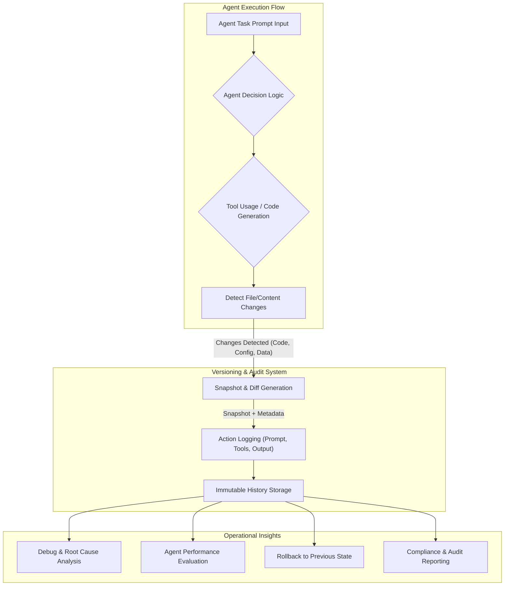

AI 에이전트의 복잡성이 증가하고 자율성이 높아짐에 따라, 이들의 생성 코드, 결정 프로세스, 그리고 상호작용을 투명하고 감사 가능한 형태로 추적하는 것이 필수적이 되었습니다. 기존 소프트웨어 개발에서 Git과 같은 버전 관리 시스템은 이러한 요구사항에 대한 강력한 해법을 제공하며, AI 에이전트의 워크플로우에도 유사한 개념을 도입하는 것이 중요합니다.

### AI 에이전트 작업 버전 관리의 필요성

AI 에이전트는 프롬프트(prompt)를 기반으로 코드를 생성하거나, 도구를 사용하여 파일을 수정하고, 복잡한 의사결정 체인을 통해 목표를 달성합니다. 이러한 과정은 동적이고 비선형적이며, 예측 불가능한 결과를 초래할 수 있습니다. `re_gent`와 같은 개념은 AI 에이전트의 각 작업 세션을 마치 Git 커밋(commit)처럼 기록하여, 에이전트가 무엇을 했고 어떤 프롬프트가 각 줄을 작성했는지 단계별로 확인할 수 있게 합니다.

주요 이점은 다음과 같습니다:

*   **재현성 (Reproducibility)**: 특정 결과가 발생한 에이전트의 경로와 상태를 정확히 재현할 수 있습니다. 이는 버그 진단, 모델 업데이트 전후 비교, 그리고 특정 행동의 원인 분석에 결정적인 역할을 합니다.
*   **감사 가능성 (Auditability) 및 규제 준수 (Compliance)**: 규제 준수 및 내부 감사 요구사항을 충족하기 위해 에이전트의 모든 의사결정 및 생성물에 대한 명확한 감사 추적(audit trail)을 제공합니다.
*   **디버깅 (Debugging) 및 반복 (Iteration)**: 에이전트의 실패 지점을 정확히 파악하고, 특정 프롬프트 변경이 출력에 미치는 영향을 단계별로 추적하여 에이전트 개발 및 개선 속도를 높입니다.
*   **협업 (Collaboration)**: 여러 에이전트 또는 인간 개발자가 동일한 프로젝트에 참여할 때, 각 에이전트의 기여와 변경 사항을 명확히 이해하고 병합(merge)할 수 있습니다.
*   **지식 축적 (Knowledge Accumulation)**: 에이전트의 성공 및 실패 이력이 체계적으로 기록됨으로써, 향후 에이전트의 학습 및 성능 개선을 위한 귀중한 데이터셋을 구축할 수 있습니다.

### `playbook`의 Claude Code 하네스에 통합

`playbook`의 Claude Code 하네스 및 다른 AI 에이전트들이 생성하는 코드/콘텐츠에 Git-like 버전 관리를 도입하는 것은 에이전트의 신뢰성과 효율성을 극대화하는 핵심 전략입니다. 이는 프롬프트와 그 결과물 간의 매핑을 저장하고, 변경 이력을 추적하며, 특정 시점으로 롤백하거나 다른 브랜치(branch)와 비교하는 기능을 제공할 수 있습니다.

이를 구현하기 위한 핵심 기능은 다음과 같습니다:

1.  **세션 로깅**: 각 에이전트 실행 세션의 시작과 끝을 기록하고, 해당 세션 동안 발생한 모든 중요한 이벤트(프롬프트 수신, 도구 호출, 파일 변경 등)를 타임스탬프와 함께 저장합니다.
2.  **변경 사항 스냅샷**: 에이전트가 생성하거나 수정한 코드 및 콘텐츠에 대해 Git의 커밋과 유사한 스냅샷을 생성합니다. 이는 파일 내용의 해시(hash) 또는 실제 `diff`를 포함할 수 있습니다.
3.  **프롬프트-결과 매핑**: 특정 프롬프트가 어떤 최종 결과를 도출했는지 명확하게 매핑하여 저장합니다. 이는 프롬프트 엔지니어링(prompt engineering)의 효율성을 측정하는 데 중요합니다.
4.  **감사 로그**: 에이전트의 모든 주요 작업에 대한 변경 불가능한(immutable) 감사 로그를 유지합니다. 이는 `rgt log`와 유사하게 세션의 작업 내역(시간, 도구, 파일, 변경 줄 수)을 표시합니다.

### 개념적 코드 예시: Agent Action Logger

아래 Python 코드는 AI 에이전트의 작업을 기록하는 간단한 개념적 버전 관리 시스템을 보여줍니다. 이는 `playbook` 환경에서 Claude Code 에이전트의 `tool_code` 실행 후 발생하는 파일 변경 사항 등을 추적하는 데 활용될 수 있습니다.

```python
import datetime
import hashlib
import json
import os

class AgentVersionControl:
    def __init__(self, project_repo_path):
        self.repo_path = project_repo_path
        os.makedirs(self.repo_path, exist_ok=True)
        self.log_file = os.path.join(self.repo_path, ".agent_history.jsonl")
        self._ensure_log_file_exists()

    def _ensure_log_file_exists(self):
        if not os.path.exists(self.log_file):
            with open(self.log_file, 'w') as f:
                pass

    def log_action(self, agent_name: str, prompt_input: str, tool_used: str, file_changes: dict, output_summary: str):
        """에이전트의 작업을 기록하고 고유한 commit_id를 할당합니다."""
        timestamp = datetime.datetime.now().isoformat()
        # Simple hash for a 'commit ID'
        action_hash_input = f"{timestamp}{agent_name}{prompt_input}{tool_used}{json.dumps(file_changes, sort_keys=True)}"
        action_hash = hashlib.sha256(action_hash_input.encode()).hexdigest()
        
        log_entry = {
            "timestamp": timestamp,
            "commit_id": action_hash[:10], # Simplified unique ID
            "agent_name": agent_name,
            "prompt_input": prompt_input,
            "tool_used": tool_used,
            "file_changes": file_changes, # e.g., {"file_path": {"before_hash": "...", "after_hash": "...", "diff": "..."}}
            "output_summary": output_summary
        }
        with open(self.log_file, 'a') as f:
            f.write(json.dumps(log_entry) + '\n')
        return log_entry

    def get_history(self, limit: int = 10):
        """최근 에이전트 작업 기록을 가져옵니다."""
        history = []
        if os.path.exists(self.log_file):
            with open(self.log_file, 'r') as f:
                for line in f:
                    history.append(json.loads(line))
        return history[-limit:][::-1] # Most recent first

# --- Usage Example (conceptual) ---
# class MockAgent:
#     def __init__(self, name):
#         self.name = name
#     def execute_tool(self, tool_name, params):
#         print(f"Agent {self.name} is using tool: {tool_name} with params: {params}")
#         return {"status": "success", "output": "Tool operation completed."}

# # Initialize the version control system
# vc = AgentVersionControl("./agent_project_history")

# # Simulate a Claude Code Agent modifying a file
# claude_agent = MockAgent("ClaudeCodeAgent-Playbook")
# task_prompt = "Update the `README.md` to include a new section on version control."
# file_changes = {
#     "README.md": {
#         "before_hash": "abc123def456",
#         "after_hash": "ghi789jkl012",
#         "diff": "--- a/README.md\n+++ b/README.md\n@@ -1,3 +1,4 @@\n # My Project\n +## AI Agent Versioning\n This project uses AI agents...\n"
#     }
# }
# output_summary = f"Modified README.md based on prompt: '{task_prompt}'"

# # Log the agent's action
# log_entry = vc.log_action(
#     agent_name=claude_agent.name,
#     prompt_input=task_prompt,
#     tool_used="file_editor_tool",
#     file_changes=file_changes,
#     output_summary=output_summary
# )
# print(f"Logged agent action with commit_id: {log_entry['commit_id']}")

# print("\nRecent Agent History:")
# for entry in vc.get_history(limit=2):
#     print(f"- [{entry['commit_id']}] {entry['timestamp']} | Agent: {entry['agent_name']} | Summary: {entry['output_summary']}")
```

### AI 에이전트 버전 관리 워크플로우

Git-like 버전 관리를 도입한 AI 에이전트 워크플로우는 다음과 같이 시각화할 수 있습니다.



## 트레이드오프

AI 에이전트 작업에 Git-like 버전 관리를 도입하는 것은 상당한 이점을 제공하지만, 몇 가지 트레이드오프를 고려해야 합니다.

*   **데이터 오버헤드 (Data Overhead)**
    *   **언제 좋은가 (When good)**: 고도의 감사(auditing)가 요구되는 금융, 의료 분야, 또는 디버깅 복잡성이 높은 초기 개발 단계에서 상세한 기록은 문제 해결에 필수적입니다. 에이전트의 모든 의사결정 경로를 재구성해야 할 때 유리합니다.
    *   **언제 나쁜가 (When bad)**: 저비용, 고속 처리가 중요한 대량의 반복적이고 중요도가 낮은 에이전트 작업, 또는 스토리지 비용에 민감한 환경에서는 방대한 데이터 기록이 비효율적일 수 있습니다. 예를 들어, 대량의 단순 데이터 변환 작업.

*   **성능 저하 (Performance Degradation)**
    *   **언제 좋은가 (When good)**: 재현성, 안정성, 정확성이 성능보다 우선시되는 경우, 특히 critical path에 있는 에이전트 작업이나 중요한 비즈니스 로직을 다루는 경우, 약간의 성능 저하는 용인될 수 있습니다.
    *   **언제 나쁜가 (When bad)**: 실시간 응답이 필수적이거나, 처리량(throughput)이 핵심 KPI(Key Performance Indicator)인 에이전트 시스템(예: 실시간 사용자 인터랙션 에이전트)에서는 로깅 및 스냅샷 생성으로 인한 지연이 치명적일 수 있습니다.

*   **구현 복잡성 (Implementation Complexity)**
    *   **언제 좋은가 (When good)**: 장기적인 에이전트 시스템의 안정성과 확장성을 확보하려는 경우, 초기 투자 비용이 높더라도 체계적인 버전 관리 시스템은 향후 유지보수 비용을 절감하고 시스템 신뢰도를 높입니다.
    *   **언제 나쁜가 (When bad)**: 빠른 프로토타이핑(prototyping)이나 단기적인 PoC(Proof of Concept)가 목표인 경우, 복잡한 버전 관리 시스템 구축은 개발 속도를 저하시키고 불필요한 오버헤드를 유발할 수 있습니다.

*   **세분성 제어 (Granularity Control)**
    *   **언제 좋은가 (When good)**: 버그 발생 가능성이 높거나, 상세한 원인 분석이 필요한 복잡한 에이전트 로직의 경우, 높은 세분성으로 모든 중간 단계를 기록하는 것이 효율적입니다.
    *   **언제 나쁜가 (When bad)**: 예측 가능하고 안정적인 에이전트 루틴, 또는 에이전트의 중간 상태보다 최종 결과가 중요한 경우, 너무 세분화된 기록은 노이즈가 많아 실제 분석에 방해가 될 수 있습니다.

## 실전 체크리스트

AI 에이전트 작업에 Git-like 버전 관리를 도입할 때 다음 사항들을 검증해야 합니다.

*   - [ ] 에이전트 작업의 어떤 '아티팩트 (artifact)'가 버전 관리 대상인지 (예: 프롬프트, LLM 응답, 사용된 도구의 입력/출력, 생성된 코드/콘텐츠, 파일 시스템 변경) 명확히 정의되었는가?
*   - [ ] 버전 관리 시스템이 에이전트의 각 작업 세션 ID와 모든 변경 사항을 정확히 매핑하여 추적하고, `commit_id`와 같은 고유 식별자를 부여하고 있는가?
*   - [ ] 특정 프롬프트 변경이 에이전트의 출력에 미치는 영향을 단계별로 시각화하거나 `diff`할 수 있는 기능이 제공되는가?
*   - [ ] 에이전트의 작업 이력을 기반으로 특정 시점(checkpoint)으로 롤백하거나 이전 상태를 재현할 수 있는 메커니즘이 구현되었으며, 실제로 테스트되었는가?
*   - [ ] 버전 관리 로깅으로 인한 스토리지 증가량 및 에이전트 작업의 성능 저하가 시스템의 허용 가능한 한계 내에 있는지 주기적으로 모니터링하고, 필요시 최적화 방안이 마련되어 있는가?
*   - [ ] 다양한 에이전트(예: Claude Code, 다른 custom agent) 및 도구(tools)와의 통합을 위한 확장 가능한 로깅 인터페이스가 설계되었으며, 새로운 에이전트 유형을 쉽게 추가할 수 있는가?
*   - [ ] 에이전트의 버전 관리 이력을 통해 성공률, 오류 패턴, 또는 특정 프롬프트의 효과와 같은 메타 데이터를 추출하여 에이전트 성능 평가 및 개선에 활용할 수 있는 대시보드 또는 분석 도구가 연동되어 있는가?
*   - [ ] 감사 추적(audit trail) 요구사항을 충족하기 위해 모든 변경 사항에 대한 사용자(에이전트) 및 타임스탬프 정보가 정확하게 기록되고, 위변조 방지 메커니즘이 적용되었는가?