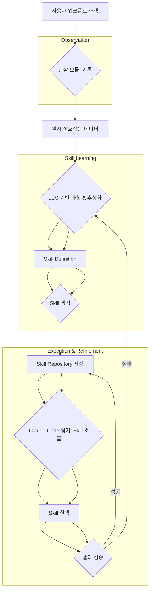

AI 에이전트 워크플로 기록 및 재사용 Skill 변환 시스템 도입은 반복적인 사용자 작업을 자동화된 Skill로 변환하여 에이전트 시스템의 효율성을 극대화하는 핵심 전략입니다. 특히 Claude Code 하네스와 같은 허브-워커 복리 자동화 시스템에서, 사용자가 직접 수행하는 워크플로를 관찰하고 이를 재사용 가능한 모듈형 Skill로 만드는 능력은 단순한 스크립트 작성이나 복잡한 프롬프트 엔지니어링의 한계를 넘어섭니다. 이는 사용자의 선호, 특정 규칙, 그리고 GUI 상의 미묘한 조작이 중요한 작업에 특히 유용하며, `Show, Don't Tell` 패러다임을 AI 에이전트 스킬 학습에 적용하는 것입니다.

## 핵심 개념: Record & Replay 기반 Skill 변환

Record & Replay (R&R) 시스템은 사용자가 특정 작업을 수행하는 과정을 실시간으로 관찰하고, 해당 상호작용의 시퀀스와 문맥을 기록합니다. 기록된 데이터는 이후 LLM (Large Language Model) 기반의 분석 모듈을 통해 추상화되고, 반복 가능한 `Skill` 또는 `Playbook` 단계로 변환됩니다. 이 `Skill`은 Claude Code 하네스 내에서 다른 에이전트 워커에 의해 호출되거나, 복잡한 자동화 워크플로의 구성 요소로 활용될 수 있습니다. 2026년 트렌드는 단순한 매크로 기록을 넘어, 작업의 본질적인 의도를 이해하고 다양한 상황에 적용 가능한 파라미터화된 Skill을 생성하는 방향으로 진화하고 있으며, 이는 멀티모달 관찰 및 고도화된 컨텍스트 인지 기능을 요구합니다.

### Claude Code 하네스를 위한 R&R 시스템 아키텍처

Claude Code 하네스에 R&R 개념을 적용하기 위한 아키텍처는 주요 구성 요소를 포함합니다.

1.  **관찰 모듈**: 사용자의 GUI 상호작용 또는 API 호출 시퀀스를 기록합니다. 스크린샷, DOM 변경, 네트워크 요청 등 멀티모달 데이터 수집은 Skill 정확도 향상에 중요합니다.
2.  **워크플로 파싱 및 추상화**: 기록된 원시 데이터를 LLM에 입력하여 사용자 의도, 반복 패턴, 핵심 단계, 파라미터를 식별합니다. 비정형 데이터를 구조화된 JSON 또는 Markdown 기반의 `Skill Definition`으로 변환합니다.
3.  **Skill 생성 및 저장소**: `Skill Definition`을 기반으로 Claude Code 하네스에서 직접 실행 가능한 코드 스니펫 (예: Python 함수) 또는 Playbook YAML 정의를 생성하고 중앙 Skill Repository에 저장합니다.
4.  **Skill 실행 및 검증**: 생성된 Skill은 Claude Code 워커에 의해 실행되며, 예상된 결과를 도출하는지 지속적으로 검증됩니다. 초기 인간 피드백 루프는 필수적이며, 자동화된 테스트를 통해 견고성을 확보합니다.



### 코드 예제: 간단한 Skill 정의 (Python)

사용자가 웹 페이지에서 특정 요소를 클릭하고 텍스트를 입력하는 과정을 기록한 뒤, 이를 추상화하여 Python Skill로 변환하는 간소화된 예시입니다.

```python
from selenium import webdriver
from selenium.webdriver.common.by import By

# LLM-generated Skill Definition (conceptual)
skill_definition = {
    "name": "LoginToWebApp",
    "description": "웹 애플리케이션에 로그인합니다.",
    "parameters": [
        {"name": "username", "type": "string", "default": "guest"},
        {"name": "password", "type": "string", "default": "guest"}
    ],
    "steps": [
        {"action": "click", "target": "Login Button"},
        {"action": "fill", "target": "Username Field", "value_param": "username"},
        {"action": "fill", "target": "Password Field", "value_param": "password"},
        {"action": "click", "target": "Submit Button"}
    ]
}

# Converted Python Skill (example for Claude Code Worker)
def login_to_webapp(driver: webdriver.Chrome, username: str, password: str):
    """
    웹 애플리케이션에 로그인하는 Skill.
    :param driver: Selenium WebDriver 인스턴스.
    :param username: 로그인할 사용자 이름.
    :param password: 로그인할 비밀번호.
    """
    driver.find_element(By.ID, "loginButton").click()
    driver.find_element(By.ID, "usernameField").send_keys(username)
    driver.find_element(By.ID, "passwordField").send_keys(password)
    driver.find_element(By.ID, "submitButton").click()
    print(f"Logged in as {username}")

# Usage within Claude Code Harness (conceptual)
# agent.execute_skill("LoginToWebApp", driver=browser_driver, username="admin", password="password123")
```

## 트레이드오프

AI 에이전트 워크플로 기록 및 재사용 Skill 변환 시스템 도입은 다음과 같은 트레이드오프를 고려해야 합니다.

*   **Skill 생성 가속화 vs. 초기 개발 복잡성**:
    *   **언제 좋음**: 반복적이고 GUI 중심적인 복잡한 작업의 Skill화에 매우 효율적입니다. 프롬프트 설명이 어려운 미묘한 상호작용을 빠르게 Skill로 변환할 때 유리합니다.
    *   **언제 나쁨**: R&R 시스템 자체의 개발 및 통합은 관찰, 파싱, 추상화, 생성, 검증 등 여러 모듈을 포함하므로 초기 투자 비용과 복잡성이 높습니다.

*   **사용자 친화적 Skill 정의 vs. 일반화 및 견고성 부족**:
    *   **언제 좋음**: `Show, Don't Tell` 방식은 비기술적인 사용자도 자신의 워크플로를 기반으로 Skill을 정의할 수 있게 하여 접근성을 높입니다. 사용자 선호가 중요한 영역에서 특히 강력합니다.
    *   **언제 나쁨**: 기록된 특정 컨텍스트에 과적합(overfitting)될 위험이 높습니다. 다양한 변수와 예외 상황에 유연하게 대처하기 어렵고, UI 변경에 취약할 수 있습니다.

*   **실시간 학습 및 적응 vs. 관찰 데이터의 보안 및 개인 정보 보호**:
    *   **언제 좋음**: 사용자의 최신 워크플로를 반영하여 Skill을 지속적으로 업데이트하고 개선할 수 있어 에이전트의 적응력을 높입니다.
    *   **언제 나쁨**: 모든 상호작용 기록 시 민감한 데이터 포함 가능성이 높으므로, 안전한 처리, 저장, 익명화 등 강력한 보안 및 개인 정보 보호 메커니즘이 필수적입니다.

## 실전 체크리스트

AI 에이전트 워크플로 기록 및 재사용 Skill 변환 시스템을 Claude Code 하네스에 도입할 때 다음 항목들을 검증해야 합니다.

*   [ ] **초기 Skill Scope 명확화**: R&R을 적용할 첫 워크플로를 명확히 정의하고, 반복적이며 프롬프트 설명이 어려운 특징을 가지는지 확인합니다.
*   [ ] **관찰 데이터 수집 전략 및 표준화**: GUI, API, 시스템 이벤트 등 수집할 데이터 유형과 형식을 결정하고 표준화하여 데이터 일관성을 확보합니다.
*   [ ] **개인 정보 보호 및 보안 정책 구현**: 기록될 민감 정보에 대한 PII 마스킹, 접근 제어, 데이터 보존 정책 등 보안 메커니즘을 설계 및 구현합니다.
*   [ ] **LLM 기반 워크플로 파서 개발 및 평가**: 원시 데이터를 Skill Definition으로 변환하는 LLM 프롬프트/모델을 개발하고, 다양한 시나리오에 대한 정확도를 평가합니다.
*   [ ] **Skill 일반화 테스트 케이스 구축**: 단일 기록 세션에 과적합되지 않도록, 다양한 파라미터를 가진 시나리오에 대해 생성된 Skill의 일반화 성능을 측정하는 테스트 케이스를 작성하고 실행합니다.
*   [ ] **지속적인 Skill 성능 모니터링 및 피드백 루프**: 배포된 Skill의 실행 성공률, 소요 시간, 인간 개입 필요성 등을 모니터링하고, 실패 시 자동화된 진단 및 재학습 피드백 루프를 통합합니다.
