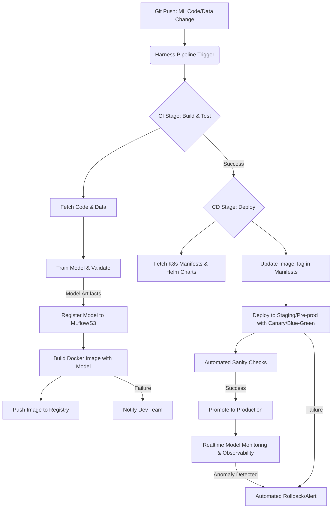

대규모 AI 시스템의 성공적인 운영은 모델의 빠르고 안정적인 배포 및 업데이트에 달려 있습니다. AI 모델은 지속적인 학습과 개선을 통해 진화하며, 이에 맞춰 프로덕션 환경에 배포되는 과정 또한 자동화되고 효율적이어야 합니다. Harness는 이러한 요구사항을 충족시키기 위한 강력한 CI/CD 및 MLOps 플랫폼으로, 복잡한 AI 워크로드를 위한 모델 배포 파이프라인을 간소화하고 자동화하는 데 핵심적인 역할을 수행합니다.

## Harness를 활용한 AI 모델 배포의 중요성
기존 소프트웨어 배포와 달리 AI 모델 배포는 데이터 의존성, 모델 버전 관리, GPU/TPU와 같은 특수 인프라 요구사항, 그리고 지속적인 성능 모니터링이 필수적입니다. 수동 배포는 인적 오류의 위험을 높이고, 배포 시간을 지연시키며, 빠른 모델 업데이트 주기를 방해합니다. Harness는 이러한 복잡성을 추상화하고 자동화하여, 개발자와 ML 엔지니어가 모델 개발에 집중하고 배포는 신뢰할 수 있는 자동화 시스템에 맡길 수 있도록 지원합니다.

### CI/CD 파이프라인을 통한 모델 라이프사이클 관리
Harness는 코드 빌드, 테스트, 배포, 그리고 운영 모니터링에 이르는 전 과정을 통합하는 CI/CD 파이프라인을 제공합니다. AI 모델의 경우, 이 파이프라인은 다음과 같은 단계로 확장될 수 있습니다:

1.  **코드 변경 감지**: 모델 학습 코드, 전처리 스크립트, 추론 코드 등의 변경을 Git 리포지토리에서 감지합니다.
2.  **데이터 버전 관리**: 학습 데이터셋의 변경 사항을 추적하고, 모델 학습에 사용될 적절한 버전을 확보합니다.
3.  **모델 학습 및 검증**: 지정된 컴퓨팅 리소스에서 모델을 학습시키고, 성능 지표(accuracy, precision, recall 등)를 기준으로 검증합니다.
4.  **모델 등록**: 학습된 모델 아티팩트와 메타데이터(버전, 성능 지표, 학습 파라미터 등)를 Model Registry에 등록합니다.
5.  **컨테이너화**: 모델 추론에 필요한 환경(코드, 라이브러리, 런타임)을 Docker 이미지로 컨테이너화합니다.
6.  **배포 전략**: Canary, Blue/Green, A/B 테스트와 같은 고급 배포 전략을 통해 모델을 프로덕션 환경에 안전하게 릴리스합니다.
7.  **지속적인 모니터링**: 배포된 모델의 성능, 지연 시간, 자원 사용량, 데이터 드리프트 등을 실시간으로 모니터링하고 이상 감지 시 자동 롤백을 트리거합니다.

## Harness 기반 자동화 파이프라인 예제
다음은 Harness YAML 파이프라인의 간소화된 예시입니다. 이 예시는 ML 코드 변경 시 Docker 이미지를 빌드하고 Kubernetes에 배포하는 과정을 보여줍니다.

```yaml
pipeline:
  name: AI Model Deployment Pipeline
  identifier: ai_model_deployment_pipeline
  projectIdentifier: ai_mlops_project
  orgIdentifier: default
  tags: {ai, mlops, deployment}
  stages:
    - stage:
        name: Build Model Image
        identifier: build_model_image
        type: CI
        spec:
          connectorRef: github_connector
          strategy:
            steps:
              - step:
                  name: Build Docker Image
                  identifier: build_docker_image
                  type: BuildAndPushDockerRegistry
                  spec:
                    image: your-docker-registry/ml-model:{{.Build.Number}}
                    dockerConnectorRef: docker_hub_connector
                    repo: ml-model
                    tag: "{{.Build.Number}}"
                    buildArgs:
                      CONTEXT: .
                      DOCKERFILE: Dockerfile.model
              - step:
                  name: Run Unit Tests
                  identifier: run_unit_tests
                  type: Run
                  spec:
                    shell: bash
                    command: |-
                      pip install -r requirements.txt
                      python -m pytest tests/unit
    - stage:
        name: Deploy to Kubernetes
        identifier: deploy_to_kubernetes
        type: CD
        spec:
          serviceConfig:
            serviceRef: ml_model_service
            serviceDefinition:
              type: Kubernetes
              spec:
                manifests:
                  - manifest:
                      identifier: deployment_manifest
                      type: K8sManifest
                      spec:
                        store:
                          type: Github
                          spec:
                            connectorRef: github_connector
                            gitFetchType: Branch
                            paths:
                              - k8s/deployment.yaml
                            branch: main
                artifacts:
                  primary: "{{.Build.Number}}"
                  sidecars: []
          infrastructure:
            infrastructureDefinition: 
              type: KubernetesDirect
              spec:
                connectorRef: k8s_cluster_connector
                namespace: ml-inference
          execution:
            steps:
              - step:
                  name: Rollout Deployment
                  identifier: rollout_deployment
                  type: K8sRollingDeploy
                  spec:
                    timeout: 10m
```

### Harness를 통한 AI 모델 배포 흐름



이 다이어그램은 CI/CD 파이프라인을 통한 AI 모델의 학습부터 배포 및 모니터링에 이르는 전체적인 흐름을 시각화합니다. 특히 2026년 트렌드에 맞춰 GitOps 기반의 인프라 관리와 모델 아티팩트의 자동 등록, 그리고 Canary 또는 Blue/Green과 같은 점진적 배포 전략이 중요하게 다뤄집니다. 또한, Prometheus, Grafana와 같은 툴과의 연동을 통해 모델의 성능 저하나 데이터 드리프트 발생 시 즉각적인 대응(자동 롤백)이 가능하도록 설계되어야 합니다.

## 트레이드오프

*   **초기 설정 복잡성 vs. 장기적 효율성**: Harness와 같은 플랫폼 도입은 초기 설정 및 통합에 시간과 노력이 필요합니다. 하지만 일단 구축되면 모델 배포의 안정성과 속도를 크게 향상시켜 장기적인 개발 및 운영 효율성을 극대화합니다. 복잡한 멀티클라우드 환경이나 대규모 팀에서는 장점이 크고, 소규모 프로젝트나 단일 환경에서는 초기 오버헤드가 단점으로 작용할 수 있습니다.
*   **자동화 수준 vs. 유연성**: Harness는 높은 수준의 자동화를 제공하지만, 매우 특수한 요구사항이나 고도로 커스터마이징된 워크플로우에 대해서는 유연성이 제한될 수 있습니다. 표준화된 ML Ops 프로세스를 따르는 경우에 적합하며, 비정형적인 실험적 배포가 잦은 연구 환경에서는 일부 제약이 있을 수 있습니다.
*   **비용 효율성 vs. 관리 용이성**: 매니지드 서비스인 Harness 사용에는 비용이 발생하지만, 인프라 관리 및 유지보수에 드는 시간과 인력을 절약할 수 있습니다. 자체적으로 CI/CD 시스템을 구축하고 관리하는 것에 비해 총 소유 비용(TCO) 관점에서 유리할 수 있습니다. 클라우드 비용 최적화가 핵심인 상황이나, 전문 MLOps 인력이 부족한 경우에 이점이 크고, 비용에 민감한 스타트업에서는 단점으로 인식될 수 있습니다.
*   **벤더 종속성 vs. 통합된 경험**: Harness와 같은 특정 벤더 플랫폼에 의존하게 되면 일정 수준의 벤더 종속성이 발생합니다. 이는 플랫폼이 제공하는 풍부한 기능과 통합된 사용자 경험을 얻는 대가입니다. 플랫폼 전환이 어려운 대규모 시스템에서는 단점으로 작용할 수 있으나, 다양한 툴을 개별적으로 통합하는 복잡성을 피하고 싶은 조직에게는 장점으로 작용합니다.

## 실전 체크리스트

*   [ ] 모든 AI 모델 아티팩트(학습된 모델 파일, 메타데이터, 학습 스크립트)가 Harness 파이프라인을 통해 버전 관리 및 Model Registry에 자동 등록되는지 확인합니다.
*   [ ] 모델 배포 파이프라인이 최소한 Canary 또는 Blue/Green 배포 전략을 지원하며, 배포 실패 시 자동 롤백 메커니즘이 정상 작동하는지 검증합니다.
*   [ ] 프로덕션 배포 전, 새로운 모델 버전에 대해 데이터 드리프트(data drift), 개념 드리프트(concept drift) 및 성능 회귀(performance regression)를 감지하는 자동화된 테스트가 파이프라인에 포함되어 있는지 확인합니다.
*   [ ] 모델 서빙 인프라(Kubernetes, Serverless 등)의 리소스(GPU/CPU, 메모리) 사용량이 최적화되어 있으며, Harness 모니터링 대시보드에서 실시간으로 추적 가능한지 확인합니다.
*   [ ] 모델 추론 서비스의 API 엔드포인트에 대한 부하 테스트(load test) 및 스트레스 테스트(stress test)가 CI/CD 파이프라인의 일부로 자동 실행되며, SRE 기준에 부합하는지 검증합니다.
*   [ ] 모델 배포 파이프라인에 보안 스캐닝(예: 컨테이너 이미지 취약점 스캔) 단계가 포함되어 있고, 승인된 보안 정책 위반 시 배포가 자동으로 차단되는지 확인합니다.
*   [ ] 팀 내 ML 엔지니어 및 DevOps 엔지니어들이 Harness 파이프라인 구성 및 운영에 필요한 지식을 충분히 갖추고 있으며, 문서화된 가이드라인이 제공되는지 확인합니다.