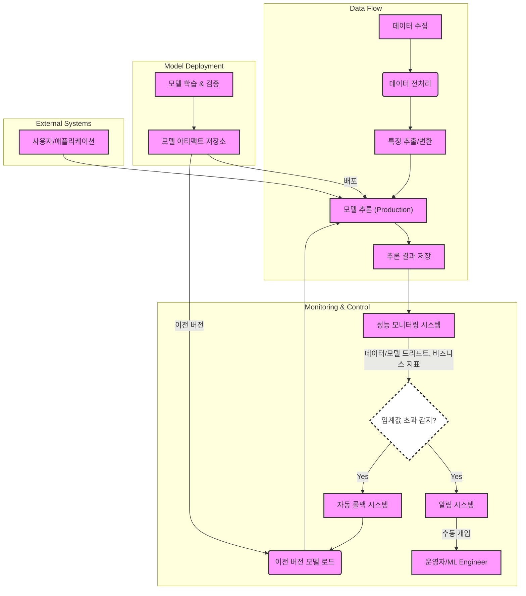

프로덕션 환경에서 AI 모델의 안정적인 운영은 비즈니스 연속성과 직결된다. 모델의 성능 저하, 데이터 드리프트, 개념 드리프트는 사용자 경험 저해 및 재정적 손실로 이어질 수 있다. 따라서 AI 모델의 지속적인 성능 모니터링 및 문제가 발생했을 때 신속하게 이전 버전으로 복구하는 자동화된 롤백 시스템 구축은 필수적인 Harness Engineering 패턴이다.

## AI 모델 성능 모니터링의 핵심

AI 모델 모니터링은 단순히 시스템 리소스 사용량을 넘어, 모델 자체의 예측 품질과 비즈니스 목표 달성 여부를 지속적으로 측정하는 것을 의미한다. 2026년 현재, 이 과정은 더욱 정교하고 실시간에 가깝게 이루어져야 한다.

### 데이터 드리프트 (Data Drift) 감지

모델이 학습된 데이터 분포와 프로덕션에서 유입되는 실시간 데이터 분포 사이에 차이가 발생하는 현상이다. 이는 모델 성능 저하의 주요 원인 중 하나이다. 특징 분포 변화, Missing Value 패턴 변화 등을 지속적으로 감지해야 한다.

### 모델 드리프트 (Model Drift) 감지

모델의 예측 성능이 시간이 지남에 따라 저하되는 현상이다. 이는 데이터 드리프트에 의해 발생할 수도 있고, 외부 환경 변화, 사용자 행동 변화 등 다양한 요인에 기인할 수 있다. 정확도(Accuracy), 정밀도(Precision), 재현율(Recall), F1-Score, ROC-AUC와 같은 지표들을 지속적으로 트래킹해야 한다. 회귀 모델의 경우 MSE, RMSE 등을 활용한다.

### 비즈니스 지표 및 설명 가능성 (Explainability) 모니터링

AI 모델의 최종 목표는 비즈니스 가치 창출이다. 따라서 모델 예측이 실제 비즈니스 성과(예: 클릭률, 전환율, 매출)에 미치는 영향을 모니터링하는 것이 중요하다. 또한, 모델의 예측이 특정 피처에 과도하게 의존하거나 비정상적인 패턴을 보이는지 SHAP, LIME과 같은 XAI (Explainable AI) 기법을 활용하여 지속적으로 검증해야 한다.

## 자동화된 롤백 시스템 구축 패턴

모니터링 시스템에서 정의된 임계값을 초과하는 성능 저하가 감지되거나, 비정상적인 패턴이 발견될 경우, 사전에 정의된 안정적인 이전 버전의 모델로 자동 복구하는 시스템이다. 이는 문제 해결까지의 시간을 최소화하고 서비스 중단을 방지한다.

### 롤백 트리거 및 임계값 설정

롤백은 매우 민감한 작업이므로, 명확하고 검증된 트리거 조건이 필요하다. 단순히 한 가지 지표가 임계값을 넘는 것을 넘어, 여러 지표의 복합적인 변화, 또는 통계적 유의미성 검증을 통해 오탐을 최소화해야 한다. 예를 들어, `(정확도 < 0.8 AND 예측 지연 시간 > 100ms) OR 데이터 드리프트 지수 > 0.5`와 같은 복합 조건 설정이 가능하다.

### 모델 버전 관리 및 아티팩트 저장

모든 모델 배포는 고유한 버전으로 관리되어야 하며, 해당 모델을 구성하는 코드, 학습 데이터, 환경 설정, 메타데이터 등이 함께 아티팩트로 저장되어야 한다. 이를 통해 언제든 특정 버전의 모델을 정확히 재현하고 배포할 수 있다.

### 롤백 전략: Canary & Blue/Green Deployment

*   **Canary Deployment**: 새로운 모델을 소수의 사용자 트래픽에만 먼저 배포하고, 해당 트래픽에서 안정성을 검증한 후 점진적으로 전체 트래픽으로 확장하는 방식이다. 문제가 발생하면 해당 Canary 모델만 롤백하면 되므로, 전체 서비스에 미치는 영향을 최소화할 수 있다.
*   **Blue/Green Deployment**: 프로덕션 환경과 동일한 두 개의 독립적인 환경 (Blue, Green)을 구축한다. 현재 서비스 중인 환경을 Blue로 하고, 새로운 모델을 Green 환경에 배포하여 테스트한다. 테스트가 완료되면 로드 밸런서 설정을 변경하여 트래픽을 Green 환경으로 전환한다. 문제가 발생하면 즉시 트래픽을 다시 Blue 환경으로 돌릴 수 있다.

## 아키텍처 예시

다음 Mermaid 다이어그램은 AI 모델의 지속적인 모니터링 및 자동 롤백 시스템의 간소화된 아키텍처를 보여준다.



## Python 코드 예제: 간단한 모니터링 및 롤백 로직

이 예제는 간단한 예측 성능 기반의 롤백 로직을 보여준다. 실제 시스템에서는 메시지 큐, 컨테이너 오케스트레이션, CI/CD 파이프라인과 연동된다.

```python
import numpy as np
from sklearn.metrics import accuracy_score
import time

# --- 모델 버전 관리 및 로드 시뮬레이션 ---
class ModelRegistry:
    def __init__(self):
        self.models = {}
        self.current_version = None

    def register_model(self, version, model_object, metadata):
        self.models[version] = {
            'model': model_object,
            'metadata': metadata,
            'performance': []
        }
        print(f"Model version {version} registered.")

    def load_model(self, version):
        if version not in self.models:
            raise ValueError(f"Model version {version} not found.")
        self.current_version = version
        print(f"Model version {version} loaded for serving.")
        return self.models[version]['model']

    def get_current_model(self):
        if self.current_version is None:
            return None
        return self.models[self.current_version]['model']

    def update_performance(self, version, metric_value):
        if version in self.models:
            self.models[version]['performance'].append(metric_value)

# --- 모니터링 및 롤백 시스템 ----
class AIMonitoringAndRollback:
    def __init__(self, registry, perf_threshold=0.85, rollback_threshold_count=3):
        self.registry = registry
        self.perf_threshold = perf_threshold # Accuracy threshold
        self.rollback_threshold_count = rollback_threshold_count
        self.consecutive_failures = 0
        self.active_model_version = None
        self.fallback_model_version = None

    def deploy_new_model(self, version, model_object, metadata, fallback_version=None):
        self.registry.register_model(version, model_object, metadata)
        self.active_model_version = version
        self.registry.load_model(version)
        if fallback_version:
            self.fallback_model_version = fallback_version
        else:
            # If no explicit fallback, previous active becomes fallback
            prev_active = list(self.registry.models.keys())[-2] if len(self.registry.models) > 1 else None
            self.fallback_model_version = prev_active
        print(f"New model {version} deployed. Fallback: {self.fallback_model_version}")

    def monitor_performance(self, true_labels, predictions):
        if self.active_model_version is None:
            print("No active model to monitor.")
            return

        accuracy = accuracy_score(true_labels, predictions)
        self.registry.update_performance(self.active_model_version, accuracy)
        print(f"Monitoring: Current model {self.active_model_version} accuracy: {accuracy:.2f}")

        if accuracy < self.perf_threshold:
            self.consecutive_failures += 1
            print(f"WARNING: Performance below threshold! Consecutive failures: {self.consecutive_failures}")
            if self.consecutive_failures >= self.rollback_threshold_count:
                self.initiate_rollback()
        else:
            self.consecutive_failures = 0 # Reset on good performance

    def initiate_rollback(self):
        print("!!! Initiating automated rollback !!!")
        if self.fallback_model_version and self.fallback_model_version != self.active_model_version:
            try:
                self.registry.load_model(self.fallback_model_version)
                self.active_model_version = self.fallback_model_version
                self.consecutive_failures = 0 # Reset failures after rollback
                print(f"Rollback successful to version: {self.active_model_version}")
            except ValueError as e:
                print(f"Rollback failed: {e}. Manual intervention required.")
        else:
            print("No valid fallback model available. Manual intervention required.")

# --- 시뮬레이션 사용 예제 ---
if __name__ == "__main__":
    # 더미 모델 생성
    class DummyModel:
        def __init__(self, version, perf_factor=1.0):
            self.version = version
            self.perf_factor = perf_factor
        def predict(self, X):
            # Simulate predictions with varying performance
            if self.version == 'v1.0': # Good performance
                return np.random.randint(0, 2, size=len(X)) 
            elif self.version == 'v1.1': # Slightly worse performance
                return np.random.choice([0, 1], size=len(X), p=[0.3, 0.7]) # Simulating some error
            else: # Bad performance
                return np.random.choice([0, 1], size=len(X), p=[0.7, 0.3]) # Simulating more error

    registry = ModelRegistry()
    monitor = AIMonitoringAndRollback(registry)

    # Initial deployment of v1.0
    model_v1_0 = DummyModel('v1.0')
    monitor.deploy_new_model('v1.0', model_v1_0, {'created_by': 'dev_team'})

    # Simulate monitoring for v1.0 (good performance)
    for i in range(5):
        X_test = np.random.rand(100, 10)
        y_true = np.random.randint(0, 2, size=100)
        predictions = registry.get_current_model().predict(X_test)
        monitor.monitor_performance(y_true, predictions)
        time.sleep(0.5)

    # Deploy new model v1.1 (with slight degradation, but still above threshold for a while)
    model_v1_1 = DummyModel('v1.1')
    monitor.deploy_new_model('v1.1', model_v1_1, {'created_by': 'ml_team'}, fallback_version='v1.0')

    # Simulate monitoring for v1.1 (performance degrades below threshold)
    for i in range(10):
        X_test = np.random.rand(100, 10)
        y_true = np.random.randint(0, 2, size=100)
        predictions = registry.get_current_model().predict(X_test)
        monitor.monitor_performance(y_true, predictions)
        time.sleep(0.5)

    print(f"\nFinal active model version: {monitor.active_model_version}")
```

## 트레이드오프

### 1. **모니터링 복잡성 vs. 감지 정확도**
*   **언제 좋고**: 다양한 지표와 복잡한 감지 로직을 사용할수록 모델 문제의 원인을 정확히 파악하고 오탐을 줄일 수 있다. 특히 고위험/고가치 AI 애플리케이션에 적합하다.
*   **언제 나쁜지**: 모니터링 시스템의 구축 및 유지보수 비용이 증가하고, 지나치게 많은 알림으로 인해 `alert fatigue`를 유발할 수 있다. 빠른 프로토타이핑이나 리소스가 제한된 환경에서는 부담이 될 수 있다.

### 2. **자동화된 롤백 vs. 수동 개입**
*   **언제 좋고**: 비상 상황에서 인적 개입 없이 즉각적인 복구를 가능하게 하여 서비스 중단 시간을 최소화한다. 고가용성이 요구되는 실시간 서비스나 대량 트래픽 처리 환경에 필수적이다.
*   **언제 나쁜지**: 잘못된 트리거 조건이나 롤백 로직 오류는 오히려 시스템을 불안정하게 만들 수 있다. 복잡한 의사결정이 필요한 상황이나 롤백 자체가 추가적인 문제를 야기할 수 있는 경우 (예: 데이터베이스 스키마 변경을 포함하는 모델 변경)에는 신중한 검토와 수동 승인이 필요하다.

### 3. **Canary/Blue-Green 배포 비용 vs. 위험 감소**
*   **언제 좋고**: 새로운 모델 배포 시 발생할 수 있는 잠재적 위험을 최소화하고, 실제 환경에서 검증할 수 있는 안전한 방법을 제공한다. 사용자에게 미치는 영향을 제한하면서 점진적인 릴리즈가 가능하다.
*   **언제 나쁜지**: 두 개의 환경을 유지하거나 트래픽 분할을 위한 인프라 비용과 관리 복잡성이 증가한다. 리소스가 제한적이거나, 모델 변경의 영향이 미미하다고 판단되는 소규모 서비스에서는 과도한 오버헤드가 될 수 있다.

## 실전 체크리스트

프로덕션 AI 모델의 지속적인 모니터링 및 자동 롤백 시스템을 구축할 때 다음 사항을 확인해야 한다.

- [ ] **핵심 성능 지표 (KPIs) 정의**: 모델의 기술적 성능 지표(정확도, F1-Score 등)와 비즈니스 성과 지표(클릭률, 전환율, 수익 등)를 명확히 정의하고 측정 계획을 수립했는가?
- [ ] **데이터 드리프트 감지 메커니즘 구축**: 입력 데이터의 통계적 분포 변화를 실시간 또는 주기적으로 감지하고, 유의미한 변화 발생 시 알림을 발생시키는 시스템이 갖추어져 있는가?
- [ ] **모델 드리프트 감지 및 임계값 설정**: 모델의 예측 성능 저하를 감지하는 기준(예: 정확도 하락 폭, MSE 증가)과 롤백을 트리거할 명확한 임계값을 설정하고 주기적으로 검증하고 있는가?
- [ ] **자동 롤백 트리거 로직 구현**: 모니터링 시스템에서 감지된 문제에 따라 롤백을 자동 실행하는 스크립트 또는 워크플로우가 안전하게 구현되었으며, 오탐(false positive) 방지 로직이 포함되어 있는가?
- [ ] **모델 버전 관리 및 아티팩트 관리**: 모든 모델 버전이 고유하게 식별되고, 학습 코드, 데이터, 환경 설정 등 모델 재현에 필요한 모든 아티팩트가 체계적으로 저장 및 관리되고 있는가?
- [ ] **롤백 테스트 및 재해 복구 계획**: 롤백 시스템이 실제 프로덕션 환경에서 제대로 작동하는지 정기적으로 테스트하며, 롤백 실패 시 수동 개입을 포함한 재해 복구(DR) 계획이 수립되어 있는가?
- [ ] **알림 및 시각화 대시보드 구축**: 모니터링 지표, 드리프트 감지 결과, 롤백 이벤트 등을 실시간으로 확인할 수 있는 대시보드와 적절한 알림 채널(Slack, PagerDuty 등)이 연동되어 있는가?