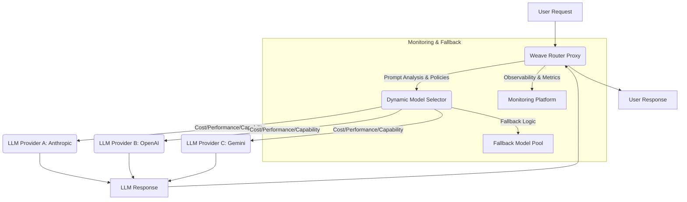

대규모 언어 모델(LLM) 기반 애플리케이션의 개발 및 운영에 있어, 단일 LLM 공급자에 의존하는 것은 비용 효율성, 성능 최적화, 그리고 안정성 측면에서 한계를 가집니다. 각 LLM은 고유한 강점과 비용 구조를 가지며, 특정 태스크에 더 적합하거나 특정 시점에 더 저렴할 수 있습니다. 이러한 다중 LLM 환경에서 최적의 모델을 동적으로 선택하고 관리하는 것이 AI 애플리케이션의 성공을 좌우하는 핵심 요소가 되었습니다. AI 모델 라우터, 특히 Weave Router와 같은 솔루션은 이러한 복잡성을 추상화하여 개발자가 다양한 LLM을 유연하게 활용할 수 있도록 지원합니다.

## Weave Router의 핵심 개념 및 동작 방식

Weave Router는 Anthropic, OpenAI, Gemini 등 다양한 LLM 공급자를 단일 엔드포인트로 통합하는 드롭인 프록시(Drop-in Proxy)입니다. 이는 클라이언트 애플리케이션이 여러 LLM API를 개별적으로 관리할 필요 없이, 라우터의 통일된 엔드포인트만 호출하면 되도록 합니다. 라우터는 들어오는 프롬프트(Prompt)를 분석하고, 미리 정의된 정책 또는 실시간 성능/비용 데이터를 기반으로 가장 적합한 LLM을 자동으로 선택하여 요청을 전달합니다.

이러한 동적 라우팅 메커니즘은 다음과 같은 주요 이점을 제공합니다:

1.  **비용 효율성**: 각 LLM의 토큰 비용은 상이하며, 동일한 퀄리티를 제공하더라도 저렴한 모델이 있을 수 있습니다. 라우터는 이러한 비용 차이를 활용하여 특정 프롬프트에 가장 저렴한 모델을 선택함으로써 전체 운영 비용을 40-70%까지 절감할 수 있습니다.
2.  **성능 최적화**: 특정 모델은 특정 유형의 작업(예: 코딩, 창의적 글쓰기, 정보 검색)에 더 특화되어 있거나 응답 속도가 빠를 수 있습니다. 라우터는 이러한 성능 특성을 고려하여 최적의 사용자 경험을 제공합니다.
3.  **고가용성 및 안정성**: 특정 LLM 공급자에 장애가 발생하거나 Rate Limit에 도달했을 때, 라우터는 자동으로 다른 LLM으로 요청을 Failover하여 서비스 중단을 최소화합니다.
4.  **개발 복잡성 감소**: 개발자는 여러 LLM API의 상이한 인터페이스와 인증 방식을 직접 처리할 필요 없이, Weave Router의 단일 인터페이스만 신경 쓰면 됩니다.

## Weave Router 아키텍처 다이어그램

다음 Mermaid 다이어그램은 Weave Router가 요청을 처리하고 LLM을 선택하는 과정을 시각적으로 보여줍니다.



## Weave Router 활용 코드 예시

클라이언트 입장에서 Weave Router를 사용하는 방식은 일반적인 LLM API 호출과 유사합니다. 핵심은 여러 LLM 공급자의 복잡성을 Weave Router가 단일 엔드포인트로 추상화한다는 점입니다.

```python
import os
import httpx # For async requests
from dotenv import load_dotenv

load_dotenv()

# Weave Router는 여러 LLM Provider를 단일 엔드포인트로 추상화합니다.
# 클라이언트는 이 단일 엔드포인트를 호출하며, 라우터가 내부적으로 최적의 LLM을 선택합니다.
WEAVE_ROUTER_ENDPOINT = os.getenv("WEAVE_ROUTER_ENDPOINT", "https://your-weave-router.com/v1/chat/completions")
WEAVE_ROUTER_API_KEY = os.getenv("WEAVE_ROUTER_API_KEY", "sk-your-weave-router-key")

async def call_llm_via_weave_router(prompt: str, model_preference: str = None):
    headers = {
        "Authorization": f"Bearer {WEAVE_ROUTER_API_KEY}",
        "Content-Type": "application/json"
    }

    payload = {
        "messages": [
            {"role": "system", "content": "You are a helpful AI assistant."},
            {"role": "user", "content": prompt}
        ],
        # 'model' 필드는 라우터에게 모델 선택에 대한 힌트를 줄 수 있습니다.
        # 'auto-select'는 라우터가 자체 로직으로 최적 모델을 선택하도록 지시합니다.
        "model": model_preference if model_preference else "auto-select" 
    }

    async with httpx.AsyncClient() as client:
        try:
            response = await client.post(WEAVE_ROUTER_ENDPOINT, headers=headers, json=payload)
            response.raise_for_status() # HTTP 에러 발생 시 예외 발생
            return response.json()
        except httpx.HTTPStatusError as e:
            print(f"HTTP error occurred: {e.response.status_code} - {e.response.text}")
            return None
        except httpx.RequestError as e:
            print(f"An error occurred while requesting {e.request.url!r}: {e}")
            return None

async def main():
    # 일반적인 질문: 라우터가 비용 효율적인 모델을 선택할 수 있습니다.
    general_query = "What is the capital of France?"
    print(f"--- Query: '{general_query}' ---")
    response_general = await call_llm_via_weave_router(general_query)
    if response_general:
        print(f"LLM Response: {response_general.get('choices')[0].get('message').get('content')}")
        # 실제 환경에서는 응답 헤더나 라우터의 모니터링 대시보드에서 어떤 모델이 사용되었는지 확인할 수 있습니다.
    print("-" * 30)

    # 코딩 관련 질문: 라우터가 코딩에 특화된 모델을 선택할 수 있습니다.
    coding_query = "Write a Python function to calculate the factorial of a number."
    print(f"--- Query: '{coding_query}' ---")
    response_coding = await call_llm_via_weave_router(coding_query, model_preference="code-llama") 
    # 'model_preference'는 라우터에게 특정 모델을 선호한다고 힌트를 줄 수 있습니다.
    if response_coding:
        print(f"LLM Response: {response_coding.get('choices')[0].get('message').get('content')}")
    print("-" * 30)

if __name__ == "__main__":
    import asyncio
    asyncio.run(main())

```

## 2026년 AI 모델 라우터의 전략적 중요성

2026년에는 LLM 생태계가 더욱 파편화되고 전문화될 것으로 예상됩니다. 다양한 규모와 기능을 가진 모델(예: 경량 모델, 멀티모달 모델, 도메인 특화 모델)이 등장하고, 각 모델의 업데이트 주기도 빨라질 것입니다. 또한, 규제 및 데이터 주권(Data Sovereignty) 문제로 인해 특정 지역에서만 사용 가능한 모델이나 온프레미스(On-premise) LLM의 중요성이 커질 수 있습니다.

이러한 환경에서 AI 모델 라우터는 다음과 같은 전략적 중요성을 가집니다.

*   **기술 부채 감소**: 새로운 LLM 통합 시 코드 변경을 최소화하고, 기존 애플리케이션에 미치는 영향을 줄입니다.
*   **비즈니스 민첩성 확보**: 시장에 새로 출시되는 고성능/저비용 모델을 빠르게 도입하고 실험하여 경쟁 우위를 유지합니다.
*   **위험 관리**: 단일 LLM 공급자에 대한 종속성을 줄이고, 잠재적인 가격 인상이나 서비스 중단 위험에 대비합니다.
*   **비용 거버넌스 강화**: 모델별 사용량 및 비용을 투명하게 모니터링하고 관리하여 AI 운영 비용을 예측 가능하게 만듭니다.

## 트레이드오프

AI 모델 라우터를 도입할 때는 다음과 같은 장단점을 고려해야 합니다.

*   **비용 절감 및 성능 최적화 vs. 초기 설정 및 운영 복잡성**: LLM 호출 비용을 크게 절감하고 응답 품질 및 속도를 향상할 수 있습니다. 하지만 Weave Router와 같은 솔루션을 도입하고 최적의 라우팅 정책을 설정하는 데 초기 설정 및 관리 노력이 필요하며, 모니터링 시스템과의 통합도 고려해야 합니다.
*   **향상된 안정성 및 가용성 vs. 라우터 자체의 SPOF(Single Point of Failure) 가능성**: 특정 LLM 서비스의 장애 시 자동 Failover를 통해 애플리케이션의 안정성을 높입니다. 그러나 라우터 자체가 단일 실패 지점이 될 수 있으므로, 라우터 자체의 고가용성 아키텍처(HA, High Availability) 구성이 필수적입니다.
*   **유연한 LLM 선택 및 확장성 vs. 잠재적 Latency 증가**: 프롬프트 분석 및 라우팅 결정 과정에서 미미한 수준의 Latency가 추가될 수 있습니다. 이는 대부분의 애플리케이션에서 허용 가능한 수준이나, 극도로 낮은 Latency를 요구하는 실시간 시스템에서는 정밀한 측정과 최적화가 필요할 수 있습니다.
*   **단일 인터페이스를 통한 개발 편의성 vs. 라우터 공급자에 대한 의존성**: 다양한 LLM API를 단일 인터페이스로 추상화하여 개발 편의성을 높입니다. 이는 라우터 공급자의 서비스 안정성 및 기능 업데이트에 대한 의존성을 생성하므로, 공급자 선정 시 장기적인 비전과 지원을 검토해야 합니다.

## 실전 체크리스트

AI 모델 라우터(Weave Router) 도입을 검토할 때 다음 체크리스트를 활용하여 준비 상태를 평가하십시오.

- [ ] 초기 POC에서 Weave Router 도입 전후 LLM API 호출 비용 변화를 20% 이상 절감했는가?
- [ ] LLM 응답 지연 시간(Latency)이 Weave Router 도입 후 평균 50ms 미만으로 유지되는가?
- [ ] Anthropic, OpenAI, Gemini 등 3개 이상의 LLM 공급자를 단일 엔드포인트로 통합하여 관리 효율을 높였는가?
- [ ] 프롬프트 내용에 기반한 동적 모델 선택 로직이 비즈니스 요구사항에 맞춰 정확하게 동작하는가? (예: 코딩 질문은 특정 모델, 일반 대화는 다른 모델)
- [ ] 특정 LLM에 장애 발생 시, 자동 Fallback 메커니즘이 99.9% 이상의 가용성을 보장하며 즉시 대체 모델로 전환되는가?
- [ ] Weave Router가 제공하는 로깅 및 모니터링 기능을 활용하여 모델별 사용량, 비용, 성능 데이터를 실시간으로 수집하고 분석할 수 있는가?
- [ ] 새로운 LLM 모델 또는 버전 업데이트 시, 라우터 설정을 통해 빠르게 통합 및 배포할 수 있는 프로세스를 구축했는가?