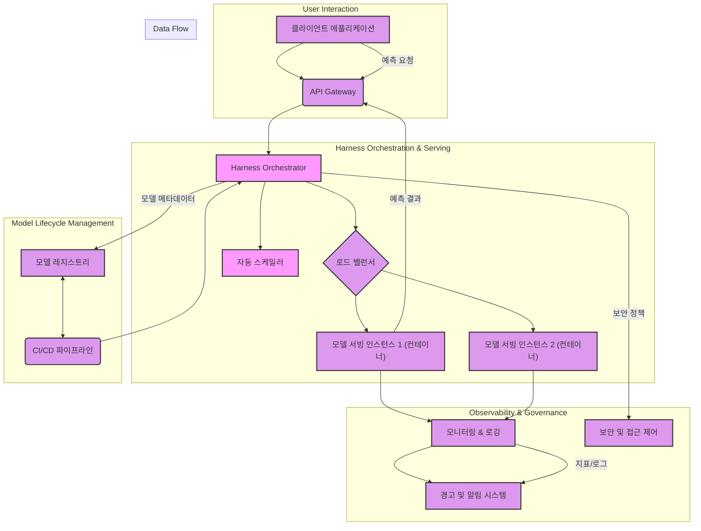

엔터프라이즈 환경에서 AI 모델을 성공적으로 배포하고 관리하는 것은 단순한 기술적 과제를 넘어섭니다. 확장성, 안정성, 보안, 그리고 효율성은 물론, 급변하는 비즈니스 요구사항에 유연하게 대응할 수 있는 아키텍처가 필수적입니다. AI 모델 서빙 하네스(AI Model Serving Harness)는 이러한 복잡성을 추상화하고, 모델의 라이프사이클 전반을 자동화하여 운영 효율성을 극대화하는 핵심 솔루션입니다.

## AI 모델 서빙 하네스 아키텍처 및 핵심 구성 요소

AI 모델 서빙 하네스는 모델 학습 후 추론(inference)을 위한 일련의 과정을 자동화하고 관리하는 플랫폼입니다. 이는 다음의 핵심 구성 요소들을 포함합니다.

### 1. 오케스트레이션 엔진 (Orchestration Engine)
Kubernetes, AWS SageMaker, Azure ML, Google Vertex AI와 같은 플랫폼은 모델 컨테이너의 배포, 스케줄링, 로드 밸런싱을 관리하며, 엔터프라이즈 환경에서 요구되는 고가용성과 확장성을 제공합니다. 이는 복잡한 마이크로서비스 아키텍처를 AI 모델 서빙에 적용하는 핵심 기반이 됩니다.

### 2. 모델 레지스트리 및 버전 관리
MLflow, BentoML, Kubeflow 등은 학습된 모델을 저장하고 관리하며, 각 모델 버전에 대한 메타데이터(학습 데이터셋, 파라미터, 성능 지표)를 추적합니다. 이는 모델의 재현성(reproducibility)과 감사(audit) 기능을 보장하는 데 중요합니다.

### 3. 모니터링 및 로깅
Prometheus, Grafana, ELK Stack(Elasticsearch, Logstash, Kibana) 같은 도구들은 모델의 성능(응답 시간, 처리량), 리소스 사용량(CPU, GPU, 메모리), 데이터 드리프트(data drift), 개념 드리프트(concept drift) 등을 실시간으로 모니터링합니다. 이는 모델의 품질을 유지하고 잠재적 문제를 조기에 감지하는 데 필수적입니다.

### 4. 자동 스케일링
수요 변화에 따라 모델 서빙 인스턴스를 자동으로 확장하거나 축소하는 기능입니다. Kubernetes의 Horizontal Pod Autoscaler(HPA), KEDA(Kubernetes Event-driven Autoscaling) 등은 GPU와 같은 고비용 리소스의 효율적 사용을 가능하게 합니다.

### 5. 보안 및 접근 제어
API Gateway, IAM(Identity and Access Management), RBAC(Role-Based Access Control)을 통해 모델 엔드포인트에 대한 접근을 제어하고, 데이터 및 모델의 무결성을 보장합니다. 엔드투엔드 암호화(end-to-end encryption) 및 취약점 관리도 포함됩니다.

### 6. CI/CD 파이프라인 통합
GitOps 기반의 CI/CD(Continuous Integration/Continuous Deployment) 파이프라인은 모델 학습부터 배포, 테스트, 모니터링까지의 전 과정을 자동화하여, 모델 업데이트 주기를 단축하고 배포 오류를 최소화합니다.

## 배포 전략: 2026년 트렌드 반영

엔터프라이즈 환경에서의 AI 모델 서빙 하네스 배포는 2026년에도 다음과 같은 방향으로 진화할 것입니다.

### 1. 컨테이너 기반 및 쿠버네티스(Kubernetes) 표준화
모델과 그 의존성을 컨테이너화하여 Kubernetes 위에서 관리하는 것은 이미 표준입니다. 이는 일관된 배포 환경을 제공하고, 다양한 클라우드 환경 및 온프레미스(on-premise)에서 이식성(portability)을 보장합니다. GitOps 패턴을 통해 인프라와 배포 구성을 코드(IaC)로 관리하며 자동화 수준을 높입니다.

### 2. 서버리스(Serverless) 및 Function-as-a-Service (FaaS)
AWS Lambda, Azure Functions, GCP Cloud Functions 및 Cloud Run과 같은 서버리스 플랫폼은 특정 이벤트에 따라 모델을 호출하고, 유휴 시에는 리소스를 소모하지 않아 비용 효율적입니다. 특히 간헐적이거나 예측 불가능한 트래픽 패턴을 가진 모델에 적합하며, 관리 오버헤드를 최소화합니다.

### 3. 엣지 AI(Edge AI) 배포
저지연(low-latency) 추론, 데이터 주권(data sovereignty), 네트워크 대역폭 제한 등의 요구사항이 있는 시나리오에서는 모델을 엣지 디바이스에 직접 배포하는 것이 중요해집니다. 경량화된 모델과 온디바이스(on-device) 추론 엔진(예: ONNX Runtime, TFLite)을 활용하여 효율적인 엣지 AI 하네스를 구축합니다.

### 4. 하이브리드 및 멀티 클라우드 전략
단일 클라우드 벤더에 대한 종속성을 피하고, 비용 최적화, 재해 복구(disaster recovery), 규제 준수 등을 위해 하이브리드(온프레미스 + 클라우드) 및 멀티 클라우드 전략이 보편화됩니다. 이는 일관된 하네스 추상화 계층을 통해 복잡성을 관리해야 합니다.

## 효율적인 관리 및 운영

배포만큼 중요한 것은 모델 서빙 하네스의 지속적인 관리 및 운영 효율성입니다.

### 1. 종단간(End-to-End) 옵저버빌리티(Observability)
모델의 입력부터 출력까지의 전체 파이프라인에 대한 심층적인 가시성(visibility)을 확보합니다. 성능 지표뿐만 아니라, 모델의 행동 변화를 감지하고 설명 가능한 AI(Explainable AI, XAI) 지표를 통합하여 모델 투명성을 높입니다. 이는 모델 드리프트, 데이터 편향(bias) 등을 조기에 발견하고 대응하는 데 필수적입니다.

### 2. 자동화된 모델 검증 및 재학습 루프
프로덕션 환경에서의 모델 성능 저하를 감지하면, 자동으로 재학습 데이터를 수집하고 모델을 재학습하여 배포하는 파이프라인을 구축합니다. 이는 모델의 지속적인 성능 유지와 최신 데이터에 대한 적응성을 보장합니다.

### 3. A/B 테스트 및 카나리(Canary) 배포
새로운 모델 버전을 전체 트래픽에 적용하기 전에 소규모 사용자 그룹에게만 노출하여 성능과 안정성을 검증합니다. 문제가 발생하면 즉시 이전 버전으로 롤백(rollback)하여 위험을 최소화합니다.

### 4. 자원 최적화 및 비용 관리
모델 서빙에 필요한 컴퓨팅 자원(특히 GPU)을 효율적으로 스케줄링하고, 클라우드 비용을 지속적으로 모니터링하여 최적화합니다. 이는 예측 가능한 워크로드에 대한 예약 인스턴스(Reserved Instances) 활용, 오토스케일링 정책 미세 조정 등을 포함합니다.

### 5. 거버넌스 및 규정 준수
데이터 프라이버시(GDPR, CCPA), 모델 사용 정책, 접근 제어 등 엔터프라이즈의 거버넌스 프레임워크와 규제 요건을 충족하도록 하네스를 설계하고 운영합니다. 모델의 공정성(fairness) 및 책임감 있는 AI(Responsible AI) 원칙을 통합합니다.

## 코드 예제: 간단한 Kubernetes Model Server 배포

아래는 `my-model-server`라는 이름의 간단한 FastAPI 기반 모델 서버를 Kubernetes에 배포하는 예시입니다. AI 모델 서빙 하네스는 이와 같은 배포를 자동화하고 관리합니다.

```yaml
# model-server-deployment.yaml
apiVersion: apps/v1
kind: Deployment
metadata:
  name: my-model-server
  labels:
    app: my-model-server
spec:
  replicas: 2
  selector:
    matchLabels:
      app: my-model-server
  template:
    metadata:
      labels:
        app: my-model-server
    spec:
      containers:
      - name: model-inference
        image: my-registry/my-model-image:v1.0.0 # 학습된 모델이 포함된 Docker 이미지
        ports:
        - containerPort: 8000
        resources:
          requests:
            memory: "512Mi"
            cpu: "500m"
          limits:
            memory: "1Gi"
            cpu: "1"
---
# model-server-service.yaml
apiVersion: v1
kind: Service
metadata:
  name: my-model-server-service
spec:
  selector:
    app: my-model-server
  ports:
    - protocol: TCP
      port: 80
      targetPort: 8000
  type: LoadBalancer # 외부 접근을 위한 로드 밸런서
```

하네스는 위와 같은 YAML 파일을 생성하고, `kubectl apply -f .` 명령을 실행하거나 Argo CD, FluxCD와 같은 GitOps 도구를 통해 배포를 관리합니다. 또한, 모델 업데이트 시 이미지 태그(`v1.0.0` -> `v1.1.0`) 변경, 롤링 업데이트, 롤백 등을 자동으로 수행합니다.

## Mermaid 다이어그램: 엔터프라이즈 AI 모델 서빙 하네스 아키텍처



## 트레이드오프

AI 모델 서빙 하네스를 구축하고 운영하는 과정에는 여러 트레이드오프가 존재합니다.

*   **복잡성 vs. 유연성**: 자체 하네스 구축은 높은 유연성을 제공하지만, 초기 설계 및 구현에 상당한 시간과 전문성이 요구됩니다. 복잡한 모델 파이프라인이나 특정 규제 환경에서는 필수적이나, 단순한 모델 서빙에는 과도한 오버헤드가 될 수 있습니다.
*   **상용 솔루션 vs. 오픈소스**: 클라우드 벤더의 관리형 서비스(예: SageMaker, Vertex AI)는 빠른 구축과 높은 안정성을 제공하지만, 벤더 종속성과 높은 운영 비용을 야기할 수 있습니다. 반면, Kubeflow, MLflow와 같은 오픈소스는 커스터마이징이 자유롭고 비용 효율적이지만, 관리 및 유지보수 부담이 큽니다.
*   **자동화 수준 vs. 제어**: 완벽한 자동화는 운영 효율성을 극대화하지만, 특정 상황(예: 예측 불가능한 엣지 케이스, 긴급 수동 개입 필요)에서는 제한적인 제약이 될 수 있습니다. 중요 서비스의 경우 수동 개입 여지를 남겨두는 것이 안전하며, 자동화와 수동 제어 간의 적절한 균형이 필요합니다.
*   **성능 최적화 vs. 개발 속도**: 모델 서빙 성능을 극대화하기 위한 저수준(low-level) 최적화(예: 커스텀 추론 엔진, GPU 최적화)는 개발 및 배포 시간을 증가시킵니다. 높은 처리량이나 낮은 지연 시간이 critical한 애플리케이션에서는 필수적이지만, 빠른 MVP(Minimum Viable Product) 개발이 중요한 초기 단계에서는 복잡성을 피하는 것이 좋습니다.
*   **보안 강화 vs. 접근 편의성**: 엄격한 보안 프로토콜과 접근 제어는 시스템의 안전성을 높이지만, 개발자나 데이터 과학자의 모델 배포 및 테스트 과정을 복잡하게 만들 수 있습니다. 서비스의 민감도와 규제 요구사항에 따라 적절한 보안 수준을 정의하고, 개발 워크플로우를 방해하지 않도록 설계해야 합니다.

## 실전 체크리스트

프로젝트에 AI 모델 서빙 하네스를 적용할 때 다음과 같은 사항들을 검증해야 합니다.

*   [ ] 모델 서빙에 필요한 최소한의 자원 요구사항 (CPU, GPU, Memory) 및 최대 허용 지연 시간(latency)을 정의하고, 이를 충족하는 인프라를 프로비저닝했는가?
*   [ ] 모델 드리프트(drift) 및 컨셉 드리프트(concept drift) 감지 메커니즘을 구축하고, 감지 시 자동 경고 및 필요에 따라 모델 재학습/재배포 파이프라인이 연동되어 있는가?
*   [ ] 새로운 모델 버전에 대한 A/B 테스트 또는 카나리 배포 전략이 명확하며, 성능 저하 시 이전 버전으로의 자동 롤백 기능이 작동하는가?
*   [ ] 데이터 프라이버시(GDPR, CCPA 등) 및 보안 규정 준수 여부를 검증하고, 모델 및 데이터 접근에 대한 강력한 인증 및 권한 부여(RBAC) 체계가 구현되어 있는가?
*   [ ] 모델 서빙 인프라의 총 소유 비용(TCO)을 지속적으로 모니터링하고, GPU 스케줄링 최적화, 서버리스 활용 등 비용 효율화 전략을 수립하여 적용하고 있는가?
*   [ ] 장애 발생 시 자동 복구(self-healing) 메커니즘(예: Pod 재시작, 노드 장애 시 인스턴스 교체) 및 핵심 이해관계자에게 알림이 전송되는 시스템이 작동하는가?
*   [ ] 모델의 예측 결과에 대한 설명 가능성(XAI) 지표(예: SHAP, LIME)를 수집하고 이를 통해 모델의 의사결정 과정을 이해할 수 있는 도구를 제공하는가?
*   [ ] 엔터프라이즈 환경의 기존 CI/CD 파이프라인 및 개발자 도구와 AI 모델 서빙 하네스가 원활하게 통합되어, 개발자 경험(DX)을 저해하지 않는가?