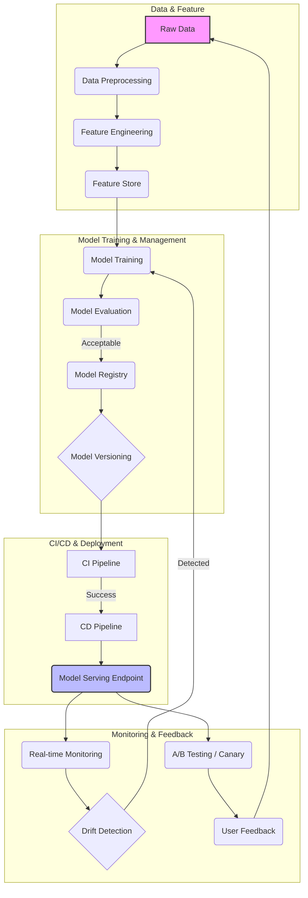

AI 모델 서빙을 위한 MLOps 파이프라인은 학습된 AI 모델을 안정적이고 효율적으로 프로덕션 환경에 배포하고 관리하기 위한 핵심 인프라입니다. 실시간 AI 서비스의 확장은 단순한 모델 배포를 넘어, 지속적인 통합(CI), 지속적인 배포(CD), 모델 모니터링, 재학습 자동화 등을 포함하는 포괄적인 시스템 설계를 요구합니다. 표준화된 디자인 패턴의 적용은 이러한 복잡성을 줄이고 서비스의 안정성과 확장성을 확보하는 데 필수적입니다.

## MLOps 파이프라인 핵심 디자인 패턴

AI 모델 서빙을 위한 MLOps 파이프라인은 일반적으로 다음과 같은 주요 패턴으로 구성됩니다.

### 1. Model Registry를 통한 중앙화된 모델 관리

Model Registry는 학습된 모델의 버전 관리, 메타데이터 저장, 승인 워크플로우 등을 중앙에서 관리하는 시스템입니다. 모델의 lineage (기원), 학습 데이터셋, 성능 지표, 배포 상태 등을 추적하여 모델 거버넌스를 강화하고, 특정 모델 버전을 프로덕션에 배포하거나 롤백하는 과정을 효율화합니다.

### 2. CI/CD for Machine Learning

전통적인 소프트웨어 CI/CD 파이프라인을 ML 워크로드에 적용한 패턴입니다. 모델 코드는 물론, 데이터 전처리 스크립트, 학습 코드, 평가 스크립트 등에 대한 버전 관리와 자동화된 테스트를 포함합니다. 새로운 모델 버전이 생성되거나 기존 모델이 재학습될 때마다 자동으로 빌드, 테스트, 배포 후보로 승격되는 과정을 자동화하여 배포 속도와 신뢰도를 높입니다.

```python
# pseudo-code for a simplified CI/CD trigger and model registration

def trigger_ml_ci_pipeline(git_commit_id):
    print(f"CI Pipeline triggered for commit: {git_commit_id}")
    # 1. Fetch updated code and data
    # 2. Run data validation tests
    # 3. Train model
    # 4. Evaluate model performance
    if evaluate_model(model_path) > threshold:
        print("Model performance is acceptable.")
        register_model(model_path, version=get_new_version(), metadata={'commit_id': git_commit_id})
        trigger_ml_cd_pipeline(get_new_version())
    else:
        print("Model performance is below threshold. Aborting deployment.")

def register_model(model_path, version, metadata):
    print(f"Registering model v{version} from {model_path} with metadata: {metadata}")
    # API call to Model Registry service

def trigger_ml_cd_pipeline(model_version):
    print(f"CD Pipeline triggered for model v{model_version}")
    # Deploy model to staging/production
    # Run integration tests
    # Start monitoring

# Example usage
trigger_ml_ci_pipeline("a1b2c3d4e5f6")
```

### 3. Feature Store를 통한 특징(Feature) 관리

Feature Store는 모델 학습과 추론 과정에서 사용되는 특징들을 중앙에서 관리하고 서빙하는 시스템입니다. 온라인 추론 시 낮은 지연 시간으로 특징을 제공하고, 오프라인 학습 시에는 대량의 특징을 일관된 방식으로 추출할 수 있게 하여 학습-서빙 간 특징 불일치(training-serving skew) 문제를 해결합니다. 이는 2026년에도 데이터 일관성 유지의 핵심 요소로 자리매김하고 있습니다.

### 4. 실시간 모델 모니터링 및 드리프트 감지

배포된 모델의 성능, 입력 데이터 분포, 출력 예측 결과 등을 실시간으로 모니터링하는 패턴입니다. 데이터 드리프트(Data Drift), 모델 드리프트(Model Drift), 개념 드리프트(Concept Drift) 등을 감지하여 모델 성능 저하를 조기에 파악하고 알림을 발생시킵니다. 이를 통해 모델의 재학습 또는 롤백과 같은 적절한 대응을 자동화할 수 있습니다.

### 5. A/B 테스트 및 Canary Deployment

새로운 모델 버전을 전체 사용자에게 한 번에 배포하는 대신, 소수의 사용자에게만 먼저 노출하여 실제 환경에서의 성능을 검증하는 패턴입니다. Canary Deployment는 점진적으로 트래픽을 늘려가며 위험을 최소화하고, A/B 테스트는 여러 모델 버전을 동시에 서빙하며 최적의 모델을 선택하는 데 활용됩니다.

## MLOps 파이프라인 워크플로우



## 트레이드오프

MLOps 파이프라인 디자인 패턴을 적용할 때는 다음과 같은 트레이드오프를 고려해야 합니다.

*   **자동화 수준 vs. 초기 구축 비용**: 고도로 자동화된 End-to-End MLOps 파이프라인은 장기적으로 운영 효율성을 극대화하지만, 초기 설계 및 구축에 상당한 시간과 자원이 소모됩니다. 초기에는 단순한 수동 배포로 시작하여 점진적으로 자동화를 확대하는 것이 좋습니다. 언제 좋으냐면, **장기적인 대규모 AI 서비스 운영**에 좋고, 언제 나쁘냐면, **단기 PoC 또는 소규모 프로젝트**에는 과도한 오버헤드입니다.
*   **범용 플랫폼 vs. 커스텀 솔루션**: AWS SageMaker, Google Vertex AI, Azure ML과 같은 범용 MLOps 플랫폼은 다양한 기능을 제공하며 빠른 시작을 돕습니다. 반면, 특정 도메인에 최적화된 커스텀 솔루션은 특정 요구사항에 대한 유연성과 성능 이점을 가집니다. 언제 좋으냐면, **초기 빠른 시작 및 표준화된 워크로드**에 좋고, 언제 나쁘냐면, **고유의 복잡한 요구사항이나 특정 성능 최적화가 필요한 경우**에는 제약이 될 수 있습니다.
*   **온라인 서빙 vs. 배치 서빙**: 실시간(Online) 추론은 낮은 지연 시간을 요구하며, 서버리스 함수(Serverless Functions) 또는 고성능 API 게이트웨이(API Gateway)를 통해 구현됩니다. 배치(Batch) 추론은 대량의 데이터를 효율적으로 처리하지만, 실시간 응답은 중요하지 않습니다. 언제 좋으냐면, **대화형 챗봇, 추천 시스템 등 즉각적인 사용자 상호작용**에는 온라인 서빙이 좋고, 언제 나쁘냐면, **주기적인 보고서 생성, 데이터 분석**에는 오버헤드가 큽니다.
*   **데이터 일관성 vs. 데이터 신선도**: Feature Store를 통해 학습-서빙 간 특징 일관성을 유지하는 것은 중요하지만, 데이터 신선도(freshness)를 유지하기 위한 파이프라인 설계는 추가적인 복잡성을 야기합니다. 언제 좋으냐면, **모델 성능에 데이터 일관성이 절대적인 영향을 미치는 경우**에 좋고, 언제 나쁘냐면, **데이터 신선도 요구사항이 낮고 데이터 볼륨이 매우 큰 경우**에는 리소스 낭비가 될 수 있습니다.
*   **모델 복잡성 vs. 서빙 지연 시간**: Transformer 기반의 대규모 언어 모델(LLM)과 같이 복잡한 모델은 높은 추론 비용과 지연 시간을 가집니다. 이를 최적화하기 위해 양자화(quantization), 지식 증류(knowledge distillation) 등의 기술을 적용할 수 있습니다. 언제 좋으냐면, **복잡한 문제 해결 및 높은 정확도가 요구되는 경우**에 좋고, 언제 나쁘냐면, **실시간 응답성이 매우 중요한 저지연 서비스**에는 적합하지 않습니다.

## 실전 체크리스트

AI 모델 서빙을 위한 MLOps 파이프라인을 설계하고 적용할 때 다음 항목들을 검증합니다.

- [ ] 모델 서빙 아키텍처가 고가용성(HA) 및 재해 복구(DR)를 지원하며, 각 컴포넌트의 SPOF(Single Point of Failure)가 제거되었는가?
- [ ] 새로운 모델 버전 배포 시 롤백(rollback) 전략이 명확하게 정의되어 있고, 문제가 감지되면 자동으로 또는 수동으로 빠르게 롤백할 수 있는 메커니즘이 구축되어 있는가?
- [ ] 실시간 모델 성능 지표(예: 추론 레이턴시, 처리량, 오류율, 모델 정확도)를 모니터링하고, 설정된 임계치를 벗어날 경우 담당자에게 즉시 알림을 발송하는 시스템이 구축되어 있는가?
- [ ] 입력 데이터 분포 변화(Data Drift) 및 모델 예측 성능 저하(Model Drift)를 감지하는 메커니즘이 포함되어 있으며, 드리프트 감지 시 재학습(retraining) 워크플로우를 자동으로 트리거하거나 수동 개입을 위한 알림을 제공하는가?
- [ ] 특징 저장소(Feature Store)를 활용하여 모델 학습과 온라인 추론 간에 특징 생성 로직의 일관성을 유지하고 있으며, 낮은 지연 시간으로 특징을 서빙할 수 있는가?
- [ ] A/B 테스트 또는 카나리 배포(Canary Deployment) 전략을 사용하여 새로운 모델 업데이트의 영향을 점진적으로 검증하고, 사용자 경험에 미치는 부정적인 영향을 최소화하는 프로세스가 있는가?
- [ ] 모델 거버넌스를 위해 모델 레지스트리(Model Registry)에서 모델 버전, 학습 데이터셋, 학습 파라미터, 성능 지표, 배포 이력 등 모델의 모든 메타데이터를 추적하고 관리하고 있는가?
- [ ] 모델 추론 요청량 증가에 따라 서빙 인프라가 자동으로 확장(Auto-scaling)될 수 있도록 설계되어 있으며, 최대 부하 상황에서도 안정적인 성능을 보장하는가?