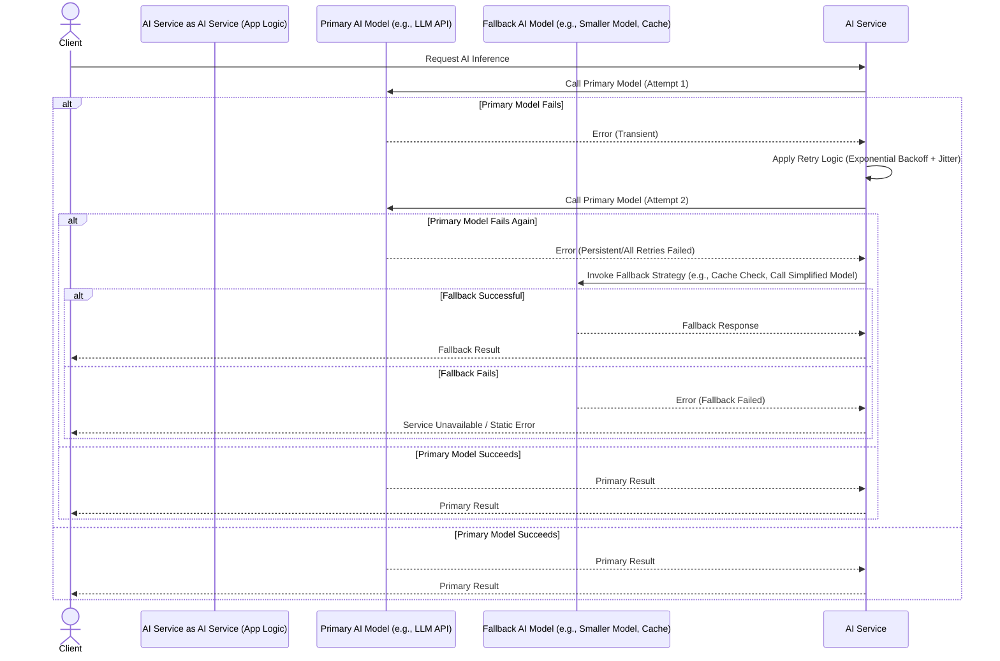

AI 서비스의 운영 환경에서는 모델의 예측 불확실성, 외부 API 의존성, 인프라 장애 등 다양한 요인으로 인해 서비스 중단 또는 성능 저하가 발생할 수 있습니다. 고가용성(High Availability) 및 복원력(Resiliency) 확보는 사용자 경험을 유지하고 비즈니스 연속성을 보장하는 데 필수적입니다. 이를 위한 핵심 전략 중 하나가 바로 폴백(Fallback) 및 재시도(Retry) 패턴 구현입니다. AI 모델의 안정성은 단순히 정확도뿐 아니라 운영 환경에서의 지속적인 서비스 제공 능력으로 평가되어야 합니다. 특히 2026년 기준, AI 워크로드가 복잡해지고 여러 모델 및 외부 서비스와의 연동이 심화되면서, 이러한 방어 메커니즘의 중요성은 더욱 강조되고 있습니다.

## 폴백(Fallback) 전략

폴백 전략은 주 서비스나 시스템 구성 요소에 장애가 발생했을 때, 미리 정의된 대체 동작을 수행하여 서비스 중단을 방지하거나 최소화하는 기법입니다. AI 서비스 맥락에서는 주 AI 모델 호출이 실패했을 때 사용자에게 에러 대신 차선책을 제공함으로써 시스템의 우아한 저하(Graceful Degradation)를 가능하게 합니다.

### 폴백 유형

*   **정적 폴백 (Static Fallback)**: 가장 단순한 형태로, 미리 정의된 기본값이나 고정된 응답을 반환합니다. 예를 들어, 추천 시스템이 실패했을 때 인기 상품 리스트를 반환하는 경우입니다.
*   **캐시 폴백 (Cache Fallback)**: 이전에 성공적으로 처리된 요청의 결과를 캐시에서 가져와 반환합니다. 최신 데이터는 아니지만, 유효한 이전 정보를 제공할 수 있습니다.
*   **간소화된 모델 폴백 (Simplified Model Fallback)**: 더 작고, 빠르며, 안정성이 높은 대체 AI 모델을 호출합니다. 예를 들어, 대규모 언어 모델(LLM)이 응답하지 않을 때, 더 작은 규모의 온디바이스 모델이나 규칙 기반 시스템으로 전환할 수 있습니다. 응답의 질은 떨어질 수 있지만, 완전한 서비스 중단보다는 낫습니다.
*   **동적 폴백 (Dynamic Fallback)**: 여러 대체 리소스 중 현재 사용 가능한 최적의 리소스를 동적으로 선택하여 사용합니다. 이는 여러 AI 모델 제공업체 또는 여러 인스턴스를 활용할 때 유용합니다.

### 폴백 구현 예시

```python
import random

class AIServiceError(Exception):
    pass
class ExternalAPIError(AIServiceError):
    pass
class ModelInferenceError(AIServiceError):
    pass

def call_primary_ai_model(prompt: str) -> str:
    # Simulate potential failure for primary model
    if random.random() < 0.6: # 60% chance of failure
        raise ExternalAPIError("Primary AI model call failed")
    return f"Primary model response for: {prompt}"

def call_simplified_fallback_model(prompt: str) -> str:
    print("Falling back to simplified model...")
    # A simpler, potentially faster or more stable model/logic
    if random.random() < 0.2: # 20% chance of failure for fallback model
        raise ModelInferenceError("Simplified fallback model also failed")
    return f"Simplified model fallback response for: {prompt}"

def get_cached_response(prompt: str) -> str | None:
    # Simulate cache hit/miss
    if random.random() < 0.3: # 30% cache hit
        print("Cache hit!")
        return f"Cached response for: {prompt}"
    print("Cache miss.")
    return None

def process_ai_request_with_fallback(prompt: str) -> str:
    # 1. Try cache first
    cached = get_cached_response(prompt)
    if cached:
        return cached

    try:
        # 2. Try primary AI model
        return call_primary_ai_model(prompt)
    except ExternalAPIError:
        # 3. Fallback to simplified model
        try:
            return call_simplified_fallback_model(prompt)
        except AIServiceError as e:
            # 4. Final fallback (e.g., static response, error message)
            print(f"All AI services failed. Returning static fallback. Error: {e}")
            return "Sorry, I am currently unable to process your request."

# Example usage:
# for _ in range(5):
#     print(process_ai_request_with_fallback("Describe the weather"))
```

## 재시도(Retry) 전략

재시도 전략은 일시적인 네트워크 문제, 서비스 과부하 또는 타임아웃 등 transient error 발생 시 일정 시간 후 작업을 다시 시도하여 성공 가능성을 높이는 기법입니다. 무한 재시도는 시스템에 더 큰 부하를 줄 수 있으므로, 제한된 횟수와 적절한 지연 시간을 적용하는 것이 중요합니다.

### 재시도 패턴

*   **선형 재시도 (Linear Retry)**: 매 재시도마다 고정된 시간 간격을 두고 재시도합니다. 단순하지만, 짧은 시간 내에 여러 서비스가 동시에 재시도할 경우, 다시 과부하를 유발할 수 있습니다.
*   **지수 백오프 (Exponential Backoff)**: 재시도 실패 시 다음 재시도까지의 대기 시간을 기하급수적으로 늘립니다 (예: 1초, 2초, 4초, 8초). 이는 서버의 부하를 줄이고 시스템이 복구될 시간을 벌어주는 효과적인 방법입니다.
*   **지터(Jitter) 추가**: 지수 백오프에 무작위성(randomness)을 추가하여, 여러 클라이언트가 동시에 재시도하여 또 다른 피크 부하를 유발하는 'thundering herd' 문제를 방지합니다. 일반적으로 `min(fixed_backoff_time, random_between(0, calculated_backoff_time))` 또는 `calculated_backoff_time +/- random_jitter` 방식을 사용합니다.
*   **서킷 브레이커 (Circuit Breaker) 패턴**: 일정 임계치 이상의 실패가 발생하면 더 이상 요청을 보내지 않고 빠르게 실패를 반환하는 패턴입니다. 이는 다운된 서비스에 불필요한 요청을 보내는 것을 막고, 서비스가 복구될 시간을 제공합니다. 일정 시간 후 'half-open' 상태로 전환하여 소량의 트래픽으로 복구 여부를 확인합니다.

### 재시도 구현 예시

아래 Python 코드는 지수 백오프와 지터를 사용하여 재시도 로직을 구현하는 데코레이터입니다.

```python
import time
import random
from functools import wraps

def retry_with_exponential_backoff(retries=3, initial_delay=0.1, max_delay=1.0, jitter_factor=0.3):
    def decorator(func):
        @wraps(func)
        def wrapper(*args, **kwargs):
            for i in range(retries):
                try:
                    return func(*args, **kwargs)
                except ExternalAPIError as e:
                    if i < retries - 1:
                        delay = min(initial_delay * (2 ** i), max_delay)
                        # Add jitter to the delay
                        jitter = delay * jitter_factor * (random.random() * 2 - 1) # +/- jitter_factor
                        sleep_time = delay + jitter
                        print(f"Retrying in {max(0, sleep_time):.2f}s due to: {e}")
                        time.sleep(max(0, sleep_time))
                    else:
                        raise # Re-raise if all retries failed
            # This line should ideally not be reached if exceptions are properly handled
            return func(*args, **kwargs)
        return wrapper
    return decorator

@retry_with_exponential_backoff(retries=4, initial_delay=0.2, max_delay=2.0, jitter_factor=0.2)
def call_external_llm_api(prompt: str) -> str:
    # Simulate an external LLM API call that might fail
    if random.random() < 0.7: # 70% chance of transient failure
        raise ExternalAPIError("External LLM API temporary unavailable")
    return f"LLM API successful response for: {prompt}"

# Example usage with retry and fallback combined
def robust_ai_workflow(prompt: str) -> str:
    try:
        return call_external_llm_api(prompt)
    except ExternalAPIError:
        print("Primary LLM API failed even after retries. Initiating fallback...")
        return process_ai_request_with_fallback(prompt) # Using the fallback logic defined earlier

# for _ in range(5):
#     print(robust_ai_workflow("Summarize a document"))
```

### 폴백 및 재시도 통합 흐름



## 2026년 최신 트렌드 반영

AI 서비스의 고가용성 및 복원력 전략은 2026년에도 지속적으로 진화하고 있습니다.

*   **AIOps 기반 자동화된 장애 감지 및 복구**: AI 모델 자체를 활용하여 시스템 로그 및 메트릭을 분석, 잠재적 장애를 예측하고 폴백/재시도 전략을 자동으로 조정하는 AIOps 솔루션이 중요해지고 있습니다. 이는 예측 정비(Predictive Maintenance) 및 자가 치유(Self-Healing) 시스템으로의 발전을 의미합니다.
*   **멀티-모델/멀티-벤더 전략**: 단일 AI 모델이나 단일 클라우드 벤더에 대한 의존도를 줄이기 위해, 여러 모델 또는 여러 제공업체의 API를 동시에 또는 순차적으로 사용하는 패턴이 일반화되고 있습니다. 한 모델이 실패하면 다른 모델로 즉시 전환하는 동적 폴백이 핵심입니다.
*   **에지 AI 및 온디바이스 폴백**: 중앙 클라우드 AI 서비스에 대한 네트워크 지연이나 연결 문제에 대비하여, 에지 디바이스나 클라이언트 기기에서 실행되는 경량 AI 모델을 폴백으로 활용하는 사례가 증가하고 있습니다. 이는 특히 실시간 응답이 중요한 애플리케이션에서 중요합니다.
*   **지능형 재시도 및 서킷 브레이커**: 시스템 상태, 과거 성공률, 부하 수준 등을 고려하여 재시도 간격과 횟수를 동적으로 조절하고, 서킷 브레이커의 열림/닫힘 임계치를 실시간으로 조정하는 고급 패턴이 도입되고 있습니다.

## 트레이드오프

AI 서비스의 폴백 및 재시도 전략 구현에는 다음과 같은 트레이드오프가 존재합니다.

*   **Latency vs. Resiliency**: 재시도 로직은 서비스가 응답을 반환하기까지의 시간을 늘릴 수 있습니다. 짧은 지연 시간(Low Latency)이 필수적인 서비스에서는 재시도 횟수와 지연 시간을 신중하게 설정해야 합니다. 지연이 허용되는 배치 처리 등에서는 높은 복원력(High Resiliency)을 위해 더 많은 재시도를 허용할 수 있습니다. 반면, 실시간 대화형 AI에서는 Latency를 최소화하기 위해 재시도 횟수를 줄이고 폴백으로 빠르게 전환하는 것이 좋습니다.
*   **Complexity vs. Robustness**: 정교한 폴백 및 재시도 로직(예: 여러 계층의 폴백, 동적 지수 백오프, 서킷 브레이커)은 시스템의 복원력(Robustness)을 크게 향상시키지만, 구현 및 유지보수 복잡성(Complexity)을 증가시킵니다. 핵심 비즈니스 로직과 분리하여 모듈화된 형태로 구현하는 것이 중요하며, 장애 발생 시 치명도가 높은 서비스일수록 복잡하더라도 견고한 패턴을 적용해야 합니다.
*   **Cost vs. Availability**: 폴백 모델이나 멀티-벤더 전략은 추가 인프라 비용(Cost)을 발생시킵니다. 예를 들어, 백업 모델을 호스팅하거나 여러 API를 동시에 호출하는 경우입니다. 하지만 이는 서비스 중단으로 인한 비즈니스 손실에 비하면 훨씬 저렴할 수 있습니다. 서비스의 가용성(Availability)이 직접적인 수익과 연결되는 경우, 추가 비용을 감수하고서라도 고가용성 전략을 취해야 합니다.
*   **Data Freshness vs. Fallback Efficacy**: 캐시 폴백이나 간소화된 모델 폴백은 주 모델의 최신 정보를 반영하지 못할 수 있습니다. 이는 데이터 신선도(Data Freshness)에 영향을 미칩니다. 그러나 완전한 서비스 중단보다는 차선책이라도 제공하는 것이 사용자 만족도와 서비스 연속성 측면에서 효과적(Efficacy)일 수 있습니다. 데이터의 실시간성이 중요하지 않거나, 빠르게 변화하지 않는 컨텍스트에서는 캐시 폴백이 매우 효율적입니다.

## 실전 체크리스트

AI 서비스의 고가용성을 위한 폴백 및 재시도 전략을 프로젝트에 적용할 때 다음 항목들을 검증하십시오.

*   [ ] **RTO/RPO 정의**: AI 서비스의 핵심 기능별 목표 복구 시간(RTO) 및 목표 복구 시점(RPO)을 명확히 정의하고, 폴백/재시도 전략이 이 목표를 충족하는지 평가한다.
*   [ ] **지수 백오프 및 지터 구현**: 외부 API 호출 및 내부 마이크로서비스 간 통신에 지수 백오프와 랜덤 지터가 포함된 재시도 로직을 적용했는지 확인한다.
*   [ ] **서킷 브레이커 설정**: 과부하 또는 지속적인 장애 발생 시 추가 요청을 차단하여 시스템 연쇄 장애를 방지하는 서킷 브레이커 패턴이 적절한 임계치와 함께 구현되었는지 검증한다.
*   [ ] **폴백 시나리오 테스트**: 주 AI 모델, 캐시, 대체 모델 등 모든 폴백 경로가 실제 장애 상황에서 예상대로 동작하는지 정기적으로 통합 테스트(Integration Test)를 수행한다.
*   [ ] **모니터링 및 알림**: 폴백이 활성화되거나 재시도 횟수가 임계치를 초과할 때 관련 모니터링 대시보드와 알림 시스템이 정상적으로 작동하는지 확인하여, 운영팀이 빠르게 인지하고 대응할 수 있도록 한다.
*   [ ] **성능 영향 분석**: 폴백 및 재시도 로직이 서비스의 응답 시간(Latency) 및 리소스 사용량(Resource Usage)에 미치는 영향을 측정하고, 허용 가능한 범위 내에 있는지 주기적으로 분석한다.
*   [ ] **문서화**: 각 AI 서비스 컴포넌트의 폴백 및 재시도 정책, 관련 설정, 예상되는 동작 및 트레이드오프가 명확하게 문서화되어 있는지 확인하여, 팀원들이 이해하고 관리할 수 있도록 한다.