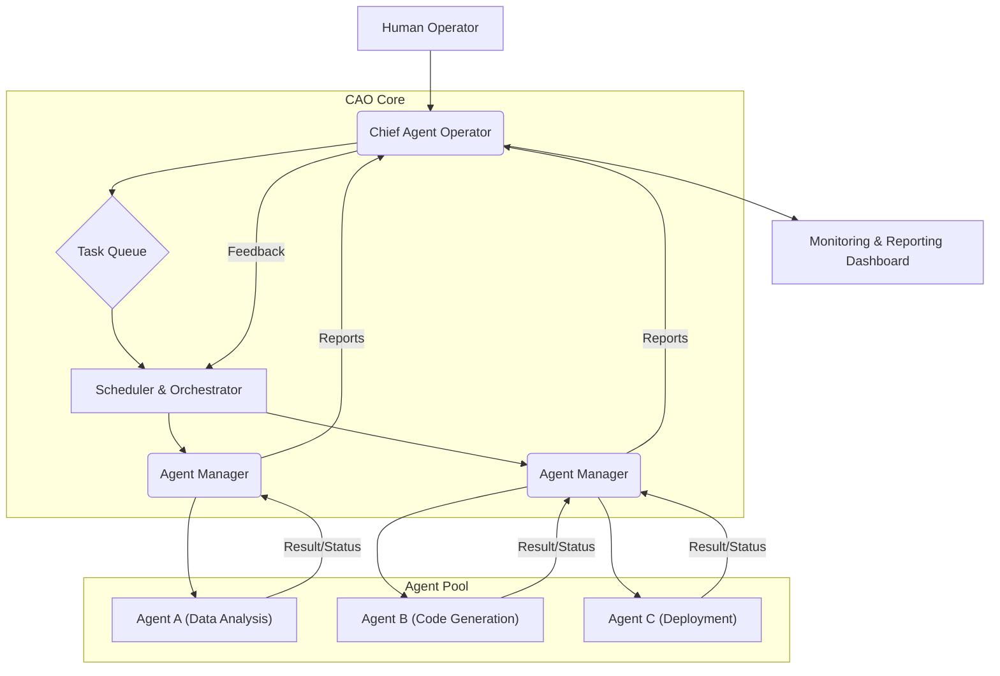

AI 에이전트의 확산과 함께, 이들을 효과적으로 조직하고 관리하는 시스템의 필요성이 증대되고 있습니다. 개별 에이전트의 능력도 중요하지만, 여러 에이전트가 하나의 목표를 향해 유기적으로 협력하도록 조율하는 것은 복잡한 문제를 해결하고 자동화 수준을 극대화하는 데 필수적입니다. 이러한 배경에서 Chief Agent Operator (CAO) 개념은 AI 팀 전체를 고용, 스케줄링, 보고하는 중앙 관제 시스템으로서 중요한 역할을 합니다. CAO는 단순한 에이전트 오케스트레이터를 넘어, AI 에이전트가 인간의 개입 없이도 7×24 운영 체제로 동작하며, 다양한 작업을 자율적으로 수행하고 보고하도록 조직화하는 프레임워크를 제공합니다. 이는 `playbook`의 '프로젝트 관제탑' 및 'AI 에이전트 하네스' 설계에 직접적으로 반영되어, 허브-워커 복리 자동화의 관리 및 운영 체계를 강화하는 핵심 요소가 됩니다. 2026년에는 이러한 자율적이고 자기-최적화하는 에이전트 팀이 엔터프라이즈 환경에서 더욱 보편화될 것으로 예상됩니다.

## Chief Agent Operator의 핵심 기능

CAO는 크게 네 가지 핵심 기능을 통해 AI 에이전트 팀을 관리합니다.

### 1. 에이전트 고용 및 자원 할당 (Employment & Resource Allocation)
CAO는 특정 태스크에 필요한 에이전트를 식별하고 '고용'합니다. 이는 에이전트 풀에서 적절한 스킬셋을 가진 에이전트를 선택하고, 필요한 컴퓨팅 자원(GPU, 메모리 등)을 할당하는 과정을 포함합니다. 에이전트는 작업 단위로서 정의되며, CAO는 이들의 생명주기를 관리합니다. 예를 들어, 특정 데이터 분석 작업을 위해 `DataScientistAgent`와 `ETLAgent`를 고용하고 각 에이전트에게 필요한 환경을 프로비저닝합니다.

### 2. 태스크 스케줄링 및 오케스트레이션 (Scheduling & Orchestration)
CAO는 복잡한 프로젝트를 작은 태스크로 분해하고, 이를 고용된 에이전트들에게 스케줄링하며 실행 순서를 오케스트레이션합니다. 병렬 처리, 종속성 관리, 우선순위 조절 등 다양한 스케줄링 전략을 통해 워크플로우의 효율성을 극대화합니다. 이는 `ai-agent-parallel-task-orchestration-and-auto-merge`와 같은 고급 패턴을 활용하여 에이전트 간의 협업을 최적화합니다.

### 3. 실시간 보고 및 모니터링 (Reporting & Monitoring)
에이전트들이 작업을 수행하는 동안, CAO는 이들의 진행 상황, 성능 지표(처리 시간, 성공률, 오류율), 발생한 문제 등을 실시간으로 모니터링하고 종합하여 보고합니다. 이는 `ai-model-performance-metrics-dashboard-design-guide`와 같은 시스템에 연동되어 관리자에게 투명한 운영 가시성을 제공합니다. 이상 징후 발생 시 자동 경고를 발생시키거나, 필요에 따라 인간 개입을 요청할 수 있습니다.

### 4. 7×24 자율 운영 및 공진화 (24/7 Operation & Co-evolution)
CAO는 에이전트 팀이 사용자의 상시 접속 없이도 지속적으로 운영되도록 보장합니다. 에이전트의 실패를 감지하고 복구 메커니즘을 트리거하며, 장기적인 관점에서 에이전트의 성능 데이터를 분석하여 시스템 전체의 효율성을 개선합니다. 인간은 에이전트의 학습 과정에 피드백을 제공하며, 에이전트는 이 피드백을 통해 스킬을 발전시키는 공진화(co-evolve) 인프라를 구축합니다.

## CAO 아키텍처 예시

다음은 CAO가 여러 에이전트를 관리하는 기본적인 아키텍처를 보여주는 Mermaid 다이어그램입니다.



## CAO 구현을 위한 코드 스니펫 (Python)

다음은 Python을 활용한 매우 간소화된 `ChiefAgentOperator` 구현 예시입니다. 실제 시스템은 훨씬 복잡한 스케줄링, 자원 관리, 에이전트 통신 로직을 포함합니다.

```python
import uuid
import time
import logging
from collections import deque

logging.basicConfig(level=logging.INFO, format='%(asctime)s - %(name)s - %(levelname)s - %(message)s')
logger = logging.getLogger('CAO')

class AIAgent:
    def __init__(self, name, skills):
        self.agent_id = str(uuid.uuid4())
        self.name = name
        self.skills = skills
        self.status = "idle"
        logger.info(f"Agent {self.name} ({self.agent_id}) with skills {self.skills} created.")

    def perform_task(self, task_description):
        self.status = "busy"
        logger.info(f"Agent {self.name} performing task: {task_description}")
        # Simulate work
        time.sleep(2)
        self.status = "idle"
        result = f"Task '{task_description}' completed by {self.name}."
        logger.info(result)
        return result

class ChiefAgentOperator:
    def __init__(self):
        self.agents = {}
        self.task_queue = deque()
        self.reports = []
        logger.info("Chief Agent Operator initialized.")

    def hire_agent(self, agent: AIAgent):
        if agent.agent_id in self.agents:
            logger.warning(f"Agent {agent.name} already hired.")
            return
        self.agents[agent.agent_id] = agent
        logger.info(f"Hired agent: {agent.name}")

    def assign_task(self, task_description, required_skill):
        task_id = str(uuid.uuid4())
        self.task_queue.append((task_id, task_description, required_skill))
        logger.info(f"Task '{task_description}' added to queue. Required skill: {required_skill}")

    def run_scheduling_cycle(self):
        if not self.task_queue:
            return

        available_agents = [a for a in self.agents.values() if a.status == "idle"]

        for agent in available_agents:
            if not self.task_queue:
                break
            
            for i, (task_id, task_desc, required_skill) in enumerate(list(self.task_queue)):
                if required_skill in agent.skills:
                    # Assign task
                    self.task_queue.remove((task_id, task_desc, required_skill))
                    logger.info(f"Assigning task '{task_desc}' to {agent.name}.")
                    result = agent.perform_task(task_desc)
                    self.reports.append(f"Report for task {task_id}: {result}")
                    break # Agent is busy, move to next available agent

    def generate_summary_report(self):
        return "\n".join(self.reports)

# Example Usage:
if __name__ == "__main__":
    cao = ChiefAgentOperator()

    data_agent = AIAgent("DataAnalyst", ["data_analysis", "reporting"])
    code_agent = AIAgent("CodeGenius", ["code_generation", "refactoring"])
    deploy_agent = AIAgent("DevOpsPro", ["deployment", "infrastructure"])

    cao.hire_agent(data_agent)
    cao.hire_agent(code_agent)
    cao.hire_agent(deploy_agent)

    cao.assign_task("Analyze Q3 sales data", "data_analysis")
    cao.assign_task("Generate Python API client", "code_generation")
    cao.assign_task("Deploy microservice to staging", "deployment")
    cao.assign_task("Refactor legacy code module", "refactoring")
    cao.assign_task("Create executive summary report", "reporting")

    logger.info("--- Starting CAO scheduling cycles ---")
    for _ in range(3): # Run multiple cycles to process tasks
        cao.run_scheduling_cycle()
        time.sleep(1) # Simulate time passing between cycles

    logger.info("--- CAO Summary Report ---")
    print(cao.generate_summary_report())
    logger.info("--- Remaining tasks in queue --- ")
    print(cao.task_queue)
```

## 트레이드오프

CAO 시스템 도입은 여러 장점과 함께 고려해야 할 트레이드오프를 수반합니다.

*   **중앙 집중식 제어 (Centralized Control) vs. 분산형 자율성 (Distributed Autonomy)**: CAO는 에이전트 관리에 있어 중앙 집중식 접근 방식을 제공하여, 시스템의 일관성과 거버넌스를 강화합니다. 이는 작은 규모의 시스템이나 엄격한 규제가 필요한 환경에서 효율적입니다. 하지만 대규모 분산 환경에서는 CAO 자체가 병목 현상이나 단일 장애점 (Single Point of Failure)이 될 수 있으며, 개별 에이전트의 완전한 자율성을 제한할 수 있습니다. 완전한 분산형 시스템은 복원력이 높지만, 전체적인 제어가 어렵고 일관성 유지가 도전적입니다.
*   **구현 복잡성 (Implementation Complexity) vs. 관리 효율성 (Management Efficiency)**: CAO 시스템의 초기 설계 및 구현에는 에이전트 정의, 태스크 스케줄링, 자원 관리, 모니터링, 보고 시스템 구축 등 높은 공수가 필요합니다. 하지만 일단 구축되면 다수의 에이전트를 안정적으로 관리하고 운영하는 데 큰 효율성을 제공하여 장기적인 운영 비용을 절감할 수 있습니다. 복잡성이 낮으면 빠르게 시작할 수 있지만, 에이전트 수가 늘어나면 관리 비용이 기하급수적으로 증가할 수 있습니다.
*   **자원 최적화 (Resource Optimization) vs. 운영 오버헤드 (Operational Overhead)**: CAO는 에이전트에게 필요한 컴퓨팅 자원을 효율적으로 할당하고 관리하여 전체 시스템의 자원 활용률을 높이고 비용 효율성을 개선할 수 있습니다. 그러나 CAO 자체의 모니터링, 스케줄링 로직, 데이터 수집 및 분석 등의 유지보수에도 상당한 운영 오버헤드가 발생합니다. 이 오버헤드가 자원 최적화로 얻는 이점보다 커지지 않도록 설계해야 합니다.
*   **인간 개입 (Human Intervention) vs. 완전 자율 (Full Autonomy)**: CAO는 자율 운영을 목표로 하지만, 중요한 의사결정이나 예측 불가능한 예외 상황에서는 인간의 검토 및 승인 (Human-in-the-Loop) 메커니즘이 필수적입니다. 완전 자율은 효율적이지만 위험할 수 있으며, 과도한 인간 개입은 CAO의 존재 가치를 희석시킬 수 있습니다. 자율성 수준과 인간 개입 지점은 시스템의 신뢰성과 안전 요구사항에 따라 유연하게 조절되어야 합니다.
*   **정적 스케줄링 (Static Scheduling) vs. 동적 적응 (Dynamic Adaptation)**: CAO는 예측 가능한 반복 작업에 대해 고정된 스케줄링 규칙을 적용하여 안정적인 성능을 보장할 수 있습니다. 그러나 실시간으로 변화하는 외부 환경이나 예측 불가능한 요구사항에는 에이전트를 동적으로 스케줄링하고 재배치하는 고급 적응형 로직이 필수적입니다. 동적 적응은 복잡하지만 유연하며, 정적 스케줄링은 단순하지만 경직될 수 있습니다.

## 실전 체크리스트

Chief Agent Operator (CAO) 시스템을 프로젝트에 성공적으로 도입하기 위한 검증 항목입니다.

*   - [ ] **에이전트 정의 및 등록**: 각 AI 에이전트의 역할, 책임, 사용 가능한 툴, 예상 자원 요구 사항이 명확하게 정의되고 CAO 시스템에 등록되었는가? (예: `skills` 및 `resource_profile` 필드 정의)
*   - [ ] **태스크 스케줄링 및 우선순위 정책**: 다양한 태스크의 스케줄링 정책 (예: 병렬, 순차, 우선순위 기반)이 구현되었으며, 긴급 상황 시 동적으로 우선순위를 조정할 수 있는 메커니즘이 있는가? (예: `priority` 속성과 `preemption` 로직 구현)
*   - [ ] **성능 모니터링 및 경고 시스템**: 각 에이전트의 실시간 성능 지표 (처리량, 지연 시간, 오류율)를 수집하고, 임계치 이탈 시 자동 경고를 발생시키는 시스템이 구축되었는가? (예: Prometheus, Grafana와 연동된 지표 대시보드 및 AlertManager 구성)
*   - [ ] **자원 할당 및 확장성 관리**: 에이전트 팀의 워크로드에 따라 컴퓨팅 자원이 효율적으로 할당되고, 필요 시 자동으로 확장/축소될 수 있는 메커니즘이 있는가? (예: Kubernetes Pod Autoscaling 또는 클라우드 서비스의 오토스케일링 그룹 연동)
*   - [ ] **보고 및 감사 로깅**: 에이전트 활동, 태스크 완료 상태, 발생한 문제 및 해결 과정에 대한 상세한 보고서와 감사 로깅이 자동 생성되며 접근 가능한가? (예: ELK Stack 또는 Splunk를 통한 중앙 집중식 로깅 및 검색 기능 구현)
*   - [ ] **인간 개입 (Human-in-the-Loop) 인터페이스**: CAO가 중요한 결정에 도달했거나 예외 상황이 발생했을 때 인간의 검토와 승인을 요청할 수 있는 명확하고 효율적인 인터페이스가 제공되는가? (예: Slack, Jira 연동 또는 웹 기반 승인 포털 구현)
*   - [ ] **재해 복구 및 내결함성**: CAO 시스템 자체 및 관리하는 에이전트 팀에 대한 재해 복구 계획과 내결함성 메커니즘 (예: 재시도, 롤백, 대체 에이전트)이 설계 및 테스트되었는가? (예: Chaos Engineering을 통한 내결함성 테스트 수행 및 RTO/RPO 목표 설정)