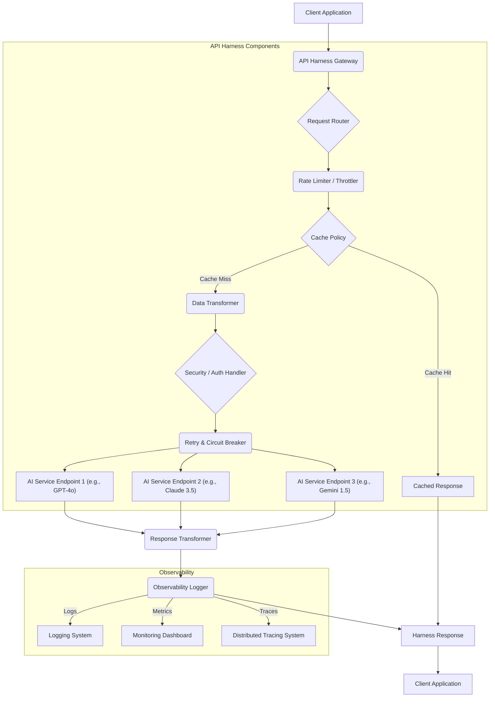

대규모 AI 서비스를 개발하고 운영함에 있어 다양한 AI 모델 및 서드파티 API를 안정적이고 효율적으로 통합하는 것은 핵심 과제입니다. API 하네스(API Harness)는 이러한 복잡한 통합 환경에서 AI 서비스의 견고성(robustness), 확장성(scalability), 그리고 관리 용이성(manageability)을 확보하기 위한 핵심 디자인 패턴입니다. 이는 단순히 API 호출을 래핑하는 것을 넘어, 요청의 라이프사이클 전반에 걸쳐 제어, 모니터링, 최적화를 수행하는 중추적인 역할을 합니다. 2026년 현재, 멀티모달(multimodal) 및 다중 LLM(multi-LLM) 환경이 보편화되면서, API 하네스는 모델 간의 유기적인 연동, 비용 효율성, 그리고 예측 불가능한 외부 API 의존성으로 인한 서비스 장애를 방지하는 필수적인 계층으로 부상했습니다.

### AI API 하네스의 핵심 구성 요소

대규모 AI 서비스 통합을 위한 API 하네스는 다음과 같은 주요 기능을 포함합니다.

#### 1. 요청 라우팅 및 부하 분산 (Request Routing & Load Balancing)
여러 AI 모델 인스턴스 또는 다양한 AI 공급자의 API 엔드포인트 간에 요청을 효율적으로 분배합니다. 이는 특정 모델의 과부하를 방지하고, 지연 시간을 최소화하며, 비용 최적화 전략(예: 저렴한 모델 우선 사용)을 적용하는 데 필수적입니다.

#### 2. 재시도 및 서킷 브레이커 (Retry & Circuit Breaker)
외부 AI API 호출 시 발생할 수 있는 일시적인 네트워크 오류, 서비스 지연, 또는 과부하에 대응하기 위한 패턴입니다. 재시도 로직은 특정 조건에서만 실행되며, 연속적인 실패를 감지하면 해당 API 엔드포인트를 일시적으로 차단하는 서킷 브레이커 패턴을 적용하여 시스템 전체의 안정성을 확보합니다.

#### 3. 캐싱 전략 (Caching Strategies)
반복되는 동일한 AI 모델 추론 요청이나 자주 사용되는 응답에 대해 캐시를 적용하여 API 호출 횟수를 줄이고, 응답 시간을 개선하며, 운영 비용을 절감합니다. 적절한 캐시 무효화(invalidation) 전략이 중요합니다.

#### 4. 관측성 (Observability): 로깅, 모니터링, 트레이싱
모든 API 요청 및 응답에 대한 상세한 로깅, 성능 지표 모니터링, 그리고 분산 트레이싱(distributed tracing)을 통해 AI 서비스의 동작을 투명하게 파악하고 문제 발생 시 신속하게 진단할 수 있도록 합니다. 이는 AI 모델의 성능 저하, 오류 발생 패턴, 그리고 잠재적인 병목 현상을 식별하는 데 필수적입니다.

#### 5. 데이터 변환 및 스키마 검증 (Data Transformation & Schema Validation)
다양한 AI 모델 또는 API가 요구하는 입력 형식과 출력 형식이 다를 수 있으므로, API 하네스 내에서 이러한 데이터 변환을 처리합니다. 또한, 유효하지 않은 입력이나 예상치 못한 출력을 사전에 필터링하고 검증하여 후속 처리 로직의 안정성을 높입니다.

#### 6. 보안 및 인증 (Security & Authentication)
외부 AI API 호출에 필요한 인증 토큰(API Key, OAuth 등)을 안전하게 관리하고, 요청에 자동으로 주입합니다. 또한, 악의적인 요청이나 비정상적인 접근으로부터 AI 서비스를 보호하기 위한 보안 계층을 제공합니다.

#### 7. 버전 관리 및 A/B 테스트 (Versioning & A/B Testing)
AI 모델의 업데이트나 새로운 기능 도입 시, 기존 서비스에 영향을 주지 않으면서 점진적으로 배포하고 성능을 비교하기 위한 메커니즘을 제공합니다. 이는 롤아웃(rollout)의 위험을 줄이고, 최적의 모델을 선정하는 데 기여합니다.

### 디자인 원칙 및 2026년 트렌드 반영

*   **모듈성 및 확장성:** 다양한 LLM 및 멀티모달 모델을 쉽게 추가하거나 교체할 수 있도록 모듈화된 아키텍처를 지향합니다. 새로운 모델이 등장할 때마다 통합 복잡성이 증가하지 않도록 설계합니다.
*   **비용 최적화:** LLM 호출 비용은 중요한 요소입니다. 동적 라우팅을 통해 요청 특성에 따라 가장 비용 효율적인 모델을 선택하고, 캐싱을 적극적으로 활용하여 불필요한 호출을 줄입니다.
*   **에이전트 시스템 통합:** 복잡한 에이전트(Agentic system) 워크플로우를 지원하기 위해 상태 저장(stateful) 라우팅, 컨텍스트 전달(context propagation), 그리고 에이전트 도구 사용(tool use)에 대한 추상화 계층을 제공할 수 있습니다.
*   **실시간 성능 최적화:** 지연 시간에 민감한 애플리케이션을 위해 비동기(asynchronous) 처리, 스트리밍(streaming) 응답 처리, 그리고 엣지 컴퓨팅(edge computing) 통합을 고려합니다.

### API 하네스 아키텍처 다이어그램



### 코드 예제: Go 기반의 간단한 AI API 하네스

이 예제는 Go 언어를 사용하여 동적 라우팅, 재시도 로직, 그리고 기본 로깅 기능을 포함하는 간소화된 API 하네스를 보여줍니다. 실제 프로덕션 환경에서는 이보다 훨씬 복잡한 로직과 에러 핸들링이 필요합니다.

```go
package main

import (
	"bytes"
	"encoding/json"
	"fmt"
	"io"
	"log"
	"net/http"
	"time"
)

// AIServiceConfig defines configuration for an AI service endpoint
type AIServiceConfig struct {
	Name    string
	URL     string
	APIKey  string
	Timeout time.Duration
}

// AIHarness manages routing and calling AI services
type AIHarness struct {
	services map[string]AIServiceConfig
	client   *http.Client
}

// NewAIHarness creates a new AIHarness
func NewAIHarness(configs []AIServiceConfig) *AIHarness {
	serviceMap := make(map[string]AIServiceConfig)
	for _, cfg := range configs {
		serviceMap[cfg.Name] = cfg
	}
	return &AIHarness{
		services: serviceMap,
		client: &http.Client{
			Timeout: 30 * time.Second, // Default client timeout
		},
	}
}

// CallAIService routes and calls the specified AI service
func (h *AIHarness) CallAIService(serviceName string, requestBody []byte) ([]byte, error) {
	cfg, exists := h.services[serviceName]
	if !exists {
		return nil, fmt.Errorf("AI service '%s' not found", serviceName)
	}

	maxRetries := 3
	for i := 0; i < maxRetries; i++ {
		log.Printf("Calling service '%s' (attempt %d/%d)", serviceName, i+1, maxRetries)
		resp, err := h.doRequest(cfg, requestBody)
		if err == nil {
			return resp, nil // Success
		}
		log.Printf("Request to '%s' failed: %v", serviceName, err)

		// Implement specific retry conditions if needed (e.g., HTTP 5xx errors)
		if i < maxRetries-1 {
			time.Sleep(time.Duration(1<<i) * time.Second) // Exponential backoff
		}
	}
	return nil, fmt.Errorf("failed to call AI service '%s' after %d retries", serviceName, maxRetries)
}

func (h *AIHarness) doRequest(cfg AIServiceConfig, requestBody []byte) ([]byte, error) {
	req, err := http.NewRequest("POST", cfg.URL, bytes.NewBuffer(requestBody))
	if err != nil {
		return nil, fmt.Errorf("failed to create request: %w", err)
	}
	req.Header.Set("Content-Type", "application/json")
	req.Header.Set("Authorization", "Bearer "+cfg.APIKey)

	// Use a client with a specific timeout for this service if defined
	serviceClient := h.client
	if cfg.Timeout > 0 {
		serviceClient = &http.Client{Timeout: cfg.Timeout}
	}

	resp, err := serviceClient.Do(req)
	if err != nil {
		return nil, fmt.Errorf("request failed: %w", err)
	}
	defer resp.Body.Close()

	if resp.StatusCode >= 400 {
		bodyBytes, _ := io.ReadAll(resp.Body)
		return nil, fmt.Errorf("API call failed with status %d: %s", resp.StatusCode, string(bodyBytes))
	}

	bodyBytes, err := io.ReadAll(resp.Body)
	if err != nil {
		return nil, fmt.Errorf("failed to read response body: %w", err)
	}
	return bodyBytes, nil
}

func main() {
	// Example configuration for different AI services
	aiServiceConfigs := []AIServiceConfig{
		{
			Name:    "gpt4o",
			URL:     "https://api.openai.com/v1/chat/completions",
			APIKey:  "YOUR_OPENAI_API_KEY", // Replace with actual key
			Timeout: 15 * time.Second,
		},
		{
			Name:    "claude35",
			URL:     "https://api.anthropic.com/v1/messages",
			APIKey:  "YOUR_ANTHROPIC_API_KEY", // Replace with actual key
			Timeout: 20 * time.Second,
		},
	}

	harness := NewAIHarness(aiServiceConfigs)

	// Example usage: call GPT-4o
	gptRequestBody := map[string]interface{}{
		"model": "gpt-4o",
		"messages": []map[string]string{
			{"role": "user", "content": "Tell me a short story."},
		},
		"max_tokens": 100,
	}
	gptJSON, _ := json.Marshal(gptRequestBody)

	gptResponse, err := harness.CallAIService("gpt4o", gptJSON)
	if err != nil {
		log.Printf("Error calling GPT-4o: %v", err)
	} else {
		log.Printf("GPT-4o response: %s", string(gptResponse))
	}

	// Example usage: call Claude 3.5
	claudeRequestBody := map[string]interface{}{
		"model": "claude-3-5-sonnet-20240620",
		"messages": []map[string]string{
			{"role": "user", "content": "Write a haiku about AI."},
		},
		"max_tokens": 50,
	}
	claudeJSON, _ := json.Marshal(claudeRequestBody)

	claudeResponse, err := harness.CallAIService("claude35", claudeJSON)
	if err != nil {
		log.Printf("Error calling Claude 3.5: %v", err)
	} else {
		log.Printf("Claude 3.5 response: %s", string(claudeResponse))
	}
}
```

### ## 트레이드오프

API 하네스 패턴은 복잡한 AI 통합 환경에서 필수적이지만, 도입 시 고려해야 할 트레이드오프가 존재합니다.

*   **구현 복잡성 vs. 시스템 안정성 및 유연성:**
    *   **언제 좋은가 (When good):** 대규모 AI 서비스나 여러 AI 모델/공급자를 통합해야 할 때, 하네스는 API 호출의 복잡성을 추상화하고 일관된 안정성, 재시도, 캐싱, 모니터링 기능을 제공하여 전체 시스템의 견고성과 유연성을 크게 향상시킵니다.
    *   **언제 나쁜가 (When bad):** 단일 AI 모델과의 간단한 통합이거나, 서비스 규모가 매우 작고 변화가 적을 경우, 하네스 구현 및 유지보수 비용이 추가적인 이점보다 클 수 있습니다. 과도한 추상화는 불필요한 오버헤드를 초래할 수 있습니다.

*   **성능 오버헤드 vs. 제어 및 최적화:**
    *   **언제 좋은가 (When good):** 요청 라우팅, 데이터 변환, 보안 검증 등 복잡한 로직을 중앙에서 처리함으로써, 각 AI 서비스 클라이언트의 로직을 단순화하고 전체적인 성능 병목 현상을 진단 및 최적화할 수 있는 단일 제어 지점을 제공합니다. 캐싱을 통해 오히려 전반적인 응답 시간을 개선할 수도 있습니다.
    *   **언제 나쁜가 (When bad):** 하네스가 과도하게 많은 로직을 처리하거나 비효율적으로 구현될 경우, 모든 AI API 호출에 추가적인 네트워크 홉과 처리 지연을 발생시켜 성능 저하의 원인이 될 수 있습니다. 특히 실시간 응답이 매우 중요한 경우 주의가 필요합니다.

*   **단일 실패 지점 가능성 vs. 중앙 집중식 관리:**
    *   **언제 좋은가 (When good):** 모든 AI API 요청이 하네스를 통해 이루어지므로, 보안 정책 적용, 비용 모니터링, 버전 관리 등 중앙 집중식 관리가 용이합니다. 이는 규제 준수(compliance) 및 거버넌스(governance) 측면에서 큰 이점을 제공합니다.
    *   **언제 나쁜가 (When bad):** 하네스 자체가 단일 실패 지점(Single Point of Failure, SPOF)이 될 수 있습니다. 하네스 구현 시 고가용성(High Availability), 장애 복구(Disaster Recovery), 견고한 에러 핸들링 메커니즘을 반드시 포함해야 하며, 이는 추가적인 설계 및 인프라 비용을 수반합니다.

*   **표준화 vs. 특정 모델 최적화 제약:**
    *   **언제 좋은가 (When good):** 여러 AI 모델을 통합할 때 일관된 인터페이스를 제공하여 개발자가 각 모델의 API 특성을 개별적으로 학습할 필요 없이 표준화된 방식으로 호출할 수 있게 합니다.
    *   **언제 나쁜가 (When bad):** 특정 AI 모델이 제공하는 고유의 고급 기능이나 최적화된 인터페이스를 하네스 레이어에서 완벽하게 추상화하기 어려울 수 있습니다. 이로 인해 특정 모델의 잠재력을 100% 활용하지 못하는 제약이 발생할 수 있습니다.

### ## 실전 체크리스트

API 하네스 패턴을 프로젝트에 적용할 때 다음 항목들을 검토하여 성공적인 통합을 보장하십시오.

- [ ] **외부 API 의존성 맵핑 완료 및 위험도 평가:** 현재 사용하거나 통합할 외부 AI API들의 특성(rate limit, 안정성, latency, 비용)을 분석하고, 각 의존성이 서비스에 미칠 잠재적 위험을 식별했는가?
- [ ] **재시도 및 서킷 브레이커 정책 명확화:** 각 AI 서비스 엔드포인트에 대한 재시도 전략(횟수, 지연 시간, 조건부 재시도)과 서킷 브레이커 임계값(failure threshold, reset timeout)을 정의하고 구현했는가?
- [ ] **관측성 지표 및 알림 시스템 구축:** API 하네스를 통한 모든 요청에 대해 응답 시간, 오류율, 캐시 적중률, 외부 API 호출 성공/실패율 등의 핵심 지표를 수집하고, 비정상적인 상황 발생 시 알림을 받을 수 있는 모니터링 및 알림 시스템을 구축했는가?
- [ ] **캐싱 전략 및 무효화 정책 수립:** 캐시를 적용할 API 응답의 범위, 캐시 유효 기간(TTL), 그리고 캐시 무효화 트리거(데이터 변경, 특정 이벤트 발생 등)를 명확히 정의하고 구현하여 비용 절감 및 성능 향상을 도모하는가?
- [ ] **데이터 변환 및 스키마 유효성 검사 로직 구현:** 다양한 AI 모델의 입력 및 출력 스키마 불일치를 처리하고, 데이터 무결성(data integrity)을 보장하기 위한 유효성 검사 로직을 하네스 내에 구현했는가?
- [ ] **보안 및 인증 토큰 관리 전략:** AI API 키 또는 인증 토큰을 안전하게 저장하고, 하네스 내에서 자동으로 주입하며, 접근 제어(access control) 및 로깅(logging) 정책을 적용하여 보안 취약점을 최소화했는가?
- [ ] **고가용성 및 장애 복구 아키텍처 설계:** API 하네스 자체가 단일 실패 지점이 되지 않도록 다중화(redundancy), 로드 밸런싱, 그리고 자동 장애 복구(failover) 메커니즘을 포함한 고가용성 아키텍처를 설계하고 테스트했는가?