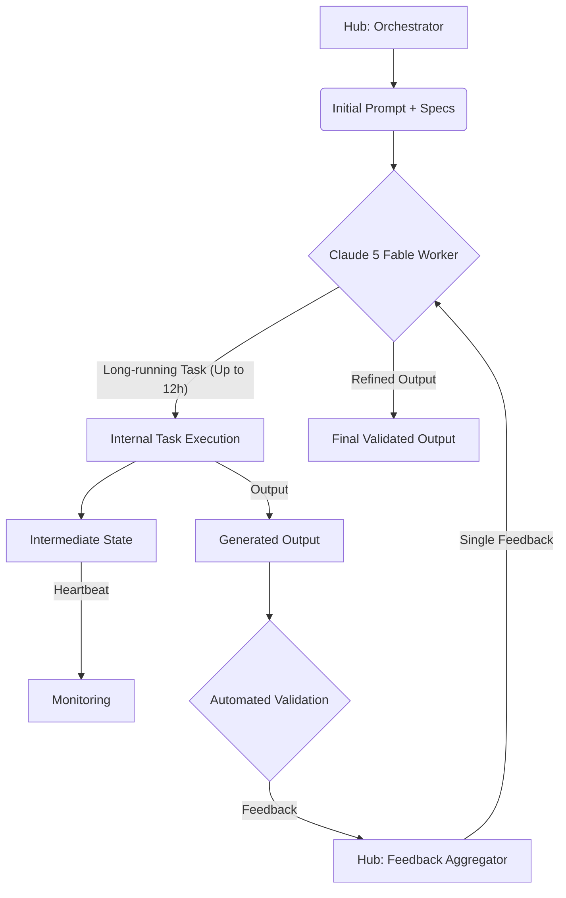

## Claude 5 Fable 기반 LLM 워커 하네스 및 복리 자동화 고도화

Anthropic의 Claude 5 Fable은 'Mythos'급 AI 모델로, 다중 페이지 명세 처리와 최대 12시간 지속 작업 능력을 제공한다. 이 강력한 역량을 활용하여 LLM 워커의 복리 자동화 및 출력 검증 파이프라인을 획기적으로 고도화한다. 기존 `playbook`의 허브-워커 아키텍처는 Fable의 장기 작업 수행 능력과 '단일 프롬프트, 한 번의 피드백' 패턴을 적용하여, 더욱 복잡하고 지속적인 작업을 효율적으로 처리하도록 재설계될 수 있다.

### Claude 5 Fable의 핵심 역량

Fable의 주요 기능은 대규모 컨텍스트 유지 및 장시간 작업 수행이다. 이는 기존 LLM의 컨텍스트 손실 및 단기 기억 제약을 해결한다.

1.  **다중 페이지 명세 처리**: 복잡한 프로젝트 계획, 상세 기술 문서 등 여러 페이지 명세를 단일 컨텍스트 내에서 이해하고 처리한다. 초기 작업 지시 시 모든 정보를 제공하여 후속 프롬프트 의존성을 줄인다.
2.  **최대 12시간 작업 지속**: 장기 코드 개발, 문서 작성, 복잡한 데이터 분석 등 중간 개입 없이 연속적으로 작업을 진행할 수 있다. 작업 흐름 연속성 보장 및 컨텍스트 전환 비용을 최소화한다.
3.  **'단일 프롬프트, 한 번의 피드백' 패턴**: 초기 프롬프트에 상세 지침과 목표를 제시하고, 워커 완료 후 단 한 번의 피드백으로 전체 작업 방향을 조정한다. 인간 감독자 개입 빈도를 줄여 워커 자율성을 극대화한다.

### LLM 워커 하네스 재설계

Fable의 역량을 최대한 활용하기 위해 기존 허브-워커 시스템 하네스를 재설계해야 한다.

*   **지속적 컨텍스트 관리**: Fable의 장기 작업 지속을 위해 워커의 상태, 중간 결과물, 관련 문서 등의 컨텍스트를 효율적으로 관리하고 지속시키는 메커니즘이 필수적이다. 장기 기억 시스템과 통합된다.
*   **복합 작업 분해 및 할당**: 허브는 Fable에게 단일 복합 장기 목표를 할당하며, Fable은 이를 내부적으로 세분화하여 처리한다. Fable 스스로 서브태스크를 정의하고 우선순위를 조정하며 실행하는 자율성이 강화된다.
*   **자동화된 출력 검증 파이프라인**: Fable이 생성한 결과물의 품질과 목표 부합도를 자동으로 검증하는 파이프라인이 중요하다. '한 번의 피드백' 패턴을 위해 초기 프롬프트에 명확한 검증 기준과 예상 출력 포맷을 포함시켜야 한다. 실패 시 허브는 Fable에게 구체적인 개선 피드백을 제공한다.
*   **에이전트 자율성 및 감시 시스템**: 워커 자율성 증대에 따라 이상 징후 감지, 진행 상황 모니터링, 필요 시 수동 개입을 위한 효과적인 감시 시스템이 필요하다. 이는 비용 효율적 자원 사용과 작업 목표 달성을 보장한다.

```python
# Fable-powered worker interaction pseudo-code
import anthropic
from typing import List, Dict, Any

class FableHarness:
    def __init__(self, api_key: str):
        self.client = anthropic.Anthropic(api_key=api_key)
        self.history: List[Dict[str, str]] = []

    def start_long_task(self, sys_p: str, user_p: str) -> Dict[str, Any]:
        """Initiates a long-running task with Claude 5 Fable."""
        self.history = [{"role": "user", "content": user_p}]
        resp = self.client.messages.create(
            model="claude-5-fable", max_tokens=4000, system=sys_p, messages=self.history,
            metadata={"duration_hint_hours": 12}
        )
        self.history.append({"role": "assistant", "content": resp.content[0].text})
        return {"session_id": "fable-task-xyz", "init_resp": resp.content[0].text}

    def provide_single_feedback(self, session_id: str, feedback_p: str) -> Dict[str, Any]:
        """Applies single feedback after task completion for refinement."""
        self.history.append({"role": "user", "content": feedback_p})
        resp = self.client.messages.create(
            model="claude-5-fable", max_tokens=4000,
            system="Refine work based on feedback.", messages=self.history,
            metadata={"session_id": session_id}
        )
        self.history.append({"role": "assistant", "content": resp.content[0].text})
        return {"status": "refined", "output": resp.content[0].text}

# Usage:
# harness = FableHarness(api_key="YOUR_ANTHROPIC_API_KEY")
# task_init = harness.start_long_task(
#     "You are an expert. Develop an API.",
#     "Develop user auth API, OpenAPI 3.0 compliant, JWT, PostgreSQL. Ref 'spec.pdf'."
# )
# final_output = harness.provide_single_feedback(
#     task_init['session_id'],
#     "JWT refresh vulnerability: token not invalidated on logout. Add negative tests."
# )
```



## 트레이드오프

*   **장기 컨텍스트 유지 비용 vs. 작업 효율성**
    *   **언제 좋음**: 복잡하고 상호 의존적인 대규모 프로젝트에서 컨텍스트 재구축 비용 절감 및 심층적 이해가 필요한 경우.
    *   **언제 나쁨**: 각 서브태스크가 독립적이고 짧게 완료될 수 있는 경우, 불필요한 긴 컨텍스트 유지는 비용 낭비.
*   **'단일 프롬프트, 한 번의 피드백' 효율성 vs. 세밀한 제어 손실**
    *   **언제 좋음**: 워커 자율성이 높고, 초기 지침이 명확하며, 예상치 못한 상황 발생 가능성이 낮은 잘 정의된 작업. 인간 개입 최소화로 생산성 극대화.
    *   **언제 나쁨**: 예측 불가능성이 높거나, 중간 요구사항 변경이 잦은 작업. 워커의 잘못된 방향성 파악 시 큰 비용 손실.
*   **복리 자동화 가능성 vs. 오류 증폭 위험**
    *   **언제 좋음**: 작은 개선이 누적되어 큰 성과로 이어지는 반복적, 점진적 작업 흐름. 워커의 자체 학습 및 개선 선순환 구조 형성.
    *   **언제 나쁨**: 초기 작은 오류나 잘못된 가정이 워커 장기 작업 전반에 걸쳐 증폭될 위험. 강력한 중간 검증 및 회복 메커니즘 필수.
*   **초기 설정 복잡성 vs. 장기 운영 용이성**
    *   **언제 좋음**: 초기 에이전트 하네스 설계 및 검증에 충분한 리소스를 투자하여 장기적으로 안정적이고 효율적인 자동화 시스템을 구축하려는 경우.
    *   **언제 나쁨**: 신속한 프로토타이핑이나 단기 자동화 솔루션이 필요한 경우, Fable 특성에 맞춘 복잡한 하네스 설계는 과도한 오버헤드.

## 실전 체크리스트

Claude 5 Fable 기반 LLM 워커 하네스 적용 시 검증 항목.

- [ ]  할당 태스크의 복잡도 및 지속 시간 분석을 완료하여, Fable의 12시간 지속 작업 능력이 실제 비용 효율적 이점을 제공하는지 확인.
- [ ]  '단일 프롬프트, 한 번의 피드백' 패턴을 위한 초기 프롬프트 설계 가이드라인을 수립하고, 모든 잠재적 피드백 시나리오를 포괄하는 명확한 검증 기준을 정의.
- [ ]  Fable 워커의 중간 작업 상태 및 결과물을 지속적으로 저장/관리할 영구 컨텍스트 시스템 (예: 벡터 DB, 파일 시스템)을 설계 및 구현.
- [ ]  Fable이 생성한 출력물에 대한 자동화된 검증 파이프라인 (LLM 기반 평가, 정규식, 스키마 유효성 검사 등)을 구축하고, 90% 이상의 정확도로 오류를 감지하는지 검증.
- [ ]  Fable 워커가 장기 작업을 수행하는 동안 이상 징후 (예: 무한 루프, 컨텍스트 드리프트)를 감지하고 알림을 발생시키는 모니터링 시스템을 구축.
- [ ]  워커 실패 시 자동으로 이전 작업 상태로 롤백하거나, 인간 감독자 개입을 요청하는 장애 복구 및 에스컬레이션 메커니즘을 정의.
- [ ]  Fable 워커의 작업 진행 상황 시각화 및 주요 의사결정 포인트를 추적할 수 있는 대시보드를 구축하여 투명성을 확보.