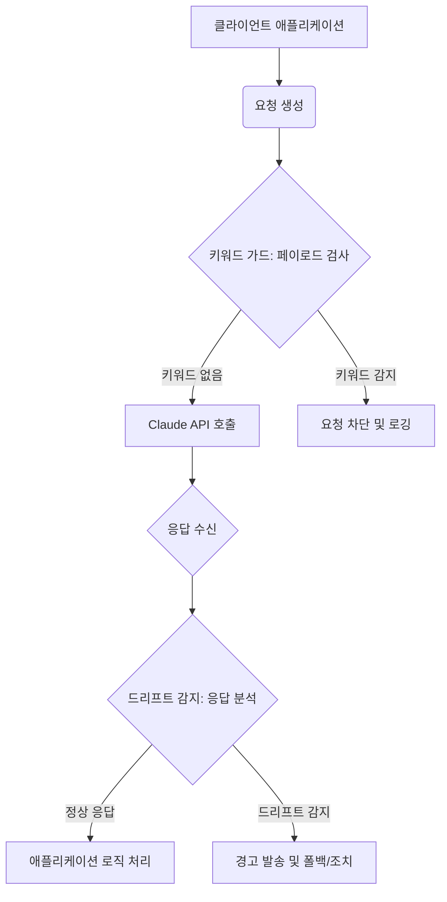

LLM API 변경은 비용 및 서비스 중단을 야기합니다. Claude API "OpenClaw" 사례는 외부 LLM API 의존성 위험을 명확히 보여주며, 이를 방지할 키워드 가드(Keyword Guard)와 응답 드리프트 감지(Response Drift Detection) 시스템 구축이 AI 시스템 보안 핵심 전략입니다.

## 키워드 가드 구현: 사전 필터링 및 모니터링

키워드 가드는 LLM API 호출 전, 페이로드 내 문제 키워드/패턴을 검사/필터링합니다. "OpenClaw" 사례처럼 특정 문자열이 API 동작에 영향을 줄 때, 불필요한 비용과 서비스 중단을 사전에 방지하는 1차 방어선 역할을 합니다.

**구현 방식:**
1.  **페이로드 검사**: API 전송 전 모든 요청 페이로드(JSON, 텍스트) 검사.
2.  **키워드 리스트**: 문제 키워드/정규식 패턴 리스트 지속 업데이트.
3.  **처리 로직**: 키워드 감지 시 요청 거부, 경고/알림, 또는 수정 후 재시도.
4.  **로깅**: 감지 이벤트를 상세 로깅하여 위협/사용 패턴 분석.

아래는 Python으로 구현된 간단한 키워드 가드 예시입니다.

```python
import json
import re

def claude_api_keyword_guard(payload_data: dict, sensitive_keywords: list) -> bool:
    """Claude API payload에서 민감 키워드 검사. 발견 시 False 반환 (호출 차단)."""
    payload_str = json.dumps(payload_data)
    for keyword in sensitive_keywords:
        if re.search(re.escape(keyword), payload_str, re.IGNORECASE):
            print(f"민감 키워드 '{keyword}' 감지. API 호출 차단.") # Simplified logging
            return False
    return True

sensitive_list = ["OpenClaw", "malicious_payload"]

safe_request = {"model": "claude-3-opus-20240229", "messages": [{"role": "user", "content": "Hello, Claude!"}]}
if claude_api_keyword_guard(safe_request, sensitive_list):
    print("페이로드 검사 통과. API 호출 진행.") # Simplified logging
else:
    print("API 호출이 키워드 가드에 의해 차단되었습니다.")

unsafe_request = {"model": "claude-3-opus-20240229", "messages": [{"role": "user", "content": "Test with OpenClaw."}]}
if claude_api_keyword_guard(unsafe_request, sensitive_list):
    print("페이로드 검사 통과. API 호출 진행.")
else:
    print("API 호출이 키워드 가드에 의해 차단되었습니다.")
```

## LLM 응답 행동 변화 (Drift) 감지

응답 드리프트 감지는 LLM API 출력 행동 변화를 실시간 모니터링하는 사후 방어 시스템입니다. LLM 모델 업데이트나 정책 변경은 응답 형식, 질, 시간, 비용에 영향을 주므로, 드리프트 감지는 '조용한' 변화를 포착해 품질 저하나 비용 증가를 방지합니다.

**감지 지표:**
*   **응답 내용**: 거부 메시지, 경고, 비정상 출력.
*   **API 상태 코드**: 4xx, 5xx 에러 증가.
*   **응답 시간**: 급격한 증가.
*   **토큰 사용량**: 유사 입력 대비 유의미한 변화.
*   **비용 알림**: 추가 요금 메시지.

**구현 방식:**
1.  **기준선 설정**: 정상 LLM 응답 패턴(평균 길이, 키워드 빈도, 시간) 정의.
2.  **실시간 모니터링**: 모든 LLM API 응답 가로채어 지표 측정.
3.  **이상 감지**: 현재 지표가 기준선을 벗어날 경우 이상으로 간주.
4.  **경고/자동화**: 이상 감지 시 즉시 알림, 필요 시 폴백 모델 전환 또는 API 호출 중단.

Mermaid 다이어그램은 키워드 가드와 드리프트 감지의 LLM API 파이프라인 통합을 보여줍니다.



## 트레이드오프

### 키워드 가드
*   **장점**: API 호출 전 문제 차단, 비용 최소화, 구현 용이.
*   **단점**: 새 위협에 취약, 리스트 업데이트 필요, 오탐 가능성.

### 응답 드리프트 감지
*   **장점**: LLM 제공사 변화 포착, 서비스 안정성/품질 유지.
*   **단점**: 기준선/모델 구축 노력, 초기 오탐률 높음, 실시간 처리 오버헤드.

## 실전 체크리스트

*   **키워드 가드**: 모든 LLM API 호출 경로에 가드 로직 통합 및 관련 페이로드 필드 검사 여부.
*   **키워드 리스트**: 잠재 위험 키워드 리스트 중앙 관리 및 신속 업데이트 가능성.
*   **드리프트 지표**: 응답 상태 코드, 시간, 토큰 사용량, 에러/경고 메시지 등 핵심 지표 정의 및 측정 여부.
*   **기준선**: 정상 LLM 응답 패턴(Baseline) 설정 및 주기적 업데이트 여부.
*   **알림**: 키워드/드리프트 감지 시, 적절한 채널 통해 담당자에게 즉시 알림 발송 여부.
*   **폴백/자동화**: 심각한 드리프트 감지 시, 대체 LLM 모델 전환/API 호출 중단 등 자동화 조치 정의 및 테스트 여부.
*   **로깅/가시성**: 키워드/드리프트 감지 이벤트 상세 로깅 및 대시보드 실시간 모니터링 가능 여부.