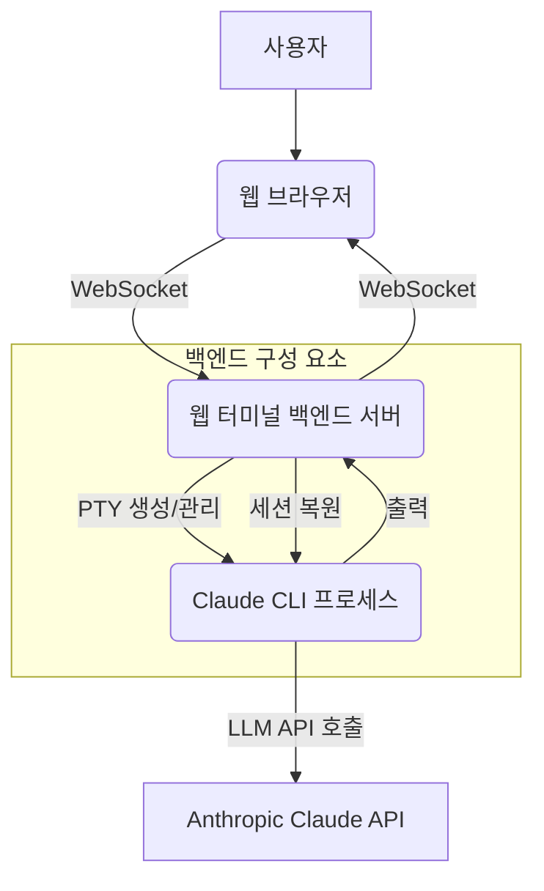

복잡하고 장시간 지속되는 Agentic LLM 작업의 경우, 중단 없는 LLM 상호작용은 2026년 개발 환경에서 핵심적인 요구사항입니다. 기존의 Claude CLI와 같은 터미널 도구는 세션을 로컬 클라이언트 환경에 종속시켜, 클라이언트 연결이 끊기면 작업이 중단되는 문제를 야기합니다. Persistent Multi-session Web Terminal은 이러한 제약을 해결하여, LLM 상호작용 세션을 클라이언트의 생명주기와 분리합니다.

## 핵심 개념: 세션 영속성 및 웹 기반 접근
이 시스템은 Claude CLI 세션을 백엔드 서버에서 PTY (Pseudo-Terminal) 형태로 유지합니다. 웹 브라우저는 단지 입출력을 스트리밍하는 인터페이스 역할만 수행합니다. 가장 중요한 특징은 브라우저 탭이 닫히거나 클라이언트 장치가 종료되더라도 서버에서 PTY가 계속 활성 상태로 유지된다는 점입니다. 세션 복원(Session Restoration) 기능은 자동으로 진행 중이던 PTY에 재연결하여 작업의 연속성을 보장합니다. PC를 끄고 켜도 `--resume` 옵션과 유사하게 세션이 자동으로 복원되는 메커니즘을 통해, 개발자는 어떤 환경에서든 중단 없이 LLM 작업을 이어나갈 수 있습니다.

## 아키텍처 및 동작 원리
이 웹 터미널의 핵심은 서버 측에서 PTY를 생성하고 관리하는 능력과, 이 PTY의 입출력을 웹 클라이언트와 실시간으로 동기화하는 것입니다. 사용자가 웹 브라우저를 통해 터미널에 접속하면, 서버는 새로운 PTY를 할당하고 그 위에 Claude CLI 프로세스를 실행합니다. 클라이언트의 입력은 WebSocket을 통해 서버로 전송되고, PTY에 연결된 Claude CLI 프로세스의 표준 입력으로 주입됩니다. Claude CLI의 출력은 PTY를 통해 서버로 전달된 후, 다시 WebSocket을 통해 웹 클라이언트로 스트리밍되어 브라우저에 표시됩니다.



```python
# Simplified Python Backend (using pty, websockets, asyncio)
import asyncio
import pty
import os
import websockets

ACTIVE_SESSIONS = {}

async def terminal_session(websocket, path):
    # For simplicity, session_id generation is omitted
    session_id = f"session-{os.getpid()}" # Placeholder
    print(f"New session: {session_id}")

    master_fd, slave_fd = pty.openpty()
    pid = os.fork()

    if pid == 0: # Child process
        os.setsid()
        os.dup2(slave_fd, 0)
        os.dup2(slave_fd, 1)
        os.dup2(slave_fd, 2)
        os.close(master_fd)
        os.execvp("claude", ["claude", "--resume", session_id]) # Example with resume
    else: # Parent process
        os.close(slave_fd)
        ACTIVE_SESSIONS[session_id] = (master_fd, pid)
        try:
            while True:
                # Read from PTY and send to websocket
                output = os.read(master_fd, 1024).decode(errors='ignore')
                if output: await websocket.send(output)

                # Read from websocket and send to PTY
                try:
                    input_data = await asyncio.wait_for(websocket.recv(), timeout=0.1)
                    os.write(master_fd, input_data.encode())
                except asyncio.TimeoutError:
                    pass # No input, continue reading output
        except websockets.exceptions.ConnectionClosed:
            print(f"Session {session_id} disconnected.")
        finally:
            # On disconnect, session can persist or be cleaned up
            # For persistence, we'd detach process from PTY and keep it running
            # For this example, we'll just clean up the PTY
            os.kill(pid, 9) # Terminate Claude CLI for simplicity
            del ACTIVE_SESSIONS[session_id]

start_server = websockets.serve(terminal_session, "localhost", 8765)
asyncio.get_event_loop().run_until_complete(start_server)
asyncio.get_event_loop().run_forever()
```

```javascript
// Simplified Frontend JavaScript (connecting to WebSocket)
const terminalContainer = document.getElementById('terminal-output');
const terminalInput = document.getElementById('terminal-input');
const ws = new WebSocket('ws://localhost:8765');

ws.onopen = () => {
    console.log('Connected to Claude CLI terminal.');
};

ws.onmessage = (event) => {
    terminalContainer.textContent += event.data;
    terminalContainer.scrollTop = terminalContainer.scrollHeight; // Auto-scroll
};

ws.onclose = () => {
    console.log('Disconnected from Claude CLI terminal.');
};

terminalInput.addEventListener('keydown', (e) => {
    if (e.key === 'Enter') {
        ws.send(terminalInput.value + '\n');
        terminalInput.value = '';
    }
});
```

## 트레이드오프

1.  **세션 영속성 및 안정성 (Session Persistence & Reliability)**: 장기간 실행되는 LLM 작업, Agentic 코딩, 원격 개발 환경에 매우 유리합니다. 하지만 일회성이고 짧은 LLM 질의, 또는 엄격하게 로컬 환경에서만 실행되어야 하는 민감한 작업에는 오버헤드가 발생할 수 있습니다.
2.  **접근성 및 협업 (Accessibility & Collaboration)**: 여러 장치에서의 접근성, 팀원 간의 공동 디버깅, 공유 LLM 환경 구축에 효과적입니다. 그러나 엄격한 네트워크 격리가 필요한 환경이나 단일 사용자의 고성능 로컬 개발 설정에는 불필요한 복잡성을 추가할 수 있습니다.
3.  **자원 관리 및 비용 (Resource Management & Cost)**: 불필요한 세션 재시작을 방지하여 LLM API 사용량을 최적화하는 데 도움이 됩니다. 하지만 서버 인프라 유지 비용이 세션 영속성으로 얻는 이점보다 큰 소규모 프로젝트에는 적합하지 않을 수 있습니다.
4.  **보안 복잡성 (Security Complexity)**: 중앙 집중식 로깅 및 접근 제어를 통해 보안 관리를 용이하게 할 수 있습니다. 그러나 웹 인터페이스 및 서버 측 PTY라는 새로운 공격 표면을 생성하므로, 적절한 보안 조치가 없으면 취약해질 수 있습니다.
5.  **지연 시간 및 UX 오버헤드 (Latency & UX Overhead)**: 백그라운드 작업이나 로컬 환경 설정이 복잡한 경우에 유용합니다. 하지만 직접적인 CLI 접근이 더 우수한 매우 낮은 지연 시간과 높은 처리량이 요구되는 인터랙티브 작업에서는 약간의 지연이 발생할 수 있습니다.

## 실전 체크리스트

- [ ] PTY 세션의 서버 측 생명주기 관리 및 자동 복구 로직이 견고하게 구현되었는가?
- [ ] 웹 터미널과 서버 간 WebSocket 연결이 안정적이며, 연결 끊김 시 재연결 메커니즘이 작동하는가?
- [ ] 여러 세션 간의 격리(Isolation)가 보장되어, 한 세션의 문제가 다른 세션에 영향을 주지 않는가?
- [ ] 세션 접속 시 사용자 인증 및 권한 부여 메커니즘이 안전하게 구현되었는가?
- [ ] 장시간 유휴 세션에 대한 자원 회수(Garbage Collection) 정책이 정의되고 적용되었는가?
- [ ] Claude CLI의 특정 출력(예: 스트리밍 응답, `tool_code` 블록)이 웹 터미널에서 올바르게 렌더링되고 사용자 입력이 정확하게 전달되는가?
- [ ] 세션 복원 시 이전 컨텍스트와 작업 상태가 `claude-cli --resume`과 같은 방식으로 완벽하게 로드되는지 검증되었는가?