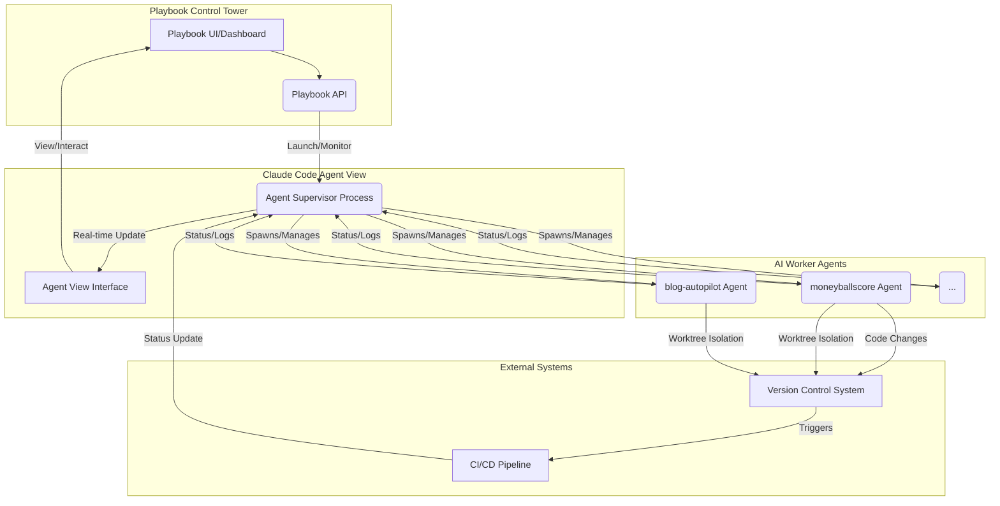

복잡한 AI 에이전트 워크플로우 환경에서 개별 워커의 운영 효율성과 안정성을 확보하는 것은 핵심적인 과제입니다. 특히 `playbook`과 같은 시스템에서 `moneyballscore`나 `blog-autopilot` 같은 다양한 AI 워커들을 효과적으로 관리하기 위해서는 중앙화된 관제 시스템이 필수적입니다. Claude Code의 'Agent View'는 이러한 요구사항을 충족시키며, 여러 에이전트 세션을 단일 화면에서 발사(launch), 감시(monitor), 응답(respond)할 수 있도록 지원하는 강력한 도구입니다.

## Claude Code Agent View의 핵심 기능과 통합 전략

Claude Code의 Agent View는 AI 에이전트 관리에 있어 기존의 분산된 접근 방식이 가진 한계를 극복합니다. 주요 기능은 다음과 같습니다:

*   **중앙화된 세션 관리**: 여러 Claude Code 세션을 하나의 인터페이스에서 통합 관리합니다. 이는 `playbook`의 '프로젝트 관제탑' 기능을 강화하는 데 결정적인 역할을 합니다.
*   **터미널 없는 백그라운드 세션**: 각 세션이 터미널에 종속되지 않고 백그라운드에서 지속적으로 실행됩니다. 이는 `playbook`의 'ambient 배포' 전략과 완벽하게 연계되어, 워커의 중단 없는 운영 안정성을 확보합니다.
*   **워크트리 파일 충돌 자동 격리**: 멀티 에이전트 환경에서 발생할 수 있는 파일 충돌 문제를 Worktree 기반으로 자동으로 해결합니다. 이는 개발 및 운영 과정에서의 효율성을 크게 향상시킵니다.
*   **CI 상태 통합 표시**: Pull Request(PR)와 연동하여 CI(Continuous Integration) 상태를 Agent View 내에서 직접 확인할 수 있습니다. 이는 `playbook`의 드리프트 감지 및 CI/CD 워크플로우에 실시간 피드백을 제공하여, 개발-운영 라이프사이클의 투명성과 신뢰도를 높입니다.

이러한 기능들을 `playbook`의 '프로젝트 관제탑'에 통합함으로써, 개발자는 AI 워커의 상태를 직관적으로 파악하고, 문제 발생 시 신속하게 대응할 수 있습니다. 2026년에는 이러한 중앙화된 에이전트 관리 시스템이 더욱 고도화되어, 자율적인 에이전트 재배치, 예측 유지보수, 그리고 AI-driven AIOps 기능을 통해 운영 비용을 최적화하고 시스템 복원력을 극대화할 것으로 예상됩니다.

### 통합 아키텍처 다이어그램



## 코드 예시: Playbook에서 Claude Code Agent 관리 인터페이스

다음은 `playbook` 시스템이 Claude Code Agent View API를 통해 AI 워커를 어떻게 관리할 수 있는지 보여주는 간략한 Python 코드 예시입니다. 이는 가상의 API를 사용하여 에이전트를 시작하고 상태를 조회하는 과정을 시뮬레이션합니다.

```python
import requests
import json
import time

class PlaybookAgentManager:
    def __init__(self, agent_view_api_base_url):
        self.api_url = agent_view_api_base_url

    def launch_agent(self, agent_id: str, config: dict) -> dict:
        """Claude Code Agent View를 통해 AI 워커를 시작합니다."""
        endpoint = f"{self.api_url}/agents/{agent_id}/launch"
        try:
            response = requests.post(endpoint, json=config)
            response.raise_for_status() # HTTP 에러 발생 시 예외 처리
            print(f"Agent '{agent_id}' launched successfully.")
            return response.json()
        except requests.exceptions.RequestException as e:
            print(f"Error launching agent '{agent_id}': {e}")
            return {"status": "error", "message": str(e)}

    def get_agent_status(self, agent_id: str) -> dict:
        """특정 AI 워커의 현재 상태를 조회합니다."""
        endpoint = f"{self.api_url}/agents/{agent_id}/status"
        try:
            response = requests.get(endpoint)
            response.raise_for_status()
            return response.json()
        except requests.exceptions.RequestException as e:
            print(f"Error fetching status for agent '{agent_id}': {e}")
            return {"status": "error", "message": str(e)}

    def terminate_agent(self, agent_id: str) -> dict:
        """AI 워커를 종료합니다."""
        endpoint = f"{self.api_url}/agents/{agent_id}/terminate"
        try:
            response = requests.post(endpoint)
            response.raise_for_status()
            print(f"Agent '{agent_id}' terminated successfully.")
            return response.json()
        except requests.exceptions.RequestException as e:
            print(f"Error terminating agent '{agent_id}': {e}")
            return {"status": "error", "message": str(e)}

# --- Usage Example ---
if __name__ == "__main__":
    manager = PlaybookAgentManager("http://localhost:8080/api/v1/agent-view") # 가상 Agent View API 엔드포인트

    # 1. moneyballscore 워커 시작
    moneyball_config = {"model": "claude-3-opus", "task": "financial-analysis", "environment": "production"}
    print("\nLaunching moneyballscore agent...")
    launch_result = manager.launch_agent("moneyballscore-001", moneyball_config)
    print(f"Launch Result: {json.dumps(launch_result, indent=2)}")

    time.sleep(2) # 에이전트 시작 대기

    # 2. blog-autopilot 워커 시작
    blog_config = {"model": "claude-3-sonnet", "task": "content-generation", "topic": "ai-trends"}
    print("\nLaunching blog-autopilot agent...")
    manager.launch_agent("blog-autopilot-002", blog_config)

    time.sleep(3) # 에이전트 작업 수행 대기

    # 3. moneyballscore 워커 상태 조회
    print("\nGetting status for moneyballscore agent...")
    status_result = manager.get_agent_status("moneyballscore-001")
    print(f"Status Result: {json.dumps(status_result, indent=2)}")

    # 4. blog-autopilot 워커 종료
    print("\nTerminating blog-autopilot agent...")
    terminate_result = manager.terminate_agent("blog-autopilot-002")
    print(f"Terminate Result: {json.dumps(terminate_result, indent=2)}")

```

## 트레이드오프

Claude Code Agent View를 플레이북에 통합하는 것은 여러 이점을 제공하지만, 고려해야 할 트레이드오프도 존재합니다.

*   **중앙 집중식 관제 및 가시성**: 여러 에이전트의 상태, 로그, 진행 상황을 한눈에 파악할 수 있어 운영 부담이 줄어듭니다.
    *   **언제 좋음**: 대규모 멀티-에이전트 시스템을 운영하거나, 복잡한 워크플로우에서 에이전트 간의 상호작용을 추적해야 할 때 유리합니다.
    *   **언제 나쁨**: 소수의 단순한 에이전트를 운영하거나, 각 에이전트가 완벽하게 독립적으로 동작하는 아키텍처에서는 오버헤드가 될 수 있습니다.

*   **운영 안정성 및 지속성**: 터미널에 종속되지 않는 백그라운드 세션은 에이전트의 지속적인 운영을 보장하며, `ambient 배포` 환경에 적합합니다.
    *   **언제 좋음**: 장시간 실행되거나 외부 이벤트에 반응해야 하는 스테이트풀(stateful) 에이전트에 특히 유용합니다.
    *   **언제 나쁨**: 에이전트 수명이 매우 짧고, 즉각적인 반응 후 종료되는 서버리스(serverless) 함수와 유사한 워커에서는 큰 이점이 없을 수 있습니다.

*   **개발 워크플로우 효율성**: Worktree를 통한 파일 충돌 자동 격리 및 CI 상태 통합 표시는 개발 및 배포 사이클을 가속화합니다.
    *   **언제 좋음**: 여러 개발자가 동시에 에이전트 코드를 수정하거나, 에이전트가 복잡한 CI/CD 파이프라인의 일부로 동작할 때 생산성을 높입니다.
    *   **언제 나쁨**: 단일 개발자가 단일 에이전트만 관리하고, CI/CD 과정이 매우 단순할 때는 그 효과가 미미할 수 있습니다.

*   **벤더 종속성**: Claude Code Agent View에 대한 의존성은 특정 벤더에 대한 종속성을 증가시킵니다.
    *   **언제 좋음**: Claude 생태계에 깊이 통합되어 있으며, 해당 플랫폼의 장점을 극대화하고자 할 때 합리적인 선택입니다.
    *   **언제 나쁨**: 멀티-클라우드 전략을 지향하거나, 유연하게 AI 모델 및 플랫폼을 변경해야 하는 경우에는 위험 요소가 됩니다.

## 실전 체크리스트

Claude Code Agent View를 `playbook`의 관제탑에 통합할 때 다음 항목들을 검증해야 합니다.

- [ ] **Agent View API 통합 유효성 검사**: `playbook` 시스템이 Claude Code Agent View의 API 엔드포인트와 안정적으로 통신하며, 에이전트 발사/감시/종료 명령을 정확히 전송하는지 확인합니다.
- [ ] **지속성 세션 안정성 테스트**: 터미널 없이 백그라운드에서 실행되는 워커 세션들이 예상치 못한 상황(네트워크 단절, 시스템 재시작 등)에서도 복원력을 가지고 지속적으로 동작하는지 부하 테스트를 포함하여 검증합니다.
- [ ] **워크트리 충돌 격리 동작 확인**: 여러 에이전트가 동시에 동일한 코드 베이스에 접근하여 수정 작업을 수행할 때, Worktree의 파일 충돌 자동 격리 메커니즘이 올바르게 작동하며 데이터 무결성을 유지하는지 확인합니다.
- [ ] **CI/CD 상태 동기화 정확성**: Agent View에 표시되는 CI 상태(예: PR 상태, 테스트 결과)가 실제 CI/CD 파이프라인의 상태와 실시간으로 정확하게 동기화되는지 검증하고, 지연 시간을 최소화합니다.
- [ ] **관제 대시보드 커스터마이징 가능성**: `playbook`의 특정 요구사항에 맞춰 Agent View의 정보 표시 방식이나 상호작용 요소를 커스터마이징할 수 있는 확장성을 평가합니다.
- [ ] **보안 및 접근 제어 정책 적용**: 중앙화된 Agent View를 통해 에이전트 라이프사이클을 관리하는 과정에서, 적절한 인증(authentication) 및 권한 부여(authorization) 메커니즘이 모든 에이전트와 사용자에게 적용되어 있는지 확인합니다.
- [ ] **성능 및 확장성 평가**: 통합된 시스템이 다수의 AI 워커를 동시에 관리하고, 각 워커의 부하 증가에 따라 안정적인 성능을 유지하며 수평적 확장이 가능한지 벤치마킹을 수행합니다.