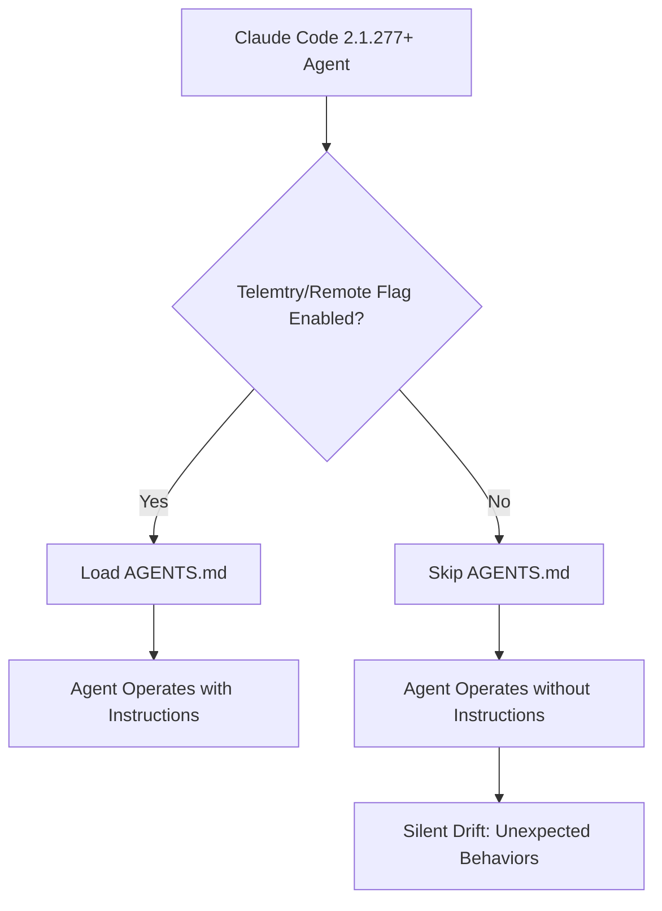

Claude Code 2.1.277+ 버전에서 `AGENTS.md` 파일이 텔레메트리 설정에 종속되어 발생하는 예기치 않은 동작은 AI 에이전트 개발 및 운영에 있어 심각한 위험을 초래합니다. `AGENTS.md`는 에이전트의 로컬 지침을 정의하는 핵심 파일임에도 불구하고, 텔레메트리 또는 비필수 트래픽이 비활성화될 경우 경고 없이 무시될 수 있습니다. 이는 에이전트의 의도된 동작과 실제 실행 간의 불일치를 야기하며, 예측 불가능한 결과를 초래할 수 있습니다.

## AGENTS.md의 역할과 텔레메트리 종속성 문제

`AGENTS.md` 파일은 Claude Code 에이전트에게 특정 프로젝트나 환경에 대한 지침, 제약 조건, 행동 원칙 등을 제공하는 역할을 합니다. 예를 들어, 특정 파일 패턴을 무시하거나, 코드 작성 스타일을 지정하거나, 보안 관련 제약을 명시하는 등의 용도로 사용됩니다. 개발자는 이 파일을 통해 에이전트의 행동을 로컬에서 세밀하게 제어할 수 있다고 기대합니다.

그러나 Claude Code 2.1.277 버전에서 도입된 `AGENTS.md` 지원 기능은 내부적으로 원격 기능 플래그(remote feature flag)에 의존하는 것으로 밝혀졌습니다. 이 플래그는 텔레메트리 수집과 같은 비필수 트래픽 설정을 통해 제어될 수 있습니다. 만약 시스템 관리자가 프라이버시, 규정 준수, 또는 네트워크 최적화를 이유로 텔레메트리나 기타 원격 통신을 비활성화하면, 해당 기능 플래그가 기본값인 `false`로 설정될 수 있습니다. 이 경우, Claude Code는 `AGENTS.md` 파일을 읽지 않고 에이전트를 실행하게 되며, 이에 대한 어떠한 경고나 오류 메시지도 출력하지 않습니다.

이러한 `Silent Drift` 패턴은 에이전트의 신뢰성과 안전성에 치명적인 영향을 미칠 수 있습니다. 개발자가 설정한 중요한 제약 조건이나 가이드라인이 에이전트에게 전달되지 않아, 예상치 못한 코드 변경, 비용 초과, 보안 취약점 발생 등으로 이어질 위험이 있습니다.

### 문제 진단 및 영향 분석

이 문제를 진단하기 위해서는 Claude Code 에이전트가 실행되는 환경의 텔레메트리 및 원격 기능 플래그 설정을 면밀히 검토해야 합니다.

1.  **Claude Code 버전 확인**: 문제가 보고된 2.1.277 이상의 버전을 사용하는지 확인합니다.
2.  **텔레메트리 설정 감사**: Claude Code를 감싸는 워커(worker) 또는 런타임 환경에서 텔레메트리 관련 설정(예: `ANTHROPIC_TELEMETRY_ENABLED`, `CLAUDE_FEATURE_AGENTS_MD_REMOTE_FLAG`)이 어떻게 구성되어 있는지 확인합니다. 클라우드 환경에서는 IAM 정책, 환경 변수, 또는 코드 내 직접 설정 등을 확인해야 합니다.
3.  **실제 에이전트 동작 테스트**: 텔레메트리를 비활성화한 상태에서 `AGENTS.md`에 명시된 지침(예: 특정 파일 타입 무시)이 실제로 에이전트에게 적용되는지 테스트하여 기능 누락 여부를 검증합니다.



## 해결 전략 및 코드 예시

이 문제를 해결하기 위한 전략은 크게 두 가지입니다: 텔레메트리 설정을 조정하거나, 에이전트의 실행 환경을 강화하여 `AGENTS.md`의 로딩을 보장하는 것입니다.

### 1. 텔레메트리 설정 조정

가장 직접적인 방법은 `AGENTS.md` 로딩을 담당하는 원격 기능 플래그가 항상 활성화되도록 텔레메트리 관련 설정을 조정하는 것입니다. 이는 일반적으로 환경 변수나 설정 파일을 통해 이루어집니다.

```python
# Python 환경 변수를 통한 설정 예시
import os

# AGENTS.md 로딩을 위한 원격 플래그를 활성화
# 실제 환경 변수명은 Claude Code 구현에 따라 다를 수 있음
os.environ["ANTHROPIC_FEATURE_AGENTS_MD_ENABLED"] = "true" 
os.environ["CLAUDE_TELEMETRY_OPT_IN"] = "true" # 텔레메트리 활성화 (AGENTS.md 종속성 해결)

# Anthropic client 초기화 (이후 Agent 호출)
# from anthropic import Anthropic
# client = Anthropic(api_key=os.environ.get("ANTHROPIC_API_KEY"))
# ...
```
**참고**: 위 환경 변수명은 예시이며, 실제 Claude Code 내부 구현에 따라 정확한 플래그 이름은 다를 수 있습니다. Anthropic 공식 문서 또는 Claude Code 릴리스 노트를 확인하여 정확한 텔레메트리 및 기능 플래그 설정 방법을 찾아야 합니다.

### 2. 워커 코드 또는 에이전트 하네스 강화

텔레메트리 활성화가 불가능하거나 바람직하지 않은 경우, 에이전트 실행을 담당하는 워커 코드 또는 하네스(harness)에서 `AGENTS.md` 내용을 직접 읽어 에이전트 프롬프트에 주입하는 방식을 고려할 수 있습니다. 이는 프레임워크의 내부 종속성을 우회하여 로컬 지침의 적용을 보장합니다.

```python
import os

def load_agents_md(filepath="AGENTS.md"):
    """
    AGENTS.md 파일을 읽어 그 내용을 반환합니다.
    파일이 없거나 읽을 수 없으면 빈 문자열을 반환합니다.
    """
    if not os.path.exists(filepath):
        print(f"Warning: AGENTS.md not found at {filepath}")
        return ""
    try:
        with open(filepath, "r", encoding="utf-8") as f:
            return f.read()
    except Exception as e:
        print(f"Error reading AGENTS.md: {e}")
        return ""

def create_claude_agent_prompt(task_description: str, agents_md_content: str) -> str:
    """
    AGENTS.md 내용을 포함하여 Claude 에이전트를 위한 프롬프트를 생성합니다.
    """
system_prompt = f"""
You are an AI assistant. Follow these guidelines for your task:

<agents_md_instructions>
{agents_md_content}
</agents_md_instructions>

Now, proceed with the following task:
{task_description}
"""
    return system_prompt

# 실제 워커 또는 하네스 로직
if __name__ == "__main__":
    agents_instructions = load_agents_md()
    
    # AGENTS.md가 로드되지 않았다면 경고 또는 강제 종료
    if not agents_instructions:
        print("CRITICAL ERROR: AGENTS.md could not be loaded. Agent will run without local instructions.")
        # production 환경에서는 이 지점에서 강제 종료 또는 대체 전략 필요
        # raise RuntimeError("Cannot proceed without AGENTS.md instructions.")

    user_task = "Refactor the 'utils.py' file to improve readability and add type hints."
    final_prompt = create_claude_agent_prompt(user_task, agents_instructions)

    # 이 final_prompt를 Claude API 호출의 system_prompt 또는 instruction으로 사용
    print("--- Generated Prompt ---")
    print(final_prompt)
    print("------------------------")
    
    # 예시: Claude API 호출 (pseudo-code)
    # from anthropic import Anthropic
    # client = Anthropic(api_key=os.environ.get("ANTHROPIC_API_KEY"))
    # response = client.messages.create(
    #     model="claude-3-opus-20240229",
    #     max_tokens=1000,
    #     system=final_prompt,
    #     messages=[
    #         {"role": "user", "content": user_task}
    #     ]
    # )
    # print(response.content)

```

이 접근 방식은 Claude Code의 내부 동작에 대한 의존성을 줄이고, `AGENTS.md`의 내용을 직접 제어함으로써 에이전트의 예측 가능성을 높입니다. 2026년 현재, AI 에이전트의 신뢰성과 투명성에 대한 요구가 커지면서, 이러한 "Agent Harness Engineering" 접근 방식은 더욱 중요해지고 있습니다. 프레임워크의 블랙박스 동작에만 의존하기보다, 핵심 제어 로직을 애플리케이션 레벨에서 관리하는 것이 안정적인 에이전트 시스템 구축의 핵심 트렌드입니다.

## 트레이드오프

### 1. 프레임워크 기능 활용 vs. 직접 제어
*   **언제 좋은가**: 프레임워크가 제공하는 `AGENTS.md` 자동 로딩 기능은 설정이 올바르게 작동할 경우 개발 편의성을 높입니다. 프레임워크의 최적화된 로딩 메커니즘을 활용할 수 있습니다.
*   **언제 나쁜가**: 프레임워크 내부 구현의 불투명성으로 인해 예기치 않은 종속성(예: 텔레메트리) 문제가 발생할 수 있습니다. 디버깅이 어렵고, 프레임워크 업데이트 시 호환성 문제가 생길 수 있습니다. 직접 제어 방식은 초기 구현 비용이 들지만, 예측 불가능한 외부 요인으로부터 시스템을 보호합니다.

### 2. 텔레메트리 활성화 vs. 프라이버시/보안
*   **언제 좋은가**: 텔레메트리 활성화는 제품 개선을 위한 사용 데이터를 제공하여 장기적으로 더 나은 AI 모델과 기능을 제공하는 데 기여합니다.
*   **언제 나쁜가**: 민감한 정보를 다루는 환경에서는 텔레메트리 활성화가 규정 준수(GDPR, HIPAA 등) 및 보안 정책을 위반할 위험이 있습니다. 불필요한 데이터 전송은 네트워크 비용 증가 및 잠재적 데이터 유출 위험을 수반합니다. `AGENTS.md`와 같은 로컬 지침이 원격 플래그에 묶이는 것은 프라이버시를 중요하게 여기는 사용자에게 큰 문제입니다.

### 3. 단일 설정 지점 vs. 분산된 제어
*   **언제 좋은가**: `AGENTS.md`가 프레임워크에 의해 자동으로 관리될 경우, 에이전트 지침을 단일 파일로 유지하면서 프레임워크의 내부 로직과 긴밀하게 통합될 수 있습니다.
*   **언제 나쁜가**: 텔레메트리 종속성과 같은 숨겨진 메커니즘으로 인해, `AGENTS.md` 파일 자체만으로는 에이전트 동작을 완전히 제어할 수 없게 됩니다. 이는 실제 동작이 여러 설정 지점(파일, 환경 변수, 원격 플래그)에 분산되어 있어 시스템의 복잡성을 증가시키고 감사(audit)를 어렵게 만듭니다.

## 실전 체크리스트

프로젝트에 Claude Code 에이전트를 도입하거나 운영할 때, `AGENTS.md`의 신뢰성을 확보하기 위한 실전 체크리스트입니다.

*   [ ] **Claude Code 버전 확인 및 패치 계획 수립**: 사용 중인 Claude Code 버전(특히 2.1.277 이상)을 확인하고, 텔레메트리 종속성 문제를 해결하는 공식 패치가 있는지 주기적으로 확인합니다.
*   [ ] **텔레메트리 및 원격 기능 플래그 설정 감사**: 에이전트 런타임 환경에서 `ANTHROPIC_FEATURE_AGENTS_MD_ENABLED` (또는 유사한) 환경 변수 및 텔레메트리 활성화 여부를 명확히 확인하고 문서화합니다.
*   [ ] **`AGENTS.md` 로딩 무결성 테스트 구현**: 텔레메트리 비활성화 환경을 포함하여, 다양한 운영 환경에서 `AGENTS.md` 파일이 예상대로 로드되고 에이전트 지침이 적용되는지 검증하는 자동화된 테스트를 추가합니다.
*   [ ] **하네스 레벨에서 `AGENTS.md` 수동 주입 고려**: 텔레메트리 활성화가 어렵거나 원치 않을 경우, 에이전트 프롬프트 구성 시 `AGENTS.md` 내용을 직접 읽어 주입하는 패턴을 적용합니다.
*   [ ] **경고 및 오류 처리 로직 강화**: `AGENTS.md` 파일을 찾을 수 없거나 로딩에 실패했을 때, 시스템이 경고를 발생시키거나 안전하게 종료되도록 에이전트 하네스 또는 워커 로직을 수정합니다.
*   [ ] **에이전트 동작 예측 가능성 문서화**: `AGENTS.md`의 내용과 함께, 이 파일이 어떤 설정에 의해 활성화되는지, 그리고 특정 환경에서 어떻게 동작할 것인지에 대한 상세한 문서를 유지보수합니다.
*   [ ] **AI 에이전트 보안 감사 프로세스 포함**: 에이전트의 외부 종속성(예: 원격 기능 플래그)이 에이전트의 보안 및 안전 지침에 영향을 미칠 수 있는지 정기적으로 감사하는 절차를 수립합니다.