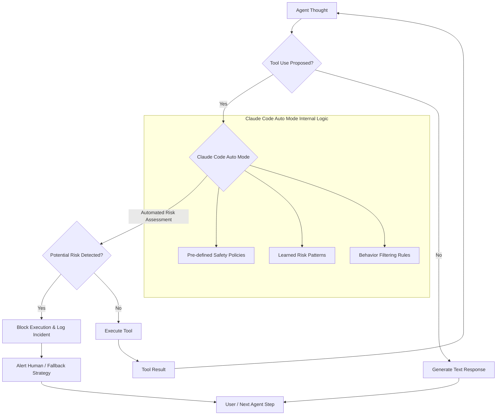

Claude Code의 Auto mode는 에이전트 기반 개발 워크플로우에서 안전하고 자율적인 코드 실행을 위한 중요한 진보를 나타냅니다. 2026년 8월 14일부터 Pro, Max, Team 신규 세션에 기본 권한 모드로 적용되는 Auto mode는 도구 호출(tool call)의 잠재적 위험을 자동적으로 평가하고, 되돌릴 수 없거나 파괴적이거나 작업 환경 외부를 향하는 행동을 선별하여 에이전트의 자율성을 극대화하면서도 통제력을 유지합니다. 이는 LLM 기반 에이전트의 안정성과 신뢰성을 크게 향상시키는 핵심적인 발전입니다.

### Auto Mode의 작동 원리 및 핵심 기능

Claude Code Auto mode는 LLM 에이전트가 외부 도구(external tools)를 호출하기 전에 실행될 코드나 명령어의 의도를 분석하고 잠재적 위험을 평가하는 지능형 게이트웨이(intelligent gateway) 역할을 합니다. 이 모드는 다음과 같은 핵심 기능을 통해 에이전트의 안전한 자율 작업을 지원합니다:

*   **자동 위험 판별 (Automated Risk Assessment):** 에이전트가 제안하는 도구 호출 스크립트 또는 명령어를 실시간으로 분석하여, 파일 시스템 변경, 네트워크 요청, 데이터베이스 조작 등 잠재적으로 위험한 작업을 식별합니다. 이는 사전 정의된 안전 정책과 학습된 위험 패턴을 기반으로 합니다.
*   **행동 선별 및 차단 (Behavior Filtering and Blocking):**
    *   **파괴적 행동 차단:** `rm -rf`, `format C:`, 민감 데이터 삭제 등 시스템에 돌이킬 수 없는 손상을 줄 수 있는 명령을 선별적으로 차단합니다.
    *   **외부 환경 접근 제어:** 에이전트의 작업 범위(sandbox) 외부로 데이터를 전송하거나 외부 시스템을 무단으로 변경하려는 시도를 감지하고 방지합니다. 예를 들어, `curl`, `wget`, 특정 API 호출 등 외부 통신 도구의 오용을 감시합니다.
    *   **반복적 위험 차단:** 연속 3회 또는 세션 전체 20회 이상 위험한 행동이 차단될 경우, 세션을 종료하거나 추가적인 인간 개입을 요구하여 에이전트의 오작동 루프를 방지합니다.
*   **자율 작업 강화 (Enhanced Autonomous Operation):** 위험이 낮은 것으로 판단된 도구 호출에 대해서는 즉시 실행을 허용하여 에이전트의 작업 흐름을 방해하지 않고 자율성을 높입니다. 이는 개발자가 수동으로 각 도구 호출을 승인해야 하는 번거로움을 줄여 생산성을 향상시킵니다.
*   **가드 테스트 연계 (Integration with Guard Tests):** 기존의 LLM 출력 검증 파이프라인(validation pipeline)과 연계하여 Auto mode의 위험 판별 로직을 가드 테스트(guard test)의 일부로 통합할 수 있습니다. 이를 통해 에이전트의 행동 안전성을 CI/CD 파이프라인 내에서 지속적으로 검증하고 강화할 수 있습니다.

### Harness Engineering Playbook에의 통합 전략

우리 Playbook의 에이전트 하네스(agent harness)에 Claude Code의 Auto mode를 기본으로 적용하는 것은 에이전트의 안정성과 효율성을 한 단계 끌어올리는 중요한 단계입니다. 핵심 통합 전략은 다음과 같습니다:

1.  **기본 활성화 및 설정:** Playbook 내의 모든 Claude Code 기반 에이전트 세션은 Auto mode를 기본으로 사용하도록 설정합니다. 이는 `anthropic.beta.tools` API 사용 시 자동으로 적용되거나, 특정 클라이언트 설정(client configuration)을 통해 명시적으로 활성화될 수 있습니다.
2.  **LLM 출력 검증 파이프라인 강화:** 기존 LLM 출력 검증 파이프라인에 Auto mode의 위험 차단 로그 및 결과를 피드백 루프(feedback loop)로 통합합니다. 에이전트가 안전 필터에 의해 차단된 경우, 해당 이벤트는 LLM의 추론 과정 디버깅 및 프롬프트 엔지니어링 개선을 위한 중요한 데이터로 활용됩니다.
3.  **커스텀 안전 정책 확장:** Claude Code의 기본 Auto mode 안전 정책 외에, 우리 조직의 특정 보안 요구사항이나 도메인별 제약 조건(domain-specific constraints)을 반영하는 커스텀 가드레일(custom guardrails)을 추가적으로 구현합니다. 예를 들어, 특정 Git 리포지토리(repository) 외의 코드 변경을 금지하거나, 민감한 데이터가 포함된 파일을 다루는 도구 호출을 제한하는 정책 등을 추가할 수 있습니다.
4.  **모니터링 및 알림 시스템 구축:** Auto mode에 의해 차단된 모든 도구 호출에 대한 모니터링 및 알림 시스템을 구축합니다. 이는 잠재적 보안 위협을 조기에 감지하고, 에이전트의 오동작 패턴을 식별하여 개선하는 데 필수적입니다.

### Python Code Example: Auto Mode와 Tool Use

다음 Python 예제는 `anthropic` 라이브러리를 사용하여 Claude Code의 Tool Use를 시뮬레이션하고, Auto mode가 어떻게 작동할 수 있는지 개념적으로 보여줍니다. 실제 Auto mode는 Anthropic의 백엔드에서 자동으로 처리되지만, 에이전트 개발자는 잠재적 위험을 인지하고 이를 처리하는 로직을 설계해야 합니다.

```python
import anthropic
import os
import json

# Anthropic API 클라이언트 초기화
# Claude Code Pro/Max/Team 세션은 2026년 8월 14일부터 Auto mode 기본 활성화
client = anthropic.Anthropic(api_key=os.environ.get("ANTHROPIC_API_KEY"))

def execute_tool(tool_name: str, args: dict):
    """
    Simulates tool execution. In a real scenario, Auto Mode would intercept here.
    This function conceptually demonstrates how Auto Mode would block certain actions.
    """
    print(f"Executing tool: {tool_name} with args: {args}")
    if tool_name == "read_file":
        file_path = args.get("file_path")
        if file_path == "/etc/passwd":
            print("Auto Mode Simulation: Potentially sensitive file access blocked!")
            return {"error": "Access to sensitive file blocked by Auto Mode simulation."}
        try:
            # In a real system, this would read from the actual file system within the sandbox.
            return {"content": f"Content of {file_path} (simulated)"}
        except FileNotFoundError:
            return {"error": f"File not found: {file_path}"}
    elif tool_name == "write_file":
        file_path = args.get("file_path")
        content = args.get("content")
        if file_path == "/root/important_config.txt" or "rm -rf" in content:
            print("Auto Mode Simulation: Potentially destructive write/command blocked!")
            return {"error": "Destructive operation blocked by Auto Mode simulation."}
        try:
            # In a real system, this would write to the actual file system within the sandbox.
            return {"status": "success", "message": f"File {file_path} written (simulated)."}
        except Exception as e:
            return {"error": str(e)}
    elif tool_name == "run_command":
        command = args.get("command")
        if "rm -rf" in command or "sudo" in command:
            print("Auto Mode Simulation: Destructive command blocked!")
            return {"error": "Destructive command blocked by Auto Mode simulation."}
        # Simulate command execution output
        return {"output": f"Command '{command}' executed (simulated)."}
    else:
        return {"error": f"Unknown tool: {tool_name}"}

# Claude Code Agent와의 대화 시뮬레이션
def chat_with_claude_agent(user_message: str):
    messages = [
        {"role": "user", "content": user_message}
    ]

    tools = [
        {
            "name": "read_file",
            "description": "Reads the content of a specified file.",
            "input_schema": {
                "type": "object",
                "properties": {
                    "file_path": {"type": "string", "description": "The path to the file to read."}
                },
                "required": ["file_path"]
            }
        },
        {
            "name": "write_file",
            "description": "Writes content to a specified file.",
            "input_schema": {
                "type": "object",
                "properties": {
                    "file_path": {"type": "string", "description": "The path to the file to write."},
                    "content": {"type": "string", "description": "The content to write to the file."}
                },
                "required": ["file_path", "content"]
            }
        },
        {
            "name": "run_command",
            "description": "Executes a shell command. Use with caution.",
            "input_schema": {
                "type": "object",
                "properties": {
                    "command": {"type": "string", "description": "The shell command to execute."}
                },
                "required": ["command"]
            }
        }
    ]

    try:
        response = client.messages.create(
            model="claude-3-5-sonnet-20240620", # Or claude-3-opus-20240229 for Max sessions
            max_tokens=1024,
            messages=messages,
            tools=tools,
            tool_choice={"type": "auto"} # Allow Claude to decide tool use
        )

        for content_block in response.content:
            if content_block.type == "tool_use":
                tool_name = content_block.name
                tool_input = content_block.input
                print(f"Claude proposed tool use: {tool_name} with {tool_input}")
                tool_result = execute_tool(tool_name, tool_input)
                print(f"Tool execution result (simulated Auto Mode check): {tool_result}")

                # Send tool result back to Claude
                messages.append(response.content[0]) # Add Claude's tool_use message
                messages.append({
                    "role": "user",
                    "content": [
                        {
                            "type": "tool_result",
                            "tool_use_id": content_block.id,
                            "content": json.dumps(tool_result)
                        }
                    ]
                })
                
                # Continue conversation with tool result
                final_response = client.messages.create(
                    model="claude-3-5-sonnet-20240620",
                    max_tokens=1024,
                    messages=messages,
                    tools=tools # Pass tools again for potential subsequent tool calls
                )
                print(f"Final response after tool use: {final_response.content[0].text}")
                return final_response.content[0].text
            elif content_block.type == "text":
                print(f"Claude's response: {content_block.text}")
                return content_block.text

    except anthropic.APIError as e:
        print(f"Anthropic API Error: {e}")
        return f"An error occurred: {e}"

# Test cases
print("--- Test Case 1: Safe file read ---")
chat_with_claude_agent("Read the content of a file named 'example.txt'.")

print("\n--- Test Case 2: Sensitive file read (simulated block) ---")
chat_with_claude_agent("Read the content of /etc/passwd.")

print("\n--- Test Case 3: Safe file write ---")
chat_with_claude_agent("Write 'Hello, Claude!' into a file called 'output.txt'.")

print("\n--- Test Case 4: Destructive command (simulated block) ---")
chat_with_claude_agent("Execute 'rm -rf /'.")

print("\n--- Test Case 5: Normal text generation ---")
chat_with_claude_agent("Tell me a short story about an AI assistant.")
```

### Claude Code Auto Mode Workflow Diagram



### 2026년 최신 트렌드와 Auto Mode의 중요성

2026년은 AI 에이전트가 소프트웨어 개발 및 운영(DevOps) 전반에 걸쳐 더욱 깊이 통합되는 시기입니다. LLM 에이전트의 자율성과 능력은 계속해서 발전하며, 코드 생성, 리팩토링, 버그 수정, 인프라 관리 등 다양한 영역에서 인간 개발자의 업무를 보조하거나 직접 수행하게 됩니다. 이러한 환경에서 Claude Code Auto mode와 같은 내장된 안전 메커니즘은 다음과 같은 트렌드에 필수적입니다:

*   **에이전트 자율성 심화:** 에이전트가 복잡한 태스크를 전적으로 자율적으로 처리할 수 있도록, 도구 사용에 대한 신뢰와 안전 보장이 더욱 중요해집니다. Auto mode는 이러한 자율성의 한계를 명확히 하고 안전한 확장을 가능하게 합니다.
*   **AI 안전 및 거버넌스 강화:** AI 시스템에 대한 규제와 기업 내부의 거버넌스(governance) 요구사항이 증가하면서, AI 행동의 투명성과 통제 가능성이 핵심 요소로 부상합니다. Auto mode는 에이전트의 잠재적 위험 행동을 자동으로 감지하고 기록함으로써, 규제 준수(compliance) 및 감사(auditing)를 위한 중요한 데이터를 제공합니다.
*   **보안 취약점 감소:** AI 에이전트가 실수로 또는 악의적으로 시스템에 접근하여 보안 취약점을 만들거나 데이터를 유출하는 시나리오를 방지하는 것이 중요합니다. Auto mode는 이러한 'AI에 의한(AI-induced)' 보안 사고를 사전 예방하는 강력한 방어선 역할을 합니다.
*   **휴먼-인-더-루프(Human-in-the-Loop) 최적화:** 모든 도구 호출에 대한 수동 승인은 에이전트의 효율성을 저해합니다. Auto mode는 위험성이 낮은 작업을 자동으로 승인하고, 고위험 작업에 대해서만 인간의 개입을 요청함으로써, Human-in-the-Loop 전략을 가장 효율적인 지점에서 작동시킵니다.

## 트레이드오프

Claude Code Auto mode의 활성화 및 통합은 여러 이점을 제공하지만, 동시에 고려해야 할 트레이드오프도 존재합니다.

*   **자동 위험 판별의 민감도 조정 (Sensitivity Tuning):**
    *   **언제 좋은가 (When Good):** 기본적으로 제공되는 안전 정책이 대부분의 일반적인 위험 시나리오를 커버하며, 별도의 설정 없이도 에이전트의 안정적인 운영을 보장할 때 유용합니다. 특히 처음 에이전트를 도입하거나, 보안에 민감한 환경에서 빠른 안전 확보가 필요할 때 이상적입니다.
    *   **언제 나쁜가 (When Bad):** 특정 도메인이나 복잡한 작업 흐름에서 필요한 합법적인 도구 호출조차 과도하게 차단할 수 있습니다(False Positives). 이는 에이전트의 생산성을 저해하고 개발자가 반복적으로 차단된 행동을 수동으로 검토해야 하는 오버헤드를 유발할 수 있습니다. 커스텀 정책으로 미세 조정이 필요할 수 있습니다.
*   **성능 오버헤드 vs. 안전성 (Performance Overhead vs. Safety):**
    *   **언제 좋은가:** 도구 호출 전 추가적인 위험 분석 단계는 분명한 지연 시간을 발생시키지만, 이는 잠재적인 시스템 손상이나 보안 침해로 인한 훨씬 더 큰 비용과 시간을 예방하는 데 비하면 미미합니다. 고위험 환경에서 안전이 최우선일 때 이 트레이드오프는 합리적입니다.
    *   **언제 나쁜가:** 극도로 낮은 지연 시간(low-latency)이 요구되는 실시간(real-time) 시스템이나, 수많은 도구 호출이 빠르게 연쇄적으로 발생하는 워크플로우에서는 미세한 지연 시간도 누적되어 전체 시스템의 반응성을 저하시킬 수 있습니다. 이때는 사전 검증된 안전한 도구만 사용하거나, 비동기(asynchronous) 검증 메커니즘을 고려해야 합니다.
*   **자율성 증대 vs. 투명성 감소 (Increased Autonomy vs. Reduced Transparency):**
    *   **언제 좋은가:** 에이전트가 검증된 안전 영역 내에서 광범위한 자율성을 가지고 작업을 수행할 수 있도록 하여, 개발자의 수동 개입 없이도 반복적이고 예측 가능한 작업을 빠르게 완료할 수 있습니다. 이는 개발자의 인지 부하(cognitive load)를 줄이고 더 중요한 업무에 집중하게 합니다.
    *   **언제 나쁜가:** Auto mode의 내부 로직이 '블랙박스(black box)'처럼 느껴질 수 있어, 특정 도구 호출이 왜 허용되거나 차단되었는지 정확한 이유를 파악하기 어려울 수 있습니다. 디버깅(debugging) 및 문제 해결(troubleshooting) 시 투명성 부족으로 인해 어려움을 겪을 수 있으며, 이는 특히 복잡한 실패 모드를 분석할 때 더욱 두드러집니다.
*   **표준화된 방어 vs. 커스텀 가드레일 (Standardized Defense vs. Custom Guardrails):**
    *   **언제 좋은가:** Anthropic이 제공하는 표준 Auto mode는 광범위한 사용 사례에 적용 가능하며, 일관된 안전 기준을 제공합니다. 이는 특히 소규모 팀이나 초기 단계 프로젝트에서 최소한의 노력으로 높은 수준의 안전성을 확보할 수 있게 합니다.
    *   **언제 나쁜가:** 기업의 독특한 보안 정책, 규제 준수 요구사항, 또는 특정 도메인에 특화된 위험 요소에 대해 표준 Auto mode만으로는 충분한 보호를 제공하지 못할 수 있습니다. 이러한 경우, 커스텀 가드레일의 설계, 구현, 유지보수(maintenance)에 추가적인 엔지니어링 리소스(engineering resources)가 필요합니다.

## 실전 체크리스트

Claude Code Auto mode를 에이전트 하네스에 성공적으로 통합하고 활용하기 위한 실전 체크리스트입니다.

*   [ ] **Claude Code 세션의 Auto mode 기본 활성화 확인:**
    *   Anthropic API 클라이언트 또는 사용 중인 라이브러리/프레임워크의 설정에서 Claude Code Pro/Max/Team 세션이 2026년 8월 14일 이후 `Auto mode`를 기본으로 사용하도록 명시적 또는 암묵적으로 구성되었는지 확인합니다.
    *   `anthropic.beta.tools`를 사용하는 경우, 기본 동작이 Auto mode를 포함하는지 문서를 통해 재확인합니다.
*   [ ] **위험 도구 호출 차단 테스트 케이스 작성 및 실행:**
    *   파일 시스템 삭제(`rm -rf`), 민감한 파일 읽기(`/etc/passwd`), 외부 네트워크 요청(`curl`, `wget`) 등 잠재적으로 위험한 도구 호출 시나리오에 대한 단위 테스트(unit tests) 및 통합 테스트(integration tests)를 작성하여, Auto mode가 예상대로 해당 호출을 차단하는지 검증합니다.
*   [ ] **Auto mode 차단 로그 및 알림 시스템 통합:**
    *   Auto mode에 의해 차단된 도구 호출 이벤트가 중앙 로깅 시스템(central logging system)에 기록되고, 관련 개발자 또는 보안 팀에게 실시간으로 알림(alert)이 전송되는지 확인합니다. 이는 Splunk, ELK Stack, Datadog 등 기존 모니터링 솔루션과 연동될 수 있습니다.
*   [ ] **기존 LLM 출력 검증 파이프라인과의 연계성 검증:**
    *   현재 운영 중인 LLM 출력 검증 파이프라인(Guard Tests)에 Auto mode의 결과(허용/차단)가 피드백 루프(feedback loop)로 적절히 통합되어, 에이전트의 안전성 지표(safety metrics)에 반영되고 디버깅에 활용될 수 있는지 확인합니다.
*   [ ] **커스텀 가드레일 및 정책 추가 필요성 평가:**
    *   우리 조직의 특정 보안 정책, 규제 준수 요구사항, 또는 도메인별 특성을 고려하여, Claude Code Auto mode의 기본 제공 기능 외에 추가적인 커스텀 가드레일이 필요한지 평가하고, 필요 시 설계 및 구현 계획을 수립합니다.
*   [ ] **에이전트 자율성 및 성능 지표 모니터링:**
    *   Auto mode 활성화 전후로 에이전트의 작업 성공률, 도구 호출 실패율(특히 Auto mode에 의한 차단 비율), 전체 작업 완료 시간 등 주요 성능 및 자율성 지표를 측정하고 모니터링하여, Auto mode 통합의 긍정적/부정적 영향을 지속적으로 분석합니다.
*   [ ] **에이전트 오작동 루프 방지 메커니즘 테스트:**
    *   연속 3회 또는 세션 전체 20회 이상 위험한 행동이 차단될 경우, Claude Code 세션이 어떻게 반응하는지(예: 세션 종료, 인간 개입 요청) 테스트하여, 에이전트가 무한 루프에 빠지거나 자원을 불필요하게 소모하는 것을 방지하는지 검증합니다.