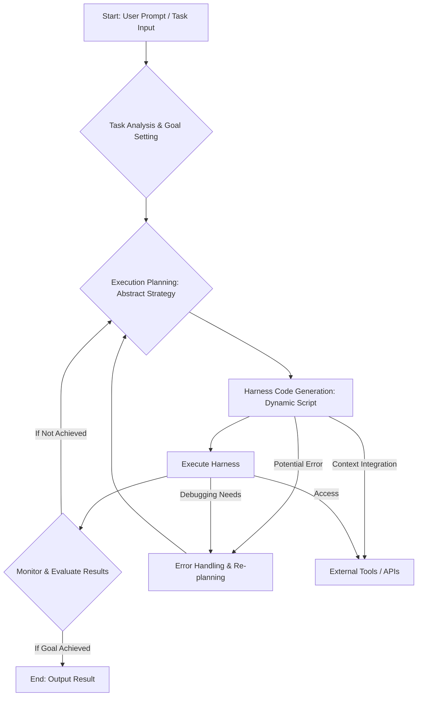

## Claude Code Dynamic Workflows 개요
Claude Code의 Dynamic Workflows는 정적 스크립트에 의존하지 않고, 주어진 태스크와 환경에 맞춰 즉석에서 최적화된 실행 구조(harness)를 생성하고 활용하는 진화된 에이전트 패러다임을 제시합니다. 이는 LLM 기반 에이전트가 복잡하고 예측 불가능한 시나리오에 더욱 유연하고 자율적으로 대응할 수 있도록 합니다.

기존의 에이전트 시스템은 주로 미리 정의된 워크플로(static workflow)나 고정된 도구 체인에 의존했습니다. 이러한 방식은 예측 가능한 작업에는 효율적이지만, 새로운 문제나 변화하는 환경에 직면했을 때 빠르게 한계에 부딪혔습니다. Claude Code의 Dynamic Workflows는 이러한 제약을 극복하고, 에이전트가 자체적으로 '어떻게' 작업을 수행할지 결정하고 실행하는 자율성을 강화합니다.

## 핵심 개념: 동적 하네스 생성
Dynamic Workflows의 핵심은 에이전트가 태스크의 목표를 이해하고, 해당 목표를 달성하기 위한 최적의 실행 계획과 도구 사용 순서(harness)를 실시간으로 구성하는 능력입니다. 이 하네스는 코드, API 호출, 내부 추론 과정 등을 조합하여 동적으로 생성됩니다.

### 하네스(Harness)의 역할
하네스는 에이전트가 특정 작업을 수행하기 위해 필요한 모든 구성 요소를 묶어주는 프레임워크 또는 실행 환경입니다. 여기에는 다음과 같은 요소가 포함될 수 있습니다:
*   **도구 선택 (Tool Selection):** 어떤 외부 API, 라이브러리, 또는 내부 함수를 사용할 것인가.
*   **실행 순서 (Execution Sequence):** 각 단계를 어떤 순서로 진행할 것인가.
*   **상태 관리 (State Management):** 각 단계의 결과와 컨텍스트를 어떻게 다음 단계로 전달할 것인가.
*   **오류 처리 (Error Handling):** 예상치 못한 상황 발생 시 어떻게 대응할 것인가.

Claude Code는 이러한 하네스를 LLM의 추론 능력과 내부 코드 생성 능력을 결합하여 동적으로 구축합니다. 이는 에이전트가 단순한 스크립트 실행기를 넘어, 진정한 문제 해결자로 기능하게 만듭니다.

## 동적 워크플로우 아키텍처
Claude Code의 Dynamic Workflows는 다음 단계로 진행됩니다.

1.  **태스크 분석 및 목표 설정 (Task Analysis & Goal Setting):** 초기 프롬프트를 통해 주어진 태스크를 분석하고 명확한 목표를 설정합니다.
2.  **실행 계획 수립 (Execution Planning):** 목표 달성을 위한 추상적인 계획을 수립합니다. 이는 도구 사용 전략, 데이터 흐름 등을 포함합니다.
3.  **하네스 코드 생성 (Harness Code Generation):** 수립된 계획을 바탕으로 실제 실행 가능한 코드 형태의 하네스를 생성합니다. 이 코드는 Python 스크립트, Shell 명령어, API 호출 로직 등 다양한 형태를 가질 수 있습니다.
4.  **하네스 실행 및 모니터링 (Harness Execution & Monitoring):** 생성된 하네스를 실행하고, 그 결과를 실시간으로 모니터링합니다.
5.  **피드백 및 재귀적 개선 (Feedback & Recursive Refinement):** 실행 결과를 분석하여 목표 달성 여부를 판단하고, 필요에 따라 계획이나 하네스 코드를 수정하여 재실행합니다.

### Mermaid Diagram: Dynamic Workflow Process


## 실제 코드 예제: 동적 스크립트 생성 시뮬레이션
다음은 Claude Code가 동적으로 하네스 스크립트를 생성하고 실행하는 과정을 모의한 Python 예시입니다. 이 예제에서는 가상의 `Agent` 클래스가 태스크에 따라 다른 파이썬 함수를 호출하는 하네스를 생성합니다.

```python
import inspect

class Agent:
    def __init__(self, tools):
        self.tools = tools
        self.dynamic_harness_code = ""

    def generate_harness(self, task_description):
        print(f"Agent: Generating harness for task: '{task_description}'")
        
        # Simulate LLM generating code based on task_description
        if "fetch user data" in task_description:
            self.dynamic_harness_code = """
import json
def execute_task(user_id):
    print(f"Fetching data for user_id: {user_id}")
    if user_id in tools["database"]:
        user_data = tools["database"][user_id]
        print(f"User data fetched: {json.dumps(user_data)}")
        return user_data
    else:
        print("User not found.")
        return None
"""
        elif "analyze text" in task_description:
            self.dynamic_harness_code = """
def execute_task(text_input):
    print(f"Analyzing text: '{text_input[:30]}...' ")
    analysis_result = tools["nlp_processor"].process(text_input)
    print(f"Analysis complete: {analysis_result}")
    return analysis_result
"""
        else:
            self.dynamic_harness_code = """
def execute_task(*args, **kwargs):
    print("No specific harness generated. Defaulting to empty operation.")
    return "Operation not recognized."
"""
        print("Agent: Harness code generated.")
        return self.dynamic_harness_code

    def execute_harness(self, *args, **kwargs):
        if not self.dynamic_harness_code:
            print("Agent: No harness to execute. Generate one first.")
            return

        # Create a dictionary for the execution context
        exec_globals = {"tools": self.tools}
        
        # Execute the generated code within this context
        exec(self.dynamic_harness_code, exec_globals)
        
        # Call the dynamically defined function
        if "execute_task" in exec_globals:
            print("Agent: Executing dynamic harness...")
            return exec_globals["execute_task"](*args, **kwargs)
        else:
            print("Agent: 'execute_task' function not found in generated harness.")
            return None

# --- Mock Tools ---
mock_db = {
    "101": {"name": "Alice", "email": "alice@example.com"},
    "102": {"name": "Bob", "email": "bob@example.com"}
}

class MockNLPProcessor:
    def process(self, text):
        return f"Processed '{text[:10]}...' with NLP. Keywords: [LLM, NLP]"

mock_tools = {
    "database": mock_db,
    "nlp_processor": MockNLPProcessor()
}

# --- Usage ---
my_agent = Agent(mock_tools)

# Task 1: Fetch user data
my_agent.generate_harness("fetch user data for id 101")
user_data = my_agent.execute_harness(user_id="101")
print(f"Result 1: {user_data}")
print("-" * 30)

# Task 2: Analyze text
my_agent.generate_harness("analyze text sentiment of a review")
analysis_output = my_agent.execute_harness(text_input="This product is absolutely fantastic! Highly recommend.")
print(f"Result 2: {analysis_output}")
print("-" * 30)
```

이 예제는 `generate_harness` 메소드가 태스크 설명에 따라 다른 파이썬 코드를 문자열로 생성하고, `execute_harness` 메소드가 이 코드를 `exec()` 함수를 이용해 동적으로 실행하는 방식을 보여줍니다. 실제 Claude Code는 훨씬 더 정교한 방식으로 내부 모델의 추론과 코드 생성 능력을 결합하여 하네스를 구축합니다.

## 2026년 최신 트렌드 반영: 자동화 복리 및 자율 에이전트
2026년에는 LLM 에이전트의 자율성과 적응성이 더욱 중요해질 것입니다. Dynamic Workflows는 이러한 트렌드의 핵심 동력으로 작용하며, 다음과 같은 방식으로 자동화 복리(automation compounding) 효과를 극대화합니다.
*   **Zero-shot Task Adaptation:** 새로운 태스크가 주어져도 기존의 고정된 워크플로를 수정할 필요 없이, 즉석에서 최적의 하네스를 생성하여 대응합니다. 이는 개발 및 유지보수 비용을 획기적으로 절감합니다.
*   **Self-Healing Workflows:** 실행 중 오류가 발생하거나 예상치 못한 상황에 직면했을 때, 에이전트 스스로 하네스를 재구성하고 문제를 해결하여 워크플로의 복원력을 높입니다.
*   **Cross-Domain Problem Solving:** 특정 도메인에 한정되지 않고, 다양한 도메인의 태스크에 맞춰 유연하게 도구와 로직을 조합하여 복합적인 문제 해결 능력을 발휘합니다.
*   **Automated Skill Acquisition:** 새로운 도구나 API가 추가될 때, 에이전트가 이를 학습하고 동적으로 하네스에 통합하는 과정을 자동화하여, 에이전트의 능력 확장 속도를 가속화합니다.

이러한 능력은 엔터프라이즈 환경에서 복잡한 비즈니스 프로세스 자동화, 데이터 분석 파이프라인 최적화, 소프트웨어 개발 자동화 등 광범위한 분야에서 혁신적인 변화를 가져올 것입니다.

## 트레이드오프
Dynamic Workflows는 강력한 기능이지만, 도입 시 고려해야 할 트레이드오프가 존재합니다.

*   **유연성 vs 예측 가능성:**
    *   **언제 좋은가:** 변화무쌍한 환경에서 새로운 태스크에 대한 높은 적응성과 유연성이 요구될 때 매우 효과적입니다. 미리 정의하기 어려운 복잡한 문제 해결에 유리합니다.
    *   **언제 나쁜가:** 고도로 규제되거나 예측 가능한 환경에서 안정성과 일관된 결과를 최우선으로 할 때는 동적 생성 과정의 비결정성이 문제가 될 수 있습니다. 디버깅 및 감사(auditing)가 어려울 수 있습니다.

*   **자율성 vs 제어 가능성:**
    *   **언제 좋은가:** 개발자의 개입 없이 에이전트 스스로 문제 해결을 위한 최적의 경로를 찾도록 할 때, 개발 생산성을 크게 높일 수 있습니다.
    *   **언제 나쁜가:** 안전(safety)이 중요한 시스템, 또는 특정 비즈니스 로직의 엄격한 준수가 필요한 경우, 에이전트의 자율성이 오히려 예기치 않은 동작을 유발할 위험이 있습니다. 강력한 가드레일(Guardrails)과 검증 메커니즘이 필수적입니다.

*   **생산성 증대 vs 초기 복잡성:**
    *   **언제 좋은가:** 에이전트가 다양한 상황에 자체적으로 대응하도록 하여 장기적으로 개발 및 유지보수 생산성을 크게 향상시킬 수 있습니다.
    *   **언제 나쁜가:** Dynamic Workflows를 설계하고 구현하는 초기 단계에는 LLM과의 상호작용, 동적 코드 생성의 안정성 확보, 보안 문제 처리 등 기존 정적 시스템보다 높은 복잡성이 따릅니다.

*   **자원 효율성 vs 컴퓨팅 비용:**
    *   **언제 좋은가:** 각 태스크에 최적화된 하네스를 생성함으로써, 불필요한 연산을 줄이고 효율적인 자원 사용을 유도할 수 있습니다.
    *   **언제 나쁜가:** 하네스를 동적으로 생성하고, LLM의 추론을 여러 번 거쳐 재귀적으로 개선하는 과정은 정적 워크플로에 비해 더 많은 컴퓨팅 자원(특히 LLM 토큰)과 시간을 소모할 수 있습니다. 비용 최적화 전략이 중요합니다.

## 실전 체크리스트
Claude Code Dynamic Workflows를 프로젝트에 성공적으로 통합하기 위한 실전 체크리스트입니다.

*   - [ ] **태스크 복잡도 및 동적 필요성 평가:** 현재 해결하려는 태스크가 정적 워크플로로 처리하기에 너무 복잡하거나, 자주 변경되는 요구사항을 가지는지 명확히 평가했는가?
*   - [ ] **가드레일 및 안전 메커니즘 설계:** 동적으로 생성된 하네스가 예측 불가능하거나 위험한 작업을 수행하지 않도록 강력한 입력 유효성 검사, 출력 필터링, 실행 환경 격리 등의 가드레일을 설계하고 구현했는가?
*   - [ ] **성능 및 비용 최적화 전략 수립:** 동적 하네스 생성 및 실행 과정에서 발생하는 LLM 호출 비용과 Latency를 모니터링하고, 캐싱, 병렬 처리, 하네스 재사용 등의 최적화 전략을 수립했는가?
*   - [ ] **디버깅 및 감사(Auditing) 도구 마련:** 동적으로 생성된 코드와 실행 흐름을 추적하고 디버깅할 수 있는 로깅 시스템, 가시화 도구, 그리고 감사에 필요한 실행 기록 저장 메커니즘을 구축했는가?
*   - [ ] **도구 인터페이스 표준화 및 모듈화:** 에이전트가 활용할 외부 도구(APIs, 라이브러리)의 인터페이스를 명확하고 일관되게 정의하여, 동적 하네스 생성 시 안정적인 통합을 보장하는가?
*   - [ ] **재귀적 개선 루프 및 피드백 메커니즘 구현:** 하네스 실행 결과에 대한 자동화된 평가 지표를 설정하고, 실패 시 LLM에게 피드백을 주어 하네스를 재구성하고 개선하는 재귀적 루프를 구현했는가?
*   - [ ] **버전 관리 및 변경 추적:** 동적으로 생성된 하네스 템플릿 또는 주요 로직에 대한 버전 관리를 수행하고, 시간 경과에 따른 변경 사항을 추적할 수 있는 시스템을 마련했는가?