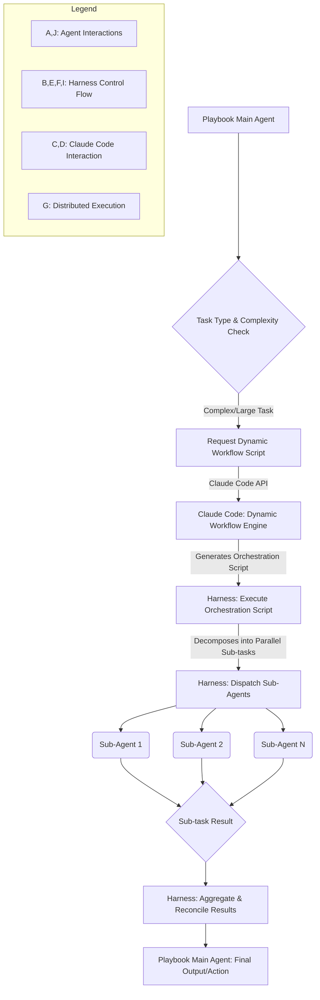

Claude Code의 동적 워크플로우 기능은 단일 에이전트가 처리하기 어려운 대규모 및 복잡한 엔지니어링 작업을 효율적으로 관리하기 위한 핵심 진화입니다. 이 기능은 하나의 세션 내에서 오케스트레이션 스크립트를 동적으로 생성하고, 이를 기반으로 수십에서 수백 개의 병렬 서브에이전트를 실행하며, 최종적으로 그 결과를 통합하여 사용자에게 전달합니다. 이 엔트리는 Claude Code의 동적 워크플로우를 기존 playbook 에이전트 하네스에 통합하는 방안을 설계하고, 대규모 작업을 분산 처리하는 프로토타입 구현 전략을 제시합니다.

## 동적 워크플로우의 핵심 가치

기존의 에이전트 시스템은 정적으로 정의된 작업 흐름이나 제한된 툴 사용 패턴을 따르는 경우가 많았습니다. 그러나 실제 엔지니어링 도메인에서는 예측 불가능한 복잡성과 규모의 문제가 빈번하게 발생합니다. Claude Code의 동적 워크플로우는 이러한 한계를 극복하기 위해 에이전트가 문제 해결 과정에서 최적의 실행 계획(orchestration script)을 스스로 구성하고, 이를 바탕으로 필요한 서브에이전트들을 동적으로 스폰(spawn)하여 병렬로 작업을 수행하게 합니다. 이는 특히 다음 시나리오에서 강력한 이점을 제공합니다:

*   **대규모 코드베이스 분석 및 리팩토링**: 수십만 라인 이상의 코드베이스에서 특정 패턴을 찾아 수정하거나, 복잡한 종속성을 가진 모듈을 리팩토링하는 작업.
*   **분산 시스템 테스트**: 여러 마이크로서비스에 걸쳐 동시성 테스트를 수행하고 결과를 통합 분석하는 경우.
*   **복잡한 데이터 파이프라인 구축 및 검증**: 다양한 데이터 소스에서 데이터를 수집, 변환, 로드하는 다단계 파이프라인을 동적으로 구성하고 검증하는 작업.

## Playbook 에이전트 하네스 통합 전략

Playbook 에이전트 하네스는 에이전트의 생명주기 관리, 컨텍스트 전달, 결과 집계 및 오류 처리 등을 담당하는 프레임워크입니다. Claude Code의 동적 워크플로우를 여기에 통합하려면 다음과 같은 핵심 단계를 고려해야 합니다.

### 1. 작업 분해 및 트리거 식별

대규모 작업이 하네스에 유입될 때, 이를 동적 워크플로우로 처리할지 여부를 결정하는 로직이 필요합니다. 이는 작업의 복잡도, 예상 실행 시간, 필요한 병렬 처리 수준 등을 기준으로 판단할 수 있습니다. 예를 들어, 특정 키워드, 작업 요청의 크기, 혹은 사전 정의된 복잡도 임계치를 넘는 경우 동적 워크플로우로 라우팅하는 방식입니다.

### 2. 동적 오케스트레이션 스크립트 생성

하네스는 Claude Code API를 호출하여 동적으로 오케스트레이션 스크립트(예: Python 코드, Bash 스크립트)를 생성하도록 요청합니다. 이 스크립트는 원본 작업을 병렬로 실행될 수 있는 여러 서브에이전트 작업으로 분할하고, 각 서브에이전트의 역할, 입력, 그리고 실행 후 결과를 어떻게 상위 에이전트로 반환할지 정의합니다.

### 3. 서브에이전트 실행 및 관리

생성된 오케스트레이션 스크립트는 하네스 내에서 실행됩니다. 하네스는 이 스크립트의 지시에 따라 실제 서브에이전트 인스턴스를 동적으로 프로비저닝하고, 각 서브에이전트에게 할당된 작업을 전달합니다. 서브에이전트는 각자의 작업을 독립적으로 수행하며, 하네스는 이들의 상태를 모니터링하고 필요에 따라 리소스 할당을 조절합니다.

### 4. 결과 집계 및 재구성

모든 서브에이전트의 작업이 완료되면, 하네스는 각 서브에이전트로부터 반환된 결과를 수집하고, 이를 원래의 대규모 작업에 대한 최종 결과로 재구성합니다. 이 과정에서 충돌 해결, 데이터 병합, 최종 검증 등이 필요할 수 있습니다.

## 프로토타입 구현 예시 (Python)

다음은 Claude Code의 동적 워크플로우 기능을 활용하여 가상의 '복잡한 코드 분석' 작업을 병렬 처리하는 개념적인 Python 코드 예시입니다. 여기서는 실제 Claude Code API 호출 대신 가상의 함수를 사용합니다.

```python
import json
from typing import List, Dict, Any
import concurrent.futures

# Assume this is a simplified interface to Claude Code's dynamic workflow generation
def generate_dynamic_workflow_script(task_description: str) -> str:
    """
    Claude Code API를 호출하여 동적 워크플로우 스크립트(Python)를 생성합니다.
    이 스크립트는 task_description을 병렬 서브태스크로 분할하는 로직을 포함합니다.
    """
    # 실제로는 Claude Code API 호출을 통해 스크립트 생성
    # 예시 스크립트: 'parse_module_a', 'test_module_b', 'refactor_module_c' 등
    script_template = """
def execute_dynamic_workflow(main_task_context: Dict[str, Any]):
    sub_tasks = [
        {{"name": "AnalyzeCodeModule", "module": "module_a", "params": {{\ "path\": \"src/module_a.py\"}}}},
        {{"name": "RunUnitTests", "module": "module_b", "params": {{\ "test_suite\": \"tests/module_b_tests.py\"}}}},
        {{"name": "SuggestRefactoring", "module": "module_c", "params": {{\ "target_function\": \"legacy_func\"}}}}
    ]
    results = []
    for task in sub_tasks:
        # 실제로는 하네스가 서브에이전트 디스패치
        print(f"  [Workflow] Dispatching sub-task: {{task['name']}} on {{task['module']}}")
        # 임시 결과
        results.append({{"task": task["name"], "module": task["module"], "status": "completed", "output": f"Result for {{task['module']}}"}})
    return results
    """
    return script_template

def execute_sub_agent_task(task: Dict[str, Any]) -> Dict[str, Any]:
    """
    개별 서브에이전트가 수행할 작업을 시뮬레이션합니다.
    """
    print(f"    [Sub-Agent] Processing {{task['name']}} for {{task['module']}} with params {task['params']}")
    # 실제 작업 로직 (코드 분석, 테스트 실행 등)
    import time
    time.sleep(1) # Simulate work
    return {"task": task["name"], "module": task["module"], "status": "success", "details": f"Successfully processed {{task['module']}}"}

def playbook_harness_orchestrator(main_task_id: str, task_description: str):
    print(f"[Harness] Receiving main task: {{main_task_id}} - {{task_description}}")

    # 1. 동적 워크플로우 스크립트 생성 요청
    print("[Harness] Requesting dynamic workflow script from Claude Code...")
    workflow_script = generate_dynamic_workflow_script(task_description)
    print("[Harness] Dynamic workflow script received.")

    # 2. 생성된 스크립트 실행 (보안 주의: 실제 환경에서는 샌드박스 처리)
    exec_globals = {}
    exec(workflow_script, exec_globals)
    
    # 3. 동적 워크플로우 함수 실행 및 서브태스크 목록 얻기
    main_task_context = {"main_task_id": main_task_id, "description": task_description}
    # execute_dynamic_workflow 함수는 서브태스크 목록과 실행 로직을 반환한다고 가정
    print("[Harness] Executing dynamic workflow to get sub-tasks...")
    dynamic_workflow_results = exec_globals['execute_dynamic_workflow'](main_task_context)

    # 4. 서브에이전트 병렬 실행 (개념적)
    print("[Harness] Dispatching sub-agents for parallel execution...")
    final_aggregated_results = []
    if 'sub_tasks' in dynamic_workflow_results[0]: # Assume the script provides sub_tasks directly
        with concurrent.futures.ThreadPoolExecutor() as executor:
            future_to_task = {executor.submit(execute_sub_agent_task, sub_task): sub_task for sub_task in dynamic_workflow_results[0]['sub_tasks']}
            for future in concurrent.futures.as_completed(future_to_task):
                sub_task = future_to_task[future]
                try:
                    result = future.result()
                    final_aggregated_results.append(result)
                    print(f"    [Harness] Sub-agent {{sub_task['name']}} completed: {{result['status']}}")
                except Exception as exc:
                    print(f"    [Harness] Sub-agent {{sub_task['name']}} generated an exception: {{exc}}")
                    final_aggregated_results.append({"task": sub_task["name"], "status": "failed", "error": str(exc)})
    else:
        # Simplified: If the script already produced results directly
        final_aggregated_results = dynamic_workflow_results
        
    print(f"[Harness] All sub-agents completed for task {{main_task_id}}.")
    print("[Harness] Aggregated Results:", json.dumps(final_aggregated_results, indent=2))
    return final_aggregated_results

# Example usage:
# playbook_harness_orchestrator("TASK-001", "Implement a new feature with API changes across 3 services")
```

## 동적 워크플로우 오케스트레이션 흐름



## 트레이드오프

### 1. 확장성 (Scalability) vs. 오버헤드 (Overhead)
*   **언제 좋은가**: 대규모 작업을 병렬로 효율적으로 처리할 수 있어, 처리량을 극대화하고 복잡한 문제 해결 시간을 단축합니다. 특히 컴퓨팅 리소스를 유연하게 확장할 수 있는 클라우드 환경에서 강력합니다.
*   **언제 나쁜가**: 작은 규모의 단순한 작업에는 동적 워크플로우 생성 및 서브에이전트 프로비저닝에 따른 추가적인 Latency와 리소스 오버헤드가 발생하여 비효율적일 수 있습니다. 초기 설정 및 관리가 복잡합니다.

### 2. 유연성 (Flexibility) vs. 예측 가능성 (Predictability)
*   **언제 좋은가**: 예측하기 어려운 복잡한 문제를 해결하거나, 요구사항이 자주 변경되는 환경에서 에이전트가 상황에 따라 최적의 접근 방식을 동적으로 구성할 수 있도록 합니다. 이는 시스템의 적응력을 크게 향상시킵니다.
*   **언제 나쁜가**: 동적으로 생성된 스크립트와 실행 경로는 테스트 및 검증이 어렵고, 예상치 못한 동작이나 버그를 추적하기 복잡해질 수 있습니다. 디버깅 및 감사(auditing) 측면에서 도전이 있습니다.

### 3. 복잡성 관리 (Complexity Management) vs. 디버깅 난이도 (Debugging Difficulty)
*   **언제 좋은가**: 단일 에이전트가 감당하기 어려운 고도로 복잡한 작업을 여러 서브에이전트로 분산시켜, 각 에이전트의 책임을 명확히 하고 전체 시스템의 복잡성을 관리 가능한 수준으로 낮춥니다.
*   **언제 나쁜가**: 여러 에이전트 간의 상호작용, 동적인 실행 흐름, 그리고 분산 환경에서의 상태 관리는 디버깅을 매우 어렵게 만듭니다. 각 서브에이전트의 로그를 통합하고 분석하는 시스템이 필수적입니다.

### 4. 리소스 활용 효율성 (Resource Utilization Efficiency) vs. 비용 예측 (Cost Predictability)
*   **언제 좋은가**: 필요할 때만 서브에이전트를 스폰하고 작업을 병렬로 처리함으로써, 유휴 리소스 낭비를 줄이고 총 처리 시간 대비 리소스 활용 효율을 높일 수 있습니다.
*   **언제 나쁜가**: 동적으로 다수의 서브에이전트가 실행될 경우, 클라우드 리소스 사용량이 급증하여 예상치 못한 비용이 발생할 위험이 있습니다. 서브에이전트의 수와 실행 시간을 제어하는 메커니즘이 중요합니다.

## 실전 체크리스트

Claude Code의 동적 워크플로우를 프로젝트에 성공적으로 통합하기 위한 체크리스트입니다.

*   [ ] **동적 워크플로우 트리거 조건 정의**: 복잡도, 크기, 키워드 등 어떤 조건에서 동적 워크플로우를 사용할지 명확한 임계치 및 라우팅 로직을 문서화했는가?
*   [ ] **서브에이전트 프로비저닝 및 자원 관리 전략 수립**: 동적으로 생성되는 서브에이전트 인스턴스의 최대 개수, 할당될 리소스(CPU, Memory), 생명주기 관리 방안을 확립했는가?
*   [ ] **오케스트레이션 스크립트 보안 및 샌드박싱**: Claude Code가 생성하는 동적 스크립트의 실행 환경이 격리되어 있으며, 잠재적 보안 위협으로부터 보호되는지 검증했는가?
*   [ ] **분산 로깅 및 모니터링 시스템 구축**: 모든 서브에이전트의 실행 로그, 상태, 에러를 중앙에서 집계하고 시각화할 수 있는 시스템을 마련했는가?
*   [ ] **결과 집계 및 충돌 해결 로직 구현**: 병렬로 실행된 서브에이전트들의 결과가 어떻게 병합되고, 충돌 발생 시 어떤 우선순위로 해결할지 명확한 정책과 코드를 구현했는가?
*   [ ] **비용 모니터링 및 제어 메커니즘 도입**: 동적 워크플로우 실행으로 인한 리소스 사용량 및 비용을 실시간으로 추적하고, 과도한 비용 발생을 방지하기 위한 제어 장치(예: 예산 경고, 자동 종료)를 설정했는가?
*   [ ] **장애 복구 및 재시도 전략 정의**: 특정 서브에이전트의 실패 시 전체 워크플로우에 미치는 영향을 최소화하고, 자동으로 재시도하거나 대체 플랜을 실행하는 로직을 설계했는가?