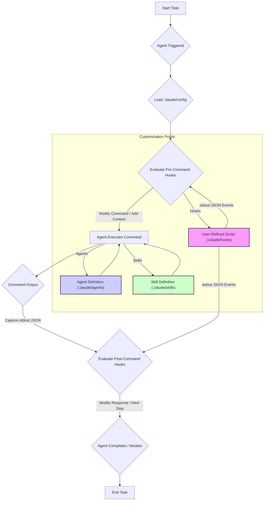

Claude Code Harness는 LLM 기반의 코딩 에이전트 워크플로를 자동화하고 관리하는 강력한 도구입니다. 특히 버전 2.1.87에서 문서화되지 않은 `.claude/` 파일 기반의 Hooks, Skills, Agents 커스터마이징 기능은 Harness의 기능을 심층적으로 확장하고 최적화할 수 있는 기회를 제공합니다. 이는 단순한 설정 변경을 넘어, 에이전트의 내부 동작 방식과 외부 시스템과의 상호작용을 정밀하게 제어하여 특정 프로젝트나 사용 사례에 완벽하게 부합하는 맞춤형 AI 개발 환경을 구축하는 데 필수적입니다. 2026년 현재, 엔터프라이즈 환경에서 LLM 기반 에이전트의 안정성과 효율성을 극대화하기 위해 이러한 저수준(low-level) 커스터마이징은 중요한 경쟁 우위가 되고 있습니다. 특히 AI 에이전트의 의사 결정 로직, 컨텍스트 관리, 외부 도구 연동 패턴을 정교하게 제어하는 데 활용됩니다. 

## Hooks를 통한 실행 흐름 제어
Hooks는 Claude Code Harness의 핵심적인 확장 메커니즘으로, 에이전트의 특정 실행 단계에서 사용자 정의 스크립트를 삽입하여 워크플로를 가로채고 수정합니다. `.claude/hooks` 디렉토리에 정의된 쉘 스크립트는 `stdin`으로 JSON 형식의 이벤트 데이터를 받아 처리하고, `stdout`으로 특정 JSON 필드를 출력하여 Claude의 후속 행동에 영향을 줄 수 있습니다. 대표적인 Hooks 유형으로는 `pre_command`, `post_command`, `on_exit` 등이 있습니다. 이 메커니즘은 명령 수정, 컨텍스트 주입, 권한 결정 등 다양한 시나리오에 적용될 수 있습니다. 

### Hook 예제: 컨텍스트 조건부 주입
다음 예제는 `pre_command` Hook을 사용하여 특정 조건(예: 특정 파일이 수정되었을 때)에서 추가 컨텍스트를 에이전트에 주입하는 방법을 보여줍니다. `stdout`의 `context_add` 필드를 사용하여 Claude의 프롬프트에 동적으로 정보를 추가합니다. 

```bash
#!/bin/bash

# Read stdin JSON
EVENT_DATA=$(cat /dev/stdin)

# Parse relevant fields (e.g., command, files_changed)
COMMAND=$(echo "$EVENT_DATA" | jq -r '.command')
FILES_CHANGED=$(echo "$EVENT_DATA" | jq -r '.files_changed') # Hypothetical field

# Custom logic: if specific files were changed, inject a warning context
if [[ "$FILES_CHANGED" == *"critical_config.yaml"* ]]; then
  echo '{"status": "ok", "context_add": "WARNING: critical_config.yaml was recently modified. Ensure changes are reviewed for security implications."}'
else
  echo '{"status": "ok"}'
fi
```
이 스크립트는 `pre_command` 단계에서 실행되어, 특정 조건에 따라 에이전트에게 추가적인 지시사항이나 경고를 제공함으로써 에이전트의 의사 결정 품질을 향상시킬 수 있습니다. 

## Skills 및 Agents 커스터마이징
Skills는 특정 작업을 수행하는 데 필요한 일련의 명령어, 프롬프트, 도구 사용 패턴 등을 캡슐화한 것입니다. `.claude/skills` 디렉토리에서 YAML 또는 JSON 형식으로 정의되며, 에이전트가 복잡한 문제를 해결할 때 필요한 '능력'을 부여합니다. Agents는 `.claude/agents` 디렉토리에서 정의되며, 특정 페르소나, 목표, 사용 가능한 Skills 및 제약 조건을 포함합니다. 이를 통해 개발자는 다양한 역할과 기능을 가진 에이전트를 생성하고 관리할 수 있습니다. 

### Agent Workflow Diagram


## stdout JSON 필드를 통한 고급 제어
Hooks 및 Skills는 `stdout`으로 특정 구조의 JSON을 출력하여 Claude Harness 런타임에 직접적인 제어 신호를 보낼 수 있습니다. 예를 들어, `re_prompt`, `context_add`, `permission_override`, `next_action`과 같은 필드를 통해 에이전트의 다음 행동을 명시적으로 지시하거나, 추가적인 컨텍스트를 주입하거나, 심지어 특정 작업에 대한 권한을 동적으로 부여/회수할 수 있습니다. 이는 복잡한 워크플로, 보안 제약 조건, 그리고 다단계 의사 결정 프로세스를 구현하는 데 있어 매우 유용합니다. 

### 주요 stdout JSON 필드 및 활용
*   `status`: Hook 또는 Skill의 성공 여부. `"ok"` 또는 `"error"`.
*   `message`: 사용자에게 표시될 메시지.
*   `context_add`: Claude에게 추가할 임시 컨텍스트.
*   `command_override`: 에이전트가 실행할 다음 명령어를 변경.
*   `permission_override`: 특정 리소스에 대한 에이전트의 접근 권한을 동적으로 수정.
*   `action`: 에이전트의 다음 행동을 지시 (예: `"re_prompt"`, `"abort"`). 

이러한 기능들은 2026년 에이전트 기반 개발의 핵심 트렌드인 '자율성(Autonomy)'과 '안정성(Reliability)'을 동시에 확보하는 데 기여합니다. 특히, 실시간으로 에이전트의 행동을 감지하고, 비정상적인 동작을 수정하거나, 보안 위험에 대응하는 강력한 '가드레일(Guardrails)' 시스템을 구축하는 데 필수적입니다. 

## 트레이드오프

*   **Granular Control vs. Increased Complexity**: 
    *   **언제 좋음**: 에이전트의 행동을 특정 도메인 요구사항에 맞춰 극도로 정밀하게 제어해야 할 때. (예: 규제 준수, 보안 감사 로깅, 특정 CI/CD 파이프라인 통합)
    *   **언제 나쁨**: 개발 초기 단계나 단순한 작업 자동화에는 과도한 오버헤드를 발생시키며, 학습 곡선을 가파르게 만듭니다.
*   **Deep Integration vs. Maintenance Burden**: 
    *   **언제 좋음**: 기존 레거시 시스템이나 고유한 사내 도구와의 심층적인 통합이 필요할 때. (예: 특정 사내 API 호출, 커스텀 데이터베이스 연동)
    *   **언제 나쁨**: Claude Code Harness의 버전 업데이트 시 비문서화된 기능의 변경 가능성이 있어 유지보수 비용이 증가하며, 디버깅이 복잡해질 수 있습니다.
*   **Enhanced Security vs. Vendor Lock-in Risk**: 
    *   **언제 좋음**: 동적인 권한 관리 Hooks를 통해 에이전트의 자원 접근을 최소화하고 보안 취약점을 줄일 때. 
    *   **언제 나쁨**: Claude Code Harness에 대한 의존성을 심화시켜, 다른 LLM Orchestration 플랫폼으로의 마이그레이션이 어려워질 수 있습니다. 
*   **Optimized Resource Use vs. Debugging Challenges**: 
    *   **언제 좋음**: 특정 작업에 필요한 리소스(예: 특정 API 호출, 컴퓨팅 자원)를 효율적으로 할당하고 불필요한 호출을 방지하여 비용을 절감할 때. 
    *   **언제 나쁨**: Hooks나 Skills 내의 로직 오류가 발생했을 때, 블랙박스처럼 동작하여 문제의 근원을 파악하기 어렵습니다. 

## 실전 체크리스트

- [ ] `.claude/` 파일 구조가 프로젝트 표준에 따라 일관되게 관리되고 있는지 검증
- [ ] 커스텀 Hooks 및 Skills의 `stdin`/`stdout` JSON 스키마 유효성 및 예상치 못한 Side Effect 여부 검토
- [ ] 각 Agent 정의에 할당된 Skillset의 오버랩 또는 충돌 가능성 주기적 감사 및 최적화
- [ ] 컨텍스트 주입 메커니즘을 통해 민감 정보가 불필요하게 노출되지 않도록 보안 및 권한 분리 강화
- [ ] 비문서화된 Harness 기능에 의존하는 부분에 대한 회귀 테스트(Regression Test) 스위트 구축 및 Claude Harness 버전 고정(Pinning) 전략 수립
- [ ] 프로덕션 환경 배포 전, 다양한 사용자 시나리오 기반의 E2E 테스트(End-to-End Test) 자동화 및 통과 여부 확인
- [ ] 핵심 Hooks 및 Skills의 실행 시간을 프로파일링하여 성능 병목 현상(Bottleneck) 및 비효율적인 리소스 사용 패턴 식별