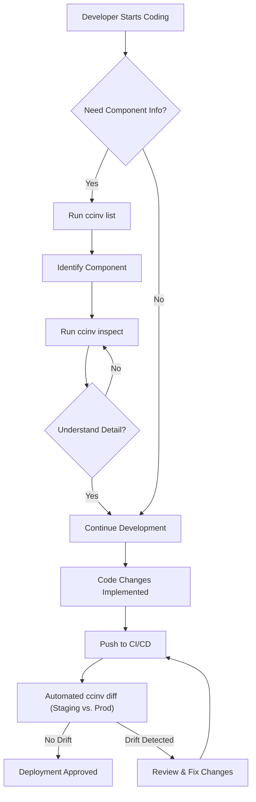

대규모 언어 모델 (LLM) 기반의 에이전트 시스템, 특히 Claude Code와 같은 복잡한 하네스(Harness) 환경의 핵심은 구성 요소의 투명한 가시성(Visibility)입니다. 에이전트 시스템은 `commands`, `skills`, `agents`, `hooks`, `mcp (Multi-Component Planner)`, `plugins` 등 다양한 모듈의 유기적인 결합으로 동작하며, 이러한 구성 요소들의 상태와 상호작용을 파악하는 것은 개발, 디버깅, 감사, 그리고 운영 효율성 증대에 필수적입니다. 고도로 분산되고 동적인 LLM 에이전트 시스템에서는 블랙박스 특성이 강하여, 내부 동작을 이해하기 어려운 경우가 많습니다. 이때 `ccinv`와 같은 전용 CLI 툴은 이러한 복잡성을 해소하고 시스템의 '무엇이 깔려 있는지'를 한눈에 파악할 수 있도록 돕는 중요한 역할을 합니다.

### Claude Code 하네스 구성 요소의 중요성
Claude Code 환경은 LLM 기반 에이전트가 복잡한 태스크를 수행할 수 있도록 지원하는 프레임워크입니다. 각 구성 요소는 다음과 같은 역할을 수행합니다.

*   **Commands**: 에이전트가 직접 호출할 수 있는 저수준의 실행 가능한 기능.
*   **Skills**: 여러 Command를 조합하거나 더 복잡한 로직을 캡슐화한 고수준의 기능.
*   **Agents**: 특정 목표를 달성하기 위해 Skills와 Commands를 활용하고, 의사결정을 내리는 자율적인 엔티티.
*   **Hooks**: 특정 이벤트 발생 시 자동으로 실행되는 코드 스니펫. 모니터링, 로깅, 전처리/후처리 등에 사용됩니다.
*   **MCP (Multi-Component Planner)**: 여러 Agent나 Skill 간의 조정을 담당하여 복잡한 워크플로우를 관리합니다.
*   **Plugins**: 외부 시스템과의 통합이나 특정 기능을 확장하는 모듈.

이러한 구성 요소들이 증가함에 따라, 개발자는 특정 Skill이 어떤 Command를 사용하는지, 어떤 Agent가 특정 Plugin에 의존하는지, 혹은 시스템 전체에 어떤 Hook이 활성화되어 있는지 파악하기 어렵습니다. 이는 디버깅 시간을 증가시키고, 불필요한 종속성을 생성하며, 시스템의 확장성을 저해하는 요인이 됩니다.

### `ccinv` CLI 소개 및 핵심 기능
`ccinv` (Claude Code Inventory)는 Claude Code 하네스 환경의 구성 요소들을 스캔하고, 그 목록과 세부 정보를 시각적으로 제공하는 CLI 툴입니다. 이를 통해 개발자와 운영팀은 다음과 같은 이점을 얻을 수 있습니다.

*   **빠른 현황 파악**: 현재 배포된 하네스에 어떤 Command, Skill, Agent, Hook, Plugin이 존재하는지 즉시 확인합니다.
*   **디버깅 효율성 증대**: 특정 기능이 예상대로 동작하지 않을 때, 관련 구성 요소들의 정의와 상태를 빠르게 검토하여 문제의 원인을 파악합니다.
*   **보안 및 규정 준수 감사**: 사용되지 않거나 불필요한 구성 요소를 식별하고, 특정 보안 정책을 위반하는 Hook이나 Plugin이 존재하는지 검사합니다.
*   **온보딩 및 지식 공유**: 새로운 팀원이 프로젝트에 합류했을 때, `ccinv`를 통해 하네스의 구조와 기능을 빠르게 이해할 수 있도록 돕습니다.

### `ccinv` 사용 예제

#### 1. 설치
`ccinv`는 일반적으로 Python 기반으로 배포되거나, 독립 실행형 바이너리 형태로 제공될 수 있습니다. 여기서는 Python `pip`를 통한 설치를 가정합니다.

```bash
# ccinv 설치 (가상 환경 권장)
pip install ccinv
```

#### 2. 주요 명령어 활용

`ccinv`는 `list`, `inspect`, `diff`와 같은 서브커맨드를 제공하여 다양한 수준의 가시성을 확보할 수 있습니다.

**모든 구성 요소 나열:**
`ccinv list` 명령어는 현재 환경에서 감지된 모든 Claude Code 구성 요소를 범주별로 나열합니다.

```bash
$ ccinv list

Found 12 components:

-- Agents --
  - main-orchestrator-agent
  - data-processing-agent

-- Skills --
  - execute-code-skill
  - retrieve-documentation-skill
  - generate-report-skill

-- Commands --
  - run-python-script
  - fetch-web-page
  - save-to-database

-- Hooks --
  - pre-execution-logging-hook
  - post-execution-metrics-hook

-- Plugins --
  - github-issue-tracker-plugin
  - slack-notification-plugin
```

**특정 구성 요소 세부 정보 검사:**
`ccinv inspect <type>/<name>` 명령어를 사용하여 특정 Agent, Skill 또는 Plugin의 상세 설정, 종속성, 코드 스니펫 등을 확인할 수 있습니다. 예를 들어, `execute-code-skill`의 세부 정보를 보려면 다음을 실행합니다.

```bash
$ ccinv inspect skills/execute-code-skill

Component Type: Skill
Name: execute-code-skill
Description: Executes Python code in a sandboxed environment.
Dependencies:
  - commands/run-python-script
Configuration:
  - timeout_seconds: 300
  - allow_network_access: false
Code Snippet:
```python
def execute_code(code: str, inputs: dict):
    # ... safety checks and execution logic ...
    result = run_python_script(code, inputs)
    return result
```
```

**환경 간 차이점 비교 (2026년 트렌드 반영):**
CI/CD 파이프라인에서 개발 환경과 프로덕션 환경 간의 구성 요소 차이를 자동으로 감지하는 것은 2026년 MLOps 및 AI 시스템 운영의 핵심 트렌드입니다. `ccinv diff`는 이러한 환경 간의 드리프트(drift)를 식별하는 데 매우 유용합니다.

```bash
# dev.yaml과 prod.yaml에 정의된 하네스 구성 비교
$ ccinv diff --config-file dev.yaml prod.yaml

Differences detected:

--- Agents ---
  - main-orchestrator-agent: Version mismatch (v1.2 in dev, v1.1 in prod)
  - new-experiment-agent: Present in dev, missing in prod

--- Skills ---
  - generate-report-skill: 'template_engine' config changed (Jinja2 -> Markdown)

--- Hooks ---
  - post-execution-metrics-hook: Threshold value changed (0.8 -> 0.95)
```

### Mermaid 다이어그램: `ccinv` 워크플로우

`ccinv`가 개발 워크플로우에서 어떻게 활용되는지 보여주는 간단한 흐름도입니다.



### 2026년 트렌드와 `ccinv`의 역할
2026년에는 LLM 에이전트 시스템의 복잡성과 중요성이 더욱 증대될 것입니다. 다음은 `ccinv`와 같은 가시성 도구가 핵심적인 역할을 할 주요 트렌드입니다.

*   **Verifiable AI**: AI 시스템의 의사결정 과정을 추적하고 검증해야 하는 필요성이 증가합니다. `ccinv`는 에이전트가 어떤 도구를 사용하고 어떤 논리로 구성되었는지 명확히 보여줌으로써, 이러한 '책임 있는 AI (Responsible AI)' 프레임워크의 중요한 기반이 됩니다.
*   **Autonomous Agent Orchestration**: 수많은 에이전트가 복잡한 태스크를 자율적으로 수행하는 시대에는, 각 에이전트의 능력과 제약 사항을 정확히 아는 것이 필수적입니다. `ccinv`는 이러한 오케스트레이션 과정에서 에이전트의 '도구 상자'를 투명하게 공개하는 역할을 합니다.
*   **AI Security & Compliance**: 에이전트의 공격 표면이 넓어짐에 따라, 사용되는 모든 Command, Skill, Plugin에 대한 보안 감사가 중요해집니다. `ccinv`는 잠재적 취약점이나 정책 위반 요소를 신속하게 식별하는 데 기여합니다.
*   **Dynamic Configuration Management**: 런타임에 에이전트의 동작이 동적으로 변경되는 시나리오에서, `ccinv`는 현재 활성화된 구성을 스냅샷하고 버전 관리하는 데 활용될 수 있습니다.

## 트레이드오프
`ccinv`와 같은 하네스 구성 요소 가시성 도구의 도입은 여러 이점을 제공하지만, 몇 가지 트레이드오프를 고려해야 합니다.

*   **가시성 향상 vs. 성능 오버헤드**: `ccinv`는 시스템의 메타데이터를 스캔하고 파싱하는 과정에서 약간의 성능 오버헤드를 발생시킬 수 있습니다. 개발 단계에서는 무시할 만하지만, 매우 큰 규모의 하네스에서 런타임에 동적으로 사용될 경우 고려해야 합니다. 대개 개발/CI/CD 시점에 활용되므로, 런타임 성능에 직접적인 영향은 적습니다.
*   **복잡성 감소 vs. 도구 유지보수**: `ccinv`는 하네스 구성 요소의 복잡성을 이해하기 쉽게 만들지만, `ccinv` 자체도 유지보수해야 하는 도구입니다. Claude Code 하네스 프레임워크의 업데이트나 변경 사항이 발생할 경우, `ccinv`도 함께 업데이트되어야 합니다. 이는 전담 인력이나 커뮤니티 기여를 통한 지속적인 관리가 필요함을 의미합니다.
*   **개발자 역량 강화 vs. 표준화된 통제**: 개발자가 `ccinv`를 통해 하네스 내부를 자유롭게 탐색하고 변경하는 데 익숙해지면, 이는 생산성을 높일 수 있습니다. 그러나 동시에 모든 개발자가 동일한 표준과 규약을 따르도록 강제하기 어려워질 수 있습니다. 특히 프로덕션 환경에서 엄격한 변경 통제가 필요한 경우, `ccinv`의 사용 범위를 제한하거나 결과에 대한 추가 검증 프로세스가 필요할 수 있습니다.
*   **빠른 문제 해결 vs. 근본 원인 분석 소홀**: `ccinv`가 제공하는 즉각적인 가시성은 빠른 문제 해결에 도움을 줍니다. 하지만 때로는 가시성에만 의존하여 근본적인 설계 문제나 아키텍처 결함에 대한 심층적인 분석을 소홀히 할 위험도 있습니다. 도구의 활용과 함께 시스템 디자인에 대한 꾸준한 고찰이 병행되어야 합니다.

## 실전 체크리스트
`ccinv`와 같은 하네스 가시성 도구를 프로젝트에 성공적으로 통합하기 위한 실전 체크리스트입니다.

*   [ ] **CI/CD 통합 여부 확인**: `ccinv diff` 명령어를 CI/CD 파이프라인에 통합하여 개발, 스테이징, 프로덕션 환경 간 구성 요소 드리프트(drift)를 자동으로 감지하고 경고하는지 확인합니다.
*   [ ] **구성 요소 버전 관리 정책 수립**: `ccinv`를 통해 감지된 구성 요소들에 대해 명확한 버전 관리 정책을 수립하고, 변경 이력을 추적할 수 있는 시스템이 마련되어 있는지 검토합니다.
*   [ ] **문서화 표준 연동**: `ccinv`가 제공하는 정보를 바탕으로 각 구성 요소의 목적, 사용법, 종속성 등을 자동으로 생성하거나 업데이트하는 문서화 프로세스가 구축되어 있는지 확인합니다.
*   [ ] **접근 제어 및 권한 모델 정의**: 프로덕션 환경에서 `ccinv` 사용에 대한 접근 제어 및 권한 모델이 명확하게 정의되어 있는지, 민감한 구성 요소 정보에 대한 노출이 통제되는지 검증합니다.
*   [ ] **새로운 구성 요소 등록 가이드라인**: 새 Command, Skill, Agent 등이 생성될 때 `ccinv`에 의해 정확하게 인식되고, 표준화된 형식으로 메타데이터가 관리되는지에 대한 가이드라인이 존재하는지 확인합니다.
*   [ ] **운영 모니터링 연동**: `ccinv`가 주기적으로 하네스 상태를 스캔하여 이상 징후(예: 예상치 못한 구성 요소 변경, 누락)를 모니터링 시스템에 보고하는 메커니즘이 마련되어 있는지 확인합니다.
*   [ ] **개발자 온보딩 및 교육 프로그램 포함**: 새로운 팀원이 `ccinv`를 효과적으로 활용하여 Claude Code 하네스 구조를 이해하고 개발 생산성을 높일 수 있도록 온보딩 및 교육 프로그램에 포함되어 있는지 확인합니다.