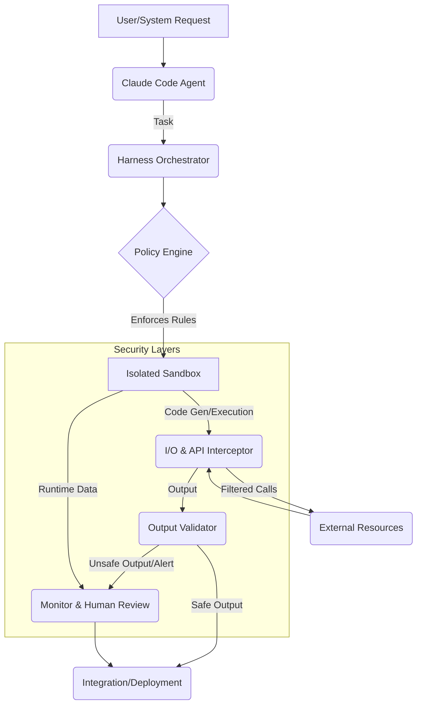

The increasing power and autonomy of AI agents like Claude Code demand robust containment architectures to mitigate potential risks. As agent capabilities and access expand, so does their "blast radius." This entry outlines how to enhance the Claude Code harness, adopting Anthropic's insights to reduce failure probability and limit damage scope through stringent safety mechanisms and continuous learning.

## Core Principles of Claude Code Containment

A secure Claude Code harness architecture relies on several critical pillars:

1.  **Isolated Execution & Fine-grained Access Control**: Confine all Claude Code operations to sandboxed environments (e.g., Docker, micro-VMs). Access to file systems, networks, and system commands must adhere strictly to the principle of least privilege, dynamically adjusting per validated task.
2.  **I/O Interception & Output Validation**: Intercept and audit all agent interactions with external systems (file writes, network requests, API calls). Generated code or data outputs undergo rigorous static analysis and runtime validation before integration.
3.  **Real-time Monitoring & Anomaly Detection**: Continuously monitor runtime (resource consumption, system calls, code changes). AI-powered anomaly detection identifies deviations from safe behavior, triggering alerts.
4.  **Human-in-the-Loop (HITL)**: For high-impact or irreversible actions (e.g., production deployments, critical data modifications), a mandatory human review and approval step provides an essential failsafe.
5.  **Safety-Driven Model Learning**: Integrate feedback from security incidents and human overrides into the model's training. This allows Claude Code to internalize safety constraints, reducing unsafe actions.

## Containment Architecture Flow

The following diagram illustrates the flow of a securely contained Claude Code agent.



### Implementing Output Validation

A critical component is validating the agent's output. Below is a simplified Python example for static analysis of generated code.

```python
import ast

def validate_generated_code_static(code_string: str) -> bool:
    """Performs basic static analysis on generated Python code for common unsafe patterns."""
    try:
        tree = ast.parse(code_string)
        for node in ast.walk(tree):
            if isinstance(node, (ast.Call, ast.Attribute)):
                if isinstance(node, ast.Call) and isinstance(node.func, ast.Name) and node.func.id in ['eval', 'exec', 'open', 'subprocess.run', 'os.system']:
                    return False
                if isinstance(node, ast.Attribute) and isinstance(node.value, ast.Name) and node.attr in ['system', 'popen']:
                    return False
        return True
    except SyntaxError:
        return False
```
This snippet is foundational. A 2026 production environment would integrate advanced semantic analysis, taint tracking, and security-focused LLM agents to detect vulnerabilities and malicious intent, leveraging real-time threat intelligence.

## 트레이드오프

### 1. 보안 강화 vs. 성능 및 자원 오버헤드
*   **언제 좋음**: 고위험 코드 생성/실행 시 잠재적 피해 최소화 및 규제 준수 필요. 철저한 격리 및 다단계 검증이 보안 침해 비용보다 낮을 때.
*   **언제 나쁨**: 개발/테스트 환경의 빠른 반복, 또는 실시간 응답이 중요한 경량 자동화 작업. 과도한 보안 계층은 처리량 감소와 높은 컴퓨팅 비용으로 효율성을 저하시킴.

### 2. 에이전트 자율성 vs. 엄격한 통제
*   **언제 좋음**: 예측 불가능한 행동 가능성 또는 광범위한 시스템 접근 권한 부여 시. 명확한 제약과 통제가 안전한 작동 범위 유지 및 의도치 않은 부작용 방지.
*   **언제 나쁨**: 미지의 문제 해결, 창의적/탐색적 코드 개발 요구 시. 지나치게 엄격한 통제는 에이전트의 유연성과 문제 해결 능력을 제한하여 혁신 방해.

### 3. 개발/배포 속도 vs. 견고한 안전장치 구축 시간
*   **언제 좋음**: 장기적인 시스템 안정성과 신뢰성이 최우선이며, 잠재적 장애 영향이 클 때. 초기 견고한 안전장치 구축은 치명적 보안 취약점 예방 및 장기 유지보수 비용 절감.
*   **언제 나쁨**: 빠른 시장 출시(Time-to-market) 또는 초기 개념 증명(PoC) 단계에서 빠른 실험/반복 필요 시. 복잡한 안전 메커니즘 구축은 개발 주기 지연 및 리소스 소모로 비효율적일 수 있음.

## 실전 체크리스트

Claude Code 하네스 봉쇄 아키텍처 적용을 위한 검증 항목입니다.

- [ ] **샌드박스 환경 설정 완료**: 모든 실행이 자원 제한 및 네트워크 격리 기능을 갖춘 샌드박스에서 이루어지는지 확인합니다.
- [ ] **최소 권한 원칙 적용**: 에이전트에게 현재 작업에 필요한 최소한의 파일, 디렉토리, 네트워크 포트 접근 권한만 부여되었는지 주기적으로 감사합니다.
- [ ] **I/O 활동 로깅 및 감사**: 모든 I/O 활동이 상세히 기록되고, 정책 위반 시 즉시 알림이 전송되는 시스템이 구축되었는지 확인합니다.
- [ ] **코드 출력물 자동 검증**: Claude Code가 생성하는 모든 코드에 대해 정적 분석 도구를 통한 자동화된 유효성 검사 파이프라인이 구현되었는지 확인합니다.
- [ ] **위험 행동에 대한 HITL 정의**: 특정 고위험 또는 비정상 행동 감지 시, 반드시 인간의 검토 및 승인이 요구되도록 워크플로우를 정의하고 테스트합니다.
- [ ] **런타임 이상 탐지 활성화**: 에이전트의 CPU/메모리 사용량, 시스템 호출 빈도 등 런타임 메트릭을 모니터링하여 비정상적인 패턴을 탐지하고 경고하는 시스템이 작동 중인지 확인합니다.
- [ ] **정기적인 레드팀 및 취약점 스캔**: 하네스 아키텍처의 보안 강도를 평가하기 위해 정기적인 레드팀 테스트와 자동화된 취약점 스캔을 수행하고, 발견된 문제점을 개선합니다.