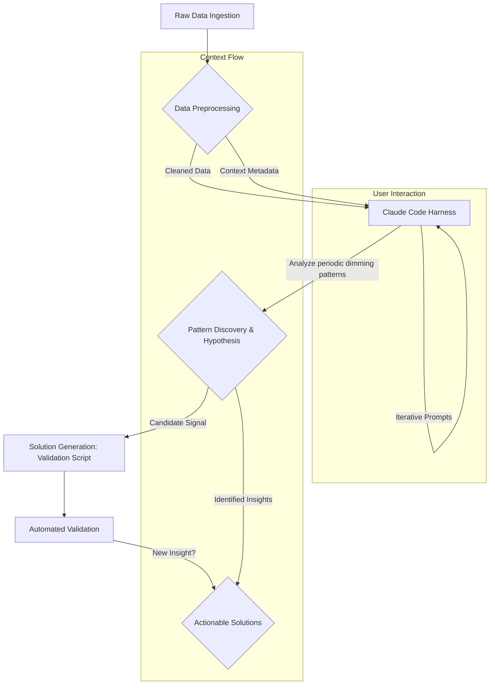

Claude Code 하네스를 활용한 데이터 분석 및 패턴 발견은 단순한 코드 생성 기능을 넘어, 복잡한 원시 데이터(raw-sources)에서 숨겨진 인사이트와 새로운 해결책(solutions)을 도출하는 데 강력한 역량을 제공합니다. NASA TESS 관측 데이터에서 외계행성 후보 신호를 발견한 사례는 Claude Code의 탐색적 데이터 분석(Exploratory Data Analysis, EDA) 및 패턴 인식(Pattern Recognition) 능력이 실제 문제 해결에 어떻게 적용될 수 있는지를 명확히 보여줍니다. 이는 기존의 통계적 방법론이나 휴리스틱으로 찾기 어려운 미묘한 신호를 AI가 대규모 데이터셋 내에서 식별할 수 있음을 의미합니다.

## Claude Code 기반 고급 패턴 발견 워크플로

Claude Code 하네스 내 데이터 분석 및 패턴 발견 기능 강화 워크플로는 다음과 같은 핵심 단계로 구성됩니다.

### 1. 원시 데이터 수집 및 전처리(Raw Data Ingestion & Preprocessing)
다양한 소스(예: logs, sensor data, scientific observations)에서 대량의 원시 데이터를 수집하고, Claude Code 분석에 용이하도록 정규화(normalization), 클리닝(cleaning), 특징 추출(feature extraction) 등의 전처리 작업을 수행합니다. 데이터의 일관성과 품질 확보가 중요합니다.

```python
import pandas as pd
import numpy as np

def preprocess_tess_data(filepath: str) -> pd.DataFrame:
    """
    TESS 관측 데이터 파일을 로드하고 기본적인 전처리를 수행합니다.
    예시: 결측치 처리, 이상치 제거, 스케일링
    """
    df = pd.read_csv(filepath)
    if 'flux' in df.columns:
        df['flux_normalized'] = (df['flux'] - df['flux'].mean()) / df['flux'].std()
    
    df = df.fillna(0) # 간단한 결측치 처리
    return df

# raw_data_path = "raw-sources/tess_observation_data.csv"
# processed_df = preprocess_tess_data(raw_data_path)
```

### 2. Claude Code를 활용한 탐색적 분석(Exploratory Analysis with Claude Code)
전처리된 데이터를 Claude Code 하네스에 입력하여, 데이터 내의 특이점(anomalies), 추세(trends), 주기(periodicities) 등을 탐색합니다. Claude Code는 자연어 기반 지시를 통해 데이터 시각화 코드를 생성하거나, 특정 가설(hypotheses) 검증을 위한 통계 분석을 수행할 수 있습니다. TESS 데이터에서 주기적인 밝기 감소 패턴을 찾아내도록 지시하는 것이 예시입니다.



### 3. 패턴 식별 및 솔루션 도출(Pattern Identification & Solution Derivation)
Claude Code는 학습된 모델과 도구 사용(tool use) 능력을 활용하여 데이터에서 미묘한 패턴을 식별하고, 이에 기반한 가설을 생성합니다. 이는 단순히 통계적 상관관계를 넘어, 데이터 이면에 숨겨진 인과관계나 복잡한 상호작용을 추론하는 데 도움을 줍니다. 식별된 패턴과 가설을 바탕으로, Claude Code는 특정 문제를 해결하거나 새로운 인사이트를 검증하기 위한 솔루션을 제시합니다. 예를 들어, 행성 후보 신호 유효성 검증을 위한 추가 관측 로직이나 유사 패턴 검색 알고리즘을 생성할 수 있습니다. 이러한 솔루션은 실제 환경에서 검증되어(automated validation) 최종 지식으로 확립됩니다.

2026년 트렌드에 따라, Claude Code 하네스는 멀티모달(multimodal) 데이터 처리 능력과 실시간 분석(real-time analysis) 기능을 통합할 것입니다. 이는 정형 데이터를 넘어 이미지, 텍스트, 음성 등 다양한 형태의 원시 데이터에서 복합적인 패턴을 발견하고, 이를 즉각적으로 솔루션 도출에 연계하는 것을 가능하게 합니다. 또한, 고급 지식 그래프(Knowledge Graph) 통합을 통해 발견된 패턴의 맥락을 풍부하게 하고, 설명 가능성(Explainability)을 높여 AI의 추론 과정을 투명하게 만들 것입니다.

## 트레이드오프

Claude Code 하네스를 활용한 데이터 분석 및 패턴 발견은 강력한 기능이지만, 몇 가지 트레이드오프를 고려해야 합니다.

*   **정확성 vs. 탐색 범위**: Claude Code는 복잡한 패턴 탐색과 새로운 가설 생성에 뛰어나지만, 때로는 '환각(hallucination)'으로 잘못된 패턴을 식별하거나 비현실적인 솔루션을 제시할 수 있습니다.
    *   **언제 좋은가**: 광범위한 데이터 탐색이 필요하고, 기존 방법론으로 찾기 어려운 미지의 패턴을 찾을 때 효과적입니다. 새로운 발견의 가능성을 높여줍니다.
    *   **언제 나쁜가**: 높은 정확성과 검증 가능성이 필수적인 금융, 의료 등 규제가 엄격한 도메인에서는 독립적인 사용에 위험이 따릅니다. 인간의 검토와 보완이 필수적입니다.

*   **비용 vs. 인사이트 깊이**: Claude Code의 고급 분석 능력은 상당한 컴퓨팅 리소스와 토큰 사용량을 요구할 수 있습니다. 대규모 원시 데이터셋 처리나 복잡한 추론 체인 구성 시 비용이 증가합니다.
    *   **언제 좋은가**: 높은 가치의 인사이트가 예상되고, 기존의 수동 분석 비용이 더 높은 경우, 초기 탐색 단계에서 빠른 가설 수립이 필요할 때 비용 대비 효율적일 수 있습니다.
    *   **언제 나쁜가**: 예산 제약이 크거나, 이미 잘 정의된 분석 방법론이 존재하며 결과가 예측 가능한 경우에는 과도한 비용이 발생할 수 있습니다.

*   **설명 가능성(Explainability) vs. 자동화 수준**: AI가 복잡한 패턴을 식별하고 솔루션을 도출하는 과정은 '블랙박스(black box)'처럼 느껴질 수 있어, 왜 특정 결론에 도달했는지 설명하기 어려울 수 있습니다.
    *   **언제 좋은가**: 빠른 패턴 식별과 솔루션 자동화가 우선시되며, 내부 로직의 투명성보다는 최종 결과의 유용성이 더 중요한 상황에서 유리합니다.
    *   **언제 나쁜가**: 규제 준수, 감사(audit), 또는 의사결정의 근거를 명확히 제시해야 하는 상황에서는 설명 가능성이 부족하여 채택이 어렵거나 추가적인 해석 계층이 필요합니다.

## 실전 체크리스트

Claude Code 하네스 내 데이터 분석 및 패턴 발견 기능을 실제 프로젝트에 적용하기 위한 검증 항목입니다.

- [ ] **데이터 품질 및 전처리 파이프라인 확인**: 원시 데이터가 Claude Code가 분석할 수 있는 형태로 정제되고 표준화되는지, 결측치 및 이상치 처리가 적절한지 검증했습니다.
- [ ] **프롬프트 엔지니어링 최적화**: 특정 패턴 탐색 목표에 맞춰 Claude Code에게 제공되는 프롬프트(prompt)가 명확하고 구체적이며, 모호함 없이 의도를 정확히 전달하는지 확인했습니다.
- [ ] **패턴 식별 결과의 유효성 검증 메커니즘 구축**: Claude Code가 식별한 패턴이나 생성된 가설이 독립적인 통계 분석 또는 도메인 전문가의 검토를 통해 유효성을 검증할 수 있는 프로세스를 마련했습니다.
- [ ] **솔루션 도출 및 실행 가능성 평가**: Claude Code가 제시한 솔루션이 실제 환경에서 실행 가능하며, 예상된 문제를 해결하거나 새로운 가치를 창출하는지 평가하는 기준을 수립했습니다.
- [ ] **비용 모니터링 및 최적화 전략 적용**: 대규모 데이터 분석 시 발생하는 토큰 사용량과 컴퓨팅 비용을 지속적으로 모니터링하고, 캐싱(caching) 또는 모델 선택(model selection)을 통한 비용 최적화 전략을 적용했습니다.
- [ ] **보안 및 개인 정보 보호 준수**: 분석 대상 데이터에 민감 정보가 포함된 경우, 데이터 비식별화, 접근 제어 등 관련 보안 및 개인 정보 보호 규정을 준수하는지 확인했습니다.
- [ ] **AI 추론 과정의 투명성 확보**: Claude Code가 도출한 패턴이나 솔루션의 근거를 추적하고 설명할 수 있는 로그(logs) 또는 설명 가능한 AI(XAI) 기술을 통합하여 투명성을 확보했습니다.