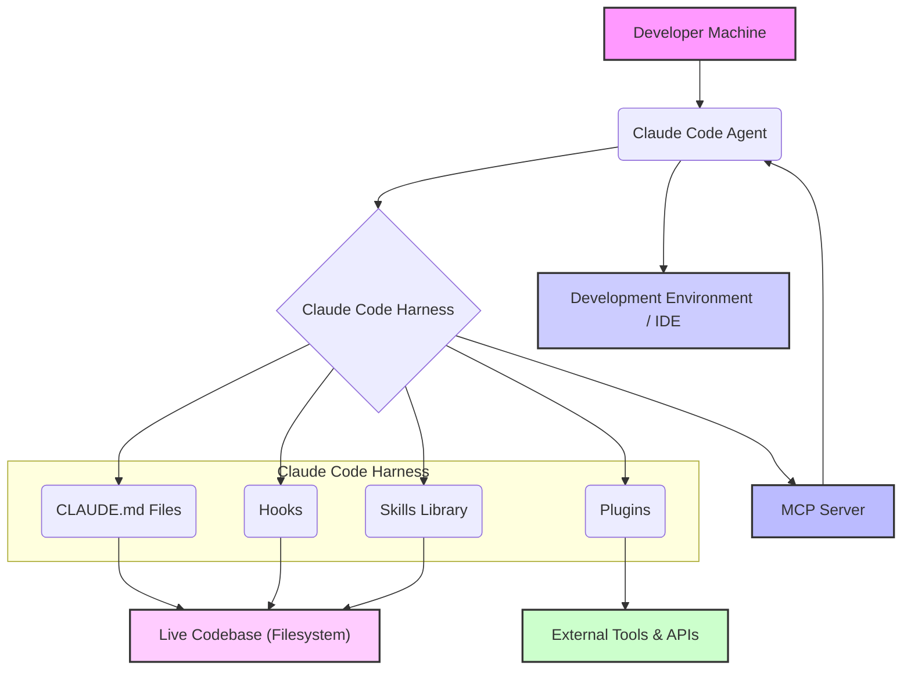

대규모 코드베이스 환경에서 AI 에이전트의 효율적인 작동은 복잡한 도전 과제를 제시합니다. 기존의 많은 LLM 기반 코드 분석 도구들은 코드베이스를 미리 인덱싱하거나 특정 데이터베이스에 저장하는 방식을 채택합니다. 그러나 Claude Code는 이러한 방식과 달리, 개발자 머신에서 파일 시스템 탐색, `grep` 명령, 그리고 참조 추적과 같은 방식을 통해 라이브 코드베이스를 직접 읽는 독특한 접근 방식을 사용합니다.

이러한 직접 접근 방식의 성능과 확장성을 극대화하기 위해, Claude Code는 단순한 모델을 넘어 `CLAUDE.md`, `hooks`, `skills`, `plugins`, 그리고 MCP (Multi-Agent Control Plane) 서버로 구성된 정교한 '하네스(Harness)' 아키텍처 패턴을 활용합니다. 이 하네스는 에이전트가 코드베이스를 더 깊이 이해하고, 복잡한 작업을 효율적으로 수행하며, 개발 워크플로우에 매끄럽게 통합될 수 있도록 지원하는 핵심 인프라스트럭처입니다.

## Claude Code 하네스 핵심 구성 요소

Claude Code 하네스는 LLM 에이전트가 대규모 코드베이스에서 효과적으로 상호작용할 수 있도록 설계된 모듈형 아키텍처입니다. 각 구성 요소는 특정 역할을 수행하며, 상호 유기적으로 결합되어 에이전트의 인지 능력과 실행 효율성을 향상시킵니다.

### CLAUDE.md: Contextual Markdown

`CLAUDE.md` 파일은 코드베이스의 특정 디렉터리나 모듈에 대한 인간 및 에이전트가 이해할 수 있는 컨텍스트를 제공합니다. 이는 `README.md`와 유사하지만, 에이전트가 시스템의 설계 의도, 핵심 로직, 특정 제약 사항 등을 빠르게 파악할 수 있도록 최적화된 정보를 포함합니다. 에이전트는 이 파일을 통해 복잡한 프로젝트 구조나 비즈니스 로직에 대한 온디맨드(on-demand) 설명을 얻어 코드 이해도를 높입니다.

```markdown
# CLAUDE.md for src/services/authService

## Purpose
This module handles user authentication, authorization, and session management. It integrates with external OAuth providers and our internal user database.

## Key Components
- `login.ts`: Initiates OAuth flow or local login.
- `sessionManager.ts`: Manages user sessions and JWT tokens.
- `permissionChecker.ts`: Verifies user roles and permissions.

## Design Principles
- **Stateless JWT**: Sessions are managed via signed JWTs to ensure scalability.
- **Least Privilege**: Authorization checks are performed at every API boundary.

## Known Limitations
- Rate limiting for login attempts is currently handled by the API Gateway, not internally.

## Agent Actions
- To add a new OAuth provider: Refer to `src/config/oauthProviders.ts` and update `login.ts`.
- To modify permission logic: Update `permissionChecker.ts` and ensure comprehensive unit tests.
```

### Hooks: Workflow Integration Points

Hooks는 특정 개발자 워크플로우 이벤트(예: 코드 변경 감지, 테스트 실행, 커밋 전)에 반응하여 에이전트가 개입할 수 있는 지점을 제공합니다. 이를 통해 에이전트는 코드 컨벤션 검사, 자동 리팩토링 제안, 또는 변경 사항에 대한 컨텍스트 요약 생성과 같은 작업을 자동으로 수행할 수 있습니다. 예를 들어, Git `pre-commit` 훅을 통해 에이전트가 변경된 코드에 대한 초기 검토를 수행하고 잠재적인 문제를 보고할 수 있습니다.

### Skills: Reusable Capabilities

Skills는 에이전트가 수행할 수 있는 특정 기능 또는 작업 단위를 추상화한 것입니다. 이는 코드 생성, 디버깅, 문서화, 또는 특정 프레임워크와의 상호작용과 같은 복잡한 작업을 캡슐화합니다. Skills는 재사용 가능하도록 설계되어, 에이전트가 다양한 상황에서 일관된 방식으로 전문화된 작업을 수행할 수 있도록 합니다. 예를 들어, '리팩토링 Skill'은 특정 패턴을 찾아 코드를 개선하는 일련의 단계를 포함할 수 있습니다.

### Plugins: External Tool Integration

Plugins는 Claude Code 하네스가 외부 도구 및 시스템과 연동될 수 있도록 확장하는 메커니즘입니다. 데이터베이스, CI/CD 파이프라인, 이슈 트래킹 시스템, 또는 외부 API 등과의 인터페이스를 구축하여 에이전트가 더 넓은 범위의 작업을 수행하도록 지원합니다. 이를 통해 에이전트는 코드베이스 내부 작업뿐만 아니라, 시스템 전체의 개발 및 운영 생명주기(DevOps lifecycle)에 기여할 수 있습니다.

### MCP Server: Orchestration and Management

MCP (Multi-Agent Control Plane) 서버는 Claude Code 에이전트들의 오케스트레이션과 관리를 담당하는 중앙 집중식 컴포넌트입니다. 이는 에이전트들의 작업 할당, 진행 상황 모니터링, 리소스 관리, 그리고 여러 에이전트 간의 협업 조정을 수행합니다. 대규모 환경에서 다수의 에이전트가 동시에 작동할 때, MCP 서버는 충돌을 방지하고 전체 시스템의 효율성을 보장하는 데 필수적입니다.

## Claude Code 하네스 아키텍처 개요

Claude Code 하네스는 에이전트와 코드베이스, 그리고 외부 환경 간의 상호작용을 체계화합니다. 아래 다이어그램은 주요 컴포넌트들의 관계와 데이터 흐름을 보여줍니다.



이 아키텍처는 2026년 현재 빠르게 발전하는 LLM 기술의 트렌드를 반영합니다. 특히, 에이전트의 *동적 컨텍스트 이해*, *실시간 상호작용*, 그리고 *자율적 학습 및 개선* 능력을 강화하는 데 중점을 둡니다. `CLAUDE.md`는 실시간으로 변경되는 코드베이스의 최신 상태를 반영하며, `hooks`와 `skills`는 에이전트가 개발자 워크플로우에 깊숙이 통합되어 더욱 능동적으로 기여할 수 있도록 합니다. `plugins`는 에이전트의 활동 범위를 확장하여 단순한 코드 수정 봇을 넘어선 복합적인 문제 해결 에이전트로서의 역할을 가능하게 합니다.

## 트레이드오프

Claude Code 하네스 아키텍처 패턴은 강력한 이점을 제공하지만, 고려해야 할 트레이드오프도 존재합니다. 다른 엔트리에서 이 문서를 참조할 때 판단 근거로 활용할 수 있습니다.

*   **직접 코드베이스 접근 vs. 인덱싱 기반 접근**: 
    *   **장점**: 항상 최신 코드 상태를 반영하며, 인덱스 업데이트 지연이나 불일치 문제가 없습니다. 에이전트가 실제 개발자와 유사하게 `grep`이나 파일 탐색을 통해 코드를 이해할 수 있습니다. (언제 좋음: 빠르게 변화하는 코드베이스, 실시간 컨텍스트가 중요한 경우)
    *   **단점**: 대규모 코드베이스에서 `grep` 등의 작업은 성능 병목을 유발할 수 있습니다. 초기 파일 시스템 스캔 시간이 길어질 수 있으며, 보안 정책에 따라 직접 파일 접근이 제한될 수 있습니다. (언제 나쁨: 매우 큰 모노리포, 성능이 절대적으로 중요한 실시간 코드 분석, 엄격한 샌드박스 환경)

*   **CLAUDE.md를 통한 컨텍스트 제공 vs. 자동 컨텍스트 추출**: 
    *   **장점**: 개발자가 직접 에이전트에게 필요한 핵심 정보, 설계 의도, 제약 사항 등을 명시적으로 전달하여 에이전트의 오해를 줄이고 관련성을 높일 수 있습니다. (언제 좋음: 복잡한 비즈니스 로직, 암묵적인 규칙, 특정 설계 패턴이 중요한 프로젝트)
    *   **단점**: `CLAUDE.md` 파일의 작성 및 유지보수에 개발자의 노력이 필요합니다. 파일이 최신 상태로 유지되지 않으면 오히려 잘못된 정보를 제공할 수 있습니다. (언제 나쁨: 문서화 리소스가 부족한 팀, 빠르게 프로토타이핑하는 프로젝트, 매우 동적으로 변경되는 컨텍스트)

*   **Hooks, Skills, Plugins의 모듈화 vs. 초기 설정 복잡성**: 
    *   **장점**: 에이전트의 기능을 재사용 가능한 모듈로 분리하여 개발 및 유지보수를 용이하게 하고, 에이전트의 역량을 확장합니다. 새로운 외부 도구 통합이나 특정 작업 자동화가 유연합니다. (언제 좋음: 장기적인 관점에서 에이전트 기능 확장 및 재사용이 필요한 대규모 프로젝트)
    *   **단점**: 각 컴포넌트의 설계, 구현, 테스트, 그리고 통합에 초기 설정 비용과 복잡성이 수반됩니다. 잘못된 설계는 디버깅을 어렵게 만들 수 있습니다. (언제 나쁨: 단기적인 소규모 프로젝트, 빠르게 결과물을 내야 하는 상황)

*   **MCP 서버를 통한 중앙 오케스트레이션 vs. 분산 에이전트**: 
    *   **장점**: 여러 에이전트의 작업을 효율적으로 관리하고 조정하며, 리소스 할당 및 충돌 해결을 용이하게 합니다. 전체 시스템의 가시성과 제어권을 확보할 수 있습니다. (언제 좋음: 다수의 에이전트가 협업하는 복합적인 태스크, 엔터프라이즈 수준의 에이전트 관리 시스템)
    *   **단점**: MCP 서버 자체가 단일 장애 지점(Single Point of Failure)이 될 수 있으며, 중앙 집중화된 아키텍처는 확장성 및 탄력성 측면에서 추가적인 고려 사항을 요구합니다. (언제 나쁨: 고도의 분산 시스템 요구사항, 낮은 초기 도입 비용이 중요한 경우)

## 실전 체크리스트

Claude Code 하네스 아키텍처 패턴을 프로젝트에 성공적으로 적용하기 위한 실전 체크리스트입니다.

*   - [ ] 핵심 모듈 및 디렉터리에 대한 `CLAUDE.md` 파일이 존재하며, 코드 변경 시 최신 상태로 업데이트되는 자동화된 프로세스가 구축되었는가?
*   - [ ] 주요 개발 워크플로우 (예: `git pre-commit`, `CI/CD pipeline`)에 에이전트 `hooks`가 통합되어 코드 품질 검사, 컨텍스트 요약 생성 등의 작업을 수행하는가?
*   - [ ] 반복적이고 복잡한 개발 작업(예: 특정 패턴의 리팩토링, 새로운 컴포넌트 스캐폴딩)을 추상화한 재사용 가능한 `skills`가 정의되고 테스트되었는가?
*   - [ ] 필요한 경우 외부 시스템 (예: Jira, Slack, 내부 API)과 연동하기 위한 `plugins`가 구현되었으며, 보안 및 성능 요구 사항을 충족하는가?
*   - [ ] `MCP server`의 배포 전략이 명확하며, 에이전트의 작업 할당, 진행 상황 모니터링, 로그 수집 메커니즘이 확립되었는가?
*   - [ ] 하네스 구성 요소(CLAUDE.md, hooks, skills, plugins)에 대한 버전 관리 시스템이 구축되어 변경 사항 추적 및 롤백이 용이한가?
*   - [ ] Claude Code 에이전트가 대규모 코드베이스에서 `grep` 및 참조 추적 작업을 수행할 때, 설정된 성능 지표 (예: 응답 시간, CPU 사용률) 내에서 효율적으로 작동하는 것이 검증되었는가?