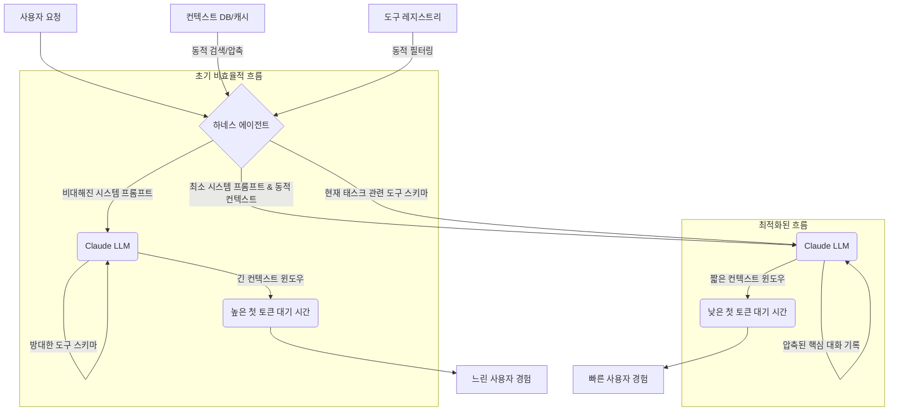

최근 긱뉴스 기사에서 LLM 하네스(harness) 구현 방식에 따라 첫 토큰 대기 시간(FTL)이 크게 벌어질 수 있음을 지적했습니다. 이는 LLM 모델 속도만으로 실제 응답성을 판단하기 어렵게 하며, 특히 Claude Code와 같은 로컬/하이브리드 환경에서는 긴 시스템 프롬프트, 복잡한 도구 스키마, 과도한 요청이 제한된 자원을 압박하여 성능 저하의 주요 원인이 됩니다. 본 문서는 Claude Code 하네스의 응답성을 최적화하고, 프롬프트 및 도구 스키마를 경량화하는 전략을 제시합니다.

## 첫 토큰 대기 시간(FTL)의 중요성 및 발생 원인
FTL은 LLM이 사용자 입력에 대해 첫 토큰을 생성하기까지 걸리는 시간으로, 사용자 경험(UX)에 직접적인 영향을 미칩니다. 즉각적인 피드백이 중요한 시나리오에서 핵심 성능 지표입니다.

FTL 지연의 주된 원인은 다음과 같습니다:
*   **과도한 컨텍스트 크기**: 시스템 프롬프트, 채팅 히스토리, RAG 문서, 도구 스키마 등 모든 입력은 LLM 컨텍스트 윈도우에 로드됩니다. 컨텍스트가 길수록 처리 토큰 수가 늘어나 FTL이 증가합니다.
*   **복잡한 도구 스키마**: LLM이 호출할 도구가 많거나, 각 함수의 인자 및 설명이 장황할수록 LLM은 도구 사용 결정에 더 많은 추론 시간과 토큰을 소모합니다.
*   **하네스 구현 오버헤드**: 프롬프트 구성, 컨텍스트 관리, API 호출 직렬화/역직렬화, 네트워크 전송 등 하네스 자체의 비효율적인 구현도 FTL에 영향을 미칩니다.

## Claude Code 하네스 응답성 최적화 전략

### 1. 시스템 프롬프트 경량화
시스템 프롬프트는 LLM의 행동 양식을 정의합니다. 불필요하게 길거나 반복적인 내용은 제거하고, LLM이 작업에 집중하도록 최소한의 필수 정보만 제공해야 합니다.

*   **핵심 지침 집중**: 역할, 페르소나, 출력 형식 등 핵심 지침만 간결하게 포함합니다 (예: `You are a Python code expert.`).
*   **불필요한 설명 제거**: "매우 유용하고 유능한 AI 어시스턴트" 같은 일반적인 수식어는 제거합니다.
*   **동적 컨텍스트 활용**: 정적 시스템 프롬프트에 모든 정보를 담기보다, 필요한 코드 스니펫, 에러 로그, 문서 등은 RAG나 동적 컨텍스트 주입 방식으로 제공합니다. (`context-engineering/agentic-context-compaction-trigger-heuristics` 참조).

```python
# 기존 시스템 프롬프트 (conceptual)
verbose_prompt = "You are an extremely helpful and super intelligent Python programming assistant. Always provide full, runnable code examples. Explain every step in detail. Do not make assumptions. Be polite and comprehensive in your responses."

# 경량화된 시스템 프롬프트
lightweight_prompt = "You are a Python code expert. Provide concise, runnable Python code and explanations. Focus on the user's explicit request."
```

### 2. 도구 스키마 경량화
Claude Code 하네스의 도구 스키마는 LLM 추론 성능에 직접적인 영향을 미칩니다.

*   **필요한 도구만 노출**: 현재 작업의 도메인이나 단계에 따라 필요한 도구만 동적으로 선택하여 스키마를 구성합니다. (`agents/llm-agent-tool-utilization-optimization` 참조).
*   **간결하고 명확한 설명**: 각 도구의 이름, 설명, 인자는 LLM이 빠르게 이해할 수 있도록 간결하게 작성합니다.
*   **스키마 구조 최적화**: 복잡한 `enum`이나 깊은 중첩 구조 대신, 가능한 한 플랫하고 단순한 데이터 타입을 사용합니다. `anyOf`, `oneOf` 같은 복잡한 스키마 정의는 LLM 처리 부담을 가중시킬 수 있습니다.

```json
// 기존 도구 스키마 (conceptual)
{
  "name": "search_web",
  "description": "Performs a comprehensive web search across multiple engines and extracts key information related to programming concepts, API documentation, and troubleshooting guides.",
  "parameters": {
    "type": "object",
    "properties": { "query": { "type": "string", "description": "The search query string. Must be highly specific." } },
    "required": ["query"]
  }
}

// 경량화된 도구 스키마
{
  "name": "search_web",
  "description": "Searches the web for given query.",
  "parameters": {
    "type": "object",
    "properties": { "query": { "type": "string", "description": "Search query." } },
    "required": ["query"]
  }
}
```

### 3. 하네스 구현 최적화 기법
하네스 자체의 구현 방식도 응답성에 큰 영향을 미칩니다. 2026년 LLM 에이전트 개발 트렌드에서 하이브리드 접근 방식이 강조됨에 따라 하네스의 효율성이 더욱 중요해지고 있습니다.

*   **스트리밍 응답 처리**: 첫 토큰 생성 즉시 사용자에게 스트리밍하여 응답하면, 사용자 인지 지연(perceived latency)을 크게 개선할 수 있습니다.
*   **비동기 I/O**: LLM API 호출 및 외부 도구 실행 시 논블로킹(non-blocking) 비동기 I/O를 사용하여 하네스가 다른 작업을 동시에 처리하도록 합니다. (`harness-engineering/realtime-ai-latency-optimization-harness-deployment` 참조).
*   **캐싱 및 전처리**: 자주 사용되는 정적 프롬프트나 도구 스키마는 캐싱하거나 미리 토큰화하여 오버헤드를 줄입니다. RAG 조회 결과도 캐싱 대상이 될 수 있습니다.
*   **컨텍스트 압축**: 과거 대화나 불필요한 컨텍스트는 요약하거나 제거하여 컨텍스트 윈도우 크기를 최소화합니다. (`context-engineering/agentic-context-compaction-commit-density-survival` 참조).

## Claude Code Harness 최적화 흐름



## 트레이드오프

*   **프롬프트 및 스키마 경량화**:
    *   **장점**: FTL 및 응답 시간 감소, 토큰 비용 절감, LLM 추론 효율성 증대.
    *   **단점**: 필요한 컨텍스트 누락 위험, LLM 기능 활용 범위 축소, 관리 복잡성 증가.
    *   **언제 좋은가**: 실시간 응답이 중요하고 비용에 민감하며, 태스크가 명확하고 한정적인 경우.
    *   **언제 나쁜가**: LLM이 광범위한 지식과 유연한 도구 사용이 필요한 복잡하고 탐색적인 태스크를 수행할 때.

*   **동적 컨텍스트 및 도구 주입**:
    *   **장점**: 항상 최적의 관련성 높은 정보만 제공, 컨텍스트 윈도우 효율 극대화.
    *   **단점**: 컨텍스트 검색/필터링 과정에서 추가 지연, 복잡한 로직, 검색 시스템 성능/정확성에 의존.
    *   **언제 좋은가**: 대규모 코드베이스/문서 집합에서 정보를 찾아야 하거나 태스크가 점진적으로 변화하는 경우.
    *   **언제 나쁜가**: 컨텍스트 검색 자체가 지연을 유발하거나 관련성이 낮은 정보를 가져올 때.

*   **스트리밍 응답**:
    *   **장점**: 사용자 인지 지연 크게 개선, 긴 응답 생성 시 사용자 이탈 방지.
    *   **단점**: 실제 FTL 자체는 줄어들지 않음, 클라이언트 측 구현 복잡성 증가.
    *   **언제 좋은가**: 즉각적인 피드백이 중요한 대화형 애플리케이션, 긴 텍스트/코드 블록 생성 시.
    *   **언제 나쁜가**: 짧고 결정적인 응답이 필요한 경우, 클라이언트 측에서 모든 응답을 받은 후 일괄 처리가 필요한 경우.

## 실전 체크리스트

Claude Code 하네스 응답성 최적화 및 프롬프트/도구 스키마 경량화를 위한 실전 체크리스트입니다.

- [ ] **현재 FTL 및 토큰 사용량 측정**: 다양한 시나리오에 대한 FTL 및 각 LLM 호출 시 총 토큰 사용량(입력 + 출력) 기준선을 설정합니다.
- [ ] **시스템 프롬프트 간결성 감사**: 시스템 프롬프트에서 불필요한 반복, 일반적인 수식어, 또는 작업과 직접 관련 없는 지시 사항이 없는지 검토하고 제거합니다.
- [ ] **도구 스키마 효율성 분석**: LLM에 제공되는 모든 도구 스키마를 검토하여, 현재 태스크에 실제로 사용되지 않거나 설명이 과도하게 장황한 도구/인자 정의를 식별하고 경량화합니다.
- [ ] **동적 컨텍스트 주입 시스템 구현**: RAG 또는 다른 컨텍스트 관리 시스템을 통해, LLM에 필요한 관련 컨텍스트만 동적으로 주입하는 메커니즘을 설계하고 구현합니다.
- [ ] **API 호출 및 데이터 처리 최적화**: LLM API 호출 시 직렬화/역직렬화 오버헤드, 네트워크 지연을 최소화하기 위해 비동기 I/O를 활용하고 효율적인 데이터 구조를 사용합니다.
- [ ] **스트리밍 응답 기능 구현**: LLM의 첫 토큰 생성 즉시 사용자에게 스트리밍하여 표시하는 기능을 구현, 사용자 인지 지연을 개선합니다.
- [ ] **FTL 및 토큰 비용 모니터링 체계 구축**: 최적화 후에도 FTL과 토큰 비용을 지속적으로 모니터링하고, 설정된 임계값(threshold) 초과 시 알림 시스템을 구축합니다. (`reports/ai-model-performance-cost-efficiency-reporting` 통합 고려).
