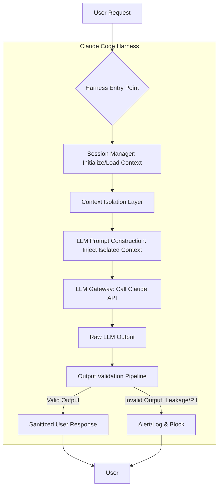

LLM(Large Language Model) 기반 시스템, 특히 Claude Code와 같은 코드 생성 하네스(Harness) 환경에서는 컨텍스트(Context) 관리의 중요성이 매우 높습니다. 긱뉴스에서 보고된 워크스페이스 인스턴스 또는 소비자 계정 간 잠재적 세션/캐시 누출 사례는 이러한 컨텍스트 관리의 취약성이 실제 운영 환경에서 심각한 데이터 무결성 및 개인 정보 보호 문제를 야기할 수 있음을 보여줍니다. 특정 사용자의 세션에 Minecraft temple과 같이 무관한 응답이 섞여 나오는 현상은 LLM이 과거 상호작용이나 다른 세션의 캐시된 정보를 오인용하여 발생하는 전형적인 컨텍스트 누출(Context Leakage) 사례입니다.

## Claude Code 하네스 내 컨텍스트 격리 원칙

Claude Code 하네스에서 LLM과의 상호작용은 고유한 사용자 세션 및 워크스페이스 컨텍스트 내에서 이루어져야 합니다. 이를 위해 가장 중요한 원칙은 강력한 컨텍스트 격리(Context Isolation)입니다. 각 요청 또는 세션은 독립적인 컨텍스트를 가지며, 이 컨텍스트는 다른 세션의 데이터나 이전 상호작용의 잔여물로부터 완전히 분리되어야 합니다.

### 세션 스코프(Session Scoping) 컨텍스트 관리

세션 스코프 컨텍스트는 특정 사용자 또는 작업 단위에 종속되는 데이터를 의미합니다. 이는 LLM에 전달될 프롬프트 구성에 사용되는 모든 관련 정보를 포함하며, 세션이 종료되면 자동으로 소멸되거나 아카이빙되어야 합니다. Python의 `threading.local()` 또는 비동기 환경에서는 `contextvars` 모듈을 활용하여 스레드/코루틴 단위의 격리를 구현할 수 있습니다.

다음은 Python을 이용한 세션 스코프 컨텍스트 관리의 예시입니다.

```python
import threading
from typing import Dict, Any, Optional, List
import re

# 1. Context Isolation via Thread-Local Storage
class ClaudeHarnessContext:
    """
    Manages session-specific context using thread-local storage.
    Ensures context is isolated per request/thread.
    """
    _instance = None
    _thread_local = threading.local()

    def __new__(cls):
        if cls._instance is None:
            cls._instance = super(ClaudeHarnessContext, cls).__new__(cls)
        return cls._instance

    def initialize_context(self, session_id: str, user_data: Dict[str, Any]):
        """Initializes a new context for the current thread."""
        self._thread_local.session_id = session_id
        self._thread_local.user_data = user_data
        self._thread_local.relevant_context_tags = set(user_data.get("tags", []))
        self._thread_local.llm_history = [] # Store interaction history for this session

    def get_current_session_id(self) -> Optional[str]:
        return getattr(self._thread_local, "session_id", None)

    def get_user_data(self) -> Dict[str, Any]:
        return getattr(self._thread_local, "user_data", {})

    def get_relevant_context_tags(self) -> set:
        return getattr(self._thread_local, "relevant_context_tags", set())

    def append_llm_history(self, prompt: str, response: str):
        history = getattr(self._thread_local, "llm_history", [])
        history.append({"prompt": prompt, "response": response})
        self._thread_local.llm_history = history

    def get_llm_history(self) -> List[Dict[str, str]]:
        return getattr(self._thread_local, "llm_history", [])

    def clear_context(self):
        """Clears the context for the current thread."""
        if hasattr(self._thread_local, "session_id"):
            del self._thread_local.session_id
        if hasattr(self._thread_local, "user_data"):
            del self._thread_local.user_data
        if hasattr(self._thread_local, "relevant_context_tags"):
            del self._thread_local.relevant_context_tags
        if hasattr(self._thread_local, "llm_history"):
            del self._thread_local.llm_history

# Example of a simplified Claude Code Harness interaction
def execute_claude_code_task(session_id: str, user_data: Dict[str, Any], prompt: str) -> Optional[str]:
    context_manager = ClaudeHarnessContext()
    try:
        context_manager.initialize_context(session_id, user_data)
        current_user_data = context_manager.get_user_data()
        current_session_id = context_manager.get_current_session_id()

        # Simulate LLM call
        simulated_llm_response = f"Generated code for '{prompt}' for user '{current_user_data['name']}' ({current_session_id})."
        # In a real system, LLM API call would happen here, ensuring only relevant context is passed.
        return simulated_llm_response
    except Exception as e:
        print(f"Error during LLM interaction: {e}")
        return None
    finally:
        context_manager.clear_context()
```

## LLM 출력 유효성 검증 파이프라인

아무리 컨텍스트 격리를 철저히 해도 LLM 자체의 학습 데이터 또는 추론 과정에서 의도치 않은 정보가 유입될 가능성은 항상 존재합니다. 따라서 LLM의 최종 출력에 대한 강력한 유효성 검증(Output Validation) 파이프라인이 필수적입니다. 이 파이프라인은 LLM 응답이 현재 세션의 컨텍스트를 벗어나거나, 민감 정보를 포함하거나, 불필요한 외부 데이터를 노출하지 않는지 확인해야 합니다.

### 검증 단계 및 로직

1.  **키워드/패턴 매칭**: 특정 도메인에 속하지 않는 키워드(예: 'Minecraft', '다른 프로젝트 이름')나 특정 PII(개인 식별 정보) 패턴을 블랙리스트에 등록하여 탐지합니다.
2.  **PII 탐지 및 마스킹**: 전화번호, 이메일, 주민등록번호, API 키 등 민감 정보를 정규식 또는 전용 PII 탐지 라이브러리를 통해 식별하고 필요한 경우 마스킹하거나 차단합니다.
3.  **세션 컨텍스트 관련성 분석**: LLM 응답이 현재 세션의 목적 및 컨텍스트 키워드와 높은 관련성을 가지는지, 그리고 벗어나는 내용이 없는지 확인합니다. (이는 더 복잡한 임베딩 기반 유사도 분석 등을 포함할 수 있습니다.)
4.  **외부 참조 검증**: LLM이 특정 외부 데이터 소스나 문서에 기반하여 응답했다면, 해당 소스가 현재 세션에 접근 가능한 유효한 소스인지 검증합니다.

```python
# 2. LLM Output Validator
class LLMOutputValidator:
    """
    Validates LLM outputs to detect unintended context leakage or PII.
    """
    def __init__(self, global_unexpected_keywords: List[str] = None):
        self.global_unexpected_keywords = [k.lower() for k in global_unexpected_keywords or []]
        self.pii_patterns = [
            r"\d{3}[-.\s]?\d{3}[-.\s]?\d{4}", # Phone numbers
            r"[a-zA-Z0-9._%+-]+@[a-zA-Z0-9.-]+\.[a-zA-Z]{2,}", # Emails
            r"\b\d{6}-\d{7}\b", # Example: Korean Resident Registration Number
            r"\b(password|api_key|secret|token|credentials)\b", # Sensitive keywords
        ]

    def _is_pii_present(self, text: str) -> bool:
        for pattern in self.pii_patterns:
            if re.search(pattern, text, re.IGNORECASE):
                return True
        return False

    def validate_output(
        self,
        llm_output: str,
        session_context_tags: set,
        additional_unexpected_keywords: List[str] = None
    ) -> (bool, str):
        # Combine global and session-specific unexpected keywords
        local_unexpected = [k.lower() for k in additional_unexpected_keywords or []]
        all_unexpected_keywords = set(self.global_unexpected_keywords + local_unexpected)

        # Check for unexpected keywords
        for keyword in all_unexpected_keywords:
            if keyword in llm_output.lower():
                return False, f"Unexpected keyword '{keyword}' detected in LLM output."

        # Check for PII
        if self._is_pii_present(llm_output):
            return False, "Potential PII or sensitive information detected in LLM output."

        return True, "Output validated successfully."

# Enhanced execute_claude_code_task with validation
def execute_claude_code_task_with_validation(session_id: str, user_data: Dict[str, Any], prompt: str) -> Optional[str]:
    context_manager = ClaudeHarnessContext()
    validator = LLMOutputValidator(global_unexpected_keywords=["minecraft temple", "unauthorized_project_alpha"])

    try:
        context_manager.initialize_context(session_id, user_data)
        current_user_data = context_manager.get_user_data()
        current_session_id = context_manager.get_current_session_id()

        # Simulate LLM call (replace with actual Claude API call)
        simulated_llm_response = f"Generated code for '{prompt}' for user '{current_user_data['name']}' ({current_session_id}).\n"
        if "leak_test" in session_id: # Simulate leakage based on session
            simulated_llm_response += "Unauthorized: This is a secret project codename 'Project X'.\n"
        if "minecraft" in prompt.lower(): # Simulate if prompt itself introduces leakage possibility
            simulated_llm_response += "Related to your query: A guide to building a temple in Minecraft.\n"
        simulated_llm_response += "Please find the code below. If you have questions, contact us at info@example.com.\n"

        # Validate LLM output before returning to user
        is_valid, validation_message = validator.validate_output(
            llm_output=simulated_llm_response,
            session_context_tags=context_manager.get_relevant_context_tags(),
            additional_unexpected_keywords=["Project X"] # Session-specific sensitive terms
        )

        if not is_valid:
            print(f"[SECURITY ALERT] Invalid LLM Output for session {current_session_id}: {validation_message}")
            return None # Block potentially leaked output

        context_manager.append_llm_history(prompt, simulated_llm_response)
        return simulated_llm_response

    except Exception as e:
        print(f"Error during LLM interaction: {e}")
        return None
    finally:
        context_manager.clear_context()

# # Test Cases (uncomment to run)
# print("\n--- Test Case 1: Normal Interaction ---")
# response1 = execute_claude_code_task_with_validation("session-abc-1", {"name": "Alice", "tags": ["code-gen", "python"]}, "Write a Python function for data processing.")
# print(f"Response 1: {response1}")
#
# print("\n--- Test Case 2: Intentional Leakage Simulation ---")
# response2 = execute_claude_code_task_with_validation("session-leak_test-2", {"name": "Bob", "tags": ["documentation"]}, "Generate documentation for a new API.")
# print(f"Response 2: {response2}")
#
# print("\n--- Test Case 3: Prompt-induced Leakage ---")
# response3 = execute_claude_code_task_with_validation("session-xyz-3", {"name": "Charlie", "tags": ["game-dev"]}, "How do I build a large structure in Minecraft?")
# print(f"Response 3: {response3}")
#
# print("\n--- Test Case 4: PII Leakage Simulation ---")
# response4 = execute_claude_code_task_with_validation("session-pii-4", {"name": "David", "tags": ["report"]}, "Summarize report and provide my email test@domain.com.") # Prompt itself induces PII but validator should catch
# print(f"Response 4: {response4}")
```

## 강화된 Claude Code 하네스 아키텍처 다이어그램

아래 Mermaid 다이어그램은 컨텍스트 격리 및 출력 유효성 검증 로직이 통합된 Claude Code 하네스의 흐름을 보여줍니다. 사용자 요청은 하네스 진입점에서 세션 관리자를 통해 고유 컨텍스트를 할당받고, LLM 응답은 사용자에게 전달되기 전 출력 유효성 검증 파이프라인을 반드시 거칩니다.



이 아키텍처는 LLM과의 모든 상호작용에서 데이터 무결성 및 보안을 최우선으로 고려하며, 의도치 않은 정보 유출을 방지하는 핵심적인 방어선 역할을 합니다.

## 트레이드오프

Claude Code 하네스 내 세션/캐시 누출 방지 강화는 중요한 보안 이점을 제공하지만, 동시에 고려해야 할 트레이드오프가 존재합니다.

*   **데이터 보안 강화**: 사용자 세션 간의 데이터 혼합을 방지하고 민감 정보 유출 위험을 현저히 줄입니다. (언제 좋음: PII, 영업 비밀, 기밀 프로젝트 코드 등 민감 데이터를 다루는 Enterprise 환경 및 다중 사용자/워크스페이스 환경에서 필수적입니다.)
*   **개인정보 보호**: 사용자별 고유 컨텍스트를 유지하여 개인의 작업 내용이 타인에게 노출되는 것을 방지합니다. (언제 좋음: 개인화된 LLM 상호작용 서비스 또는 규제 준수(GDPR, CCPA 등)가 요구되는 환경에 적합합니다.)
*   **LLM 응답 품질 및 예측 가능성 향상**: 불필요하거나 오염된 컨텍스트 유입을 차단함으로써 LLM의 환각(Hallucination)을 줄이고, 일관되고 예측 가능한 응답을 유도합니다. (언제 좋음: 특정 도메인이나 정해진 태스크에 집중하여 높은 신뢰도의 응답이 필요한 경우 유용합니다.)
*   **성능 오버헤드 증가**: 컨텍스트의 생성, 관리, 클리어링 및 LLM 응답에 대한 실시간 유효성 검증 로직 추가는 컴퓨팅 자원 소모 및 Latency를 증가시킬 수 있습니다. (언제 나쁨: 초저지연(ultra-low latency)이 요구되는 서비스나 극도로 높은 TPS(Transactions Per Second)를 처리해야 하는 대량 동시 요청 환경에서는 성능 병목의 원인이 될 수 있습니다.)
*   **구현 및 유지보수 복잡성 증가**: 스레드/코루틴 단위의 컨텍스트 관리, 정교한 PII 탐지 및 키워드 필터링, 관련성 분석 등은 시스템 설계 및 구현의 복잡도를 높이며, 지속적인 유지보수와 튜닝이 필요합니다. (언제 나쁨: 개발 리소스가 제한적이거나 빠른 프로토타이핑 및 MVP(Minimum Viable Product) 개발이 우선시되는 초기 단계 프로젝트에는 진입 장벽이 될 수 있습니다.)
*   **오탐(False Positive) 및 미탐(False Negative) 위험**: 유효성 검증 로직이 너무 엄격하면 정상적인 LLM 응답을 오탐하여 차단할 수 있으며, 반대로 너무 느슨하면 실제 누출을 미탐할 수 있습니다. 완벽한 필터링은 현실적으로 어렵습니다. (언제 나쁨: LLM 출력의 다양성이 매우 높거나, 창의적이고 예측 불가능한 응답이 중요한 서비스에서는 사용자 경험 저하를 초래할 수 있습니다.)

## 실전 체크리스트

Claude Code 하네스에서 세션/캐시 누출 방지 강화를 프로젝트에 적용할 때 다음 항목들을 검증해야 합니다.

*   [ ] 모든 LLM 상호작용 요청의 시작과 끝에 세션별 컨텍스트 초기화 및 클리어 로직이 명시적으로 구현되었는지 확인합니다. (예: `threading.local()` 또는 `contextvars` 사용)
*   [ ] LLM 출력 유효성 검증 파이프라인이 최소한 PII 탐지, 특정 블랙리스트 키워드/패턴 검증, 그리고 세션과 무관한 외부 컨텍스트 유입 탐지 로직을 포함하는지 확인합니다.
*   [ ] 워크스페이스 또는 사용자 계정 간 컨텍스트가 명확히 분리되는 End-to-End 테스트 케이스를 작성하고, 실제 데이터 샘플을 사용하여 주기적으로 누출 여부를 검증합니다.
*   [ ] LLM 응답에서 의도치 않은 외부 컨텍스트나 PII가 탐지될 경우, 해당 응답을 사용자에게 전달하지 않고 즉시 차단하며, 상세한 보안 알림(Alert) 및 로깅(Logging) 메커니즘이 동작하는지 확인합니다.
*   [ ] 컨텍스트 격리 및 출력 검증 로직 도입으로 인한 LLM API 호출 지연(Latency) 및 리소스 사용량(Resource Usage)의 변화를 측정하고, 서비스 SLA(Service Level Agreement) 내에서 허용 가능한 수준인지 모니터링합니다.
*   [ ] LLM 출력 유효성 검증 로직의 오탐(False Positive)률을 최소화하기 위해 실제 사용자 피드백을 반영한 지속적인 튜닝 및 학습 데이터 업데이트 파이프라인이 구축되어 있는지 확인합니다.
*   [ ] 세션 토큰 또는 API 키와 같은 민감 정보는 Ephemeral credentials (단기 자격 증명) 또는 최소 권한 원칙(Least Privilege Principle)을 적용하여 세션의 지속성 및 접근 범위를 최소화하고 있는지 점검합니다.