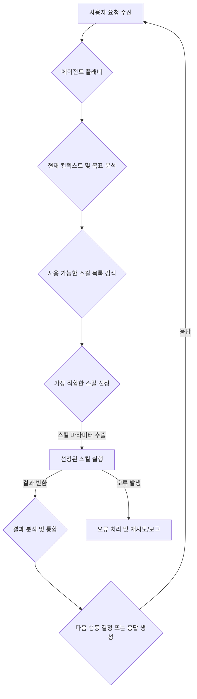

Matt Pocock의 'Skills For Real Engineers'에서 영감을 받아, Claude Code 에이전트의 하네스 내 스킬 정의 및 관리 체계를 고도화하는 접근 방식은 AI 에이전트가 단순한 '바이브 코딩'을 넘어 예측 가능하고 견고한 엔지니어링 도구로 기능하도록 만드는 핵심 전략입니다. 이 접근 방식은 에이전트의 행동을 표준화하고, 재사용 가능한 빌딩 블록을 제공하여 복잡한 태스크를 효율적으로 처리할 수 있도록 돕습니다.

## 에이전트 스킬셋의 중요성

전통적인 소프트웨어 개발에서 함수나 모듈이 코드의 재사용성과 유지보수성을 높이듯, AI 에이전트에게 '스킬'은 특정 목적을 수행하는 독립적인 기능을 의미합니다. 효과적인 스킬셋은 다음과 같은 이점을 제공합니다.

1.  **예측 가능성 및 신뢰성**: 잘 정의된 스킬은 특정 입력에 대해 일관된 출력을 보장하여 에이전트의 행동을 예측 가능하게 만듭니다.
2.  **재사용성**: 한 번 정의된 스킬은 다양한 컨텍스트와 태스크에서 재사용될 수 있어 개발 시간과 리소스를 절약합니다.
3.  **유지보수성**: 스킬별로 기능을 분리하면 특정 기능의 변경이 다른 에이전트 행동에 미치는 영향을 최소화하고 디버깅을 용이하게 합니다.
4.  **확장성**: 새로운 기능 요구사항이 발생할 때 기존 스킬에 영향을 주지 않고 새로운 스킬을 추가하거나 기존 스킬을 개선하기 용이합니다.
5.  **할루시네이션 감소**: 명확한 스킬 정의는 에이전트가 허위 정보를 생성하거나 비논리적인 행동을 하는 경향을 줄입니다.

## Claude Code 하네스 내 스킬 정의 및 관리 체계

Claude Code 하네스 내에서 스킬을 효과적으로 정의하고 관리하기 위해서는 구조화된 접근 방식이 필요합니다. 이는 스킬의 메타데이터, 구현 로직, 그리고 호출 프로토콜을 포함합니다.

### 스킬 정의 템플릿

각 스킬은 다음과 같은 구성 요소를 포함하는 JSON 또는 YAML 형식으로 정의될 수 있습니다.

```json
{
  "skill_id": "code_refactor_function",
  "name": "코드 함수 리팩토링",
  "description": "주어진 코드 스니펫에서 특정 함수를 명확성, 효율성, 가독성 측면에서 리팩토링합니다.",
  "parameters": [
    {
      "name": "code_snippet",
      "type": "string",
      "description": "리팩토링할 코드 스니펫",
      "required": true
    },
    {
      "name": "function_name",
      "type": "string",
      "description": "리팩토링할 함수의 이름",
      "required": true
    },
    {
      "name": "optimization_goal",
      "type": "enum",
      "values": ["readability", "performance", "maintainability"],
      "description": "리팩토링의 주요 목표",
      "required": false,
      "default": "readability"
    }
  ],
  "pre_conditions": [
    "`code_snippet`은 유효한 프로그래밍 언어의 구문이어야 함",
    "`function_name`은 `code_snippet` 내에 존재해야 함"
  ],
  "post_conditions": [
    "리팩토링된 코드는 기능적으로 원본과 동일해야 함",
    "리팩토링 목표(`optimization_goal`)에 부합하는 개선이 이루어져야 함"
  ],
  "implementation": {
    "type": "prompt_template",
    "template": """Given the following code snippet: `{code_snippet}`\nRefactor the function named `{function_name}` with a primary goal of `{optimization_goal}`. Provide the refactored code and a brief explanation of the changes."""
  },
  "version": "1.0.0"
}
```

이 템플릿은 스킬의 기능, 입력/출력, 제약 조건, 그리고 실제 실행 로직을 명확히 합니다. `implementation` 필드는 직접 코드 실행 스크립트를 참조하거나, 위 예시처럼 프롬프트 템플릿을 포함할 수 있습니다.

### 스킬 선택 및 실행 흐름

에이전트가 사용자 요청을 받아 스킬을 실행하는 일반적인 흐름은 다음과 같습니다.



2026년에는 스킬 선정 단계에서 LLM이 단순히 이름/설명을 매칭하는 것을 넘어, 스킬의 내부 로직, 잠재적 부작용, 그리고 과거 실행 데이터를 기반으로 가장 '안전하고' '효율적인' 스킬을 동적으로 판단하는 고급 추론 능력이 통합될 것입니다. 또한, 스킬 자체가 필요에 따라 다른 스킬을 동적으로 생성하거나 조합하는 `Self-Evolving Playbooks` 개념이 확산될 것입니다.

### 코드 예제: Python을 이용한 스킬 실행 관리

Claude Code 하네스에서는 Python 라이브러리를 통해 스킬을 로드하고 실행할 수 있습니다.

```python
import json
import os

class AgentSkillManager:
    def __init__(self, skill_dir="skills"):
        self.skills = {}
        self._load_skills(skill_dir)

    def _load_skills(self, skill_dir):
        for filename in os.listdir(skill_dir):
            if filename.endswith(".json"):
                filepath = os.path.join(skill_dir, filename)
                with open(filepath, 'r', encoding='utf-8') as f:
                    skill_data = json.load(f)
                    self.skills[skill_data["skill_id"]] = skill_data
        print(f"Loaded {len(self.skills)} skills.")

    def get_skill(self, skill_id):
        return self.skills.get(skill_id)

    def execute_skill(self, skill_id, params):
        skill = self.get_skill(skill_id)
        if not skill:
            raise ValueError(f"Skill '{skill_id}' not found.")

        # 여기에 실제 스킬 실행 로직 (예: LLM API 호출, 외부 도구 실행) 포함
        # 현재 예시에서는 프롬프트 템플릿을 사용
        if skill["implementation"]["type"] == "prompt_template":
            template = skill["implementation"]["template"]
            # 파라미터 검증 (간단화)
            for p_def in skill["parameters"]:
                if p_def["required"] and p_def["name"] not in params:
                    raise ValueError(f"Missing required parameter: {p_def["name"]}")
                if p_def["name"] not in params and "default" in p_def:
                    params[p_def["name"]] = p_def["default"]
            
            # 템플릿 렌더링 (주의: 중괄호 {} 처리)
            formatted_prompt = template.format(**params)
            print(f"Executing skill '{skill_id}' with prompt:\n{formatted_prompt}")
            # 실제 LLM API 호출은 여기에 통합
            return f"LLM Output for: " + formatted_prompt[:50] + "..."
        else:
            raise NotImplementedError("Only prompt_template implementation is supported for now.")

# 스킬 정의 파일을 'skills' 디렉토리에 저장했다고 가정
# 예시: 'skills/code_refactor_function.json' 파일에 위 JSON 스킬 정의 저장

# manager = AgentSkillManager()
# try:
#     result = manager.execute_skill(
#         "code_refactor_function",
#         {
#             "code_snippet": "def calculate_sum(a, b): return a + b",
#             "function_name": "calculate_sum",
#             "optimization_goal": "readability"
#         }
#     )
#     print(result)
# except ValueError as e:
#     print(f"Error: {e}")
```

이 예제는 스킬을 로드하고, 주어진 `skill_id`와 `params`를 기반으로 스킬을 실행하는 기본 구조를 보여줍니다. 실제 프로덕션 환경에서는 `execute_skill` 내부에 Claude API 호출, 외부 도구 통합 (예: 검색, 코드 실행 환경), 그리고 강력한 파라미터 검증 로직이 포함될 것입니다.

## 트레이드오프

### 1. 스킬 구조화의 엄격성 (Strict Skill Structuring) vs. 프롬프트 유연성 (Prompt Flexibility)

*   **언제 좋은가 (Good When)**: 에이전트의 행동이 예측 가능하고 반복적인 태스크에 적합하며, 안전성과 일관성이 최우선일 때 좋습니다. 특히 비즈니스 로직과 같이 변경에 민감한 영역에서 유용합니다.
*   **언제 나쁜가 (Bad When)**: 탐색적이거나 창의적인 작업, 혹은 빠르게 변화하는 요구사항에 맞춰 즉흥적인 대응이 필요할 때 에이전트의 유연성과 창의성을 제한할 수 있습니다. 과도한 구조화는 개발 오버헤드를 증가시킵니다.

### 2. 중앙 집중식 스킬 플레이북 (Centralized Playbook) vs. 분산형 스킬 모듈 (Decentralized Skill Modules)

*   **언제 좋은가 (Good When)**: 조직 내 모든 에이전트가 일관된 행동 규약을 따르고, 스킬 버전 관리 및 배포가 단일 지점에서 관리될 때 효율적입니다. 보안 및 감사에 용이합니다.
*   **언제 나쁜가 (Bad When)**: 다양한 팀이나 프로젝트가 독립적으로 스킬을 개발하고 배포해야 할 때 병목 현상을 유발할 수 있습니다. 특정 도메인에 특화된 스킬의 빠른 도입이 어려울 수 있습니다.

### 3. 인간 정의 스킬 (Human-defined Skills) vs. AI 생성 스킬 (AI-generated Skills)

*   **언제 좋은가 (Good When)**: 초기 스킬셋 구축 시 비즈니스 규칙, 안전 제약 조건, 핵심 도메인 지식을 정확하게 반영해야 할 때 좋습니다. 안정성과 신뢰성 확보에 필수적입니다.
*   **언제 나쁜가 (Bad When)**: 스킬셋의 규모가 매우 커지거나 새로운 사용 패턴에 대한 동적인 적응이 필요할 때, 인간의 수작업으로는 확장성이 떨어집니다. AI가 발견할 수 있는 새로운 최적화나 패턴을 놓칠 수 있습니다.

### 4. 엄격한 타입 힌팅 및 검증 (Strict Type-Hinting and Validation) vs. 유연한 입력 처리 (Lenient Input Handling)

*   **언제 좋은가 (Good When)**: 스킬의 견고성을 높이고 런타임 오류를 최소화하며, 에이전트의 오작동 가능성을 줄여야 할 때 좋습니다. 특히 데이터 무결성이 중요한 경우에 필수적입니다.
*   **언제 나쁜가 (Bad When)**: LLM의 자연어 기반 입력 특성을 과도하게 제한하여 에이전트의 유연성과 대화 능력을 저해할 수 있습니다. 초기 개발 단계에서 빠른 프로토타이핑을 방해할 수 있습니다.

## 실전 체크리스트

프로젝트에 Claude Code 하네스 스킬셋 강화 전략을 적용하기 위한 체크리스트입니다.

- [ ] **스킬 명세 표준화**: 모든 스킬이 `skill_id`, `name`, `description`, `parameters`, `pre_conditions`, `post_conditions`, `implementation` 필드를 포함하는 표준화된 JSON/YAML 스키마를 따르는지 확인.
- [ ] **스킬 라이브러리 구축**: 정의된 스킬들을 중앙에서 관리하고 검색할 수 있는 스킬 라이브러리 (예: Git 저장소, 내부 데이터베이스)를 구축했는지 확인.
- [ ] **자동화된 스킬 테스트**: 각 스킬의 기능적 정확성, 성능, 그리고 안정성을 검증하는 단위 테스트 및 통합 테스트를 자동화했는지 확인.
- [ ] **런타임 파라미터 검증**: 스킬 실행 시 LLM이 추출한 파라미터가 스킬 정의에 명시된 타입, 필수 여부, 값 범위 등을 준수하는지 런타임에 검증하는 로직을 구현했는지 확인.
- [ ] **스킬 버전 관리**: 스킬의 변경 사항을 추적하고 롤백할 수 있도록 Git과 같은 버전 관리 시스템을 활용하며, 각 스킬 정의에 `version` 필드를 포함했는지 확인.
- [ ] **성능 및 비용 모니터링**: 스킬 실행에 소요되는 시간, 토큰 사용량, API 호출 비용 등을 모니터링하여 최적화 기회를 식별할 수 있는 대시보드를 구축했는지 확인.
- [ ] **피드백 루프 통합**: 에이전트의 스킬 사용 결과에 대한 인간 피드백을 수집하고, 이를 스킬 개선에 반영하는 체계 (human-in-the-loop)를 마련했는지 확인.
- [ ] **보안 및 접근 제어**: 민감한 정보에 접근하거나 외부 시스템을 제어하는 스킬에 대해 적절한 인증 및 인가 메커니즘을 적용했는지 확인.