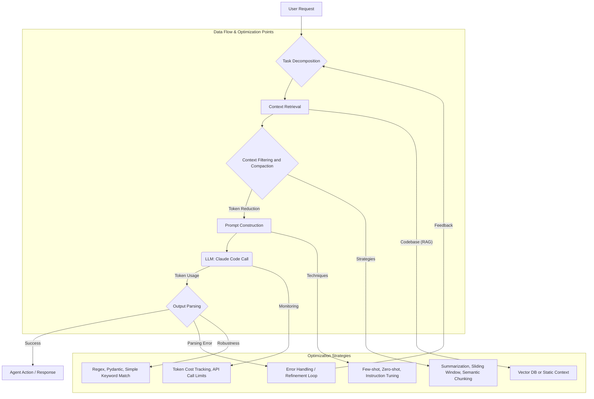

LLM 기반 코딩 에이전트의 효율성은 하네스 설계에 크게 좌우됩니다. 'HarnessTax' 연구에서 밝혀졌듯이, 동일한 LLM 모델이라도 하네스 구현에 따라 작업 성공률은 비슷하지만 토큰 비용은 최대 5배까지 차이 날 수 있습니다. 특히 "Pi"와 같은 단순한 하네스가 비용 효율성 측면에서 경쟁력을 갖는다는 점은 Claude Code 하네스 설계 시 토큰 효율성 최적화의 중요성을 강조합니다. 본 문서는 Claude Code 하네스의 프롬프트 구조, 컨텍스트 주입 방식, 출력 파싱 전략이 토큰 사용량과 성공률에 미치는 영향을 분석하고 최적화 방안을 제시합니다.

## Claude Code 하네스 핵심 구성 요소와 토큰 효율성

Claude Code 하네스는 기본적으로 LLM과 외부 환경(코드베이스, 파일 시스템, 터미널 등) 간의 상호작용을 중개하는 계층입니다. 이 계층의 설계는 LLM 호출당 소모되는 토큰량과 작업 성공률에 결정적인 영향을 미칩니다.

### 프롬프트 구조 (Prompt Structure)

프롬프트는 LLM에 전달되는 지시문, 컨텍스트, 예제 등으로 구성됩니다. 과도하게 상세하거나 중복된 정보, 비효율적인 지시문은 불필요한 토큰 낭비를 초래합니다. 시스템 프롬프트, 사용자 프롬프트, 그리고 에이전트가 사용하는 툴(Tool) 정의 방식 모두 토큰 효율성에 영향을 줍니다.

```python
# 비효율적인 프롬프트 예시
SYSTEM_PROMPT_INEFFICIENT = """
You are an expert Python developer. Your goal is to write code.
Always follow best practices. Be concise.
"""

USER_PROMPT_INEFFICIENT = """
I need a function to calculate the factorial of a number. Make sure it's efficient.
Please provide the Python code. Remember to handle edge cases.
"""

# 효율적인 프롬프트 예시
SYSTEM_PROMPT_EFFICIENT = """
You are a Python code generation agent. Output only Python code.
"""

USER_PROMPT_EFFICIENT = """
Generate a Python function `factorial(n)` that calculates the factorial of a non-negative integer `n`. Include docstrings and handle `n=0`.
"""
```

### 컨텍스트 주입 방식 (Context Injection)

LLM이 문제를 해결하기 위해 필요한 정보(코드 스니펫, 에러 로그, 문서 등)를 프롬프트에 포함시키는 방식입니다. RAG (Retrieval-Augmented Generation) 패턴을 통해 관련성 높은 정보만 주입하는 것이 일반적이지만, 주입되는 컨텍스트의 양과 품질이 토큰 사용량에 직결됩니다.

*   **Sliding Window**: 대화 기록 중 최신 부분만 유지하여 컨텍스트 창 크기를 제한합니다.
*   **Summarization**: 과거 대화나 코드 블록을 요약하여 토큰을 절약합니다.
*   **Semantic Search**: 코드베이스에서 의미론적으로 가장 관련 높은 코드 조각만 검색하여 주입합니다.

### 출력 파싱 전략 (Output Parsing Strategy)

LLM의 응답은 텍스트 형태이므로, 이를 에이전트가 이해하고 실행 가능한 명령으로 변환하는 파싱 과정이 필요합니다. 견고하지만 복잡한 파싱(예: 복잡한 JSON 스키마 강제)은 LLM이 원하는 형식으로 응답하기 위해 더 많은 토큰을 소모하거나 재시도 횟수를 늘릴 수 있습니다. "Pi" 하네스 사례처럼 단순한 `읽기`, `쓰기`, `편집`, `bash` 명령만 지원하는 것이 오히려 효율적일 수 있습니다.

```python
# 복잡한 JSON 스키마를 강제하는 프롬프트 지시
PROMPT_COMPLEX_PARSE = """
Your response MUST be a JSON object with the following structure:
{ "action": "<action_type>", "parameters": { "key": "value", ... }, "explanation": "<string>" }
Action types can be 'read_file', 'write_file', 'execute_bash'.
"""

# 단순한 출력 파싱을 위한 프롬프트 지시
PROMPT_SIMPLE_PARSE = """
Provide the next action. If you need to read a file, output: READ <filepath>
If you need to write, output: WRITE <filepath>\n<content>
If you need to execute bash, output: BASH <command>
"""
```

## Claude Code 하네스 정보 흐름 및 토큰 최적화 다이어그램

아래 Mermaid 다이어그램은 Claude Code 하네스 내에서 정보가 흐르고 토큰이 사용되는 과정을 시각화하여, 각 단계에서 토큰 효율성을 고려해야 하는 지점을 보여줍니다.



## 최적화 전략

### 1. 프롬프트 간결성 및 명확성 강화

*   **명확한 역할 정의**: 시스템 프롬프트에서 에이전트의 역할과 목표를 간결하고 명확하게 정의하여 불필요한 추론을 줄입니다.
*   **구조화된 지시**: LLM 응답에 필요한 형식을 구체적으로 지시하되, 너무 복잡한 스키마는 피합니다. (예: JSON 대신 간단한 XML 또는 커맨드 기반 형식).
*   **정보 압축**: 예제(few-shot)를 제공할 경우, 가장 핵심적인 예제만 포함하고 반복되는 설명은 제거합니다.

### 2. 동적 컨텍스트 관리

*   **JIT (Just-In-Time) 컨텍스트 주입**: 필요한 시점에 필요한 정보만 동적으로 검색하여 주입합니다. LLM에 모든 정보를 한 번에 제공하는 대신, 단계별로 관련 정보를 요청하고 주입합니다.
*   **컨텍스트 요약 및 필터링**: 긴 대화 기록이나 문서 블록은 관련 핵심 정보만 추출하여 요약한 후 프롬프트에 포함합니다. 비활성 코드는 주입하지 않도록 합니다.
*   **토큰 버짓 설정**: 각 LLM 호출에 대한 최대 토큰 사용량을 설정하고, 이를 초과할 경우 컨텍스트를 강제로 축소하거나 요약하는 로직을 구현합니다.

### 3. 출력 파싱 단순화 및 견고성 확보

*   **단순한 출력 형식 선호**: "Pi" 하네스처럼 LLM이 예측하기 쉬운 `ACTION: ARGUMENTS` 형태의 단순한 응답 형식을 유도합니다. 이는 LLM이 형식에 맞추기 위한 내부적인 시도 횟수를 줄여 토큰을 절약합니다.
*   **재시도 로직 강화**: 파싱 실패 시, LLM에 오류를 정확히 알리고 재시도를 요청하는 메커니즘을 구현합니다. 이 과정에서 불필요한 컨텍스트 재전송을 피하고, 오류 관련 정보만 전달합니다.

### 4. 코드 블록 및 파일 시스템 상호작용 최적화

*   **Change-Only Context**: 코드 수정 시, 전체 파일 대신 변경된 코드 블록과 주변 컨텍스트만 제공합니다.
*   **Code Graph Integration**: 코드의 의존성 및 구조 정보를 활용하여, 특정 문제 해결에 필요한 코드 부분만 정확히 식별하고 주입합니다.

## 트레이드오프

### 1. 공격적인 컨텍스트 요약/축소
*   **언제 좋은가**: 토큰 비용을 대폭 절감하고, LLM의 컨텍스트 창 제약이 클 때 (예: 구형 모델 또는 초거대 모델의 대규모 작업). 장기 실행 에이전트의 메모리 관리에도 유리합니다.
*   **언제 나쁜가**: 요약 과정에서 중요한 세부 정보가 손실될 위험이 있으며, 이는 LLM의 정확도나 문제 해결 능력을 저해할 수 있습니다. 특히 미묘한 버그 디버깅이나 복잡한 아키텍처 이해에 불리합니다.

### 2. 단순화된 출력 파싱 스키마
*   **언제 좋은가**: LLM이 일관된 형식으로 응답할 확률을 높여 파싱 성공률을 개선하고, LLM의 토큰 사용량을 줄입니다. 에이전트 로직 구현도 단순해집니다.
*   **언제 나쁜가**: 에이전트가 수행할 수 있는 작업의 복잡성과 다양성이 제한될 수 있습니다. 복잡한 다단계 작업이나 유연한 의사 결정이 필요한 경우, 표현력이 부족할 수 있습니다.

### 3. JIT (Just-In-Time) 컨텍스트 주입
*   **언제 좋은가**: LLM 호출당 토큰 비용을 최소화하고, 초기 프롬프트의 복잡성을 낮출 수 있습니다. 특히 대규모 코드베이스나 방대한 문서에서 필요한 정보만 추출할 때 효율적입니다.
*   **언제 나쁜가**: 컨텍스트 검색 및 필터링 과정에서 추가적인 지연 시간이 발생할 수 있으며, 관련성 낮은 정보를 가져오거나 중요한 정보를 누락할 경우 LLM의 성능 저하로 이어질 수 있습니다. RAG 시스템의 오버헤드가 발생합니다.

### 4. LLM 재시도 로직의 상세도
*   **언제 좋은가**: 파싱 실패나 잘못된 응답에 대해 LLM이 스스로 수정하도록 유도하여 에이전트의 견고성을 높입니다. 오류 메시지를 구체적으로 전달하여 LLM의 학습 및 개선에 기여할 수 있습니다.
*   **언제 나쁜가**: 반복적인 재시도는 전체 작업 시간을 늘리고, 재시도 프롬프트 자체에도 토큰이 소모되어 비용 효율성이 떨어질 수 있습니다. 무한 루프에 빠지거나 컨텍스트가 오염될 위험도 있습니다.

## 실전 체크리스트

Claude Code 하네스 최적화 시 다음 항목들을 검증합니다.

- [ ] **토큰 사용량 모니터링**: 각 LLM 호출의 입력/출력 토큰 수를 기록하고, 특정 작업에 대한 평균 토큰 비용을 주기적으로 분석하여 비효율적인 부분을 식별합니다.
- [ ] **프롬프트 A/B 테스트**: 여러 프롬프트 구조와 컨텍스트 주입 전략을 사용하여 동일한 작업에 대해 성공률과 토큰 비용을 비교 분석합니다.
- [ ] **컨텍스트 압축률 측정**: 컨텍스트 요약 또는 필터링 후 프롬프트에 포함되는 정보의 양이 원본 대비 얼마나 줄어들었는지 측정하고, 정보 손실 여부를 검증합니다.
- [ ] **출력 파싱 성공률**: LLM 응답에 대한 파싱 성공률을 측정하고, 실패 시 LLM에 제공되는 오류 메시지의 명확성과 재시도 로직의 효율성을 평가합니다.
- [ ] **"Pi" 벤치마킹**: 단순한 `읽기`, `쓰기`, `편집`, `bash` 명령만 사용하는 "Pi" 스타일 하네스를 구현하여 현재 복잡한 하네스의 비용 대비 성공률을 벤치마킹하고, 개선 목표를 수립합니다.
- [ ] **코드 그래프 기반 컨텍스트 주입**: 코드 그래프 또는 AST(Abstract Syntax Tree)를 활용하여 필요한 코드 블록만 선택적으로 주입하는 로직을 구현하고, 토큰 절감 효과를 측정합니다.
- [ ] **에이전트 스텝별 지연 시간 분석**: 각 에이전트 스텝(컨텍스트 검색, 프롬프트 생성, LLM 호출, 파싱)에서 발생하는 지연 시간을 분석하여 병목 현상을 식별하고 최적화 기회를 탐색합니다.