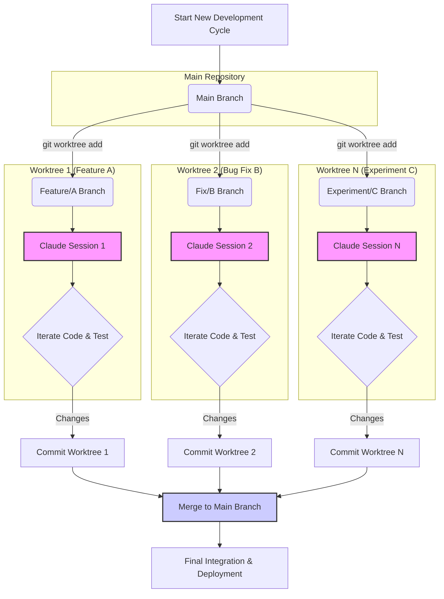

Claude Code와 같은 대규모 언어 모델(LLM) 기반의 코딩 에이전트를 활용한 제품 개발은 반복적이고 탐색적인 과정이 수반됩니다. 단일 세션으로 여러 가지 아이디어를 동시에 탐색하거나 복잡한 기능을 프로토타이핑하는 것은 비효율적이며, 컨텍스트 혼란을 야기할 수 있습니다. 2026년의 LLM 에이전트 개발 트렌드는 이러한 비효율성을 해소하고 개발 처리량(throughput)을 극대화하기 위한 병렬 워크플로 구축에 초점을 맞추고 있습니다. 특히, Claude Code 수석 디자이너의 실전 워크플로에서 영감을 받은 Git worktree 활용 전략은 에이전트 기반 개발의 새로운 표준을 제시합니다.

## Git Worktree를 활용한 병렬 세션 관리

Git worktree는 단일 Git 리포지토리의 여러 작업 복사본을 동시에 관리할 수 있게 해주는 기능입니다. 이를 활용하면 메인 브랜치에서 분리된 여러 개의 격리된 환경에서 동시에 다양한 Claude Code 세션을 실행할 수 있습니다. 각 worktree는 고유한 브랜치와 작업 디렉토리를 가지므로, 에이전트가 생성하는 코드, 임시 파일, 컨텍스트 등이 서로 섞이지 않고 독립적으로 관리됩니다. 이는 다음과 같은 이점을 제공합니다:

*   **컨텍스트 격리 (Context Isolation)**: 각 Claude 세션은 자신만의 clean한 작업 환경과 컨텍스트를 가집니다. 특정 기능 구현, 버그 수정, 성능 최적화 등 각기 다른 목적의 작업을 병렬로 진행할 때, 에이전트가 불필요하거나 잘못된 컨텍스트에 영향을 받을 위험을 최소화합니다.
*   **처리량 증대 (Increased Throughput)**: 여러 개발 작업을 동시에 진행함으로써 전체 개발 속도를 향상시킬 수 있습니다. 예를 들어, 한 worktree에서는 새로운 기능의 프로토타입을 만들고, 다른 worktree에서는 기존 코드의 리팩토링을 Claude Code에 지시할 수 있습니다.
*   **빠른 실험과 비교 (Rapid Experimentation and Comparison)**: 동일한 문제에 대해 여러 가지 접근 방식을 병렬로 탐색하고, 각 결과를 쉽게 비교하여 최적의 솔루션을 선택할 수 있습니다.

## 워크플로 구현 가이드라인

Git worktree 기반의 Claude Code 하네스 워크플로를 구축하기 위한 구체적인 단계는 다음과 같습니다.

### 1. Worktree 생성 및 초기화

메인 프로젝트 리포지토리에서 새로운 기능을 개발하거나 실험할 때마다 별도의 worktree를 생성합니다. 각 worktree는 특정 작업(task)에 대한 독립적인 브랜치를 기반으로 합니다.

```bash
# 현재 위치를 메인 리포지토리로 이동
cd /path/to/main/repo

# 새로운 기능 개발을 위한 worktree 생성
git worktree add -b feature/excalidraw-autocomplete ../worktrees/excalidraw-autocomplete main

# 버그 수정을 위한 worktree 생성
git worktree add -b fix/api-rate-limit ../worktrees/api-rate-limit main
```

### 2. Claude Code 세션 관리 및 컨텍스트 격리

각 worktree 내에서 Claude Code 세션을 시작하고, `claude-code-ctx-plugin`과 같은 도구를 활용하여 해당 세션의 컨텍스트를 지속적으로 관리합니다. 이 플러그인은 작업 디렉토리의 변경 사항, 코드 스니펫, 에이전트의 이전 대화 등을 자동으로 수집하고 업데이트하여, Claude가 항상 최신의 정확한 컨텍스트에서 작업하도록 돕습니다.

```bash
# excalidraw-autocomplete worktree로 이동
cd ../worktrees/excalidraw-autocomplete

# 해당 worktree에서 Claude Code 세션 시작
claude-code start --project-root . --context-plugin claude-code-ctx-plugin

# 또는 특정 스크립트를 통해 에이전트 실행
python -m my_agent_orchestrator --task-id excalidraw-autocomplete
```

### 3. 병렬 에이전트 작업 오케스트레이션

여러 worktree에서 실행되는 Claude 세션들을 효율적으로 관리하기 위해 간단한 오케스트레이션 스크립트나 도구를 활용할 수 있습니다. 이는 각 세션의 진행 상황을 모니터링하고, 필요에 따라 입력을 제공하며, 결과물을 수집하는 역할을 합니다.

```bash
#!/bin/bash

WORKTREES_DIR="../worktrees"

# Function to run Claude Code in a worktree
run_claude_in_worktree() {
    local worktree_name=$1
    local task_description=$2
    local branch_name=$3

    echo "Starting Claude Code for '$worktree_name' on branch '$branch_name'"
    cd "$WORKTREES_DIR/$worktree_name"
    git checkout "$branch_name"

    # Simulate Claude Code interaction or agent invocation
    echo "Working on task: $task_description"
    # Example: claude-code run --prompt "Implement the autocomplete feature for Excalidraw." &> "logs/${worktree_name}.log" &
    # For demonstration, just simulate work
    sleep 5
    echo "Task '$worktree_name' completed (simulated)."
    cd -
}

# Parallel tasks
run_claude_in_worktree "excalidraw-autocomplete" "Implement Excalidraw autocomplete" "feature/excalidraw-autocomplete" &
run_claude_in_worktree "api-rate-limit" "Fix API rate limit bug" "fix/api-rate-limit" &

wait # Wait for all background jobs to complete
echo "All parallel Claude Code sessions completed."
```

## 효율성 및 처리량 극대화 전략

병렬 워크플로의 효과를 극대화하기 위한 추가 전략입니다.

### 컨텍스트 엔지니어링 (Context Engineering)

각 worktree의 특정 태스크에 필요한 최소한의 컨텍스트만 제공하도록 프롬프트와 컨텍스트 플러그인을 최적화합니다. 불필요한 파일이나 과거 대화 기록을 필터링하여 토큰 사용량을 줄이고, 에이전트의 집중도를 높입니다. `context-engineering/claude-code-ctx-plugin-context-persistence`와 같은 패턴을 참조하여 세션 간 컨텍스트를 효과적으로 유지 및 활용하는 방법을 모색합니다.

### 자동화된 테스트 및 검증

Claude Code가 생성한 코드는 각 worktree 내에서 자동화된 테스트 파이프라인(예: CI/CD)을 통해 즉시 검증되어야 합니다. 이는 에이전트의 실수를 조기에 발견하고, 빠른 피드백 루프를 통해 수정 과정을 가속화합니다. `evaluation/claude-code-generation-validation-pipeline-extension`에서 영감을 얻을 수 있습니다.

### 프롬프트 엔지니어링 최적화

각 worktree의 목표에 맞춰 구체적이고 명확한 프롬프트를 설계합니다. 예를 들어, `prompt-engineering/llm-prompt-optimization-role-definition-constraint-design`에서 논의된 바와 같이, 에이전트의 역할과 제약 조건을 명확히 정의하여 의도된 방향으로 코드 생성을 유도합니다.

## Git Worktree 기반 Claude Code 워크플로



## 트레이드오프

Git worktree를 활용한 Claude Code 워크플로 최적화는 여러 장점을 제공하지만, 몇 가지 트레이드오프를 고려해야 합니다.

*   **격리된 환경 vs. 관리 오버헤드**:
    *   **언제 좋고**: 여러 독립적인 기능을 동시에 개발하거나, 브랜치 간의 충돌 위험을 최소화하며 실험적 코드를 다룰 때. 각 세션의 컨텍스트가 명확하게 분리되어 에이전트의 혼동을 줄일 수 있습니다.
    *   **언제 나쁜지**: 관리해야 할 worktree의 수가 지나치게 많아지면, 각 worktree의 동기화, 커밋, 병합 과정에서 추가적인 관리 오버헤드가 발생할 수 있습니다.

*   **병렬 처리량 증대 vs. 자원 소비**:
    *   **언제 좋고**: 멀티코어 시스템이나 충분한 메모리 자원을 활용하여 여러 Claude 세션을 동시에 실행함으로써 전체 개발 시간을 단축할 수 있을 때.
    *   **언제 나쁜지**: 시스템 자원(CPU, RAM, 디스크 공간)이 제한적이거나, 각 Claude Code 세션이 상당한 연산 자원을 요구할 경우, 병렬 실행이 오히려 시스템 성능 저하를 초래할 수 있습니다.

*   **신속한 프로토타이핑 vs. 일관성 유지**:
    *   **언제 좋고**: 다양한 아이디어를 빠르게 탐색하고, 최소 기능 제품(MVP)을 신속하게 만들어내야 할 때 효과적입니다. 실패 비용이 낮고 빠른 반복이 중요할 때 유리합니다.
    *   **언제 나쁜지**: 여러 worktree에서 생성된 코드를 메인 브랜치로 통합할 때, 코딩 스타일, 아키텍처 일관성, 의존성 관리 등에서 충돌이나 불일치가 발생할 수 있습니다. 통합 및 코드 리뷰 프로세스가 더 복잡해질 수 있습니다.

*   **독립적 개발 vs. 코드 중복 및 부채**: 
    *   **언제 좋고**: 각 태스크가 서로 밀접하게 연관되지 않고 독립적으로 진행될 수 있을 때 효율적입니다.
    *   **언제 나쁜지**: 동일한 유틸리티 함수나 컴포넌트가 여러 worktree에서 독립적으로 생성되어 코드 중복이 발생하거나, 기술 부채(technical debt)를 증가시킬 위험이 있습니다. 공통 유틸리티의 중앙 집중화 전략이 필요할 수 있습니다.

## 실전 체크리스트

Claude Code 하네스 워크플로에 Git worktree 전략을 적용할 때 다음 항목들을 검증하십시오.

*   [ ] **Worktree 생성 및 관리 자동화**: 새로운 기능이나 버그 수정 작업을 시작할 때 worktree를 자동으로 생성하고 초기화하는 스크립트를 구현했는가?
*   [ ] **컨텍스트 격리 검증**: 각 worktree의 Claude Code 세션이 독립적인 파일 시스템 컨텍스트에서 실행되며, 다른 worktree의 컨텍스트에 영향을 받지 않음을 확인했는가?
*   [ ] **병렬 세션 모니터링**: 여러 Claude Code 세션의 실행 상태, 로그, 자원 사용량을 실시간으로 모니터링할 수 있는 대시보드 또는 도구를 구축했는가?
*   [ ] **병렬 작업 결과 통합 전략**: 각 worktree에서 완성된 코드 변경 사항을 메인 브랜치로 안전하고 효율적으로 병합(merge)하는 프로세스(예: Squash & Merge, Rebase)를 정의하고 팀에 공유했는가?
*   [ ] **비용 최적화**: 여러 병렬 세션으로 인한 LLM API 사용량 증가를 관리하기 위한 비용 모니터링 및 할당 전략(예: `project-ops/claude-code-cost-optimization-strategies`)을 수립했는가?
*   [ ] **에이전트 역할 명확화**: 각 worktree의 Claude Code 에이전트에게 부여된 역할(role)과 목표(goal)가 명확하게 정의되어 있으며, 이들이 서로 다른 작업을 수행하도록 프롬프트가 최적화되었는가?
*   [ ] **변경 사항 동기화 전략**: 메인 브랜치의 업데이트 사항을 진행 중인 모든 worktree에 주기적으로 반영하여, 작업 중인 브랜치들이 너무 뒤쳐지지 않도록 하는 자동화된 동기화 메커니즘을 갖추었는가?