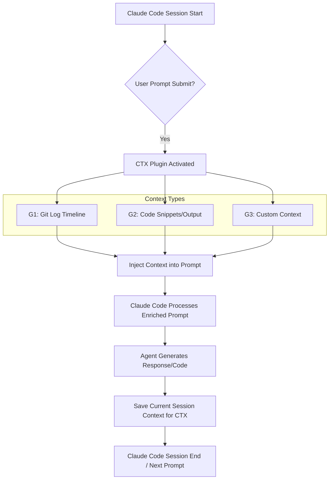

## Claude Code 세션 컨텍스트 지속성: CTX 플러그인을 활용한 메모리 관리

Claude Code 환경은 개발자들이 LLM 기반 에이전트와 상호작용하며 코드를 작성하고 디버깅하는 데 강력한 플랫폼을 제공한다. 그러나 기본적으로 각 세션은 독립적으로 운영되며, 세션이 종료되면 이전의 대화 내용, 코드 스니펫, 그리고 가장 중요한 의사결정 컨텍스트가 소실된다는 치명적인 한계가 존재한다. 이는 에이전트의 학습 능력과 연속적인 문제 해결 능력을 저해하며, 매번 새로운 세션마다 컨텍스트를 재주입해야 하는 비효율성을 초래한다.

CTX 플러그인은 이러한 문제를 해결하기 위해 설계된 강력한 도구로, Claude Code 세션 간에 컨텍스트 메모리를 자동으로 유지하고 주입한다. 2026년 기준, 에이전트의 자율성과 효율성을 극대화하는 것이 핵심 트렌드인 만큼, CTX와 같은 컨텍스트 지속성 메커니즘은 LLM 기반 개발 워크플로우의 필수 요소로 자리매김하고 있다.

### CTX 플러그인의 동작 원리

CTX 플러그인은 Claude Code의 내부 훅(hook)을 활용하여 `UserPromptSubmit` 이벤트가 발생할 때, 즉 사용자가 프롬프트를 제출하기 직전에 자동으로 컨텍스트를 주입한다. 이 과정은 1밀리초 이내에 이루어져 사용자 경험에 거의 영향을 미치지 않는다. 핵심적으로 다음 세 가지 유형의 컨텍스트를 통합하여 주입한다:

1.  **G1: Git Log 기반 의사결정 타임라인**: 프로젝트의 `git log` 데이터를 분석하여 과거의 의사결정 흐름과 그 배경을 LLM에 제공한다. 이는 '어제 왜 그 결정을 내렸는지'에 대한 맥락을 에이전트가 이해하도록 돕고, 기존 작업의 연장선상에서 보다 일관된 의사결정을 내릴 수 있게 한다. 이는 에이전트가 단순한 코드 생성기를 넘어 장기적인 프로젝트 관리와 복잡한 문제 해결에 기여하는 데 필수적이다.
2.  **G2: 이전 세션 코드 스니펫 및 출력**: 과거 세션에서 생성되었거나 실행되었던 코드 스니펫과 그 결과를 메모리화하여 주입한다. 이를 통해 에이전트는 이전에 시도했던 방식, 성공/실패했던 테스트 케이스 등을 기억하고, 불필요한 반복을 줄이며 효율적인 개발을 진행할 수 있다.
3.  **G3: 사용자 정의 지속성 컨텍스트**: 개발자가 명시적으로 지정한 중요 정보, 설정, 또는 특정 도메인 지식 등을 세션 간에 지속시킨다. 이는 에이전트가 특정 프로젝트의 고유한 요구사항이나 제약 조건을 항상 인지하도록 돕는다.

이러한 컨텍스트 주입 메커니즘은 에이전트의 `lesson/error dispatch` 처리 능력을 획기적으로 강화한다. 과거의 실패 경험을 기억하고, 이를 바탕으로 새로운 해결책을 모색하며, 결국에는 `Self-Correction` 및 `Self-Improvement` 루프를 보다 효과적으로 실행할 수 있게 된다.



### CTX 플러그인 설치 및 활용 예제

CTX 플러그인은 `pip install` 또는 Claude Code 환경 내 `/plugin install` 명령어를 통해 쉽게 설치할 수 있다. 다음은 Python 환경에서 CTX를 활용하여 Claude Code 세션 간 컨텍스트를 유지하는 간단한 예제이다.

```python
# Assuming CTX is installed and configured to connect to Claude Code session
import os
import ctx_plugin # This module provides the necessary hooks and context management

# Initialize CTX (usually done implicitly by Claude Code environment upon plugin install)
# For demonstration, we simulate context injection.

def simulate_claude_code_session(prompt: str, session_id: str):
    print(f"--- Session: {session_id} ---")

    # CTX would automatically inject context here before actual LLM call
    # For simulation, let's assume CTX provides this.
    injected_context = ctx_plugin.get_current_context(session_id)
    print(f"Injected Context (simulated): {injected_context}")

    # Simulate LLM processing
    full_prompt = f"Previous context: {injected_context}\n\nUser request: {prompt}"
    print(f"Full prompt sent to LLM:\n{full_prompt}\n")

    # Simulate LLM response
    response = f"Agent response for '{prompt}' based on context. "
    if "git log" in injected_context:
        response += "Acknowledging recent commit history. "
    if "previous_code" in injected_context:
        response += "Referencing previous code execution results. "
    response += "New code generated or action taken."

    print(f"Agent Response: {response}")

    # CTX would automatically save relevant new context from this session
    new_context_data = {
        "last_prompt": prompt,
        "last_response": response,
        "new_code_fragment": "def calculate_sum(a, b): return a + b",
        "relevant_git_info": "Updated 'feature-x' branch."
    }
    ctx_plugin.save_session_context(session_id, new_context_data)
    print(f"Context saved for session {session_id}.\n")

# --- First Session ---
print("Running first Claude Code session...")
simulate_claude_code_session(
    prompt="Can you refine the sum calculation logic from yesterday's commit?",
    session_id="project-alpha-dev-001"
)

# --- Second Session (simulating reopening Claude Code after some time) ---
print("Running second Claude Code session...")
simulate_claude_code_session(
    prompt="Based on the new `calculate_sum` function, write a unit test.",
    session_id="project-alpha-dev-001"
)

# Example of CTX plugin internal logic (simplified)
class CTXPlugin:
    _session_memory = {}

    def get_current_context(self, session_id: str):
        # Simulate fetching git log, previous code, etc.
        # In a real scenario, this would interact with git and Claude Code history APIs.
        git_log_timeline = "git log -10 --pretty=format:'%h - %an, %ar : %s'"
        if session_id in self._session_memory:
            return {
                "git_log": git_log_timeline,
                "previous_code": self._session_memory[session_id].get("new_code_fragment", ""),
                "custom_data": {"project_owner": "Team Alpha"},
                "last_interaction": self._session_memory[session_id].get("last_prompt", "N/A")
            }
        return {
            "git_log": git_log_timeline,
            "previous_code": "",
            "custom_data": {"project_owner": "Team Alpha"},
            "last_interaction": "No previous interaction"
        }

    def save_session_context(self, session_id: str, context_data: dict):
        self._session_memory[session_id] = context_data

# Mock the plugin for the example
ctx_plugin = CTXPlugin()
```

### 2026년 에이전트 개발 트렌드와 CTX의 역할

2026년, LLM 에이전트는 점차 더 자율적이고 복잡한 엔지니어링 작업을 수행할 것으로 예상된다. 이러한 추세 속에서 CTX와 같은 컨텍스트 지속성 솔루션은 다음과 같은 핵심적인 역할을 수행한다:

*   **장기적 에이전트 메모리**: 단기 기억에 의존하는 기존 LLM의 한계를 넘어, 에이전트가 여러 세션과 작업 주기에 걸쳐 장기적인 기억을 유지하도록 돕는다. 이는 지속적인 학습과 문제 해결 능력으로 이어진다.
*   **복잡한 프로젝트 관리**: 수많은 파일과 변경 이력이 얽혀 있는 대규모 프로젝트에서 에이전트가 일관성 있는 코드를 작성하고 아키텍처 결정을 내릴 수 있도록 지원한다. `git log` 기반 타임라인 주입은 특히 이 부분에서 강력한 이점을 제공한다.
*   **개발자 생산성 향상**: 개발자가 매번 동일한 컨텍스트를 반복적으로 제공할 필요 없이, 에이전트가 이전 작업을 자동으로 이어받아 진행하므로 생산성이 크게 향상된다.
*   **에러 디버깅 및 회귀 방지**: 과거의 에러 패턴과 해결책을 기억함으로써 에이전트가 유사한 문제에 직면했을 때 더 빠르게 진단하고, 과거의 실패로 인한 회귀를 방지하는 데 기여한다.

## 트레이드오프

CTX 플러그인과 같은 컨텍스트 지속성 메커니즘을 도입할 때는 다음과 같은 장단점을 고려해야 한다.

*   **장점: 에이전트의 연속성 및 효율성 증가**
    *   **언제 좋은가**: 장기 프로젝트, 복잡한 코드 베이스, 여러 세션에 걸쳐 진행되는 태스크에 매우 효과적이다. 에이전트가 과거의 결정과 코드를 기억하므로 반복 작업 및 컨텍스트 재주입 시간을 단축하여 개발 효율을 크게 향상시킨다.
    *   **언제 나쁜가**: 일회성, 단순 질의 응답, 또는 각 세션이 완전히 독립적인 환경에서는 오버헤드만 증가시킬 수 있다. 불필요하게 많은 컨텍스트를 유지하는 것은 오히려 혼란을 초래할 수도 있다.

*   **장점: 의사결정 일관성 및 품질 향상**
    *   **언제 좋은가**: 프로젝트의 히스토리, `git log` 기반 의사결정 타임라인, 이전 코드 변경 사항을 바탕으로 에이전트가 더 맥락에 맞는, 일관성 있고 고품질의 코드를 생성할 때 유리하다. 특히 팀 작업에서 다른 개발자의 의도를 빠르게 파악해야 할 때 유용하다.
    *   **언제 나쁜가**: 새로운 접근 방식이나 창의적인 아이디어가 요구되는 태스크에서는 과거의 컨텍스트가 '고정관념'처럼 작용하여 에이전트의 발상을 제한할 수 있다.

*   **단점: 컨텍스트 관리 복잡성 및 비용 증가**
    *   **언제 좋은가**: CTX와 같은 플러그인은 컨텍스트 관리를 자동화하여 개발자의 부담을 줄여준다.
    *   **언제 나쁜가**: 지속적인 컨텍스트 저장은 추가적인 스토리지 및 처리 비용을 발생시킨다. 특히 대량의 `git log`나 코드 스니펫을 저장할 경우, 비용 효율적인 컨텍스트 필터링 및 압축 전략이 필요하다. 또한, 너무 많은 컨텍스트는 LLM의 컨텍스트 윈도우 한계를 초과하거나, 프롬프트 길이가 길어져 토큰 비용을 증가시킬 수 있다.

*   **단점: 데이터 보안 및 프라이버시 문제**
    *   **언제 좋은가**: 내부 개발 환경이나 신뢰할 수 있는 프라이빗 클라우드 환경에서 사용될 때, 컨텍스트 데이터는 안전하게 관리될 수 있다.
    *   **언제 나쁜가**: 민감한 정보(PII, 기밀 코드)가 컨텍스트에 포함되어 세션 간에 지속될 경우, 데이터 유출 또는 보안 위협에 노출될 위험이 있다. 엄격한 데이터 필터링, 암호화, 접근 제어 메커니즘이 필수적이다. `sentry-pii-scrubbing-beforesend`와 같은 기술이 중요해진다.

## 실전 체크리스트

CTX 플러그인 또는 유사한 컨텍스트 지속성 메커니즘을 프로젝트에 통합할 때 다음 사항을 검증해야 한다.

*   [ ] **컨텍스트 필터링 전략 정의**: 세션 간에 지속되어야 할 핵심 컨텍스트(G1, G2, G3)의 범위를 명확히 정의하고, 불필요하거나 민감한 정보는 제외하는 필터링 메커니즘이 구현되었는가?
*   [ ] **성능 오버헤드 측정**: 컨텍스트 주입 및 저장 과정이 LLM 응답 시간 및 전체 개발 워크플로우에 미치는 성능 오버헤드를 측정하고, 허용 가능한 범위 내에 있는가?
*   [ ] **비용 최적화**: 지속성 컨텍스트의 저장량 및 LLM 프롬프트 길이 증가에 따른 토큰 비용 증가를 모니터링하고, 효율적인 컨텍스트 압축 또는 요약 전략이 적용되었는가?
*   [ ] **데이터 보안 및 접근 제어**: 저장되는 컨텍스트 데이터에 대한 암호화, 접근 제어, 그리고 PII/민감 정보 스크러빙(scrubbing) 메커니즘이 충분히 강력하게 구현되었는가? (예: `sentry-pii-scrubbing-beforesend` 통합 여부)
*   [ ] **에이전트 의사결정 일관성 검증**: 컨텍스트 지속성 적용 후, 에이전트가 여러 세션에 걸쳐 일관성 있고 맥락에 맞는 의사결정을 내리는지 정량적/정성적으로 평가하는 방법론이 마련되었는가? (`llm-output-validation-quality-metrics-design` 참조)
*   [ ] **Git 통합 안정성**: `git log` 기반의 컨텍스트 주입이 다양한 Git 리포지토리 상태(rebase, merge, detached HEAD 등)에서도 안정적으로 동작하며 정확한 타임라인을 제공하는가?
*   [ ] **오류 처리 및 복구**: 컨텍스트 저장 또는 주입 과정에서 오류 발생 시, 에이전트가 적절히 대응하고 컨텍스트 손실 없이 복구할 수 있는 메커니즘이 존재하는가?
*   [ ] **사용자 피드백 루프**: 개발자가 에이전트가 주입된 컨텍스트를 어떻게 활용하고 있는지 시각적으로 확인하고, 필요한 경우 컨텍스트를 수동으로 수정하거나 재정의할 수 있는 UI/UX 요소가 제공되는가? (`frontend-ai/claude-code-session-web-mobile-monitoring-implementation` 고려)