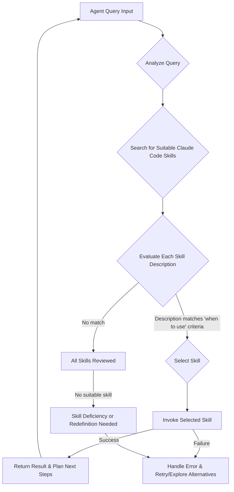

Claude Code 스킬 패턴은 AI 에이전트의 반복 작업을 재사용 가능한 함수로 추상화하여 효율성과 정확도를 극대화하는 핵심 요소입니다. 특히 Claude의 'Tool Use' 기능과 연동될 때, 스킬 `description`의 설계 방식은 에이전트의 의사결정 품질에 결정적인 영향을 미칩니다. 이 엔트리는 Claude Code 스킬의 효과적인 설계 원칙, 특히 스킬 `description`을 단순히 설명문이 아닌 '트리거(Trigger)'로 활용하여 에이전트가 적시에 올바른 스킬을 선택하도록 유도하는 방법에 대해 다룹니다.

## 스킬 `description`을 트리거로 최적화

기존 스킬 설계에서는 `description` 필드에 해당 스킬이 "무엇을 하는가(What it does)"에 초점을 맞췄습니다. 그러나 Claude Code 에이전트의 관점에서 `description`은 에이전트가 현재 태스크를 해결하기 위해 "언제 이 스킬을 사용해야 하는가(When to use it)"에 대한 명확한 지침을 제공해야 합니다. 이는 에이전트의 의사결정 로직에 직접적인 신호로 작용하여 불필요한 스킬 호출을 줄이고, 정확한 태스크 수행을 가능하게 합니다.

### 트리거 기반 `description` 작성 원칙

1.  **조건 명시**: 스킬이 호출되어야 할 특정 조건이나 상황을 명확히 제시합니다.
2.  **의도 기반**: 에이전트의 현재 의도(intent)와 스킬의 목적이 일치하는 경우를 기술합니다.
3.  **결과 예측**: 스킬 실행 후 얻을 수 있는 예상 결과를 간략히 언급합니다.
4.  **불필요한 설명 제거**: 스킬의 내부 구현이나 기능 나열은 피합니다.

예: "사용자의 이메일 주소를 받아 데이터베이스에 저장하는 스킬" 대신 "사용자의 이메일 가입 요청이 있고 유효한 이메일 주소를 확보했을 때, 해당 이메일을 사용자 데이터베이스에 저장해야 할 경우 사용"으로 작성합니다.

```go
package main

import (
	"fmt"
	"strings"
)

// Skill represents a Claude Code skill.
type Skill struct {
	Name        string
	Description string // Focuses on "when to use"
	Function    func(args map[string]interface{}) (string, error)
}

// AgentDecisionSystem simulates simplified agent skill selection.
func AgentDecisionSystem(query string, skills []Skill) (Skill, error) {
	for _, skill := range skills {
		if strings.Contains(strings.ToLower(query), strings.ToLower(skill.Description)) || 
		   strings.Contains(strings.ToLower(skill.Description), strings.ToLower(query)) {
			return skill, nil
		}
	}
	return Skill{}, fmt.Errorf("no suitable skill found")
}

func createUser(args map[string]interface{}) (string, error) {
	email, ok := args["email"].(string)
	if !ok || email == "" { return "", fmt.Errorf("missing 'email'") }
	return fmt.Sprintf("User with email %s created.", email), nil
}

func fetchProductInfo(args map[string]interface{}) (string, error) {
	productID, ok := args["productID"].(string)
	if !ok || productID == "" { return "", fmt.Errorf("missing 'productID'") }
	return fmt.Sprintf("Fetched info for product ID %s.", productID), nil
}

func main() {
	skills := []Skill{
		{
			Name:        "CreateUserAccount",
			Description: "새로운 사용자 계정을 이메일 주소로 생성해야 할 때 사용합니다. 유효한 이메일 입력이 필요합니다.",
			Function:    createUser,
		},
		{
			Name:        "GetProductDetails",
			Description: "특정 상품의 상세 정보를 조회해야 할 때 사용합니다. 상품 ID 입력이 필요합니다.",
			Function:    fetchProductInfo,
		},
	}

	query1 := "새로운 이메일로 사용자 등록을 하고 싶어요."
	skill, err := AgentDecisionSystem(query1, skills)
	if err == nil {
		fmt.Printf("Selected Skill: %s\n", skill.Name)
		result, _ := skill.Function(map[string]interface{}{"email": "test@example.com"})
		fmt.Println("Result:", result)
	} else { fmt.Println(err) }
	fmt.Println("---")
}
```

## 에이전트의 스킬 선택 플로우



## 2026년 최신 트렌드 반영

2026년에는 AI 에이전트의 자율성(Autonomy)과 다중 에이전트 시스템(Multi-Agent Systems)이 고도화됩니다. Claude Code 스킬 패턴 최적화는 에이전트가 복잡한 태스크를 효율적으로 처리하고 다양한 도메인 지식을 활용하는 데 필수적입니다. 스킬 `description`을 트리거로 활용하는 방식은 동적인 스킬 디스커버리(Dynamic Skill Discovery)와 자가 개선(Self-Improvement) 에이전트의 기반이 되어, 에이전트가 새로운 상황에 유연하게 대처하고 스스로 스킬 사용 전략을 학습하는 데 기여합니다.

## 트레이드오프

### 1. 스킬 세분화(Granularity) vs. 관리 오버헤드(Management Overhead)
- **언제 좋고**: 미세 작업에 높은 정확도와 재사용성을 제공합니다.
- **언제 나쁜지**: 스킬 수 증가로 관리 오버헤드와 에이전트 추론 비용이 늘어납니다.

### 2. `description` 명시성(Explicitness) vs. 유연성(Flexibility)
- **언제 좋고**: 스킬 선택 정확도를 높이고 예측 가능한 동작을 유도합니다.
- **언제 나쁜지**: 지나친 명시성은 예상치 못한 유사 상황에서의 스킬 활용을 제한하여 유연성을 저해합니다.

### 3. `description` 트리거 방식(Trigger-based Description) vs. 순수 Semantic Matching
- **언제 좋고**: 명확한 사용 지침을 제공하여 특정 조건에서의 스킬 호출 의도성을 높입니다 (중요 비즈니스 로직에 적합).
- **언제 나쁜지**: 에이전트 자율적 판단 범위가 제한되며, 키워드 의존성이 높아 숨겨진 의미 파악 능력이 저하될 수 있습니다.

## 실전 체크리스트

프로젝트에 Claude Code 스킬 패턴을 적용 및 최적화할 때 다음 항목들을 검증합니다.

- [ ] **기존 스킬 `description` 감사**: 모든 Claude Code 스킬 `description`이 '언제 사용하는가'에 초점을 맞추어 작성되었는지 검토 및 수정.
- [ ] **스킬 의사결정 로깅 활성화**: 에이전트 스킬 선택 과정을 상세히 로깅하여 투명성 및 디버깅 효율성 확보.
- [ ] **성능 벤치마킹 및 모니터링**: 최적화된 스킬 `description` 적용 후, 스킬 선택 정확도, 태스크 완료 시간, 불필요한 스킬 호출 감소 여부 정량 측정 및 모니터링.
- [ ] **스킬 버전 관리 및 롤백 전략 수립**: 스킬 변경사항 버전 관리 철저, 문제 발생 시 신속한 롤백 전략 마련.
- [ ] **피드백 루프 자동화**: 스킬 사용 실패 또는 비효율적 스킬 선택 패턴 감지 및 `description`/프롬프트 개선 자동화 루프 구축.
- [ ] **다중 에이전트 스킬 충돌 분석**: 다중 에이전트 시스템 내 유사/중복 스킬 충돌 분석 및 역할 재정의.