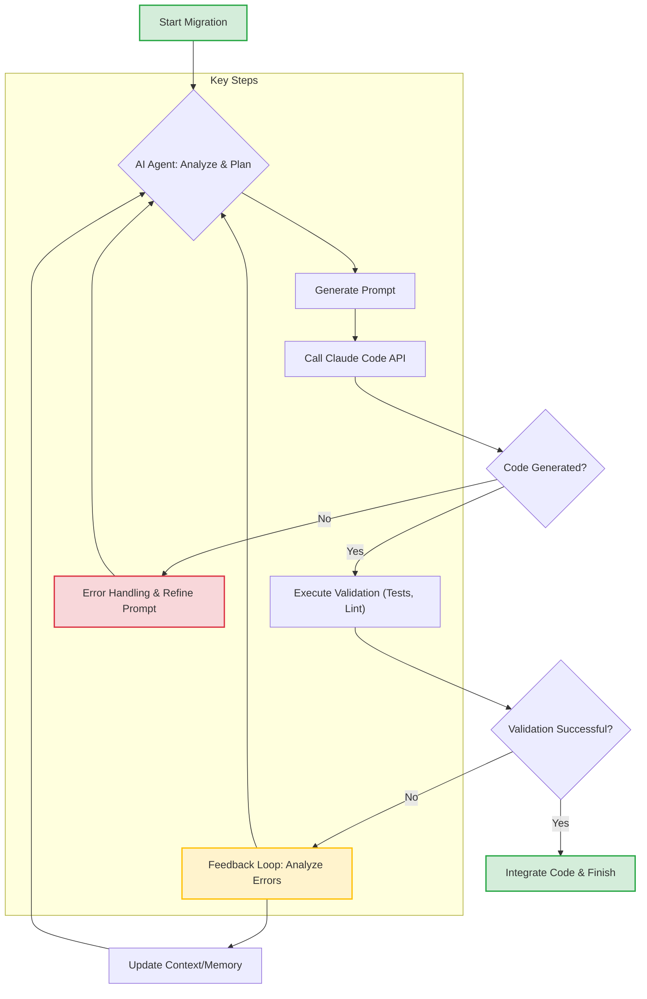

Claude Code를 활용한 대규모 코드 마이그레이션은 단일 코드 수정 접근 방식을 넘어, 반복적인 코드 생성 워크플로 개선에 중점을 두어야 하는 중요한 과제이다. Anthropic의 개발자들이 Claude Fable 5, Claude Opus 4.8과 동적 워크플로를 이용해 수만에서 수십만 줄 규모의 패키지 10개를 성공적으로 이전한 사례는 이러한 전략의 유효성을 명확히 보여준다. 이 접근 방식은 개별 코드를 수동으로 고치는 대신, AI 에이전트가 더 효율적으로 코드를 생성하고 수정할 수 있도록 반복 과정을 최적화하는 데 집중한다.

## 핵심 개념: 반복적 코드 생성 워크플로
기존의 코드 마이그레이션은 주로 문제 식별 후 코드 수정, 테스트, 그리고 이 과정을 반복하는 형태로 진행되었다. 하지만 대규모 마이그레이션에서는 이 방식이 비효율적이며, 인적 오류의 가능성이 크다. 반복적 코드 생성 워크플로는 AI 에이전트가 마이그레이션 대상 코드베이스를 분석하고, 최적화된 프롬프트를 통해 코드를 생성하거나 변환하며, 자동화된 검증 단계를 거쳐 스스로 워크플로를 개선해 나가는 순환 구조를 따른다.

### 프롬프트 엔지니어링 최적화
AI 에이전트의 코드 생성 품질은 프롬프트의 정확성과 동적 대응 능력에 크게 좌우된다. 정적 프롬프트는 변화하는 코드베이스의 컨텍스트나 특정 마이그레이션 요구사항을 반영하기 어렵다. 따라서 동적 프롬프트(Dynamic Prompt)는 현재 처리 중인 코드의 컨텍스트, 이전 반복에서 얻은 피드백, 그리고 전체 마이그레이션 목표를 실시간으로 반영하여 AI가 더 정확하고 효율적인 코드를 생성하도록 유도한다. 이는 AI 에이전트가 자체적으로 학습하고 개선하는 기반이 된다.

### 동적 워크플로 로직
동적 워크플로는 AI 에이전트가 주어진 상황과 피드백에 따라 다음 단계를 유연하게 결정하고 실행하는 능력을 의미한다. 예를 들어, 코드 생성 후 테스트에 실패하면, 에이전트는 실패 원인을 분석하고 프롬프트나 코드 생성 전략을 수정하여 재시도한다. 이러한 자기 수정(Self-correction) 및 적응형 계획(Adaptive Planning) 능력은 대규모 코드 마이그레이션의 복잡성을 관리하고, 예측 불가능한 문제에 대응하는 데 필수적이다.

## Claude Code 하네스(Harness) 설계 원칙
성공적인 반복 개선 워크플로를 위해서는 견고한 하네스 설계가 필수적이다. 이 하네스는 AI 에이전트가 코드 베이스를 안전하게 분석하고, 변경 사항을 제안하며, 이를 검증하고 통합하는 전 과정을 자동화하는 시스템이다. 주요 원칙은 다음과 같다:

*   **격리된 작업 환경**: Git Worktrees 또는 컨테이너 기반 환경을 활용하여 각 AI 에이전트의 작업이 메인 코드베이스에 직접적인 영향을 미치지 않도록 격리한다. 이는 병렬 처리와 안전한 실험을 가능하게 한다.
*   **지속적인 검증 및 피드백 루프**: 코드 생성 후 자동으로 단위 테스트, 통합 테스트, 린트(Lint) 검사 등을 수행하고, 그 결과를 AI 에이전트에 다시 전달하여 다음 반복에 활용하도록 한다.
*   **동적 스케줄링 및 오케스트레이션**: 마이그레이션 작업의 우선순위, 의존성, 자원 할당 등을 동적으로 관리하여 전체 워크플로의 효율성을 극대화한다.

## 코드 예제: 동적 프롬프트 기반 코드 변환 루프
다음은 설정 파일의 포맷을 JSON에서 YAML로 변환하는 간단한 시나리오에서, 동적 프롬프트와 반복 워크플로의 개념을 보여주는 의사 코드(Pseudo Code) 예시이다. 실제 구현에서는 Claude API 호출 및 복잡한 컨텍스트 관리가 필요하다.

````python
import json
import yaml
from typing import Dict, Any

def call_claude_api(prompt: str, code_content: str) -> str:
    # 실제 Claude API 호출 로직 (생략)
    # 예시: LLM이 JSON을 YAML로 변환한다고 가정
    if "transform_to_yaml" in prompt:
        try:
            json_data = json.loads(code_content)
            return yaml.dump(json_data, indent=2)
        except json.JSONDecodeError:
            return "ERROR: Invalid JSON input."
    return ""

def validate_yaml(yaml_content: str) -> bool:
    try:
        yaml.safe_load(yaml_content)
        return True
    except yaml.YAMLError:
        return False

def iterative_code_migration_workflow(initial_json_content: str, max_iterations: int = 5) -> str:
    current_code = initial_json_content
    history = []

    for i in range(max_iterations):
        print(f"--- Iteration {i+1} ---")
        
        # 동적 프롬프트 생성: 이전 시도 결과와 목표를 반영
        dynamic_prompt = (
            f"Given the following JSON content, transform it into a valid YAML format. "
            f"Ensure all keys and values are correctly represented. "
            f"Previous attempts and feedback (if any): {history}"
            f"Current JSON content:\n{current_code}"
        )

        generated_code = call_claude_api(dynamic_prompt, current_code)
        
        if "ERROR" in generated_code:
            print(f"Claude API returned an error: {generated_code}")
            history.append(f"Iteration {i+1} failed with API error.")
            continue

        if validate_yaml(generated_code):
            print("Validation successful. Migration complete.")
            return generated_code
        else:
            print("Validation failed. Refining prompt and retrying.")
            history.append(f"Iteration {i+1} generated invalid YAML. Input was: {current_code}. Output was: {generated_code}")
            # 실제 시스템에서는 AI에게 피드백을 주어 프롬프트를 정교화하는 로직이 추가됨
            # 여기서는 간단히 다음 반복으로 넘어가지만, 더 복잡한 추론/수정 로직이 필요
            current_code = generated_code # 다음 반복에서 잘못된 YAML을 입력으로 사용할 수도 있음 (학습 목적)

    print("Max iterations reached. Migration failed.")
    return current_code

# 예시 사용
example_json = '{"name": "project-x", "version": "1.0.0", "config": {"port": 8080, "debug": true}}'
migrated_yaml = iterative_code_migration_workflow(example_json)
print("\nFinal Migrated YAML:\n", migrated_yaml)
````

이 예제에서는 `call_claude_api` 함수가 가상의 Claude API 호출을 시뮬레이션하고, `validate_yaml` 함수가 생성된 YAML의 유효성을 검증한다. `iterative_code_migration_workflow`는 이 두 함수를 반복적으로 호출하며, 실패 시 `history`에 기록된 피드백을 통해 동적 프롬프트를 개선하려 시도한다.

## Claude Code 반복 워크플로 다이어그램


## 트레이드오프 (Trade-offs)

### 1. 대규모 작업 처리 속도 vs. 초기 설정 복잡성
*   **언제 좋은가**: 수십만 줄 이상의 코드를 이전하거나 반복적인 패턴을 가진 대규모 코드베이스 마이그레이션 시, AI 기반 반복 워크플로는 기존 수동 방식보다 월등히 빠른 속도로 작업을 완료할 수 있다. AI가 학습된 패턴에 따라 대량의 코드를 일관되게 생성/변환하기 때문이다.
*   **언제 나쁜가**: 소규모 프로젝트나 마이그레이션 범위가 작고 일회성인 경우, 복잡한 프롬프트 엔지니어링 및 동적 워크플로 하네스 구축에 필요한 초기 투자 시간과 자원이 오히려 비효율적일 수 있다.

### 2. 일관성 유지 및 재사용성 vs. 미묘한 버그 발생 가능성
*   **언제 좋은가**: AI가 정의된 규칙과 패턴에 따라 코드를 생성하므로, 스타일 가이드라인이나 특정 아키텍처 패턴을 대규모로 일관되게 적용하는 데 매우 효과적이다. 또한, 최적화된 워크플로는 유사한 다른 프로젝트에도 재사용될 수 있어 장기적인 생산성 향상에 기여한다.
*   **언제 나쁜가**: AI가 생성한 코드에는 문법적 오류는 없지만, 특정 엣지 케이스에서 미묘한 로직 버그나 예상치 못한 동작이 발생할 수 있다. 특히 복잡한 비즈니스 로직이나 도메인 특화된 지식이 필요한 경우, AI의 이해도 부족으로 인해 발견하기 어려운 버그가 숨어들 가능성이 있다.

### 3. 확장성 및 자동화 vs. 관찰 가능성(Observability) 난이도
*   **언제 좋은가**: 워크플로가 최적화되면 AI 에이전트가 자율적으로 작업을 반복하고 개선하므로, 인력 투입 없이도 마이그레이션 규모를 쉽게 확장할 수 있다. 이는 인적 자원의 제약을 극복하고 지속적인 코드베이스 개선을 가능하게 한다.
*   **언제 나쁜가**: AI 에이전트의 내부 의사결정 과정이 복잡해질수록, 특정 코드 변경이 어떤 프롬프트와 피드백에 의해 발생했는지 추적하기 어려워진다. 이는 문제 발생 시 디버깅을 어렵게 만들고, 전체 시스템의 신뢰성을 떨어뜨릴 수 있다. 투명한 로깅과 모니터링 시스템 구축이 선행되어야 한다.

## 실전 체크리스트 (Practical Checklist)

이 지식을 프로젝트에 적용할 때 검증할 항목들은 다음과 같다:

*   [ ] **마이그레이션 대상 정의**: 마이그레이션할 코드베이스의 명확한 특성(언어, 프레임워크, 규모) 및 범위를 문서화하고, 목표 아키텍처 또는 패턴을 구체적으로 명시했는가?
*   [ ] **품질 지표 설정**: AI 생성 코드의 품질을 측정할 핵심 지표(예: 자동화된 테스트 커버리지 최소 80%, 린트 오류 0개, 빌드 성공률 99%)를 사전에 정의하고, 이를 자동 측정하는 파이프라인을 구축했는가?
*   [ ] **안전한 롤백 전략**: AI 에이전트의 변경 사항으로 인해 시스템에 심각한 문제가 발생할 경우, 신속하고 안전하게 이전 상태로 복구할 수 있는 롤백 전략 및 자동화된 메커니즘을 마련했는가?
*   [ ] **프롬프트 버전 관리**: 동적 프롬프트 템플릿과 워크플로 로직을 버전 관리 시스템(Git 등)에 통합하여 변경 이력을 추적하고, 특정 버전으로 재현 가능한 환경을 구축했는가?
*   [ ] **비용 및 성능 모니터링**: AI 에이전트의 토큰 사용량, API 호출 비용, 그리고 코드 생성 및 검증에 소요되는 시간을 실시간으로 모니터링하여 예산 초과 또는 성능 저하를 조기에 감지하는 시스템을 갖추었는가?
*   [ ] **Human-in-the-Loop 체크포인트**: 특히 중요하거나 복잡한 변경 단계에서 사람의 전문적인 검토(Human-in-the-loop)를 위한 명확한 체크포인트를 워크플로에 포함하고, 이에 대한 검토 가이드라인을 수립했는가?
*   [ ] **E2E 테스트 자동화**: AI가 생성한 코드의 실제 동작을 검증하기 위해, 통합 테스트 및 End-to-End 테스트(E2E Test)를 자동화하여 전체 시스템 수준의 유효성을 지속적으로 검증하는가?