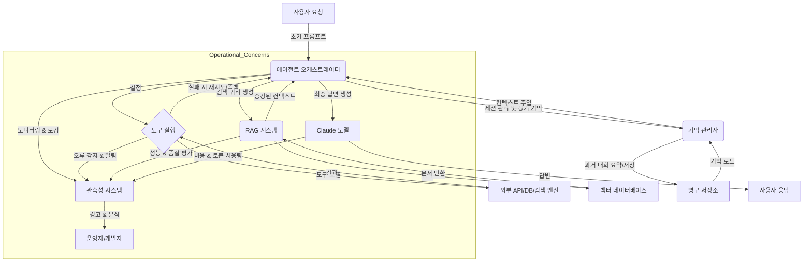

Claude Cookbook은 Anthropic의 Claude 모델을 활용하여 AI 애플리케이션을 개발하고 운영하는 데 필요한 실용적인 가이드와 예제를 제공한다. 이 문서에서는 Cookbook에 제시된 견고한 에이전트 구축 및 RAG(Retrieval-Augmented Generation) 패턴을 Playbook의 에이전트 하네스에 통합하여 시스템의 안정성과 기능성을 강화하는 방안을 다룬다. 특히 멀티에이전트 조율, 세션 관리, 도구 사용(Tool Use)의 견고성, 그리고 RAG 시스템의 효율적인 구현 및 운영 측면에 중점을 둔다. 2026년 현재, 이러한 운영 패턴의 통합은 AI 시스템의 신뢰성과 장기적 유지보수성 확보에 필수적이다.

## 에이전트 구축 패턴 (Agent Building Patterns)
Claude Cookbook은 에이전트가 복잡한 작업을 수행하도록 설계하는 다양한 패턴을 제시한다. 핵심은 신뢰할 수 있는 도구 사용(Tool Use)과 효율적인 세션 관리, 그리고 멀티에이전트 환경에서의 조율이다.

### 견고한 도구 사용 (Robust Tool Use)
에이전트가 외부 도구를 사용하는 과정에서 발생할 수 있는 오류를 효과적으로 처리하는 것이 중요하다. Cookbook은 도구 호출의 성공/실패 여부를 판단하고, 실패 시 적절한 재시도(Retry) 로직이나 대체(Fallback) 전략을 적용하는 패턴을 제안한다. 이는 예외 처리(Exception Handling)와 모니터링(Monitoring) 시스템과의 연동을 통해 더욱 강화될 수 있다.

```python
import anthropic
import json

client = anthropic.Anthropic()

def search_tool(query: str):
    """Simulates a search engine call."""
    print(f"DEBUG: Searching for: {query}")
    if "error" in query.lower():
        raise ValueError("Simulated search error")
    return {"results": f"Information about {query} from search."}

def agent_with_tool_use(prompt: str):
    messages = [
        {"role": "user", "content": prompt}
    ]
    
    tools = [
        {
            "name": "search_tool",
            "description": "Searches for information on the web.",
            "input_schema": {
                "type": "object",
                "properties": {
                    "query": {"type": "string", "description": "The search query.", "examples": ["What is the weather today?"]}
                },
                "required": ["query"]
            }
        }
    ]

    try:
        response = client.messages.create(
            model="claude-3-opus-20240229", # Or a suitable Claude model
            max_tokens=1000,
            messages=messages,
            tools=tools,
            tool_choice={"type": "auto"}
        )

        if response.stop_reason == "tool_use":
            tool_use = response.content[0]
            tool_name = tool_use.name
            tool_input = tool_use.input

            print(f"DEBUG: Agent wants to use tool: {tool_name} with input: {tool_input}")

            if tool_name == "search_tool":
                try:
                    tool_output = search_tool(tool_input["query"])
                    messages.append({"role": "tool_use", "content": json.dumps(tool_output), "tool_name": tool_name})
                    
                    final_response = client.messages.create(
                        model="claude-3-opus-20240229",
                        max_tokens=1000,
                        messages=messages
                    )
                    return final_response.content[0].text
                except Exception as e:
                    # 에이전트에게 오류를 전달하고 복구 방법을 찾도록 유도
                    error_message_for_llm = f"Tool '{tool_name}' failed with error: {e}. Please try to rephrase the query or use an alternative approach, or report the issue."
                    messages.append({"role": "tool_use", "content": error_message_for_llm, "tool_name": tool_name})
                    
                    error_recovery_response = client.messages.create(
                        model="claude-3-opus-20240229",
                        max_tokens=1000,
                        messages=messages
                    )
                    return f"Agent encountered an error during tool use: {error_recovery_response.content[0].text}"
            else:
                return "Unknown tool requested."
        else:
            return response.content[0].text
    except Exception as e:
        return f"An unexpected error occurred during agent processing: {e}"

# Example Usage
# print(agent_with_tool_use("What is the capital of France?"))
# print(agent_with_tool_use("Search for recent news about AI error handling."))
# print(agent_with_tool_use("Search for an error that might break a system.")) # This should trigger the simulated error
```

### 세션 관리 및 장기 기억 (Session Management & Long-Term Memory)
에이전트가 여러 턴(Turn)에 걸쳐 일관된 대화 맥락을 유지하고 사용자 기억을 활용하는 것은 중요한 운영 패턴이다. Cookbook은 과거 대화 기록(Conversation History)을 효율적으로 요약(Summarization)하거나 외부 벡터 데이터베이스(Vector Database)와 연동하여 장기 기억을 구현하는 방법을 다룬다. `context-engineering/claude-code-agent-persistent-memory-ctx-integration`과 같이 에이전트의 세션 컨텍스트를 지속시키는 전략은 필수적이다. 이는 장기적인 상호작용이 필요한 서비스에서 사용자 경험을 크게 향상시킨다.

## RAG 패턴 적용 (Applying RAG Patterns)
RAG는 LLM의 지식 한계와 할루시네이션(Hallucination) 문제를 보완하는 강력한 패턴이다. Claude Cookbook은 효과적인 RAG 시스템 구축을 위한 데이터 준비부터 검색, 생성까지의 전 과정을 상세히 다룬다.

### 고품질 검색 증강 (High-Quality Retrieval Augmentation)
*   **데이터 전처리 및 임베딩 (Data Preprocessing & Embedding)**: 문서 분할(Chunking) 전략, 임베딩 모델 선택, 벡터 데이터베이스 최적화는 검색 품질에 직접적인 영향을 미친다. 관련 슬러그 `data-engineering/rag-data-preprocessing-embedding-optimization-strategies`에서 다루듯이, 데이터의 특성에 맞는 전처리 파이프라인(Preprocessing Pipeline) 구축이 중요하다. 또한 2026년에는 멀티모달(Multimodal) 임베딩의 활용이 더욱 보편화될 것이다.
*   **검색 전략 최적화 (Optimizing Retrieval Strategy)**: 키워드 검색, 시맨틱 검색(Semantic Search), 하이브리드 검색(Hybrid Search) 등 다양한 검색 방식을 조합하고 랭킹(Re-ranking) 기법을 활용하여 관련성이 높은 문서를 선별한다. 동적 라우팅(Dynamic Routing)을 통해 질문 유형에 따라 최적의 검색 전략을 선택하는 것도 중요한 추세이다.

### 생성 단계에서의 할루시네이션 감소 (Reducing Hallucination in Generation)
검색된 문서(Retrieved Documents)를 Claude 모델에게 효과적으로 제시하여 답변의 신뢰도를 높이는 것이 핵심이다. Cookbook은 검색 결과를 프롬프트에 포함시키는 방법, 답변 생성 후 원본 문서와 비교하여 사실 여부를 검증하는 `evaluation/generative-ai-hallucination-automated-detection-evaluation`과 같은 평가 기법을 강조한다. 이는 LLM의 응답에 대한 투명성(Transparency)과 설명 가능성(Explainability)을 높이는 데 기여한다.

## 운영 및 평가 패턴 (Operational & Evaluation Patterns)
견고한 AI 시스템은 단순히 기능 구현을 넘어, 운영 단계에서의 안정성, 보안, 비용 효율성을 보장해야 한다. Claude Cookbook은 이러한 운영 패턴의 중요성을 강조한다.

### 장애 대응 및 취약점 탐지 (Fault Tolerance & Vulnerability Detection)
*   **장애 대응 (Fault Tolerance)**: 에이전트의 도구 사용 실패, 외부 API 타임아웃(Timeout) 등에 대한 자동 재시도, 폴백(Fallback), 경고(Alerting) 시스템 연동은 `agents/ai-agent-robust-tool-error-recovery`와 같은 문서에서 다루는 내용과 일맥상통한다. 특히 분산 시스템(Distributed System) 환경에서는 각 컴포넌트의 상태를 주기적으로 확인하는 헬스 체크(Health Check)가 필수적이다.
*   **취약점 탐지 (Vulnerability Detection)**: 프롬프트 인젝션(Prompt Injection), 민감 정보 유출(Sensitive Data Leakage) 등 보안 취약점을 탐지하고 완화하는 패턴은 `harness-engineering/claude-autonomous-vulnerability-harness-architecture`와 같은 하네스 설계에서 필수적으로 고려되어야 한다. 2026년에는 AI 시스템에 특화된 보안 감사(Audit) 및 침투 테스트(Penetration Test) 기법이 더욱 고도화될 것이다.

### 비용 관리 및 모니터링 (Cost Management & Monitoring)
LLM 사용의 주요 운영 과제 중 하나는 비용 최적화이다. Cookbook은 토큰 사용량 모니터링, 불필요한 API 호출 방지, 캐싱(Caching) 전략 등을 통해 비용을 효율적으로 관리하는 방법을 제시한다. `agents/ai-agent-runaway-cost-prevention-control-systems`는 이러한 접근 방식의 중요성을 강조한다. 또한, AI 모델 라우팅(Model Routing)을 통해 작업 특성에 맞는 최적의 비용/성능 모델을 동적으로 선택하는 것도 효과적인 비용 절감 전략이다.



## 트레이드오프

*   **복잡성 증가 vs. 견고성/확장성**: 
    *   **좋은 경우**: 다양한 운영 패턴(오류 처리, 세션 관리, RAG)을 적용하면 시스템의 복잡도가 증가하지만, 프로덕션 환경에서 발생할 수 있는 문제에 대한 대응력이 높아지고 장기적인 기능 확장에 유리하다. 특히 미션 크리티컬하거나 대규모 애플리케이션에 적합하다.
    *   **나쁜 경우**: PoC(개념 증명) 단계나 단순한 태스크를 위한 에이전트에는 과도한 오버헤드를 발생시켜 개발 속도를 늦추고 불필요한 유지보수 비용을 초래할 수 있다.

*   **성능/비용 최적화 vs. 정확도/완성도**: 
    *   **좋은 경우**: RAG 시스템의 효율적인 데이터 전처리, 임베딩 최적화, 프롬프트 엔지니어링은 LLM 호출 비용을 줄이면서도 특정 도메인 지식에 대한 정확도를 향상시킬 수 있다. 특히 실시간 응답이 중요하거나 대량의 데이터를 처리해야 할 때 유리하다.
    *   **나쁜 경우**: 지나친 압축이나 단순화는 검색 컨텍스트의 손실을 가져와 LLM의 답변 품질을 저하시키거나 할루시네이션을 유발할 수 있다. 미묘한 뉘앙스나 복잡한 추론이 필요한 경우 세심한 균형이 필요하다.

*   **자동화된 에이전트 vs. 휴먼 인 더 루프(Human-in-the-Loop)**: 
    *   **좋은 경우**: Claude Cookbook의 패턴을 통해 에이전트의 자율성을 높이고 다양한 운영 상황에 스스로 대응하도록 자동화할 수 있다. 이는 인력 비용을 절감하고 반복적인 업무의 효율을 극대화한다.
    *   **나쁜 경우**: 높은 수준의 정확성, 창의성, 혹은 윤리적 판단이 요구되는 작업에서는 에이전트의 오류가 심각한 결과를 초래할 수 있다. 이 경우 인간의 개입(Human-in-the-Loop)을 위한 명확한 체크포인트와 검증 절차를 설계해야 한다.

*   **빠른 프로토타이핑 vs. 장기적 유지보수**: 
    *   **좋은 경우**: Cookbook의 예제를 활용하면 에이전트와 RAG 시스템의 핵심 기능을 빠르게 구현하여 프로토타입을 만들 수 있다. 이는 초기 아이디어 검증에 매우 효과적이다.
    *   **나쁜 경우**: 초기 구현 시 운영 패턴(장애 대응, 취약점 탐지)을 충분히 고려하지 않으면, 프로덕션 배포 후 예상치 못한 문제들로 인해 시스템의 유지보수 비용이 급증하고 기술 부채(Technical Debt)가 쌓일 수 있다.

## 실전 체크리스트

Claude Cookbook 패턴을 활용하여 에이전트 및 RAG 시스템을 구축할 때 다음 항목들을 검증해야 한다.

*   - [ ] **도구 사용 견고성**: 에이전트가 외부 도구를 호출할 때, 예외 상황(API 타임아웃, 오류 응답)에 대한 재시도 로직과 폴백 메커니즘이 정상적으로 작동하는가?
*   - [ ] **세션 일관성**: 장기 대화에서 에이전트가 이전 대화 맥락과 사용자 기억을 정확히 유지하고 활용하는지, `context-engineering/claude-code-agent-persistent-memory-ctx-integration` 패턴이 적용되었는가?
*   - [ ] **RAG 검색 품질**: 임베딩 생성 파이프라인이 최신 데이터로 주기적으로 업데이트되며, 검색된 문서들이 질문에 대한 관련성 높은 정보를 충분히 포함하는가? (평가 지표: NDCG@k, Recall@k)
*   - [ ] **할루시네이션 방지**: RAG 시스템의 답변이 검색된 원본 문서와 일치하는지 자동으로 검증하는 `evaluation/generative-ai-hallucination-automated-detection-evaluation` 프로세스가 구현되었는가?
*   - [ ] **비용 효율성**: 토큰 사용량 모니터링 시스템이 구축되어 있으며, 불필요한 LLM 호출을 줄이기 위한 캐싱 전략이나 컨텍스트 압축 기법이 적용되었는가? (`agents/ai-agent-runaway-cost-prevention-control-systems` 참조)
*   - [ ] **보안 취약점 대응**: 프롬프트 인젝션, 민감 정보 노출 등 잠재적인 보안 위협에 대한 방어 로직이 에이전트 하네스에 통합되었으며, 주기적인 취약점 점검이 수행되는가? (`harness-engineering/claude-autonomous-vulnerability-harness-architecture` 참조)
*   - [ ] **배포 및 확장성**: 에이전트 시스템이 CI/CD 파이프라인을 통해 자동 배포되며, 트래픽 증가에 따라 확장 가능한 아키텍처(`harness-engineering/large-scale-llm-harness-architecture-patterns`)로 설계되었는가?
