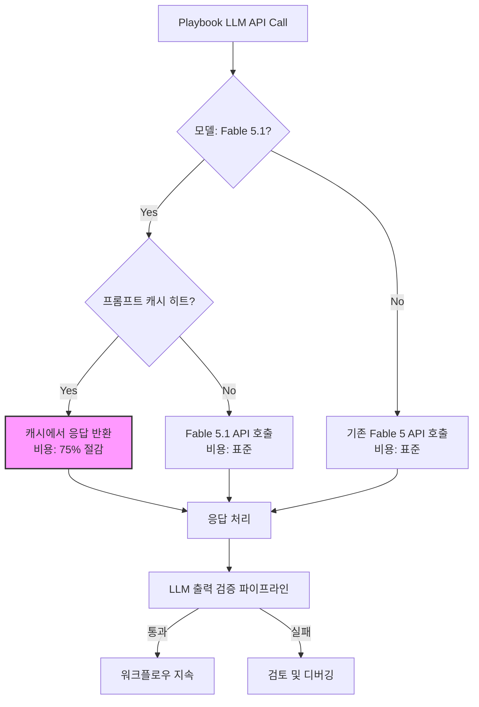

## Claude Fable 5.1 모델 마이그레이션 개요
Anthropic의 Claude Fable 5.1은 코딩, 지식 노동, 장기 문제 해결, 과학 연구 등 핵심 AI 작업 성능을 대폭 향상시킨 모델입니다. Fable 5 대비 캐시 읽기 가격을 75% 인하하여 일반 작업 비용 효율성을 크게 높였습니다. Playbook의 Claude API 호출 로직을 Fable 5.1로 업데이트하는 것은 단순한 모델 교체를 넘어, 비용 절감 및 성능 향상의 기회를 제공합니다. 특히 LLM 출력 검증 파이프라인의 성능 모니터링이 중요합니다.

## Fable 5.1의 주요 개선사항 및 비용 효율성
Claude Fable 5.1은 복잡한 추론과 코드 생성 능력이 강화되었습니다. 기존 Fable 5 대비 일반적인 작업에서 더 높은 정확도와 일관성을 보이며, 특히 장문의 프롬프트 처리와 다단계 문제 해결에서 뛰어난 성능을 발휘합니다.

**캐시 읽기 가격 인하**: 가장 주목할 만한 변화는 캐시 읽기 가격이 75% 낮아진 것입니다. 이는 반복적인 프롬프트나 동일한 컨텍스트를 사용하는 Agentic Workflow에서 큰 비용 절감 효과를 가져옵니다. 2026년 기준, 비용 최적화는 LLM 기반 시스템 운영의 핵심 트렌드이며, Fable 5.1의 이러한 정책은 Playbook과 같이 LLM 호출 빈도가 높은 환경에 매우 유리합니다.



## Playbook Claude API 호출 로직 업데이트
기존 `Fable 5` 모델 호출을 `Fable 5.1`로 전환하는 과정은 주로 API 엔드포인트 또는 모델 ID를 변경하는 것으로 이루어집니다. Anthropic의 공식 문서에서 최신 Fable 5.1 모델 ID를 확인하고 적용하는 것이 중요합니다.

```python
from anthropic import Anthropic

client = Anthropic()

# Fable 5.1 모델 ID 사용 (최신 정보 확인 필요, 예시 ID)
FABLE_5_1_MODEL_ID = "claude-3-fable-5-1-202607xx"

try:
    response = client.messages.create(
        model=FABLE_5_1_MODEL_ID,
        max_tokens=2048, # Fable 5.1의 향상된 능력에 맞춰 토큰 한도 조정 고려
        messages=[
            {"role": "user", "content": "다음 코드 스니펫을 최적화하고 설명해주세요:\n\n```python\ndef factorial(n):\n    if n == 0:\n        return 1\n    else:\n        return n * factorial(n-1)\n```"}
        ],
        system="당신은 경험 많은 소프트웨어 엔지니어입니다. 효율적이고 명확한 코드를 선호합니다."
    )
    print(response.content)
except Exception as e:
    print(f"Error calling Claude Fable 5.1: {e}")
```

### 캐시 읽기 활용 전략
*   **Agentic Workflow 최적화**: 동일한 초기 컨텍스트를 재사용하거나 반복적인 중간 단계를 거치는 Agentic Workflow의 경우, 캐시의 이점을 극대화하도록 설계를 검토합니다. 불필요한 변동성을 줄여 캐시 히트율을 높입니다.
*   **Prompt Template 표준화**: 일관된 프롬프트 사용은 캐시 히트율을 높이는 핵심 요소입니다. 프롬프트 템플릿을 표준화하고 버전 관리하여 캐시 관리의 효율성을 증대시킵니다.
*   **Context Window 관리**: 불필요한 정보나 과거 대화 기록을 제거하여 컨텍스트 윈도우 크기를 최적화하고, 이는 캐시 효율성 뿐만 아니라 전반적인 토큰 사용량 절감에도 기여합니다.

## LLM 출력 검증 파이프라인 모니터링 및 조정
새로운 모델로의 전환은 LLM 출력의 미묘한 변화를 초래할 수 있습니다. 기존의 출력 검증 파이프라인 (`evaluation/llm-output-validation-pipeline-enhancement` 참조)이 Fable 5.1의 출력을 정확하게 평가하고 있는지 지속적으로 모니터링하고 필요에 따라 조정해야 합니다.

*   **성능 지표 설정**: 응답 시간, 정확도 (Accuracy), 일관성 (Consistency), 관련성 (Relevance), 그리고 비용 효율성 등을 핵심 지표로 설정하고 추적합니다. A/B 테스트를 통해 Fable 5와 Fable 5.1의 실제 성능을 비교하는 것이 유용합니다.
*   **Guardrails 재검토**: Fable 5.1은 일반 제공 모델로서 Anthropic의 보호 장치가 적용됩니다. 하지만 특정 Agentic Task에 대해 모델의 새로운 행동 패턴이 기존의 안전성 기준을 충족하는지 분석해야 합니다. 필요한 경우 자체적인 Guardrail (`agents/ai-agent-safety-constraint-control-design-patterns` 참조)을 강화하거나 조정합니다.
*   **드리프트 감지**: 모델 전환 후 출력 드리프트 (Drift) 발생 여부를 지속적으로 감지하고, 예상치 못한 행동 변화에 신속하게 대응할 수 있는 알림 시스템을 구축합니다.

## 트레이드오프
*   **비용 절감 vs. 마이그레이션 노력**: Fable 5.1로의 전환은 캐시 읽기 비용 인하로 장기적인 운영 비용 절감을 약속합니다. 하지만 초기 API 호출 로직 업데이트, 프롬프트 재조정, 출력 검증 파이프라인 테스트 및 미세 조정에는 상당한 개발 및 검증 노력이 필요합니다.
    *   언제 좋음: 장기적으로 LLM 사용량이 많고, 반복적인 컨텍스트 호출이 잦은 Agentic 시스템에서 큰 ROI를 기대할 수 있을 때 유리합니다.
    *   언제 나쁨: LLM 호출이 매우 드물거나, 기존 시스템이 Fable 5에 너무 강하게 의존하여 변경 및 검증 비용이 절감 효과를 압도할 때 불리합니다.
*   **성능 향상 vs. 예측 불가능한 행동 변화**: Fable 5.1은 전반적인 성능 향상을 제공하지만, 기존 Fable 5에서 특정 방식으로 동작하던 부분이 미묘하게 달라질 수 있습니다. 이는 기존에 잘 작동하던 Agentic Workflow에 예기치 않은 오류나 비일관성을 유발할 수 있으며, 특히 정밀한 제어가 필요한 작업에서 문제가 될 수 있습니다.
    *   언제 좋음: 최신 모델의 개선된 추론 능력과 지식 활용이 필수적인 복잡한 문제 해결 또는 코딩 작업에 적합할 때 탁월합니다.
    *   언제 나쁨: 모델 출력의 미세한 변화에도 민감하게 반응하는 엄격한 규제 환경 또는 Critical한 시스템에서 즉각적인 마이그레이션은 높은 리스크를 동반할 때 신중해야 합니다.
*   **새로운 기능 활용 vs. 추가적인 학습 및 통합 복잡성**: Fable 5.1은 향상된 코딩 및 지식 노동 능력을 제공하지만, 이러한 새로운 기능을 Playbook의 Agentic Workflow에 효과적으로 통합하려면 추가적인 프롬프트 엔지니어링 학습과 시스템 통합 복잡성이 증가할 수 있습니다. 예를 들어, 더욱 정교한 도구 사용 (Tool Use) 패턴을 설계해야 할 수도 있습니다.
    *   언제 좋음: 기존 Agent가 해결하기 어렵던 복잡하고 다단계적인 문제를 Fable 5.1의 향상된 능력을 통해 해결하고자 할 때 높은 가치를 제공합니다.
    *   언제 나쁨: 이미 최적화된 Agentic Workflow가 존재하고, Fable 5.1의 추가 기능이 현재 당면한 문제 해결에 필수적이지 않을 경우, 불필요한 오버헤드가 발생할 수 있습니다.

## 실전 체크리스트
*   - [ ] Playbook의 Claude API 호출 로직에서 Fable 5.1 모델 ID(`claude-3-fable-5-1-xxxxxx`)로의 전환이 완료되었는가?
*   - [ ] Fable 5.1의 캐시 읽기 가격 인하를 활용하기 위한 Agentic Workflow 또는 Prompt Template 최적화 전략이 수립되고 적용되었는가?
*   - [ ] 기존 LLM 출력 검증 파이프라인이 Fable 5.1의 출력에 대해 유효한지 재평가하고, 필요한 경우 조정되었는가? (예: `evaluation/llm-output-validation-pipeline-enhancement` 참고)
*   - [ ] Fable 5.1 전환 후 핵심 성능 지표 (응답 시간, 정확도, 비용 등)를 추적하기 위한 모니터링 시스템이 구축되었는가? (예: `harness-engineering/ai-model-performance-monitoring-ab-testing-harness` 참고)
*   - [ ] Fable 5.1의 새로운 특성(강화된 추론, 잠재적 행동 변화)이 기존 Agentic Workflow의 안전성 및 일관성에 미치는 영향이 분석되고, 필요 시 자체 Guardrail이 강화되었는가? (예: `agents/ai-agent-safety-constraint-control-design-patterns` 참고)
*   - [ ] Fable 5.1로의 전환을 통해 예상되는 총 비용 절감 효과가 정량적으로 측정되고 있는가? (예: `reports/ai-model-performance-cost-efficiency-reporting` 참고)
*   - [ ] Fable 5.1의 새로운 기능을 활용하기 위한 Agentic Workflow 개선 또는 새로운 기능 도입 계획이 수립되었는가?