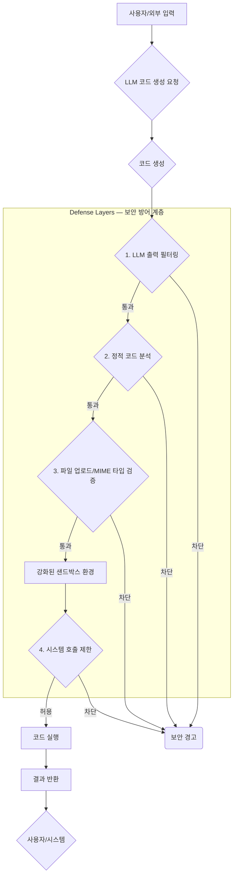

The discovery of vulnerabilities in Claude Code Opus's Auto Mode, allowing command injection and unauthorized system access via web summary requests, highlights the critical need for robust security hardening in LLM-driven code execution. Key defense strategies involve **strict policy enforcement**, **isolated execution environments (sandboxing)**, and **proactive validation**.

### 외부 네트워크 및 셸 명령 제한 (Restricting External Network and Shell Commands)

LLM 에이전트의 `Auto Mode`는 외부 네트워크 접근 (`curl`, `wget`) 및 민감한 셸 명령 (`rm`, `mv`, `sudo`) 실행으로 인한 데이터 유출이나 시스템 손상 위험이 높습니다. 에이전트 실행 환경 내에서 허용되는 시스템 호출 (syscalls) 및 외부 네트워크 접근을 엄격히 통제하는 정책이 필수적입니다. 컨테이너 기반 런타임의 네트워크 정책이나 `seccomp` 필터링을 활용하여 특정 syscall을 블랙리스트에 올리거나 화이트리스트 기반으로 허용된 작업만 수행하도록 제한합니다.

```python
import subprocess
import os

def execute_safe_code(code_string):
    restricted_commands = ["curl", "wget", "rm", "mv", "sudo", "apt", "yum", "pip install", "os.system"]
    if any(cmd in code_string for cmd in restricted_commands):
        return "Security policy violation: Restricted command detected."
    try:
        process = subprocess.Popen(
            ["python", "-c", code_string],
            stdout=subprocess.PIPE, stderr=subprocess.PIPE,
            env={"PATH": "/usr/local/bin:/usr/bin"}, # Restricted PATH
            text=True, bufsize=1, timeout=10 # Timeout for execution
        )
        stdout, stderr = process.communicate()
        return stdout if process.returncode == 0 else f"Execution failed: {stderr}"
    except subprocess.TimeoutExpired:
        process.kill(); return "Execution timed out."
    except Exception as e:
        return f"An error occurred: {e}"

# Example: print(execute_safe_code("print('Hello safe execution!')"))
```
이 코드는 개념적 예시로, 실제 샌드박스는 더욱 강력한 syscall 필터링 및 네트워크 격리를 요구합니다.

### 강화된 샌드박스 환경 (Enhanced Sandbox Environment)

LLM이 생성한 코드는 항상 격리된 환경에서 실행되어야 합니다.
**컨테이너 기반 샌드박스**: Docker 컨테이너는 실행 환경을 격리하고 리소스 제한을 적용하는 데 효과적입니다. 각 코드 실행 세션마다 새로운 임시 컨테이너를 생성하고 폐기하는 `Ephemeral Container` 패턴을 권장합니다.
**가상 머신 (VM) 격리**: 더 높은 수준의 격리를 위해 gVisor나 Firecracker와 같은 경량 VM을 활용하여 커널 수준의 강력한 보안 경계를 구축할 수 있습니다.
**시스템 호출 필터링 (Syscall Filtering)**: `seccomp`를 사용하여 프로세스가 접근할 수 있는 `execve`, `fork`, `socket` 등 위험한 시스템 호출을 명시적으로 제한하여 공격 표면을 줄입니다.

### 코드 실행 전 검증 및 필터링 (Pre-execution Validation and Filtering)

LLM이 생성하거나 사용자로부터 받은 모든 코드 및 입력에 대해 다단계 검증을 수행합니다.
**정적 코드 분석**: 코드 실행 전 정적 분석 도구 (e.g., Bandit, ESLint)로 잠재적 취약점이나 위험한 패턴을 식별합니다.
**파일 업로드 및 MIME 타입 검사**: `ZIP` 파일 내 악성 바이너리 삽입에 대응하여, 파일 확장자 뿐만 아니라 실제 MIME 타입을 철저히 검사하고 실행 가능한 바이너리 또는 스크립트 파일을 차단합니다. 파일명에 셸 명령 삽입을 방지하는 정규표현식 검증 로직을 도입합니다.
**LLM 출력 필터링**: LLM의 최종 출력에서 `/bin/bash`, `sudo`, `nc -e` 등 특정 키워드나 패턴을 감지하고 차단하는 필터링 계층을 추가하여 샌드박스 탈출 시도를 억제합니다.

### 정기적인 가드 테스트 (Regular Guard Tests)

방어 메커니즘 효과를 지속적으로 검증하기 위해 **가드 테스트 (Guard Test)** 시나리오를 정기적으로 수행해야 합니다. 실제 공격 시나리오를 모방하여 시스템의 취약점을 선제적으로 발견하고 개선합니다. Claude Code Opus Auto Mode 취약점과 유사한 `prompt injection` 및 `sandbox escape` 시나리오를 포함시켜, 에이전트가 의도치 않은 명령을 실행하거나 제한된 환경을 벗어나려는 시도를 감지하고 차단하는지 확인합니다.



---

## 트레이드오프

LLM 에이전트 보안 강화 전략은 다음과 같은 트레이드오프를 수반합니다.

*   **보안 vs. 유연성 (Security vs. Flexibility)**
    *   **장점**: 생산 환경 및 민감한 시스템에서 LLM의 위험 행동을 최소화하여 보안을 최우선으로 합니다.
    *   **단점**: 새로운 도구 학습이나 광범위한 문제 해결이 필요한 개발 초기/연구 환경에서 에이전트의 유연성과 자율성을 저해할 수 있습니다.

*   **성능 vs. 안전성 (Performance vs. Safety)**
    *   **장점**: 민감한 작업 처리 시 추가 검증 및 샌드박스 실행으로 인한 성능 저하를 감수하여 장기적인 시스템 안정성과 데이터 무결성을 보장합니다.
    *   **단점**: 초고속 응답이 요구되는 실시간 시스템이나 대규모 워크로드에서 각 보안 단계의 오버헤드가 전체 처리량을 크게 저하시킬 수 있습니다.

*   **구현 복잡성 vs. 방어 범위 (Implementation Complexity vs. Coverage)**
    *   **장점**: 포괄적인 샌드박스 및 다단계 검증은 넓은 공격 벡터를 커버하며 높은 수준의 보안을 제공합니다.
    *   **단점**: 상당한 개발 리소스와 전문 지식이 필요하며, 높은 초기 비용과 복잡한 유지보수 요구사항이 있습니다.

*   **오탐율 vs. 미탐율 (False Positives vs. False Negatives)**
    *   **장점**: 화이트리스트 기반 접근은 미탐율을 낮춰 알려지지 않은 공격에 대한 방어력을 높입니다.
    *   **단점**: 너무 엄격한 필터링은 LLM이 합법적인 작업을 방해하여 오탐율을 높이고 에이전트의 유용성을 떨어뜨릴 수 있습니다.

---

## 실전 체크리스트

LLM 에이전트 보안 강화를 위한 실전 체크리스트입니다.

- [ ] **외부 네트워크 접근 제어**: LLM 코드 실행 환경에서 `curl`, `wget` 등 외부 통신 도구 사용이 원천 차단되었는가?
- [ ] **셸 명령 실행 제한**: `rm`, `mv`, `sudo`, `execve` 등 민감한 셸 명령 및 시스템 호출이 샌드박스 내에서 엄격히 제한되는가?
- [ ] **전용 샌드박스 환경 구축**: 각 LLM 코드 실행 세션이 독립적인 컨테이너 또는 경량 가상 머신 내에서 격리되어 실행되는가?
- [ ] **코드 및 파일 입력 검증 강화**: LLM 생성 코드 및 사용자 업로드 파일에 대한 정적 분석, 악성 패턴 정규표현식 검증, MIME 타입 필터링 로직이 올바른가?
- [ ] **보안 아키텍처 문서화**: 샌드박스, 정책, 검증 계층을 포함한 보안 아키텍처가 Mermaid 다이어그램 등으로 명확히 문서화되었는가?
- [ ] **정기적인 '가드 테스트' 수행**: `prompt injection`, `sandbox escape` 시나리오를 포함하는 자동화된 가드 테스트가 주기적으로 실행되며 알림이 발생하는가?
- [ ] **실행 환경 리소스 제한**: 샌드박스 내에서 CPU, 메모리, 디스크 I/O와 같은 리소스가 엄격하게 제한되어 DoS 공격으로부터 보호하는가?