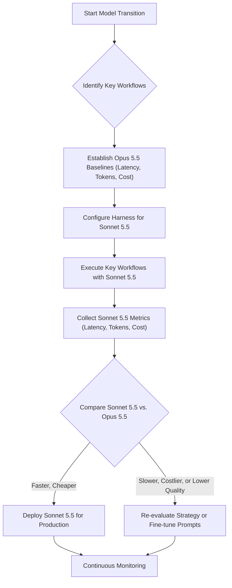

Claude Sonnet 5.5 모델은 Anthropic의 AI 모델 포트폴리오에서 효율성과 속도에 초점을 맞춰 설계된 Mid-tier 모델이다. 이는 복잡하고 장기적인 판단이 필요한 Opus 5.5 모델을 보완하며, 범위가 명확한 일상 업무, 버그 수정, 문서/슬라이드/스프레드시트 제작과 같은 작업에 특히 강점을 보인다. Sonnet 5.5는 이전 Sonnet 5 대비 출력 생성 속도가 30% 이상 향상되었으며, 토큰 단가는 동일하지만 동일한 작업에 필요한 토큰 사용량을 줄여 전반적인 효율성을 증대시킨다. 따라서 `playbook`의 `Claude Code harness`에서 사용하는 LLM 모델을 Sonnet 5.5로 전환하는 것은 비용과 성능 효율성 측면에서 중요한 개선점을 제공할 수 있다.

## Claude Sonnet 5.5 모델 전환 전략

모델 전환은 `playbook` 내 `Claude Code harness`의 설정 업데이트를 통해 이루어진다. 이 과정에서 중요한 것은 단순한 모델 변경을 넘어, 기존 작업에 대한 Sonnet 5.5의 실제 성능을 정량적으로 측정하고 Opus 5.5 대비 효율성을 명확히 입증하는 것이다.

### 모델 업데이트 및 기본 설정

`playbook` 환경에서 Claude Sonnet 5.5 모델을 사용하도록 LLM 호출 설정을 업데이트한다. 이는 일반적으로 환경 변수 또는 구성 파일을 통해 이루어지며, 모델 이름만 변경하는 간단한 작업이다.

```python
# 기존 코드 예시 (Python)
import anthropic

# ... (API 키 설정 등)

# 기존 Opus 5.5 모델 사용
# client = anthropic.Anthropic(api_key="YOUR_ANTHROPIC_API_KEY")
# response = client.messages.create(
#    model="claude-3-opus-20240229",
#    max_tokens=1024,
#    messages=[{"role": "user", "content": "Refactor this code: ..."}]
# )

# Sonnet 5.5 모델로 전환
def call_sonnet_5_5(prompt: str, system_message: str = "You are a helpful assistant.") -> str:
    client = anthropic.Anthropic(api_key="YOUR_ANTHROPIC_API_KEY")
    response = client.messages.create(
        model="claude-3-sonnet-20240229", # 모델 이름 변경
        max_tokens=2048, # 필요에 따라 max_tokens 조정
        system=system_message,
        messages=[{"role": "user", "content": prompt}]
    )
    return response.content[0].text

# 예시 사용
code_refactor_prompt = "Given the following Python code, identify and fix any bugs, and improve its readability:" \
                       "\n\n```python\ndef add_numbers(a, b):\n    return a + b\n```"

refactored_code = call_sonnet_5_5(code_refactor_prompt, system_message="You are an expert Python developer. Provide only the refactored code.")
print(refactored_code)
```

### 성능 테스트 방법론

성능 테스트는 출력 생성 속도 (Latency)와 토큰 사용량 (Token Usage)을 중심으로 진행된다. 이를 위해 기존 Opus 5.5로 수행했던 `Claude Code harness` 내의 대표적인 작업들을 Sonnet 5.5로 다시 실행하고 비교 분석한다.

1.  **기준선 설정 (Baselines)**: Opus 5.5 모델로 동일한 작업들을 수행했을 때의 평균 Latency, Input Tokens, Output Tokens, 그리고 총 비용을 기록한다.
2.  **Sonnet 5.5 실행**: Sonnet 5.5 모델로 동일한 작업들을 수행하고 해당 지표들을 기록한다.
3.  **데이터 수집 및 분석**: 각 작업별, 모델별로 수집된 데이터를 비교하여 Sonnet 5.5의 성능 향상 및 비용 절감 효과를 정량화한다. 특히, `same task에 필...` (동일 작업에 필요한 토큰 수 감소) 요약에 맞춰 토큰 효율성을 중점적으로 검증한다.



## 트레이드오프

Claude Sonnet 5.5 모델로 전환할 때 고려해야 할 트레이드오프는 다음과 같다:

*   **비용 효율성 (Cost Efficiency)**: Sonnet 5.5는 일상적인, 범위가 명확한 작업에서 Opus 5.5보다 훨씬 저렴하게 운영될 수 있다. 이는 Opus와 동일한 토큰 단가를 가지더라도, 동일한 작업을 더 적은 토큰으로 완료하거나 더 빠른 속도로 처리하여 전체 비용을 절감하는 효과를 가져온다. 
    *   **언제 좋음**: 간단한 코드 수정, 문서 요약, 슬라이드 생성, 데이터 클리닝 등 정형화된 작업에 적용할 때. 대규모 배치 작업에서 비용 절감 효과가 크다.
    *   **언제 나쁨**: 복잡한 아키텍처 설계, 미묘한 비즈니스 로직 분석, 장기적인 추론이 필요한 에이전트 작업에서는 Opus 5.5의 강력한 추론 능력이 더 중요할 수 있어, Sonnet 5.5 사용 시 여러 번의 호출 또는 품질 저하로 이어질 수 있다.

*   **성능 (Speed and Latency)**: Sonnet 5.5는 Opus 5 대비 30% 이상 빠른 출력 생성 속도를 제공한다. 이는 사용자에게 더 나은 반응성을 제공하거나, 시간 제약이 있는 자동화 워크플로우에서 유리하다.
    *   **언제 좋음**: 실시간에 가까운 응답이 요구되는 인터랙티브 Agent, CI/CD 파이프라인 내 코드 분석, 빠른 문서 초안 생성 등 빠른 처리가 핵심인 시나리오에 적합하다.
    *   **언제 나쁨**: 이미 Opus 5.5로도 충분히 빠른 응답 시간을 보이거나, Latency가 최우선 순위가 아닌 경우 (예: 야간 배치 작업)에는 속도 이득이 크게 부각되지 않으며, 품질 저하의 위험을 감수할 필요가 없다.

*   **정확도 및 복잡한 추론 (Accuracy and Complex Reasoning)**: Sonnet 5.5는 일반적인 코드 작업이나 문서 생성에 충분한 정확도를 제공하지만, Opus 5.5의 '복잡하고 지속적인 판단' 능력에는 미치지 못할 수 있다.
    *   **언제 좋음**: 버그 수정, 코드 스니펫 생성, README 작성, 단위 테스트 생성 등 LLM의 추론 범위가 명확한 작업에 효과적이다.
    *   **언제 나쁨**: 모호한 요구사항에 대한 창의적인 문제 해결, 대규모 시스템의 취약점 분석, 다단계 의사결정이 필요한 Agentic workflow와 같이 고도의 추론과 심층적인 문맥 이해가 요구되는 작업에서는 Sonnet 5.5가 한계를 보일 수 있다. 이 경우, 잘못된 결과를 도출하거나 반복적인 재시도가 필요해 총 비용이 증가할 수도 있다.

*   **통합 및 관리 용이성 (Ease of Integration and Management)**: `harness` 아키텍처가 잘 구축되어 있다면 모델 전환 자체는 비교적 간단하다. 그러나 작업의 복잡도에 따라 동적 모델 라우팅 (Dynamic Model Routing)을 구현해야 할 수도 있다.
    *   **언제 좋음**: 단일 모델로 대부분의 작업을 처리하거나, 작업 유형별로 모델을 명확히 분리하여 `harness` 내에 간단한 조건부 로직으로 라우팅할 때 관리가 용이하다.
    *   **언제 나쁨**: 작업의 복잡도에 따라 Opus 5.5와 Sonnet 5.5를 동적으로 전환하는 복잡한 라우팅 로직을 구축해야 하는 경우 (예: 초기 분석은 Sonnet, 심층 분석은 Opus), `harness` 설계 및 유지보수 비용이 증가할 수 있다.

## 실전 체크리스트

Claude Sonnet 5.5 모델 전환을 프로젝트에 적용할 때 다음 항목들을 검증한다:

- [ ] `Claude Code harness`에서 Sonnet 5.5 모델이 성공적으로 로드되고 호출되는지 확인한다.
- [ ] 기존 Opus 5.5 기반의 핵심 작업 5개 이상에 대해 출력 생성 평균 Latency (ms)를 측정하고 기록한다.
- [ ] 동일한 핵심 작업 5개 이상에 대해 Input/Output 토큰 사용량을 측정하고 기록한다.
- [ ] Sonnet 5.5로 전환 후 동일한 핵심 작업들에 대한 Latency와 토큰 사용량을 측정하고, Opus 5.5 대비 벤치마크를 수행한다.
- [ ] 전환된 Sonnet 5.5 모델의 출력 품질이 기존 Opus 5.5의 출력 품질과 비교하여 Acceptable 레벨 (예: 성공률 90% 이상)을 유지하는지 수동 또는 자동화된 검증 메커니즘으로 확인한다.
- [ ] 모델 전환 후 전체 `playbook` 내의 관련 비용 모니터링 시스템을 통해 실제 비용 절감 효과를 1주일간 트래킹하여 목표 대비 달성도를 검증한다.
- [ ] 만약 성능 저하나 예상치 못한 결과가 발생할 경우, Opus 5.5로의 즉각적인 롤백 계획이 수립되어 있고 테스트되었는지 확인한다.