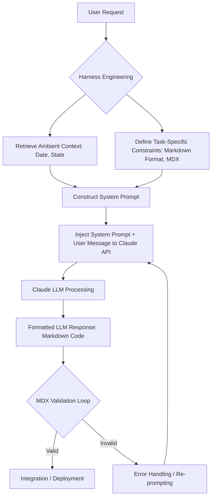

Claude와 같은 대규모 언어 모델(LLM)의 잠재력을 최대한 활용하려면 단순한 사용자 메시지 외에 시스템 프롬프트(System Prompt)를 명시적으로 제어하는 것이 필수적입니다. 시스템 프롬프트는 LLM에게 특정 역할, 제약 조건, 행동 지침, 그리고 최신 상황 정보를 제공하여 일관되고 예측 가능한 고품질 응답을 유도하는 강력한 메커니즘입니다. 특히 코드 생성 및 검증과 같은 정밀한 작업에서는 시스템 프롬프트의 역할이 더욱 중요해집니다.

## 시스템 프롬프트의 역할과 중요성

LLM과의 상호작용에서 시스템 프롬프트는 모델이 대화를 시작하기 전에 주입되는 일종의 '메타 지침'입니다. 이는 모델의 기본 페르소나와 동작 방식을 설정하며, 사용자 입력보다 높은 우선순위를 가집니다. 예를 들어, Claude 웹 및 모바일 앱은 대화 시작 시 현재 날짜와 같은 앰비언트(ambient) 정보를 시스템 프롬프트로 전달하여 모델이 항상 최신 정보를 기반으로 응답하도록 유도합니다. 이와 더불어, 코드 블록을 항상 Markdown으로 작성하게 하거나 특정 출력 형식을 강제하는 등, Claude의 응답 방식을 근본적으로 조정할 수 있습니다.

### 코드 생성 및 MDX 검증을 위한 명시적 제어

AI 에이전트 기반의 코드 하네스(harness) 환경에서 MDX (Markdown with JSX) 유효성 검사 루프를 설계할 때, Claude에게 명시적으로 Markdown 형식 코드 작성을 지시하는 시스템 프롬프트 지침은 핵심적인 역할을 합니다. 이는 모델이 생성하는 코드의 구조적 무결성을 보장하고, 후속 자동화된 검증 프로세스에서 파싱 오류를 줄이는 데 기여합니다. 예를 들어, ````markdown 항상 모든 코드 조각을 Markdown 코드 블록(```언어```)으로 작성해야 합니다. MDX 포맷팅 규칙을 엄격히 준수하십시오.````와 같은 지시를 시스템 프롬프트에 포함할 수 있습니다.

또한, `git worktree` 패턴을 활용하는 에이전트 워크플로우에서는 시스템 프롬프트를 통해 특정 Git 브랜치 상태나 현재 작업 디렉토리에 대한 정보를 전달하여, 모델이 컨텍스트를 정확하게 이해하고 관련성 높은 코드를 생성하도록 안내할 수 있습니다.

### 앰비언트 정보 관리 전략

최신 날짜, 시간, 현재 실행 중인 프로세스의 상태와 같은 앰비언트 정보는 LLM이 현실 세계와 동기화된 응답을 제공하는 데 필수적입니다. 이러한 정보는 주기적으로 업데이트되거나 동적으로 생성되어 시스템 프롬프트에 주입되어야 합니다. 예를 들어, 다음과 같은 방식으로 현재 날짜를 시스템 프롬프트에 포함할 수 있습니다.

```python
import datetime
from anthropic import Anthropic

def get_claude_response_with_system_prompt(user_message: str) -> str:
    client = Anthropic(api_key="YOUR_ANTHROPIC_API_KEY")
    
    current_date = datetime.date.today().isoformat()
    system_prompt = (
        f"You are an expert software engineer. "
        f"Always provide code in Markdown format. "
        f"Today's date is {current_date}. "
        f"Ensure all JSX within Markdown adheres to MDX specifications. "
        f"Use `javascript` or `typescript` for code blocks when applicable."
    )

    response = client.messages.create(
        model="claude-3-5-sonnet-20240620", # Or other suitable Claude model
        max_tokens=1024,
        system=system_prompt,
        messages=[
            {"role": "user", "content": user_message}
        ]
    )
    return response.content[0].text

# Example usage:
# user_query = "Write a React component for a counter with increment and decrement buttons."
# print(get_claude_response_with_system_prompt(user_query))
```

이러한 명시적 지시는 에이전트가 예상되는 출력 형식을 준수하게 하여, 후속 자동화된 프로세스(예: MDX 파서, 코드 린터)에서 발생하는 오류를 최소화하고 전체 워크플로우의 안정성을 높입니다.

## 시스템 프롬프트 처리 흐름



위 다이어그램은 시스템 프롬프트가 에이전트 워크플로우에 통합되는 방식을 보여줍니다. 사용자 요청은 하네스 엔지니어링을 통해 앰비언트 컨텍스트 및 작업별 제약 조건과 결합되어 시스템 프롬프트를 구성합니다. 이 시스템 프롬프트는 사용자 메시지와 함께 Claude LLM에 전달되어, 형식화된 응답을 생성하고 MDX 검증 루프를 거쳐 최종 결과물로 이어집니다. 유효성 검사가 실패하면 재프롬프트(re-prompting)를 통해 수정 과정을 거치게 됩니다.

## 트레이드오프

*   **정밀한 제어 vs. 프롬프트 엔지니어링 오버헤드**: 시스템 프롬프트를 명시적으로 활용하면 LLM의 응답을 세밀하게 제어할 수 있지만, 프롬프트의 설계, 테스트, 유지보수에 추가적인 엔지니어링 리소스가 필요합니다. 
    *   **언제 좋고**: 높은 정확성과 특정 출력 형식이 요구되는 자동화된 워크플로우(예: 코드 생성, 설정 파일 편집)에서 LLM의 예측 가능성을 극대화할 때 유용합니다. 
    *   **언제 나쁜지**: 빠른 프로토타이핑이나 유연성이 중요한 탐색적 대화에서는 프롬프트 오버헤드가 불필요하게 복잡성을 증가시킬 수 있습니다.
*   **일관성 vs. 유연성**: 시스템 프롬프트는 LLM의 행동에 일관된 가드레일을 제공하지만, 모델의 창의성이나 예상치 못한 상황에 대한 적응력을 제한할 수 있습니다. 
    *   **언제 좋고**: 보안 규정 준수, 특정 코딩 컨벤션 강제, 중요한 데이터 형식 보장 등 엄격한 기준이 필요한 경우에 효과적입니다. 
    *   **언제 나쁜지**: 혁신적인 아이디어 도출이나 광범위한 문제 해결이 필요한 시나리오에서는 모델의 잠재력을 억제할 수 있습니다.
*   **앰비언트 정보의 최신성 vs. 관리 복잡성**: 현재 날짜와 같은 앰비언트 정보를 시스템 프롬프트에 주입하면 모델이 최신 컨텍스트로 동작하지만, 이러한 정보의 동적인 생성 및 주입 파이프라인 관리가 복잡해질 수 있습니다. 
    *   **언제 좋고**: 시의성이 중요한 뉴스 요약, 최신 데이터 분석, 현재 시점의 소프트웨어 환경 정보(예: 패키지 버전)를 기반으로 하는 응답에 필수적입니다. 
    *   **언제 나쁜지**: 정적인 지식이나 과거 정보를 다루는 작업에서는 앰비언트 정보의 지속적인 업데이트가 불필요한 리소스 낭비가 될 수 있습니다.

## 실전 체크리스트

프로젝트에 Claude 시스템 프롬프트의 명시적 활용 전략을 적용할 때 다음 항목들을 검증합니다:

- [ ] **시스템 프롬프트 버전 관리**: 모든 시스템 프롬프트는 코드베이스와 함께 버전 관리 시스템(예: Git)에 통합되어 변경 이력을 추적할 수 있는가?
- [ ] **명시적 형식 강제**: 코드 생성 에이전트의 시스템 프롬프트에 Markdown 코드 블록 및 MDX 포맷팅 규칙이 명시적으로 포함되어 있으며, `javascript` / `typescript`와 같은 언어 지정이 일관되게 사용되는가?
- [ ] **앰비언트 정보 동기화**: 현재 날짜, 시간, 환경 변수와 같은 앰비언트 정보가 시스템 프롬프트에 주기적으로, 그리고 정확하게 주입되는 파이프라인이 구축되어 있는가?
- [ ] **출력 유효성 검증 루프**: LLM 응답 후 MDX 유효성 검사, 코드 린팅, 정적 분석과 같은 자동화된 검증 루프가 작동하며, 실패 시 시스템 프롬프트 재구성을 포함한 에러 핸들링 전략이 정의되어 있는가?
- [ ] **프롬프트 격리 및 재사용성**: 서로 다른 에이전트 또는 작업 간에 시스템 프롬프트가 적절히 격리되어 있으며, 공통된 지침은 재사용 가능한 모듈 형태로 관리되는가?
- [ ] **성능 및 비용 모니터링**: 시스템 프롬프트의 복잡성 증가가 LLM 추론 시간 및 토큰 사용량에 미치는 영향을 지속적으로 모니터링하고, 최적화 기회를 식별하는가?
- [ ] **가드레일 및 안전 메커니즘**: 시스템 프롬프트가 안전 지침(Safety Guidelines)을 포함하여 LLM의 부적절한 응답을 방지하는 가드레일 역할을 충분히 수행하는가?