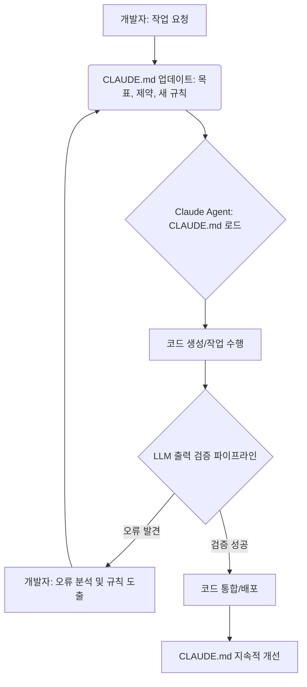

Claude Code를 활용한 개발 생산성은 단순히 프롬프트 엔지니어링을 넘어, LLM과의 상호작용에서 발생하는 문맥(context), 커스텀 명령, 병렬 세션, 그리고 프로젝트별 설정을 효과적으로 누적하고 검증하는 방식에 크게 좌우됩니다. 특히 LLM 에이전트의 자율성이 증대되는 2026년 트렌드에서, 안정적인 코드 생성 및 통합을 위해서는 예측 가능한 작업 흐름과 강력한 오류 방지 메커니즘이 필수적입니다. 이 글에서는 `CLAUDE.md` 파일을 핵심 누적 인프라로 활용하여 Claude Code 작업 흐름의 신뢰성을 극대화하고, 재발하는 오류를 체계적으로 방지하는 방법을 다룹니다.

## CLAUDE.md: 검증 중심의 누적 인프라

`CLAUDE.md`는 Anthropic Claude와의 상호작용에 필요한 모든 핵심 정보를 담는 프로젝트 루트의 Markdown 파일입니다. 이는 Karpathy LLM Wiki 패턴에서 영감을 받아, 짧고 검증 중심적인 누적 인프라 역할을 수행합니다. 단순한 지시문 목록을 넘어, Claude가 프로젝트의 목표, 제약 사항, 이전에 발생한 오류 및 이를 해결하기 위한 규칙 등을 학습하고 적용할 수 있는 동적인 지식 베이스로 기능합니다.

`CLAUDE.md`의 주요 구성 요소는 다음과 같습니다:

*   **프로젝트 목표 및 제약 조건**: 현재 작업의 핵심 목표와 Claude가 준수해야 할 기술적/비즈니스 제약 사항을 명시합니다.
*   **커스텀 명령 및 스킬**: Claude가 특정 작업을 수행할 때 사용할 수 있는 고유한 명령어나 스킬셋을 정의합니다.
*   **에러 로그 및 규칙**: 과거에 발생한 오류 사례와 해당 오류를 방지하기 위한 새로운 규칙들을 기록합니다. 이는 Claude가 같은 실수를 반복하지 않도록 학습하는 중요한 피드백 루프입니다.
*   **검증 단계**: 코드 생성 후 수행해야 할 자동화된 검증 절차나 수동 확인 사항을 명시합니다.

## 에러 방지 규칙 체계화

Claude Code 작업 흐름에서 오류는 필연적으로 발생합니다. 중요한 것은 이러한 오류를 단순히 수정하는 것을 넘어, 재발 방지를 위한 체계적인 규칙을 수립하고 이를 `CLAUDE.md`에 반영하는 것입니다. 이 과정은 다음과 같은 단계를 거칩니다.

1.  **오류 발생 및 분석**: Claude가 생성한 코드나 지시 수행 과정에서 문제가 발생하면, 그 원인을 철저히 분석합니다.
2.  **규칙 도출**: 분석된 원인을 바탕으로, 동일한 유형의 오류를 방지할 수 있는 명확하고 구체적인 규칙을 도출합니다.
3.  **CLAUDE.md에 추가**: 도출된 규칙을 `CLAUDE.md` 파일 내의 `## Error Prevention Rules` 섹션에 추가합니다. 이때 규칙은 Claude가 이해하고 적용하기 쉽도록 명료하게 작성되어야 합니다.
4.  **자동화된 검증 도입**: 가능하다면, 해당 규칙을 검증할 수 있는 단위 테스트, 린트(lint) 규칙, 또는 정적 분석 도구를 도입하여 LLM 출력 검증 파이프라인에 통합합니다.

이러한 과정을 통해 `CLAUDE.md`는 단순한 문서가 아닌, Claude 에이전트의 '장기 기억'이자 '학습된 지식'으로 기능하며 점진적으로 시스템의 견고성을 향상시킵니다.

### Claude Code 작업 흐름 예시



## CLAUDE.md 파일 구조 예시

다음은 `CLAUDE.md`의 예시 구조입니다. 실제 프로젝트의 복잡성에 따라 확장될 수 있습니다.

```markdown
# Project Name: Frontend Feature Development

## Objective
Implement a new user profile dashboard with real-time data updates using Next.js and Tailwind CSS. The dashboard should display user details, recent activity, and allow for avatar uploads.

## Constraints
*   Use React 18 and Next.js 14 App Router.
*   Ensure full responsiveness across desktop, tablet, and mobile.
*   API endpoints: `/api/user/:id` for details, `/api/user/:id/activity` for activity.
*   Avatar uploads must use pre-signed S3 URLs.
*   Strict adherence to provided design system components.
*   Performance budget: Initial load < 2 seconds on a slow 3G connection.

## Custom Commands & Skills
*   `generate-component <name> <props>`: Generate a new React component with TSX and Tailwind styling.
*   `refactor-for-performance <file>`: Analyze and refactor the given file for performance bottlenecks (e.g., unnecessary re-renders, large bundle size).
*   `run-lint-fix`: Execute ESLint with `--fix` option.

## Error Log & Prevention Rules

### [2026-05-20] Incorrect API endpoint usage for user activity
*   **Error**: Claude generated `fetch('/api/user/activity/:id')` instead of `fetch('/api/user/:id/activity')`.
*   **Rule**: When generating API calls for user-specific sub-resources, always place the user ID segment immediately after `/api/user/`. E.g., `/api/user/{id}/resource`, not `/api/resource/{id}/user` or `/api/user-resource/{id}`.
*   **Verification**: Ensure all generated API paths match the `/api/user/:id/...` pattern for authenticated routes. Add a regex check in CI/CD.

### [2026-05-22] Hardcoded styles instead of Tailwind classes
*   **Error**: Inline style objects were used for layout, violating Tailwind CSS constraint.
*   **Rule**: Prioritize Tailwind CSS utility classes for all styling. Only use inline styles for dynamic, calculation-based properties, or when Tailwind cannot express the required style directly (with a comment explanation).
*   **Verification**: Add a custom ESLint rule to flag inline style objects (`style={{...}}`) in TSX files that are not explicitly whitelisted.

## Validation Steps
1.  **Unit Tests**: All generated components must have corresponding unit tests passing.
2.  **Linting**: Ensure `pnpm lint` passes without warnings or errors.
3.  **Type Checking**: Ensure `pnpm type-check` passes.
4.  **Responsiveness Check**: Verify responsive layouts on `xs`, `sm`, `md`, `lg`, `xl` breakpoints (automated screenshot tests).
5.  **Performance Audit**: Run Lighthouse audit, ensuring scores > 90 for performance.
```

## 트레이드오프

### 1. 초기 설정 및 유지보수 오버헤드 (Initial Setup & Maintenance Overhead)
*   **언제 좋은가**: 프로젝트의 규모가 커지고, Claude Code의 사용 빈도가 높아질수록 `CLAUDE.md`의 가치는 증대됩니다. 초기 투자로 장기적인 코드 품질과 에이전트의 자율성 및 신뢰성을 크게 향상시킬 수 있습니다.
*   **언제 나쁜가**: 소규모의 일회성 스크립트나 간단한 작업에서는 `CLAUDE.md`를 작성하고 유지하는 것이 불필요한 오버헤드가 될 수 있습니다. 단순한 프롬프트만으로도 충분한 경우도 있습니다.

### 2. 에이전트 자율성 및 제어의 균형 (Balance of Agent Autonomy & Control)
*   **언제 좋은가**: `CLAUDE.md`는 에이전트에게 필요한 문맥과 규칙을 명확하게 제공하여, 일관된 품질의 결과를 도출하고 불필요한 시행착오를 줄여 자율성을 효과적으로 통제합니다.
*   **언제 나쁜가**: 너무 상세하고 엄격한 규칙은 Claude의 창의적인 문제 해결 능력을 저해하거나, 예상치 못한 상황에서 유연하게 대처하기 어렵게 만들 수 있습니다. 과도한 제어는 에이전트의 잠재력을 제한합니다.

### 3. 지식 축적 및 전파 (Knowledge Accumulation & Propagation)
*   **언제 좋은가**: 팀 내 Claude Code 작업 경험이 `CLAUDE.md`에 지속적으로 축적되어, 새로운 팀원이 빠르게 온보딩하고, 모두가 일관된 기준과 모범 사례를 따를 수 있게 합니다. 에이전트의 학습 효과도 극대화됩니다.
*   **언제 나쁜가**: `CLAUDE.md` 내용이 최신 상태로 유지되지 않거나, 너무 많은 정보가 비정형적으로 축적되면 오히려 혼란을 가중시키고 Claude가 핵심 정보를 추출하는 데 방해가 될 수 있습니다. 문서의 '신선도' 관리가 중요합니다.

### 4. 확장성 및 복잡성 관리 (Scalability & Complexity Management)
*   **언제 좋은가**: 여러 하위 에이전트 또는 병렬 세션을 관리하는 복잡한 워크플로우에서 `CLAUDE.md`는 각 에이전트의 역할을 명확히 하고, 공유된 지식 기반을 제공하여 전체 시스템의 일관성과 확장성을 높입니다.
*   **언제 나쁜가**: 단일 에이전트가 매우 간단한 태스크를 수행하는 환경에서는 `CLAUDE.md`를 통해 관리해야 할 '문맥'이나 '규칙' 자체가 적어, 별도의 파일로 관리하는 것이 비효율적일 수 있습니다.

## 실전 체크리스트

`CLAUDE.md` 기반의 오류 방지 및 검증 체계를 프로젝트에 성공적으로 도입하기 위한 실전 체크리스트입니다.

*   [ ] **초기 `CLAUDE.md` 초안 작성**: 프로젝트 목표, 핵심 제약 조건, 초기 커스텀 스킬 목록을 포함하는 `CLAUDE.md` 파일을 프로젝트 루트에 생성했는가?
*   [ ] **오류 발생 시 규칙 추가 워크플로우 정의**: Claude Code 사용 중 오류가 발생했을 때, 해당 오류를 분석하고 재발 방지 규칙을 `CLAUDE.md`에 추가하는 명확한 프로세스를 팀 내에 공유하고 교육했는가?
*   [ ] **자동화된 검증 파이프라인 연동**: `CLAUDE.md`에 명시된 주요 에러 방지 규칙 중 자동화 가능한 항목(예: 특정 API 패턴, 스타일 가이드 위반)을 CI/CD 파이프라인의 린트, 테스트 스크립트와 연동하여 자동 검증하도록 설정했는가?
*   [ ] **정기적인 `CLAUDE.md` 리뷰 및 업데이트**: 최소 주 1회 또는 주요 스프린트 마다 `CLAUDE.md` 파일의 내용을 검토하고, 최신 정보와 학습된 교훈을 반영하여 업데이트하는 절차를 수립했는가?
*   [ ] **Claude 에이전트의 `CLAUDE.md` 활용 모니터링**: Claude가 `CLAUDE.md`의 규칙과 문맥을 실제로 참조하여 작업을 수행하고 있는지, 그리고 그 효과는 어떠한지 로그 분석 등을 통해 주기적으로 모니터링하는 체계를 갖추었는가?
*   [ ] **팀원 온보딩 시 `CLAUDE.md` 교육 포함**: 새로운 팀원이 프로젝트에 합류할 때, `CLAUDE.md`의 중요성, 사용법, 그리고 업데이트 규칙을 포함한 교육을 제공하고 있는가?
*   [ ] **`CLAUDE.md` 버전 관리 및 변경 이력 추적**: `CLAUDE.md` 파일이 Git과 같은 버전 관리 시스템에 의해 관리되며, 변경 이력과 기여자 정보를 명확히 추적할 수 있도록 설정되었는가? (이는 `silent-drift` 방지에 중요)