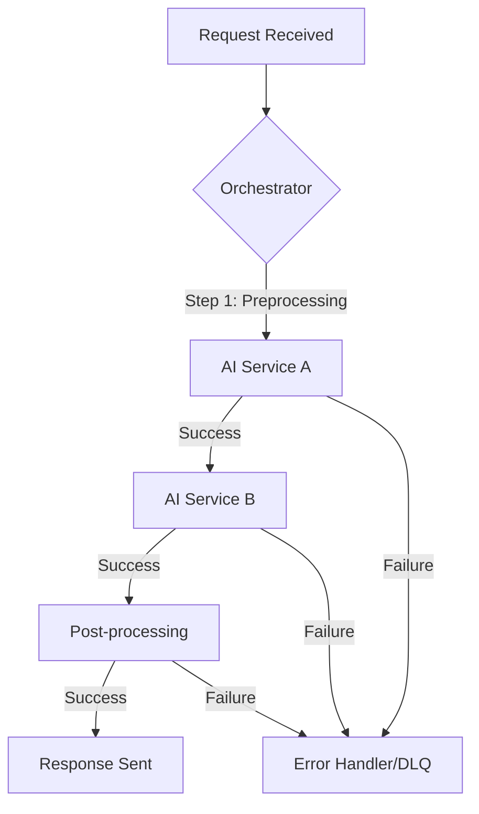
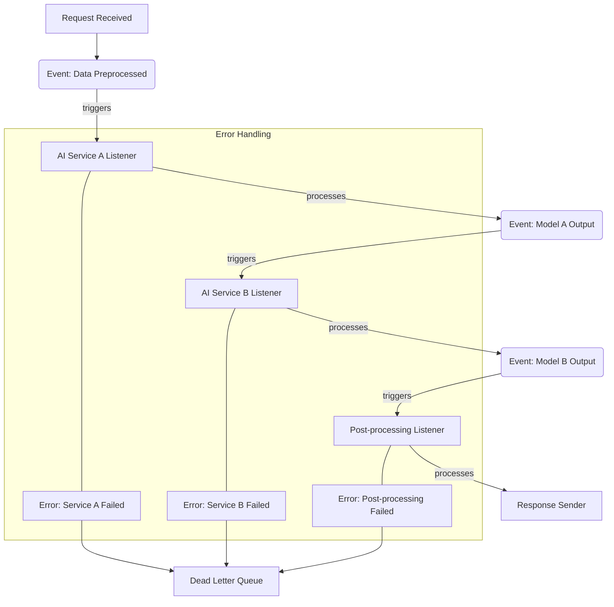

The increasing complexity of AI services necessitates robust workflow management techniques that inherently incorporate concurrency and fault tolerance. As AI models become integral to critical business operations, their underlying services must maintain high availability and reliability, even under stress or partial failures. This entry explores key design patterns and strategies to achieve concurrent and fault-tolerant AI service workflows.

### Why Concurrent and Fault-Tolerant AI Workflows?

Modern AI applications, especially those involving large language models (LLMs) or complex multi-modal processing, often entail multiple sequential or parallel steps. These steps might include:
*   Data ingestion and preprocessing
*   Multiple AI model inferences (e.g., one for classification, another for generation)
*   External API calls (e.g., for RAG, tool use)
*   Post-processing and result delivery

Without careful design, a failure in any single step can cascade, leading to service outages, data corruption, or inconsistent results. Concurrency allows for efficient utilization of resources and reduced latency by executing independent tasks simultaneously. Fault tolerance ensures that the system can gracefully handle failures, recover, and continue operation, minimizing disruption.

### Core Principles for Robust AI Workflows

#### Concurrency for Performance and Responsiveness

Concurrency enables AI services to process multiple requests or execute multiple internal tasks in parallel, significantly improving throughput and reducing perceived latency. This is crucial for real-time AI applications or those handling high volumes of requests.

*   **Asynchronous Programming**: Leveraging `async/await` constructs in languages like Python or JavaScript allows for non-blocking I/O operations, which are common when interacting with LLM APIs, databases, or external services.
*   **Worker Pools & Message Queues**: Distributing tasks across a pool of workers, often coordinated via message queues (e.g., Kafka, RabbitMQ, SQS), facilitates parallel execution and decoupling of services.

#### Fault Tolerance for Reliability and Resilience

Fault tolerance mechanisms protect the system from unexpected failures and enable recovery.

*   **Retries with Backoff**: Transient failures (e.g., network glitches, temporary API unavailability) can often be resolved by retrying the operation after a short delay, potentially with an exponential backoff strategy.
*   **Circuit Breakers**: Prevent a service from repeatedly trying to access a failing downstream dependency, allowing the dependency time to recover and preventing resource exhaustion in the calling service.
*   **Idempotency**: Designing operations such that executing them multiple times has the same effect as executing them once. This is critical for retry mechanisms, ensuring that partial failures and retries do not lead to unintended side effects (e.g., duplicate payments).
*   **Dead Letter Queues (DLQ)**: A separate queue for messages that cannot be processed successfully after a certain number of retries, preventing them from blocking the main queue and providing a mechanism for manual inspection or alternative processing.
*   **Compensation Patterns (Saga Pattern)**: For distributed transactions spanning multiple services, a Saga pattern ensures atomicity by defining a sequence of local transactions, each with a corresponding compensation action to undo its effect if a subsequent transaction fails.

### Workflow Orchestration Patterns

AI service workflows often involve complex sequences and dependencies. Two primary orchestration patterns emerge:

#### 1. Orchestration

In an orchestrated workflow, a central component (orchestrator) explicitly defines and manages the sequence of steps, invoking services, and handling state transitions.



*   **Pros**: Centralized control, easier to understand complex flows, clear visibility of workflow state.
*   **Cons**: Potential single point of failure (if orchestrator is not resilient), can become a bottleneck, tight coupling between orchestrator and services.

#### 2. Choreography

In a choreographed workflow, services react to events emitted by other services, with no central coordinator. Each service knows its role and responsibilities.



*   **Pros**: Highly decoupled services, resilient to individual service failures, scalable.
*   **Cons**: Harder to get an overall view of the workflow, complex debugging, potential for circular dependencies if not designed carefully.

### Example: Concurrent AI Task Processing with Retries

Consider an AI service that needs to process multiple sub-tasks concurrently, each involving an LLM call, and requires fault tolerance for transient API issues.

```python
import asyncio
import httpx
import logging
from tenacity import retry, wait_exponential, stop_after_attempt, before_sleep_log, retry_if_exception_type

logging.basicConfig(level=logging.INFO)
logger = logging.getLogger(__name__)

# Simulate an external LLM API call that might fail
async def call_llm_api(task_id: int) -> str:
    if task_id % 3 == 0: # Simulate transient failure for some tasks
        logger.warning(f"Task {task_id}: Simulating transient error.")
        raise httpx.RequestError("LLM API temporarily unavailable")
    await asyncio.sleep(0.5) # Simulate API latency
    logger.info(f"Task {task_id}: LLM API call successful.")
    return f"LLM_Output_for_Task_{task_id}"

@retry(
    wait=wait_exponential(multiplier=1, min=1, max=10),
    stop=stop_after_attempt(3),
    before_sleep=before_sleep_log(logger, logging.INFO),
    retry=retry_if_exception_type(httpx.RequestError)
)
async def process_ai_subtask(task_id: int) -> str:
    logger.info(f"Processing subtask {task_id}")
    try:
        result = await call_llm_api(task_id)
        logger.info(f"Subtask {task_id} completed with result: {result}")
        return result
    except httpx.RequestError as e:
        logger.error(f"Subtask {task_id} failed after retries: {e}")
        raise # Re-raise if retries exhausted

async def main_workflow(task_ids: list[int]):
    tasks = [process_ai_subtask(tid) for tid in task_ids]
    results = await asyncio.gather(*tasks, return_exceptions=True) # Continue even if some tasks fail

    successful_results = []
    failed_tasks = []

    for i, res in enumerate(results):
        if isinstance(res, Exception):
            logger.error(f"Task {task_ids[i]} ultimately failed: {res}")
            failed_tasks.append(task_ids[i])
        else:
            successful_results.append(res)
    
    logger.info(f"Workflow completed. Successful results: {len(successful_results)}, Failed tasks: {len(failed_tasks)}")
    logger.info(f"Successful outputs: {successful_results}")
    logger.info(f"Failed task IDs: {failed_tasks}")

if __name__ == "__main__":
    task_list = [1, 2, 3, 4, 5, 6, 7, 8, 9, 10]
    asyncio.run(main_workflow(task_list))
```

This example demonstrates:
*   `asyncio.gather` for concurrent execution of multiple AI sub-tasks.
*   The `tenacity` library for implementing robust retry logic with exponential backoff for transient HTTP errors.
*   `return_exceptions=True` in `asyncio.gather` ensures that even if some tasks fail, the entire workflow does not crash, and successful tasks can still complete. Failed tasks are collected for further handling (e.g., sending to a DLQ).

### 2026 Trends in AI Workflow Resilience

The year 2026 sees an increased emphasis on:
*   **Agentic AI Systems**: Multi-agent architectures where agents collaborate and autonomously recover from failures. Fault tolerance extends to agent coordination protocols and shared state management. The "ouroboros-agent-performance-cost-optimization" becomes critical.
*   **Real-time AI Inference**: Low-latency requirements for many AI applications push for highly optimized concurrent processing pipelines and immediate error detection/recovery.
*   **Explainable AI (XAI) for Debugging**: As workflows become more complex, XAI techniques are employed not just for model decisions but also for understanding workflow failures and pinpointing root causes.
*   **Responsible AI & Guardrails**: Workflows integrate sophisticated guardrails (e.g., "production-db-ai-agent-guardrails") and validation steps (`llm-output-validation-quality-metrics-design`) to prevent harmful outputs or system misuse, necessitating robust error handling for policy violations.
*   **Workflow as Code**: Defining and managing AI workflows using code-based tools (like Airflow, Kubeflow, or custom solutions) allows for version control, automated testing, and easier deployment of fault-tolerant configurations.

## 트레이드오프

### 1. Orchestration vs. Choreography

*   **언제 좋고**:
    *   **Orchestration**: 복잡한 비즈니스 로직이 중앙에서 관리되어야 하거나, 전체 워크플로우의 상태 추적 및 모니터링이 용이해야 할 때. (예: 대규모 언어 모델 기반의 다단계 추론 파이프라인)
    *   **Choreography**: 서비스 간의 독립성이 매우 중요하고, 확장성이 최우선이며, 각 서비스가 자체적인 책임 범위 내에서 자율적으로 동작해야 할 때. (예: 마이크로서비스 아키텍처에서 이벤트 기반 통신)
*   **언제 나쁜지**:
    *   **Orchestration**: 오케스트레이터가 단일 장애 지점이 될 수 있고, 시스템 전체의 병목 현상을 유발할 수 있으며, 서비스 간 결합도가 높아질 수 있습니다.
    *   **Choreography**: 전체 워크플로우의 흐름을 이해하고 디버깅하기 어렵고, 이벤트의 순서 보장 및 누락 처리가 복잡해질 수 있습니다.

### 2. 강력한 일관성(Strong Consistency) vs. 최종 일관성(Eventual Consistency)

*   **언제 좋고**:
    *   **강력한 일관성**: 금융 거래와 같이 데이터의 즉각적인 정확성과 일관성이 절대적으로 요구되는 경우. (예: AI 기반 사기 탐지 시스템의 즉각적인 조치)
    *   **최종 일관성**: 실시간으로 모든 데이터가 완벽하게 동기화될 필요는 없지만, 일정 시간 내에 데이터가 일관성을 유지하면 되는 경우. 높은 가용성과 확장성이 중요할 때. (예: 사용자 추천 시스템, 비동기 데이터 처리 파이프라인)
*   **언제 나쁜지**:
    *   **강력한 일관성**: 시스템의 복잡성과 성능 저하를 야기할 수 있으며, 분산 시스템에서 구현하기 어렵고 비용이 많이 듭니다.
    *   **최종 일관성**: 일시적으로 데이터 불일치가 발생할 수 있으므로, 해당 불일치가 비즈니스 로직에 미치는 영향을 신중하게 고려해야 합니다.

### 3. 동기(Synchronous) 처리 vs. 비동기(Asynchronous) 처리

*   **언제 좋고**:
    *   **동기 처리**: 응답이 즉시 필요하고, 작업 시간이 짧으며, 후속 작업이 이전 작업의 결과에 즉시 의존하는 경우. (예: 사용자 인터페이스의 즉각적인 피드백)
    *   **비동기 처리**: 작업 시간이 길거나, 외부 시스템 호출이 많아 대기 시간이 발생하는 경우, 시스템의 전반적인 처리량과 응답성을 높여야 할 때. (예: LLM 추론, 대규모 데이터 배치 처리)
*   **언제 나쁜지**:
    *   **동기 처리**: 블로킹(blocking) 방식으로 인해 I/O 바운드 작업에서 리소스 활용 효율이 떨어지고, 전체 시스템의 확장성을 저해할 수 있습니다.
    *   **비동기 처리**: 코드의 복잡성이 증가하고, 디버깅이 어려워질 수 있으며, 콜백 헬(callback hell)과 같은 문제가 발생할 수 있습니다.

### 4. 재시도(Retries)와 서킷 브레이커(Circuit Breaker)

*   **언제 좋고**:
    *   **재시도**: 일시적인 네트워크 문제, 리소스 고갈 등의 `httpx.RequestError`와 같은 transient 오류에 대해 시스템이 자체적으로 복구하도록 할 때.
    *   **서킷 브레이커**: 반복되는 서비스 실패로 인해 시스템 전체의 장애로 확산되는 것을 방지하고, 장애 서비스에 대한 부하를 줄여 회복 시간을 벌어줄 때.
*   **언제 나쁜지**:
    *   **재시도**: 영구적인 오류에 대해 무의미한 재시도를 반복하여 리소스를 낭비하고, 장애 복구 시간을 지연시킬 수 있습니다.
    *   **서킷 브레이커**: 너무 민감하게 설정하면 정상적인 일시적 오류에도 불필요하게 서킷이 열려 서비스 가용성에 영향을 줄 수 있습니다.

## 실전 체크리스트

AI 서비스 워크플로우에 동시성과 내결함성을 적용할 때 다음 항목들을 점검하십시오.

- [ ] **엔드포인트 및 외부 API 호출에 대한 재시도 정책 정의**: 각 외부 종속성에 대해 최대 재시도 횟수, 초기 지연 시간, 백오프 전략(예: Exponential Backoff)을 명확히 설정하고 구현했는지 확인합니다.
- [ ] **주요 서비스 컴포넌트에 서킷 브레이커 패턴 적용**: 과도한 재시도로 인한 다운스트림 서비스의 부하 증가 및 연쇄 장애를 방지하기 위해 임계값(Threshold), 쿨다운 기간(Cooldown Period)을 정의하고 서킷 브레이커를 구성했는지 확인합니다.
- [ ] **워크플로우의 각 단계별로 Idempotency 보장**: 재시도 시 중복 처리가 발생하지 않도록 각 작업이 멱등성(Idempotency)을 가지도록 설계되었는지, 필요한 경우 멱등성 키(Idempotency Key) 등을 활용하고 있는지 점검합니다.
- [ ] **비동기 메시징 시스템(예: Kafka, RabbitMQ)에 Dead Letter Queue (DLQ) 구성**: 처리 실패한 메시지가 메인 큐를 막지 않고, 향후 분석 및 수동 처리를 위해 DLQ로 전송되도록 설정되어 있는지 확인합니다.
- [ ] **분산 트랜잭션 시 Saga 패턴 또는 보상 트랜잭션 도입**: 여러 서비스에 걸쳐 복잡한 상태 변경이 발생할 때, 한 단계의 실패가 전체를 롤백하거나 보상 작업을 통해 일관성을 유지하도록 설계되었는지 점검합니다.
- [ ] **로드 테스트 및 장애 주입 테스트(Chaos Engineering) 수행**: 설계된 동시성 및 내결함성 메커니즘이 실제 부하 및 다양한 장애 시나리오에서 예상대로 동작하는지 검증합니다.
- [ ] **모니터링 및 경고 시스템 구축**: 재시도 횟수, 서킷 브레이커 상태, DLQ 메시지 수, 워크플로우 실패율 등을 실시간으로 모니터링하고, 이상 감지 시 적절한 경고가 발송되도록 시스템을 구축했는지 확인합니다.