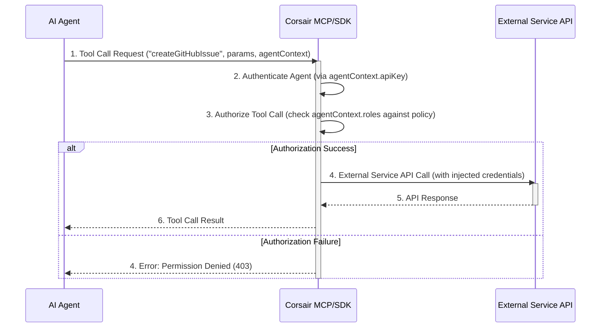

AI 에이전트의 외부 서비스 연동은 Gmail, Slack, GitHub 등 다양한 서비스와의 상호작용을 가능하게 하지만, 인증, 권한, 보안 관리에 복잡성을 초래한다. 특히 대규모 에이전트 시스템에서는 이러한 개별 관리가 비효율적이다. TypeScript 기반의 Corsair는 AI 에이전트의 외부 서비스 연결 및 권한 관리를 통합하는 Management and Control Plane (MCP) 라이브러리다.

Corsair는 에이전트가 외부 서비스를 안전하고 효율적으로 호출하도록 추상화된 통합 레이어를 제공한다. 에이전트는 개별 API 구현 대신 Corsair를 통해 ‘도구(Tool)’를 호출하며, Corsair는 이를 실제 서비스 API로 변환하고, 인증 주입 및 권한 정책에 따라 실행 여부를 결정한다. 이를 통해 개발자는 에이전트 핵심 로직에 집중하고 외부 서비스 연동의 복잡성과 보안 리스크를 Corsair에 위임할 수 있다.

### Corsair 아키텍처 및 동작 원리

Corsair는 MCP를 별도 서비스로 배포하는 중앙 집중식 방식과, SDK를 에이전트 애플리케이션 내에 직접 임베딩하는 분산 방식 두 가지로 통합될 수 있다. 동작 원리는 다음과 같다:
1.  **도구 정의**: 외부 서비스 기능을 ‘도구’로 정의하고 Corsair에 등록.
2.  **권한 정책**: 각 도구에 대한 호출 가능한 에이전트/역할, 실행 조건 정의.
3.  **에이전트 호출**: AI 에이전트가 등록된 도구를 호출.
4.  **Corsair 중재**: 호출을 가로채어 인증 처리, 권한 확인 후 실제 서비스 API 호출.
5.  **응답 반환**: 서비스 응답을 에이전트에게 전달.
이 과정으로 에이전트 개발자는 개별 서비스 API와 인증 로직 없이도 외부 서비스 연동 및 중앙 집중식 로깅, 모니터링, 감사 기능을 구축할 수 있다.

### 코드 예제: Corsair를 이용한 GitHub Issue 생성

다음은 TypeScript 환경에서 Corsair를 사용하여 AI 에이전트가 GitHub 이슈를 생성하는 과정을 시뮬레이션하는 코드 예제이다.

```typescript
import { CorsairClient, ToolDefinition, AuthorizationPolicy } from 'corsair-mcp';

const corsair = new CorsairClient({
  apiUrl: 'http://localhost:3000/api/corsair',
  apiKey: 'YOUR_CORS_SECRET_KEY',
});

const createGitHubIssueTool: ToolDefinition = {
  name: 'createGitHubIssue',
  description: 'GitHub 이슈 생성',
  parameters: {
    type: 'object',
    properties: {
      owner: { type: 'string' },
      repo: { type: 'string' },
      title: { type: 'string' },
      body: { type: 'string', optional: true },
      labels: { type: 'array', items: { type: 'string' }, optional: true },
    },
    required: ['owner', 'repo', 'title'],
  },
  authorizationPolicy: AuthorizationPolicy.allowRoles(['issue-creator-agent']),
};

async function agentCreateIssue(
  agentId: string, repoOwner: string, repoName: string, issueTitle: string, issueBody?: string, issueLabels?: string[]
) {
  try {
    console.log(`Agent '${agentId}' calling createGitHubIssue for ${repoOwner}/${repoName}...`);
    const result = await corsair.callTool(
      createGitHubIssueTool.name,
      { owner: repoOwner, repo: repoName, title: issueTitle, body: issueBody, labels: issueLabels },
      { agentId, roles: ['issue-creator-agent'] }
    );
    console.log('GitHub Issue created:', result);
    return result;
  } catch (error: any) {
    console.error(`Error creating GitHub issue: ${error.message}`);
    if (error.response && error.response.status === 403) {
      console.error('Permission denied.');
    }
    throw error;
  }
}

(async () => {
  await agentCreateIssue(
    'ai-dev-agent-001', 'my-org', 'my-project-repo',
    'Bug: Frontend button not clickable', 'Clicking submit button does nothing.', ['bug']
  );
  try {
    await agentCreateIssue(
      'unauthorized-agent-002', 'my-org', 'my-project-repo',
      'Feature Request: Dark Mode', 'Add dark mode to application.', ['feature']
    );
  } catch (e: any) {
    console.log(`Unauthorized agent test: ${e.message}`);
  }
})();
```

### Corsair 외부 서비스 연동 흐름



Corsair는 2026년 현재 고도화되는 AI 에이전트의 복잡한 워크플로우를 지원하기 위한 핵심 인프라 요소로 자리매김하고 있다. 중앙 집중식 관리와 자동화를 통해 에이전트 개발 및 운영의 효율성을 크게 높일 수 있다.

## 트레이드오프

Corsair 사용은 다음과 같은 트레이드오프를 수반한다.

*   **중앙 집중식 권한 관리**: 단일 제어 지점으로 보안/감사를 강화.
    *   **장점**: 다수 에이전트의 세분화된 권한 관리에 효과적. 보안 정책 일관성 및 컴플라이언스 유리.
    *   **단점**: 소규모 프로젝트에 불필요한 복잡성 추가. MCP 자체 보안 취약 시 단일 실패 지점 위험.

*   **자동화된 서비스 통합**: 복잡한 API 연동/인증 플로우 추상화로 개발 오버헤드 감소, 속도 향상.
    *   **장점**: 신규 서비스 빠른 통합, 연동 표준화에 유리. 에이전트 개발자의 API 학습 부담 경감.
    *   **단점**: 고도로 커스터마이징된 로직이나 미지원 API 사용 시 유연성 저하. 추상화로 디버깅 어려움.

*   **보안 강화 및 감사 용이성**: 모든 외부 호출 로깅/모니터링으로 위협 탐지 및 규제 준수 지원.
    *   **장점**: 민감 데이터 접근 에이전트나 규제 준수 중요 산업에서 필수적. 비정상 접근 신속 감지.
    *   **단점**: 로깅/모니터링 인프라 구축/유지보수 비용 발생. 과도한 로깅은 성능 저하 야기. 로그 데이터 보안 관리 필요.

## 실전 체크리스트

Corsair 활용 시 다음 항목들을 검토해야 한다.

- [ ] **MCP 인스턴스**: 프로덕션에 최적화된 Corsair MCP 인스턴스가 안정적으로 배포 및 운영되는가?
- [ ] **외부 서비스 등록**: 연동할 모든 서비스 (GitHub, Slack)가 Corsair에 도구로 정의 및 등록되었으며, API 호출이 정상 동작하는가?
- [ ] **최소 권한 원칙**: 각 AI 에이전트의 외부 서비스 접근 권한이 '최소 권한 원칙'에 따라 세분화되었으며, 불필요한 권한은 없는가?
- [ ] **인증 정보 보안**: Corsair가 API 키/OAuth 토큰 등 민감 정보를 안전하게 저장/관리(비밀 관리 시스템 연동, 암호화)하며, 에이전트에게 노출되지 않는가?
- [ ] **오류 처리/로깅**: 외부 서비스 호출 실패, 권한 거부 등 오류 상황에 대한 적절한 예외 처리, 재시도, 상세 로깅 메커니즘이 구현되었는가?
- [ ] **성능/확장성**: Corsair 통합 후 에이전트 외부 서비스 호출 Latency, 처리량 등 성능 지표를 벤치마킹하여 목표 달성 및 확장성을 확보했는가?
- [ ] **감사/모니터링 연동**: Corsair의 모든 외부 서비스 접근 기록이 중앙 로깅/모니터링 시스템과 연동되어 실시간 감시 및 이상 징후 경고가 설정되어 있는가?