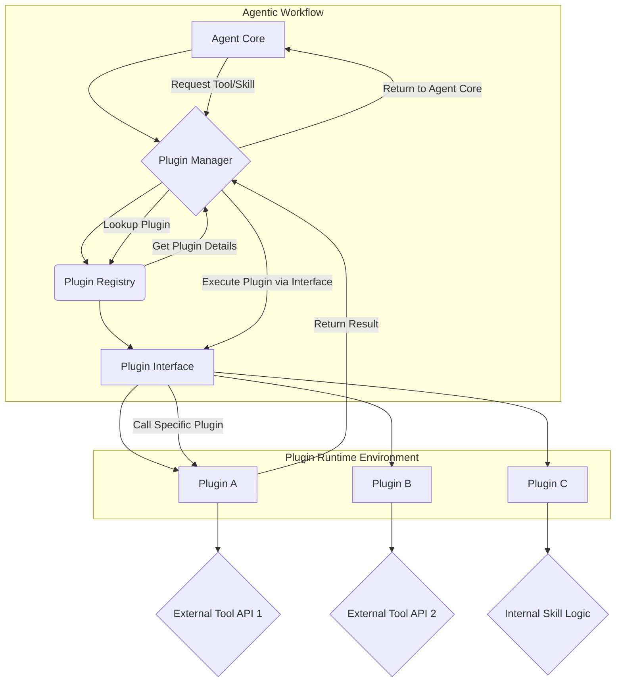

The DeepSeek Harness, characterized by its "everything is a plugin" architecture, offers a robust blueprint for constructing highly extensible and adaptable agent systems. This paradigm, inspired by Cordis, fundamentally shifts how agents integrate tools, skills, and interfaces, moving towards a modular, composable ecosystem. By adopting such an architecture for playbook agent harnesses, organizations can achieve unparalleled flexibility in evolving agent capabilities and accelerating development cycles.

## 핵심 개념: 플러그인 중심 아키텍처 (Plugin-Centric Architecture)

플러그인 중심 아키텍처는 시스템의 코어 로직과 개별 기능 단위를 분리하여, 새로운 기능 추가나 기존 기능 변경 시 코어 시스템에 미치는 영향을 최소화한다. DeepSeek Harness에서 '플러그인'은 특정 작업을 수행하는 독립적인 모듈로, 에이전트가 외부 서비스와 상호작용하거나 복잡한 로직을 실행하는 데 필요한 도구(Tools), 특정 작업 흐름을 정의하는 스킬(Skills), 사용자 또는 다른 시스템과의 접점인 인터페이스(Interfaces)를 포함한다.

이 아키텍처의 핵심 요소는 다음과 같다:
*   **플러그인 관리자 (Plugin Manager)**: 플러그인을 로드, 언로드, 활성화/비활성화하고, 생명주기를 관리하는 중앙 컴포넌트.
*   **플러그인 레지스트리 (Plugin Registry)**: 사용 가능한 모든 플러그인과 그 메타데이터(설명, 버전, 종속성 등)를 추적하는 저장소.
*   **플러그인 인터페이스 (Plugin Interface)**: 플러그인이 코어 시스템과 통신하고 상호작용하기 위한 표준화된 API 계약.
*   **플러그인 런타임 (Plugin Runtime)**: 플러그인이 격리된 환경에서 안전하게 실행되도록 보장하는 환경.

이러한 구조는 에이전트의 기능을 '레고 블록'처럼 조합하고 확장할 수 있게 하여, 특정 도메인에 특화된 에이전트를 빠르게 구축하거나, 변화하는 요구사항에 맞춰 유연하게 기능을 추가할 수 있는 기반을 마련한다.

## DeepSeek Harness의 '모든 것이 플러그인' 모델 분석

DeepSeek Harness는 에이전트의 모든 상호작용과 기능 수행을 플러그인을 통해 추상화한다. 이는 다음과 같은 이점을 제공한다:

*   **모듈성 (Modularity)**: 각 기능이 독립적인 플러그인으로 캡슐화되어 개발, 테스트, 배포가 용이하다.
*   **확장성 (Extensibility)**: 새로운 도구나 서비스가 등장할 때마다 코어 시스템 변경 없이 플러그인만 추가하면 된다.
*   **재사용성 (Reusability)**: 한번 개발된 플러그인은 다양한 에이전트나 playbook에서 재사용될 수 있다.
*   **유지보수성 (Maintainability)**: 특정 플러그인의 버그나 업데이트가 전체 시스템에 미치는 영향을 제한한다.

이러한 원칙은 복잡한 에이전트 하네스 설계에 필수적이며, 특히 다양한 LLM과 외부 API를 통합해야 하는 2026년의 Agentic workflow 트렌드에 부합한다.

## Playbook 하네스 설계 개선 방안

Playbook의 에이전트 하네스에 DeepSeek Harness의 플러그인 아키텍처를 적용하기 위한 구체적인 개선 방안은 다음과 같다.

### 1. Unified Plugin Interface 정의 (통합 플러그인 인터페이스)
모든 도구, 스킬, 인터페이스가 따를 수 있는 명확하고 일관된 인터페이스를 정의한다. 이는 LLM이 도구를 선택하고 사용하기 위한 프롬프트 엔지니어링 패턴과도 연동될 수 있다.

```typescript
// TypeScript 예제: 통합 플러그인 인터페이스 정의
interface AgentToolPlugin {
  id: string; // Unique identifier for the plugin
  name: string; // Human-readable name
  description: string; // Description for LLM tool selection
  version: string;
  run(args: Record<string, any>): Promise<any>; // Main execution logic
  schema: Record<string, any>; // JSON Schema for 'args' validation
}

class SearchTool implements AgentToolPlugin {
  id = "search_tool";
  name = "WebSearch";
  description = "Perform a web search for given query.";
  version = "1.0.0";
  schema = {
    type: "object",
    properties: {
      query: { type: "string", description: "Search query" }
    },
    required: ["query"]
  };

  async run(args: { query: string }): Promise<string> {
    console.log(`Executing web search for: ${args.query}`);
    // Simulate API call
    await new Promise(resolve => setTimeout(resolve, 500));
    return `Search results for "${args.query}": ... (simulated)`;
  }
}

// Plugin Registry
const pluginRegistry = new Map<string, AgentToolPlugin>();
pluginRegistry.set("web_search", new SearchTool());

// Example usage by an agent harness
async function executeAgentAction(toolId: string, params: Record<string, any>) {
  const plugin = pluginRegistry.get(toolId);
  if (!plugin) {
    throw new Error(`Plugin "${toolId}" not found.`);
  }
  // Basic schema validation
  // const validationResult = validate(params, plugin.schema); // Assume 'validate' function exists
  // if (!validationResult.valid) {
  //   throw new Error(`Invalid parameters for ${toolId}: ${validationResult.errors}`);
  // }
  return await plugin.run(params);
}

// await executeAgentAction("web_search", { query: "DeepSeek Harness" });
```
위 코드는 `AgentToolPlugin` 인터페이스를 통해 모든 플러그인이 일관된 `run` 메서드와 `schema`를 가지도록 강제한다. 이를 통해 에이전트는 동적으로 플러그인을 탐색하고, 적절한 인자를 사용하여 실행할 수 있다. `validate` 함수는 JSON Schema를 이용한 인자 유효성 검사를 시뮬레이션한다.

### 2. Dynamic Plugin Loading 및 Discovery
런타임에 플러그인을 동적으로 로드하고 등록하는 메커니즘을 구현한다. 이는 특정 조건(예: 특정 태스크가 필요할 때)에서만 플러그인을 로드하여 리소스 사용을 최적화하는 데 도움이 된다. 또한, 새로운 플러그인이 추가되면 자동으로 검색하여 등록하는 시스템을 갖춰야 한다.

### 3. Isolated Plugin Runtime (격리된 플러그인 런타임)
플러그인 간의 간섭을 방지하고 보안을 강화하기 위해 각 플러그인을 격리된 환경(예: 샌드박스, 컨테이너, 별도의 프로세스)에서 실행한다. 이는 잠재적으로 악성 플러그인이 전체 시스템에 미치는 영향을 최소화한다.

### 4. Versioning 및 Dependency Management
플러그인 버전 관리 시스템을 도입하여 호환성 문제를 방지하고, 플러그인 간의 종속성을 명확히 관리한다. 이는 Semantic Versioning (SemVer)과 같은 표준을 따르며, 2026년에는 AI 기반의 종속성 충돌 해결 및 자동 업데이트 기능이 중요해질 것이다.

### 5. AI-driven Plugin Orchestration (AI 기반 플러그인 오케스트레이션)
LLM이 플러그인 레지스트리를 활용하여 가장 적합한 도구와 스킬을 동적으로 선택하고 조합하도록 오케스트레이션 레이어를 강화한다. 이를 통해 에이전트는 복잡한 태스크를 해결하기 위해 여러 플러그인을 연쇄적으로 사용할 수 있게 된다.

## 플러그인 아키텍처 흐름


이 다이어그램은 Agent Core가 Plugin Manager를 통해 Plugin Registry에서 필요한 플러그인을 찾고, Plugin Interface를 통해 Plugin Runtime Environment 내의 특정 플러그인(E, F, G)을 실행하는 과정을 보여준다. 각 플러그인은 외부 API(H, I)나 내부 로직(J)과 상호작용할 수 있다.

## 트레이드오프

### 1. 초기 복잡성 vs. 장기적 유연성
*   **언제 좋나**: 시스템의 기능이 빠르게 변화하고 다양한 외부 서비스와의 연동이 필수적인 경우. 장기적으로 유지보수 비용과 확장성이 크게 향상된다.
*   **언제 나쁜가**: 기능이 고정적이거나 시스템 규모가 매우 작아 오버헤드가 더 큰 부담이 될 때. 초기 설계 및 구현 비용이 증가할 수 있다.

### 2. 성능 오버헤드 vs. 기능 격리 및 보안
*   **언제 좋나**: 플러그인 간의 충돌을 방지하고, 보안 취약점을 격리하여 시스템 전체의 안정성을 높여야 할 때. 특히 외부 개발자 또는 불확실한 소스의 플러그인을 통합할 경우 필수적이다.
*   **언제 나쁜가**: 밀리초 단위의 응답 속도가 중요한 고성능 시스템에서, 플러그인 로딩 및 런타임 격리로 인한 약간의 성능 저하가 용납되지 않을 때.

### 3. 표준화된 인터페이스 vs. 특정 기능 최적화 제약
*   **언제 좋나**: 다양한 플러그인을 일관된 방식으로 관리하고, LLM 에이전트가 예측 가능한 형태로 도구를 호출하도록 할 때. 전체 생태계의 호환성을 보장한다.
*   **언제 나쁜가**: 특정 플러그인이 매우 특수하고 최적화된 성능이나 특정 하드웨어 인터페이스가 필요하여 표준화된 인터페이스로는 효율적인 구현이 어려울 때.

### 4. 개발 분산화 vs. 통합 테스트 복잡성
*   **언제 좋나**: 여러 팀이나 개발자가 독립적으로 플러그인을 개발하여 전체 개발 속도를 높일 수 있을 때.
*   **언제 나쁜가**: 플러그인 간의 복잡한 상호작용이 많아 통합 테스트 및 디버깅 과정이 어려워질 수 있을 때. 철저한 종속성 관리와 버전 호환성 전략이 요구된다.

## 실전 체크리스트

다음은 DeepSeek Harness 스타일의 플러그인 아키텍처를 playbook 에이전트 하네스에 적용할 때 검증해야 할 항목들이다:

*   [ ] **통합 플러그인 인터페이스 정의 완료**: 모든 신규 및 기존 도구/스킬/인터페이스가 따를 수 있는 명확한 `AgentToolPlugin` 또는 유사 인터페이스가 정의되었는가? (예: `run` 메서드, `schema` 정의)
*   [ ] **플러그인 레지스트리 구현 및 동적 로딩 지원**: 런타임에 플러그인을 로드, 등록, 관리할 수 있는 메커니즘(Map 기반 레지스트리, 파일 시스템 스캔 등)이 마련되었는가?
*   [ ] **격리된 플러그인 런타임 환경 검토**: 플러그인이 서로의 실행에 영향을 주지 않도록 샌드박싱 또는 프로세스 격리 전략이 수립되었거나 구현되었는가? (예: WebAssembly, 컨테이너, 별도 프로세스)
*   [ ] **플러그인 버전 관리 및 종속성 해결 전략**: Semantic Versioning을 따르며, 플러그인 간의 종속성 충돌을 감지하고 해결할 수 있는 시스템이 설계되었는가?
*   [ ] **LLM 에이전트의 플러그인 선택 및 실행 오케스트레이션 로직**: LLM이 플러그인 레지스트리의 메타데이터(`description`, `schema`)를 기반으로 도구를 선택하고, 인자를 생성하여 호출하는 워크플로우가 명확히 구현되었는가?
*   [ ] **보안 검토 및 접근 제어**: 각 플러그인이 접근할 수 있는 리소스(파일 시스템, 네트워크)에 대한 최소 권한 원칙(Least Privilege Principle)이 적용되었는가?
*   [ ] **모니터링 및 로깅 시스템 연동**: 각 플러그인의 실행 상태, 성능, 오류를 추적할 수 있는 중앙 집중식 모니터링 및 로깅 시스템이 구축되었는가?