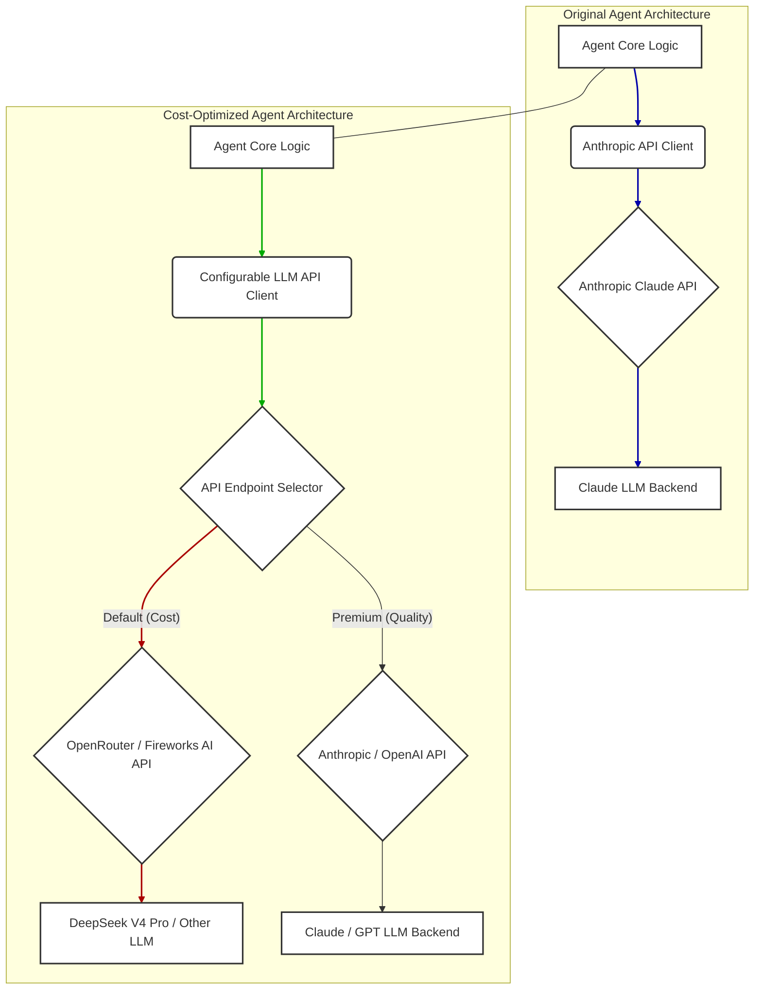

LLM 기반 에이전트의 환경은 자동화된 워크플로우와 코드 생성에 혁신을 가져오며 빠르게 발전하고 있습니다. 그러나 강력한 독점 모델과 관련된 운영 비용은 상당할 수 있어 확장성과 실험에 제약을 줍니다. DeepClaude와 같은 프로젝트에서 제시된, 더 비용 효율적인 LLM 백엔드를 통합하는 전략은 이러한 지출을 완화하면서 강력한 에이전트 기능을 유지하는 매력적인 해결책을 제공합니다. 에이전트의 핵심 로직을 특정 LLM 공급자로부터 분리함으로써, 조직은 상당한 재정적 유연성을 얻고 단일 벤더 종속성에 대한 시스템 복원력을 향상시킬 수 있습니다. 이 접근 방식은 Claude Code CLI와 같이 도구 루프 및 상호 작용 흐름을 본질적으로 제공하며, 동시에 기반이 되는 인텔리전스를 교체할 수 있는 프레임워크에 특히 적합합니다.

## 핵심 개념: LLM 백엔드로부터 에이전트 로직 분리

에이전트 프레임워크는 다양한 도구, 파일 및 실행 환경과의 복잡한 상호 작용을 추상화하도록 설계되었으며, 종종 LLM 출력에 기반하여 이러한 작업을 조정합니다. 중요한 것은 정교한 코드 에이전트를 포함한 이러한 프레임워크의 상당수가 잘 정의된 API 계약을 통해 LLM과 주로 상호 작용한다는 점입니다. 이러한 표준화는 전략적 백엔드 전환의 길을 엽니다. DeepClaude는 Claude Code의 확립된 워크플로우, 즉 파일 편집, bash 실행 및 Git 작업이 유지되면서도 API 호출 대상을 Anthropic의 Claude에서 OpenRouter 또는 Fireworks AI와 같은 플랫폼을 통해 접근 가능한 DeepSeek V4 Pro와 같은 더 경제적인 대안으로 전환할 수 있음을 보여줍니다. 이러한 아키텍처적 분리는 LLM을 긴밀하게 결합된 구성 요소에서 플러그형 서비스로 전환시켜, 비용, 성능 및 특정 작업 요구 사항에 따라 동적 선택을 가능하게 합니다.

## 구현 전략: API 리디렉션 및 호환성

이 통합의 핵심은 에이전트 하네스에서 사용되는 API 엔드포인트를 가로채거나 재구성하는 것입니다. 처음에는 Anthropic의 API를 위해 설계된 시스템의 경우, 해당 요청을 DeepSeek V4 Pro가 제공하는 호환 가능한 엔드포인트(예: OpenRouter의 Anthropic 호환 게이트웨이 또는 Fireworks AI)로 전달하는 것이 목표입니다. 이는 주로 환경 변수 구성, API 클라이언트 설정 수정, 또는 프록시 계층 구현을 통해 이루어집니다.

```python
import os
import httpx
from openai import OpenAI # 일반적으로 OpenRouter 및 Fireworks AI에서 사용

# --- 전략 1: Open AI 호환 SDK 및 대체 엔드포인트 사용 ---
# 많은 제공업체(OpenRouter, Fireworks AI)는 Open AI 호환 API를 제공합니다.
# 이 예제는 DeepSeek V4 Pro가 Open AI 호환 엔드포인트를 통해 노출된다고 가정합니다.
def get_openai_compatible_client(base_url, api_key):
    return OpenAI(
        base_url=base_url,
        api_key=api_key
    )

# OpenRouter + DeepSeek V4 Pro 예제
# 참고: OpenRouter API 키는 일반적으로 'sk-or-...'로 시작합니다.
openrouter_client = get_openai_compatible_client(
    base_url="https://openrouter.ai/api/v1",
    api_key=os.environ.get("OPENROUTER_API_KEY") # 이 키가 DeepSeek V4 Pro에 접근 권한이 있는지 확인
)

# OpenRouter가 DeepSeek V4 Pro에 매핑하는 정확한 모델 ID를 지정합니다.
# OpenRouter 문서를 확인하세요. 예: "deepseek-ai/deepseek-v4-pro"
# response_openrouter = openrouter_client.chat.completions.create(
#     model="deepseek-ai/deepseek-v4-pro",
#     messages=[{"role": "user", "content": "Explain serverless architecture."}]
# )
# print(response_openrouter.choices[0].message.content)

# --- 전략 2: 에이전트 내에서 추상화 계층 사용 ---
# 에이전트 내부에 LLM 백엔드 선택 로직을 포함하는 것이 더 견고한 접근 방식입니다.
class LLMBackend:
    def generate(self, prompt_messages, model_name, **kwargs):
        raise NotImplementedError

class OpenRouterDeepSeekBackend(LLMBackend):
    def __init__(self, api_key):
        self.client = OpenAI(
            base_url="https://openrouter.ai/api/v1",
            api_key=api_key
        )
        self.model_map = {
            "claude-like-model": "deepseek-ai/deepseek-v4-pro", # 에이전트가 요청하는 모델을 제공업체 모델에 매핑
            "general-purpose-model": "deepseek-ai/deepseek-v4-pro-32k",
            # 필요한 경우 다른 매핑 추가
        }

    def generate(self, prompt_messages, model_name, **kwargs):
        mapped_model = self.model_map.get(model_name, model_name)
        response = self.client.chat.completions.create(
            model=mapped_model,
            messages=prompt_messages,
            **kwargs
        )
        return response.choices[0].message.content

# 에이전트 내에서 사용 예시:
# backend = OpenRouterDeepSeekBackend(os.environ.get("OPENROUTER_API_KEY"))
# agent_messages = [
#    {"role": "system", "content": "You are a helpful coding assistant."}, 
#    {"role": "user", "content": "Write a Python function to sort a list."}
# ]
# agent_response = backend.generate(agent_messages, "claude-like-model")
# print(agent_response)
```

API 호환성은 매우 중요합니다. OpenRouter와 같은 플랫폼은 광범위한 호환성(주로 OpenAI의 API 사양과)을 목표로 하지만, 요청 매개변수, 응답 형식 또는 스트리밍 동작의 미묘한 차이는 어댑터 계층이나 에이전트의 LLM 상호 작용 모듈에 대한 사소한 수정을 필요로 할 수 있습니다.

## 아키텍처 진화: 단일 LLM 통합에서 모듈형 LLM 통합으로



이 다이어그램은 아키텍처의 변화를 보여줍니다. 'Original Agent Architecture'는 단일 LLM 제공업체에 긴밀하게 연결되어 있습니다. 'Cost-Optimized Agent Architecture'는 구성 가능한 API 클라이언트와 엔드포인트 셀렉터를 도입하여, 에이전트가 미리 정의된 전략(예: 대부분의 작업에 대한 비용 효율성, 중요 작업에 대한 프리미엄 품질)에 따라 다양한 LLM 백엔드로 요청을 동적으로 라우팅할 수 있도록 합니다.

## 2026년 트렌드: 추론의 상품화와 다중 LLM 전략

2026년에는 LLM 추론의 상품화 추세가 더욱 두드러질 것입니다. DeepSeek V4 Pro와 같이 전문화되고 더 작지만 매우 유능한 모델들은 계속해서 등장하여, 훨씬 낮은 추론 비용으로 더 큰 독점 모델에 가까운 성능을 제공할 것입니다. 조직은 단일 LLM 종속성에서 벗어나, 비용 절감뿐만 아니라 복원력, 이중화, 그리고 특정 모델의 강점을 활용하기 위한 다중 LLM 전략을 채택할 것입니다. 이는 정교한 라우팅 계층, 자동화된 모델 평가 파이프라인(예: `evaluation/llm-output-validation-quality-metrics-design`와의 통합), 그리고 작업별 또는 쿼리별로 다양한 요소(비용, 지연 시간, 품질, 특정 도메인 전문성)를 최적화하기 위한 동적 전환 메커니즘을 포함할 것입니다. LLM 백엔드를 원활하게 교체할 수 있는 능력은 효율적인 하네스 엔지니어링을 위한 표준 관행이 될 것입니다.

## 트레이드오프

*   **비용 절감 vs. 모델 품질/성능**: LLM 호출량이 많고, 특정 태스크의 요구 품질이 최고 사양이 아니어도 허용 가능한 경우, 또는 개발/테스트 환경에서의 실험 비용을 극적으로 줄일 때 매우 효과적입니다. 그러나 미묘한 뉘앙스 파악, 복잡한 추론, 최신 정보 반영 등 최고 수준의 LLM 품질이 필수적인 미션 크리티컬 태스크의 경우, DeepSeek V4 Pro와 같은 모델이 Claude 3 Opus 또는 GPT-4o 수준의 퍼포먼스를 항상 보장하지 않을 수 있어 적합하지 않을 수 있습니다.

*   **유연성 및 공급망 안정화 vs. 통합 복잡성**: 특정 LLM 벤더에 대한 의존도를 낮추고, 다양한 모델을 활용하여 시스템의 회복탄력성을 높일 때, 그리고 시장에서 더 나은 가격 또는 성능의 모델이 나올 경우 빠르게 전환할 수 있을 때 유리합니다. 하지만 여러 LLM API의 미묘한 차이(프롬프트 형식, 파라미터, 출력 구조)를 처리하기 위한 어댑터 계층 개발 및 유지보수에 추가 공수가 발생할 수 있어 초기 설정 및 지속적인 관리에 오버헤드를 유발할 수 있습니다.

*   **혁신 가속화 vs. 행동 일관성 유지**: 저렴한 백엔드를 통해 더 많은 실험과 프로토타이핑을 신속하게 진행하여 AI 에이전트의 새로운 기능을 탐색하고 개발 주기를 단축할 때 이점이 있습니다. 반면, LLM 백엔드 변경은 에이전트의 행동 방식, 응답 스타일, 특정 문제 해결 접근 방식에 미묘하지만 중요한 변화(드리프트)를 일으킬 수 있습니다. 일관된 사용자 경험이나 예측 가능한 에이전트 동작이 중요한 서비스에서는 이러한 드리프트 관리가 복잡해질 수 있습니다.

*   **API 호환성 증대 vs. 잠재적 제약**: OpenRouter와 같은 플랫폼이 다양한 LLM을 표준화된 API(주로 OpenAI 호환)로 제공하여 통합 노력을 줄여줄 때 유리합니다. 하지만 표준화된 API는 모든 LLM의 고유한 고급 기능(예: Claude의 특정 툴 유스, 특정 시스템 프롬프트 포맷)을 완전히 노출하지 못할 수 있어, 에이전트가 해당 LLM의 잠재력을 100% 활용하지 못하게 할 수 있습니다.

## 실전 체크리스트

*   - [ ] **API 호환성 검증**: 기존 에이전트 코드와 새로운 LLM 백엔드(예: DeepSeek V4 Pro via OpenRouter)의 API 규격(요청/응답 형식, 파라미터, 스트리밍 동작)이 100% 호환되는지 기능 테스트 및 통합 테스트를 완료했는가?
*   - [ ] **출력 품질 평가 파이프라인 통합**: 새로운 LLM 백엔드로 전환 후, `evaluation/llm-output-validation-quality-metrics-design`에서 정의된 핵심 태스크에 대한 LLM 출력 품질 메트릭(정확성, 일관성, 유효성, 안전성)이 최소 허용 기준을 충족하는지 자동화된 평가 파이프라인을 통해 지속적으로 검증하는가?
*   - [ ] **비용 및 성능 모니터링 시스템 구축**: DeepSeek V4 Pro 등 저렴한 LLM 사용 시 실제 API 호출 비용, 지연 시간(Latency), 처리량(Throughput) 데이터를 실시간으로 수집하고, 예상 비용 및 성능 지표와 비교하는 모니터링 대시보드를 구축하여 최적화 효과를 추적하는가?
*   - [ ] **드리프트 탐지 및 완화 전략**: 모델 교체로 인한 에이전트 행동 변화(드리프트)를 조기에 탐지하고, 필요한 경우 자동으로 이전 백엔드로 롤백하거나 프롬프트 엔지니어링을 통해 보정하는 `harness-engineering/drift-detection-methodology` 기반의 메커니즘을 설계하고 운영하는가?
*   - [ ] **보안 및 규정 준수 검토**: 새로운 LLM 백엔드 제공업체가 데이터 보안 표준(예: 암호화, 접근 제어), 개인 정보 보호 정책(GDPR, CCPA), 그리고 산업별 규정 준수 요구사항을 충족하는지 법률 및 보안 팀과 협력하여 철저히 검토했는가?
*   - [ ] **동적 라우팅 및 폴백 전략**: 비용 효율적인 LLM을 기본으로 사용하되, 특정 복잡하거나 중요도가 높은 태스크에 대해서는 고성능 LLM으로 자동 전환하거나, 저렴한 LLM이 실패할 경우 고성능 LLM으로 폴백(fallback)하는 `agents/multi-llm-agent-workload-partitioning-patterns`와 유사한 동적 라우팅 전략을 구현했는가?
*   - [ ] **프롬프트 엔지니어링 최적화**: 새로운 LLM 백엔드의 특성(예: 강점, 약점, 토큰 한도)에 맞춰 프롬프트 엔지니어링 전략을 재검토하고 최적화하여, `context-engineering/ai-agent-context-window-optimization-session-longevity`를 고려한 컨텍스트 활용을 최대화하고 비용 효율적인 출력을 유도했는가?