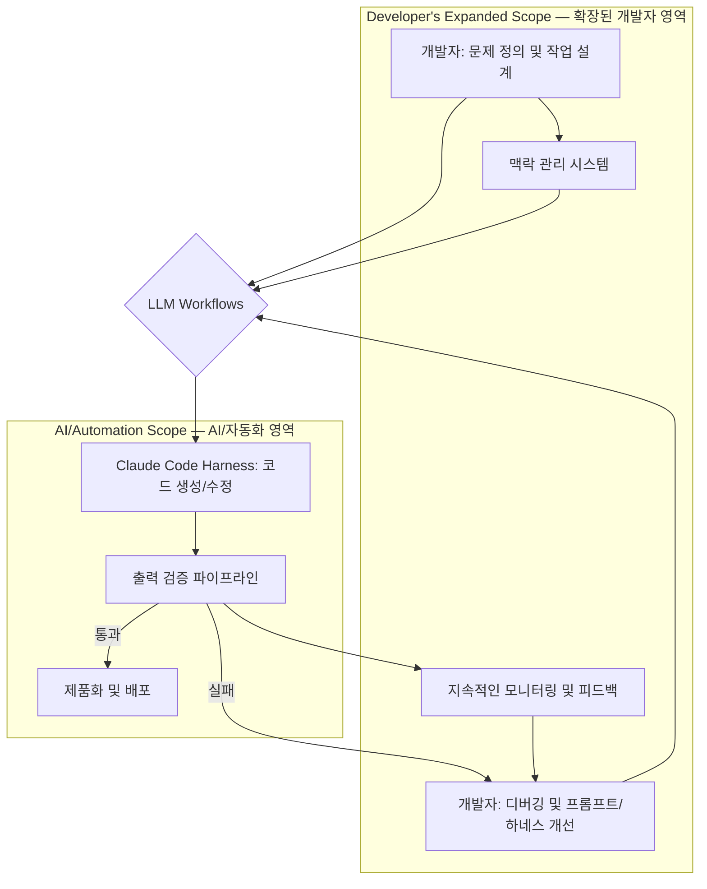

AI 기반 코드 생성 및 수정 능력이 고도화됨에 따라, 개발자의 핵심 역량은 단순히 코드를 작성하는 것을 넘어 문제 정의, 작업 설계, 맥락 관리, 그리고 최종 결과물에 대한 엄격한 검증 및 제품화 지원으로 진화하고 있습니다. 특히 Playbook의 LLM 기반 워크플로우, 예를 들어 Claude Code Harness 및 출력 검증 파이프라인 설계에서 이러한 역할 재정의는 하네스 엔지니어링(Harness Engineering)의 관점에서 필수적입니다.

## AI 코딩 시대의 개발자 역할 변화

LLM이 상당수의 코딩 작업을 자동화하면서, 개발자는 이제 지능형 에이전트(Intelligent Agent) 또는 LLM 기반 시스템의 '설계자'이자 '감독자' 역할을 수행하게 됩니다. 핵심 변화는 다음과 같습니다.

*   **문제 정의 (Problem Definition)**: 모호한 비즈니스 요구사항을 LLM이 이해하고 실행할 수 있는 구체적인 태스크로 변환하여 초기 가이드를 제공합니다.
*   **작업 설계 (Task Design)**: 복잡한 태스크를 LLM이 순차적으로 처리할 수 있는 작은 단계로 분해하고, 각 단계의 입력과 출력을 정의하여 효과적인 '생각의 과정(Chain of Thought)' 및 도구 사용(Tool Use)을 유도합니다.
*   **맥락 관리 (Context Management)**: LLM이 작업 수행에 필요한 모든 관련 정보를 적절한 시점에 제공하고, 불필요한 정보는 제거하여 '컨텍스트 윈도우(Context Window)'를 효율적으로 활용합니다. 장기 기억(Long-term Memory) 시스템, 검색 증강 생성(RAG) 기법 등이 활용됩니다.
*   **출력 검증 (Output Validation)**: LLM이 생성한 코드, 문서, 데이터 등의 결과물이 요구사항을 충족하는지, 잠재적 오류나 취약점은 없는지 체계적으로 검증합니다. 이는 단위 테스트를 넘어 통합 테스트, 보안 검토를 포함합니다.
*   **제품화 지원 (Productization Support)**: LLM 기반 솔루션을 실제 서비스 환경에 배포 및 운영하기 위한 MLOps 파이프라인 구축, 모니터링, 오류 처리 및 지속적인 개선 프로세스를 설계합니다.

### Playbook LLM 워크플로우: Claude Code Harness 및 출력 검증

Playbook 시스템에서 Claude Code Harness는 AI가 직접 코드를 작성하고 수정하는 핵심 컴포넌트입니다. 개발자는 이 Harness의 입력 프롬프트(Prompt), 출력 파서(Parser), 그리고 검증 로직을 설계하고 관리합니다. 예를 들어, 특정 API 클라이언트 코드를 생성해야 할 때, 개발자는 Claude에게 필요한 명세(Specification), 예시 코드, 제약 조건 등을 명확히 전달하는 프롬프트를 설계하며, 생성된 코드의 유효성을 검사하는 파이프라인을 구축합니다.

```python
import json
import ast

def generate_api_client_code_prompt(api_spec: dict, language: str, auth_method: str) -> str:
    """
    API 명세를 기반으로 API 클라이언트 코드 생성 프롬프트를 구성합니다.
    """
    prompt = f"""
    You are an expert {language} developer assistant tasked with generating a robust API client.
    Based on the following OpenAPI/Swagger specification, generate a {language} client for the API.

    <api_specification>
    {json.dumps(api_spec, indent=2)}
    </api_specification>

    <requirements>
    1. The client should use {auth_method} for authentication.
    2. Include error handling for network issues and API responses.
    3. Generate functions for all defined endpoints.
    4. The output must be valid {language} code, wrapped in <{language}>...</{language}> tags.
    </requirements>

    Ensure the generated code is production-ready and follows best practices.
    """
    return prompt

def validate_generated_code_structure(generated_code: str, expected_functions: list) -> bool:
    """
    LLM이 생성한 코드를 파싱하고, 필수 함수가 포함되어 있는지 검증합니다.
    실제 환경에서는 정적 분석 도구, 린터, 테스트 실행 등을 통합합니다.
    """
    try:
        tree = ast.parse(generated_code)
        found_functions = {node.name for node in ast.walk(tree) if isinstance(node, ast.FunctionDef)}
        return all(func in found_functions for func in expected_functions)
    except SyntaxError:
        return False
    except Exception:
        return False

# Example Usage
# api_spec_data = {"/users": {"get": {"summary": "List users"}}}
# prompt_text = generate_api_client_code_prompt(api_spec_data, "python", "OAuth2")
# print(prompt_text)
# 
# sample_generated_code = """
# def get_users(): pass
# def create_user(name, email): pass
# """
# is_valid = validate_generated_code_structure(sample_generated_code, ["get_users", "create_user"])
# print(f"Code validation result: {is_valid}") # Expected: True
```

### LLM 워크플로우 설계자로서의 개발자 역할 다이어그램



## 트레이드오프

LLM 워크플로우 설계에서 개발자의 역할 재정의는 여러 가지 트레이드오프를 수반합니다.

*   **높은 초기 투자 vs 장기적 생산성 향상**:
    *   **좋은 경우**: 복잡한 LLM 워크플로우와 검증 시스템 구축은 초기 투자가 크지만, 반복적인 코딩 작업을 자동화하여 장기적으로 개발자의 생산성을 크게 향상시킬 수 있습니다.
    *   **나쁜 경우**: LLM의 한계를 간과하고 초기 설계에 실패하면, LLM 생성 코드 수정 및 검증에 더 많은 시간이 소요되어 생산성이 저하될 수 있습니다.
*   **추상화 수준 증가 vs 제어의 상실 위험**:
    *   **좋은 경우**: 개발자는 고수준의 문제 정의에 집중하며 시스템 아키텍처 이해도를 높일 수 있습니다.
    *   **나쁜 경우**: LLM이 블랙박스처럼 작동하여 내부 논리 이해가 어렵거나 예상치 못한 동작 시 디버깅이 복잡해지며, 시스템 예측 가능성이 저해될 수 있습니다.
*   **새로운 스킬셋 요구 vs 기존 스킬의 무력화**:
    *   **좋은 경우**: 프롬프트 엔지니어링, 컨텍스트 관리 등 새로운 기술 역량 습득 기회를 제공하여 개발자의 가치를 높입니다.
    *   **나쁜 경우**: 기존 코딩 중심 역량만 고수하는 개발자에게는 역할 변화가 부담이 될 수 있으며, 팀 내 기술 격차를 유발할 수 있습니다.
*   **자동화된 스케일링 vs 고비용 운영**:
    *   **좋은 경우**: 반복적이고 단순한 작업을 대규모로 자동화하여 인적 자원 없이도 스케일링이 가능합니다.
    *   **나쁜 경우**: LLM API 호출 비용이 예상보다 높거나 불필요한 호출이 빈번하면 운영 비용이 급증할 수 있으므로, 비용 효율성을 고려한 하네스 설계가 필수적입니다.
*   **빠른 프로토타이핑 vs 신뢰성 및 보안 위험**:
    *   **좋은 경우**: LLM은 아이디어를 빠르게 코드로 구현하여 프로토타입 개발 속도를 극대화합니다.
    *   **나쁜 경우**: LLM이 생성한 코드의 보안 취약점, 버그 가능성을 간과하면 심각한 시스템 장애나 보안 사고로 이어질 수 있으므로, 강력한 검증 및 보안 감사 프로세스가 필수적입니다.

## 실전 체크리스트

LLM 워크플로우 설계 시 개발자 역할 재정의를 성공적으로 수행하기 위한 실전 체크리스트입니다.

*   [ ] **명확한 문제 정의 및 목표 설정**: LLM이 해결할 구체적인 문제와 기대 결과물을 명확히 정의했는가?
*   [ ] **단계별 작업 분해 및 프롬프트 설계**: 복잡한 태스크를 LLM이 처리할 수 있는 작은 단계로 분해하고, 각 단계에 대한 효과적인 프롬프트(Tool Use 포함)를 설계했는가?
*   [ ] **컨텍스트 관리 전략 수립**: LLM에 제공되는 컨텍스트의 관련성, 최신성, 효율성을 최적화하기 위한 RAG, 장기 기억, 컨텍스트 압축 등의 전략을 수립했는가?
*   [ ] **자동화된 출력 검증 파이프라인 구축**: LLM 생성 코드/출력물에 대한 정적 분석, 린팅, 테스트, 보안 검사 등을 포함하는 자동화된 검증 파이프라인을 구축했는가?
*   [ ] **인간 피드백 루프 설계**: LLM의 실패 사례를 분석하고, 프롬프트, 하네스, 또는 워크플로우를 개선하는 지속적인 인간 피드백 메커니즘을 마련했는가?
*   [ ] **LLM 비용 및 성능 모니터링**: LLM API 호출 비용과 작업 처리 시간을 지속적으로 모니터링하고, 비용 효율적인 모델 라우팅 또는 캐싱 전략을 적용했는가?
*   [ ] **보안 및 규정 준수 검토**: LLM이 생성하는 코드나 데이터가 잠재적인 보안 취약점이나 조직의 규정 준수 요건을 위반하지 않도록 정기적인 검토 프로세스를 통합했는가?