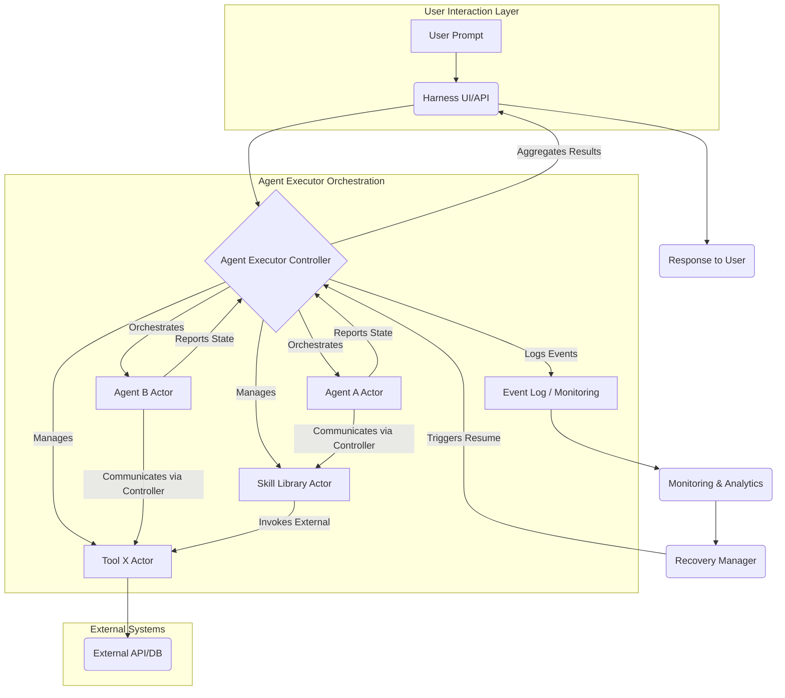

## Google Agent Executor: 분산 에이전트 런타임 하네스 통합 검토

최근 AI 에이전트 기반 시스템의 복잡도가 심화됨에 따라, 시스템의 신뢰성, 안전성, 효율성, 그리고 유연한 커스터마이징 가능한 실행 환경의 중요성이 부각되고 있습니다. 특히 `hub-worker` 복리 자동화와 고도화된 AI 에이전트 하네스 환경에서는 예측 불가능한 상황에 대한 견고한 대응과 안정적인 운영이 필수적입니다. Google에서 오픈소스화한 Agent Executor는 이러한 현대적 요구사항을 충족시키기 위해 설계된 분산 에이전트 런타임으로, 에이전트틱 루프의 조율과 실행 관리를 위한 강력한 프레임워크를 제공합니다. 본 문서는 Agent Executor의 아키텍처를 분석하고, 기존 `hub-worker` 복리 자동화 및 AI 에이전트 하네스에 대한 통합 가능성을 심층적으로 검토합니다.

### Agent Executor 핵심 아키텍처 분석

Agent Executor는 다음의 핵심 원칙과 컴포넌트를 기반으로 분산 에이전트 실행의 신뢰성과 효율성을 확보합니다:

1.  **에이전트틱 루프 조율 (Agentic Loop Orchestration)**: 에이전트의 의사결정 및 액션 실행 과정을 체계적으로 관리하여 복잡한 태스크를 안정적으로 수행할 수 있도록 지원합니다. 이는 `inference-chain-design-complex-ai-agents`에서 요구되는 복잡한 로직의 실행을 보다 구조화된 방식으로 처리하게 합니다.
2.  **이벤트 로깅 및 실행 관리 (Event Logging & Execution Management)**: 모든 에이전트 활동을 상세히 로깅하여 실행 흐름을 투명하게 추적하고, 문제 발생 시 디버깅 및 복구를 용이하게 합니다. 이 기능은 `playbook-ai-integrated-logging-system` 구축에 필수적인 요소로, `agentic-cron-zero-output-silent-success-detection`과 같은 미묘한 문제를 감지하는 데 결정적인 역할을 합니다.
3.  **격리된 액터 모델 (Isolated Actor Model)**: 컨트롤러(Controller), 스킬(Skill), 도구(Tool), 에이전트(Agent)와 같은 다양한 컴포넌트를 독립적인 액터로 실행합니다. 이 격리 모델은 각 컴포넌트 간의 간섭을 최소화하고 장애 전파를 방지하며, `multi-agent-system-efficient-interaction-design-patterns` 구현에 강력한 기반을 제공합니다. 액터는 로컬 또는 원격 환경에서 유연하게 배포 및 통신할 수 있습니다.
4.  **자동 복구 및 재개 (Automated Recovery & Resumption)**: 실패하거나 중단된 에이전트 실행을 자동으로 감지하고 복구하여, 전체 시스템의 가용성을 높입니다. 이는 `concurrent-fault-tolerant-ai-workflow-design-patterns`에서 핵심적으로 다루는 내용으로, 시스템의 운영 안정성을 극대화합니다.

### Playbook Hub-Worker 복리 자동화에의 적용

`playbook`의 `hub-worker-compounding-pattern`은 작업의 연속성과 신뢰성이 매우 중요합니다. Agent Executor의 분산 런타임은 다음과 같은 방식으로 이점을 제공하여 복리 자동화 시스템의 안정성을 획기적으로 향상시킬 수 있습니다.

*   **향상된 신뢰성 및 장애 격리**: 각 `worker`의 작업을 독립된 액터로 실행함으로써, 특정 `worker`의 실패가 전체 `hub` 시스템에 미치는 영향을 최소화합니다. Agent Executor의 자동 복구 메커니즘은 중단된 작업을 신속하게 재개하여 `agentic-hub-phase-lock-steady-state`와 같은 높은 수준의 안정성 목표 달성에 기여합니다.
*   **투명한 실행 로깅 및 감사**: 모든 `hub` 및 `worker` 활동이 Agent Executor의 상세 이벤트 로깅 시스템에 기록됩니다. 이를 통해 자동화된 작업의 진행 상황, 에러 발생 지점, 그리고 복구 과정을 명확하게 파악할 수 있으며, 이는 `agentic-loop-analytical-chain-lite-mode`를 통해 시스템 상태를 분석하고 최적화하는 데 필수적인 데이터가 됩니다.
*   **유연한 스케일링 및 자원 관리**: `worker` 액터를 로컬 또는 원격으로 유연하게 배포하고 관리할 수 있어, 필요에 따라 `worker` 풀을 동적으로 확장하거나 축소하는 것이 용이합니다. 이는 `agentic-parallel-ecosystem-integration-lag-commit-density-asymmetry` 문제를 효과적으로 관리하고 자원 효율성을 높이는 데 도움을 줍니다.

### AI 에이전트 하네스에의 통합 가능성

AI 에이전트 하네스는 다양한 LLM 에이전트와 도구를 통합하고 오케스트레이션하는 복합적인 시스템입니다. Agent Executor는 이러한 하네스 설계에 견고한 기반을 제공하여, `distributed-ai-harness-design`의 핵심 과제를 해결할 수 있습니다.

*   **안전성 및 제어 강화**: 에이전트, 스킬, 도구를 격리된 액터로 실행함으로써, 각 컴포넌트의 동작 범위를 명확히 제한하고 악의적인 또는 의도치 않은 행위를 방지하는 `ai-agent-safety-constraint-control-design-patterns`을 구현하는 데 매우 유리합니다. 컨트롤러는 이러한 액터들의 통신과 상호작용을 엄격하게 관리합니다.
*   **커스터마이징 및 확장성**: 새로운 스킬이나 도구를 추가하거나 기존 에이전트의 로직을 변경할 때, 격리된 액터 모델 덕분에 전체 시스템에 미치는 영향을 최소화하면서 모듈식으로 개발하고 배포할 수 있습니다. 이는 `llm-agent-tool-use-design-patterns`의 유연한 구현과 `multi-llm-agent-workload-partitioning-patterns`을 통한 복잡한 태스크 분할을 용이하게 합니다.
*   **효율적인 자원 관리 및 오케스트레이션**: 분산 환경에서 액터들을 효율적으로 스케줄링하고 자원을 할당함으로써, `multi-agent-collaboration-design-patterns` 시나리오에서도 최적의 성능을 유지할 수 있습니다. `llm-workflow-orchestration-business-logic-patterns`을 Agent Executor의 컨트롤러를 통해 구현하여 에이전트의 복잡한 목표 달성을 위한 계획 및 실행을 구조화할 수 있습니다.

다음 Mermaid 다이어그램은 Agent Executor의 아키텍처가 AI 에이전트 하네스에 어떻게 개념적으로 적용될 수 있는지 보여줍니다.

### 2026년 최신 트렌드 반영

2026년 AI 에이전트 기술은 점차 복잡한 다중 에이전트 시스템, 장기 기억 및 자율 학습, 그리고 실시간 상호작용 능력으로 발전하고 있습니다. 이러한 트렌드 속에서 Agent Executor와 같은 분산 런타임은 `llm-scalable-service-architecture-patterns`와 `realtime-ai-model-deployment-monitoring-patterns`을 구현하는 데 필수적인 인프라스트럭처로 자리매김합니다. 에이전트 시스템의 '신뢰성'은 더 이상 선택 사항이 아니며, 다양한 모달리티와 복잡한 의사결정 체인을 처리하는 과정에서 '안전성'과 '투명성'은 핵심 요구사항이 됩니다. Agent Executor는 이러한 복잡성 증가에 대응하여 시스템의 안정성과 관리 용이성을 제공하는 현대적인 해법입니다.

## 트레이드오프

### 1. 초기 복잡성 vs. 장기적 안정성
*   **언제 좋은가**: 복잡하고 미션 크리티컬한 AI 에이전트 시스템, `hub-worker` 자동화와 같이 높은 신뢰성과 가용성이 요구되는 경우. 액터 모델 기반의 구조는 장기적으로 유지보수 용이성과 문제 해결에 큰 이점을 제공하며, `agentic-worker-incident-triage-transient-vs-structural-ci-failure-classification`과 같은 복잡한 장애 유형 분류 및 대응에 유리합니다.
*   **언제 나쁜가**: 단순한 단일 에이전트 스크립트나 프로토타입 개발 단계에서는 Agent Executor의 도입이 불필요한 오버헤드와 학습 곡선을 발생시킬 수 있어, 개발 속도가 저하될 수 있습니다.

### 2. 자원 오버헤드 vs. 격리 및 복구 능력
*   **언제 좋은가**: 각 컴포넌트의 독립적인 실행과 자동 복구 기능이 필수적인 경우. 액터 간의 격리는 장애 전파를 효과적으로 차단하고, 예측 불가능한 에이전트의 행동을 `llm-agent-tool-call-reliability-forge-guardrails`와 같은 방식으로 안전하게 관리하는 데 기여합니다.
*   **언제 나쁜가**: 자원이 극도로 제한적이거나, 마이크로 서비스 수준의 분산 오버헤드를 감당하기 어려운 환경에서는 액터 모델의 자원 소비가 부담이 될 수 있으며, 이는 `on-device-llm-inference-efficiency-patterns`과 같은 엣지 컴퓨팅 시나리오에선 재고가 필요합니다.

### 3. 유연한 확장성 vs. 표준화된 인터페이스
*   **언제 좋은가**: 다양한 종류의 에이전트, 스킬, 도구를 통합하고 향후 시스템의 유연한 확장이 필요한 경우. Agent Executor는 표준화된 인터페이스를 통해 새로운 컴포넌트의 추가와 `multi-llm-routing-design-patterns-cost-performance` 전략 구현을 용이하게 합니다.
*   **언제 나쁜가**: 모든 컴포넌트가 고도로 결합되어 있고, 특정 기술 스택에 종속되어 유연한 확장이 고려되지 않은 레거시 시스템에는 통합의 어려움이 있으며, 기존 시스템의 대대적인 리팩토링이 필요할 수 있습니다.

### 4. 상세 로깅 vs. 성능 영향
*   **언제 좋은가**: 에이전트 실행의 투명성을 확보하고, 문제 발생 시 정확한 원인 분석 및 감사(audit)가 필요한 경우. 모든 이벤트 로깅은 시스템의 신뢰성을 높이고 `llm-ops-pipeline-design-patterns-production-strategy`의 핵심 요소인 관측 가능성(observability)을 제공하는 데 필수적입니다.
*   **언제 나쁜가**: 고처리량(high-throughput)과 저지연(low-latency)이 극도로 중요한 워크로드에서는 과도한 로깅이 성능 병목 현상을 유발할 수 있으며, 이 경우 로깅 수준을 조절하거나 비동기 로깅 패턴을 고려해야 합니다.

## 실전 체크리스트

Agent Executor를 `playbook` 또는 AI 에이전트 하네스에 성공적으로 적용하기 위한 실전 체크리스트는 다음과 같습니다.

*   [ ] **기존 Hub-Worker 패턴 장애 분석**: 현재 `hub-worker-compounding-pattern`에서 발생하는 주요 장애 유형, 복구 시간, 그리고 `silent-drift-family-pattern`을 포함한 신뢰성 문제점을 식별하고, Agent Executor 도입을 통한 개선 목표를 명확히 설정했는가?
*   [ ] **액터 모델 매핑 및 설계**: 현재 `hub`, `worker`, 그리고 AI 에이전트 하네스의 각 컴포넌트(LLM 에이전트, 도구, 스킬)를 Agent Executor의 컨트롤러, 에이전트, 스킬, 도구 액터로 어떻게 매핑할지 상세 설계를 완료하고, 액터 간의 통신 프로토콜을 정의했는가?
*   [ ] **이벤트 로깅 및 모니터링 통합 전략**: Agent Executor의 이벤트 로깅 기능을 활용하여 `agentic-loop-analytical-chain-lite-mode` 및 `agentic-worker-incident-triage-transient-vs-structural-ci-failure-classification`을 위한 모니터링 대시보드와 알림 시스템 구축 계획을 수립하고, 주요 지표(KPI)를 정의했는가?
*   [ ] **장애 복구 시나리오 및 테스트 계획**: 에이전트 또는 스킬 액터의 실패, 네트워크 단절, 외부 API 타임아웃 등 다양한 장애 상황에 대한 자동 복구 및 재개 메커니즘을 상세히 정의하고, 최소 5개의 핵심 시나리오에 대한 통합 테스트 계획을 수립했는가?
*   [ ] **성능 벤치마킹 및 최적화 로드맵**: Agent Executor 도입 전후의 시스템 자원 사용량 (CPU, 메모리, 네트워크) 및 작업 처리량에 대한 벤치마킹을 수행하고, 성능 병목 현상 발생 시 `llm-scalable-service-architecture-patterns`에 따라 최적화 전략 (예: 캐싱, 병렬 처리)을 수립했는가?
*   [ ] **보안 및 접근 제어 검토**: 격리된 액터 간의 통신 및 외부 시스템 접근에 대한 `ai-agent-safety-constraint-control-design-patterns`과 같은 보안 정책을 수립하고, 권한 관리 시스템(IAM)과의 통합 방안을 검토하여 잠재적인 보안 취약점을 최소화했는가?
*   [ ] **점진적 통합 로드맵 및 위험 관리**: 기존 시스템과의 충돌을 최소화하고 도입 위험을 분산하기 위한 점진적 통합 로드맵(예: 단계별 컴포넌트 마이그레이션, A/B 테스트, 카나리 배포)을 수립하고, 각 단계별 성공 기준과 롤백 전략을 명시했는가?