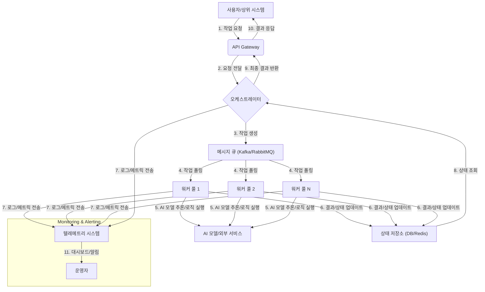

대규모 AI 시스템, 특히 복잡한 LLM 기반의 에이전트 워크플로우를 프로덕션 환경에서 운영하기 위해서는 단순한 모델 배포를 넘어선 견고한 인프라가 필수적입니다. '하네스(Harness)'는 이러한 AI 시스템의 실행, 모니터링, 관리 및 테스트를 위한 제어 프레임워크를 의미합니다. '분산형 하네스'는 이 기능을 다수의 노드에 분산시켜 시스템의 안정성, 확장성, 그리고 효율성을 극대화하는 설계 패턴입니다. 이는 단일 장애 지점(Single Point of Failure)을 제거하고, 리소스 활용도를 최적화하며, 복잡한 AI 워크플로우를 병렬로 처리할 수 있는 기반을 제공합니다.

### 왜 대규모 AI 시스템에 분산형 하네스가 필요한가?
대규모 AI 시스템은 다음과 같은 특성 때문에 분산형 하네스 없이는 안정적인 운영이 어렵습니다:
*   **높은 처리량 요구사항 (High Throughput Requirements)**: 수많은 동시 요청이나 대량의 데이터 처리가 필요합니다.
*   **복잡한 워크플로우 (Complex Workflows)**: 여러 AI 모델, 외부 도구, 데이터 처리 단계를 포함하는 다단계 프로세스가 일반적입니다.
*   **장애 허용 (Fault Tolerance)**: 단일 노드 또는 서비스의 장애가 전체 시스템에 영향을 미치지 않아야 합니다.
*   **확장성 (Scalability)**: 비즈니스 요구사항에 따라 유연하게 리소스를 확장하거나 축소할 수 있어야 합니다.
*   **관측 가능성 (Observability)**: 시스템의 각 구성 요소와 워크플로우의 상태를 실시간으로 모니터링하고 디버깅할 수 있어야 합니다.
*   **비용 효율성 (Cost Efficiency)**: 유휴 리소스를 최소화하고, 필요한 만큼만 컴퓨팅 자원을 활용해야 합니다.

### 핵심 디자인 원칙
대규모 AI 시스템을 위한 분산형 하네스는 다음 원칙을 기반으로 설계됩니다.

#### 1. 탈중앙화 및 독립적인 워커 (Decentralization & Independent Workers)
중앙 집중식 컨트롤러의 부하를 줄이고, 각 작업(task)이 독립적인 워커(worker)에 의해 처리되도록 합니다. 워커는 상태 비저장(stateless) 또는 최소한의 상태를 유지하여 쉽게 확장되거나 교체될 수 있도록 설계합니다.

#### 2. 비동기 메시징 및 큐 (Asynchronous Messaging & Queues)
오케스트레이터(orchestrator)와 워커 간의 통신은 주로 비동기 메시지 큐(Message Queue, MQ)를 통해 이루어집니다. 이를 통해 워커는 작업을 유연하게 가져가 처리하고, 오케스트레이터는 워커의 상태에 구애받지 않고 작업을 스케줄링할 수 있습니다. RabbitMQ, Kafka, SQS와 같은 메시지 큐 시스템이 활용될 수 있습니다.

#### 3. 탄력성 및 재시도 메커니즘 (Resilience & Retry Mechanisms)
네트워크 불안정성, 워커 장애, 일시적인 리소스 부족 등 다양한 실패 시나리오에 대비하여, 작업 재시도(retry), 데드 레터 큐(Dead Letter Queue, DLQ), 서킷 브레이커(circuit breaker) 등의 메커니즘을 포함해야 합니다.

#### 4. 상태 관리 및 일관성 (State Management & Consistency)
분산 환경에서 AI 워크플로우의 진행 상태와 중간 결과물은 중앙 집중식 또는 분산형 상태 저장소(State Store)에 저장되어야 합니다. 이를 통해 워커가 실패해도 다른 워커가 이어서 작업을 처리하거나 복구할 수 있습니다. DynamoDB, Redis, Cassandra 등이 사용될 수 있습니다.

#### 5. 모니터링 및 로깅 (Monitoring & Logging)
분산된 시스템의 각 구성 요소에서 발생하는 이벤트, 로그, 메트릭을 중앙 집중식으로 수집하고 분석합니다. Prometheus, Grafana, ELK Stack(Elasticsearch, Logstash, Kibana) 등이 활용되어 시스템의 건전성을 파악하고 문제를 진단합니다.

#### 6. 자율 복구 및 오토스케일링 (Self-Healing & Auto-Scaling)
워크로드 변화에 따라 워커 인스턴스를 자동으로 확장/축소(auto-scaling)하고, 비정상적인 워커를 자동으로 교체하는 자율 복구(self-healing) 기능을 구현하여 시스템의 지속적인 가용성을 보장합니다.

### 아키텍처 구성 요소

분산형 하네스는 일반적으로 다음과 같은 구성 요소로 이루어집니다.

*   **오케스트레이터 (Orchestrator)**:
    *   AI 워크플로우를 정의하고, 작업을 생성하여 메시지 큐에 발행(publish)합니다.
    *   워크플로우의 전체 진행 상태를 관리하고, 워커로부터 받은 결과를 종합합니다.
    *   예: Apache Airflow, KubeFlow, 자체 개발 서비스

*   **메시지 큐 (Message Queue)**:
    *   오케스트레이터와 워커 간의 비동기 통신을 중재합니다.
    *   작업의 신뢰성 있는 전달을 보장하고, 부하 분산을 돕습니다.
    *   예: Apache Kafka, RabbitMQ, AWS SQS, Google Cloud Pub/Sub

*   **워커 풀 (Worker Pool)**:
    *   메시지 큐에서 작업을 가져와 AI 모델 추론, 데이터 전처리, 외부 API 호출 등 실제 비즈니스 로직을 실행합니다.
    *   각 워커는 독립적으로 동작하며, 필요에 따라 수평 확장(horizontal scaling)됩니다.
    *   예: 컨테이너(Docker, Kubernetes Pod), 서버리스 함수(AWS Lambda)

*   **상태 저장소 (State Store)**:
    *   워크플로우의 메타데이터, 중간 결과, 워커의 실행 상태 등을 영구적으로 저장합니다.
    *   분산 트랜잭션 및 데이터 일관성을 위한 메커니즘을 포함할 수 있습니다.
    *   예: 관계형 데이터베이스(PostgreSQL), NoSQL 데이터베이스(DynamoDB, MongoDB), 분산 캐시(Redis)

*   **텔레메트리 시스템 (Telemetry System)**:
    *   로그(logging), 메트릭(metrics), 트레이스(tracing)를 수집하여 시스템의 가시성(observability)을 확보합니다.
    *   문제 진단, 성능 최적화, 보안 감사를 위해 필수적입니다.
    *   예: Prometheus/Grafana, ELK Stack, Jaeger, OpenTelemetry

### 분산형 하네스 아키텍처 다이어그램



### 구현 예제: Python 기반 워커 (Conceptual)

다음은 메시지 큐에서 작업을 가져와 처리하는 워커의 개념적인 Python 코드입니다. 실제 프로덕션 환경에서는 에러 핸들링, 리소스 관리, 동시성 처리 등이 더욱 정교하게 구현되어야 합니다.

```python
import os
import json
import time
import logging
from typing import Dict, Any

# Assume a message queue client (e.g., pika for RabbitMQ, confluent_kafka for Kafka)
# and a state store client (e.g., redis, boto3 for DynamoDB) are available.

# Simplified dummy clients for demonstration
class MockMessageQueueClient:
    def __init__(self):
        self.queue = []

    def receive_message(self) -> Dict[str, Any] | None:
        if self.queue:
            return self.queue.pop(0)
        return None

    def ack_message(self, message_id: str):
        logging.info(f"Acknowledged message: {message_id}")

    def nack_message(self, message_id: str, requeue: bool = True):
        logging.warning(f"NACKed message: {message_id}, requeue: {requeue}")
        if requeue:
            # In a real system, this would put it back on the queue or DLQ
            logging.info(f"Requeuing message {message_id}")

class MockStateStoreClient:
    def __init__(self):
        self.store = {}

    def update_task_status(self, task_id: str, status: str, result: Any = None):
        self.store[task_id] = {"status": status, "result": result, "updated_at": time.time()}
        logging.info(f"Task {task_id} status updated to {status}")

def process_ai_task(task_payload: Dict[str, Any]) -> Dict[str, Any]:
    """
    Simulates an AI processing task.
    In a real scenario, this would involve calling an LLM,
    running a local model, or integrating with other services.
    """
    task_id = task_payload.get("task_id")
    task_type = task_payload.get("type")
    data = task_payload.get("data")

    logging.info(f"Processing task {task_id} of type {task_type} with data: {data}")

    try:
        if task_type == "text_generation":
            # Simulate LLM call
            time.sleep(float(os.getenv("SIMULATED_LLM_LATENCY", 2.0)))
            generated_text = f"Generated response for '{data['prompt']}': Lorem ipsum..."
            return {"output": generated_text}
        elif task_type == "image_analysis":
            # Simulate image processing
            time.sleep(float(os.getenv("SIMULATED_IMAGE_LATENCY", 3.0)))
            analysis_result = f"Analysis of image {data['url']}: detected objects."
            return {"output": analysis_result}
        else:
            raise ValueError(f"Unknown task type: {task_type}")
    except Exception as e:
        logging.error(f"Error processing task {task_id}: {e}")
        raise

def worker_main(mq_client: MockMessageQueueClient, ss_client: MockStateStoreClient):
    logging.basicConfig(level=logging.INFO)
    logging.info("AI Worker started. Waiting for messages...")

    while True:
        message = mq_client.receive_message()
        if message:
            task_id = message.get("task_id", "UNKNOWN")
            logging.info(f"Received message for task: {task_id}")
            ss_client.update_task_status(task_id, "PROCESSING")

            try:
                result = process_ai_task(message)
                ss_client.update_task_status(task_id, "COMPLETED", result)
                mq_client.ack_message(task_id)
            except Exception as e:
                logging.error(f"Failed to process task {task_id}: {e}")
                ss_client.update_task_status(task_id, "FAILED", {"error": str(e)})
                mq_client.nack_message(task_id, requeue=True) # Or send to DLQ
        else:
            time.sleep(1) # Wait for new messages

if __name__ == "__main__":
    # Example usage:
    mock_mq = MockMessageQueueClient()
    mock_ss = MockStateStoreClient()

    # Simulate sending some tasks
    mock_mq.queue.append({"task_id": "task-001", "type": "text_generation", "data": {"prompt": "Generate a short story about a brave knight."}});
    mock_mq.queue.append({"task_id": "task-002", "type": "image_analysis", "data": {"url": "http://example.com/image1.jpg"}});
    mock_mq.queue.append({"task_id": "task-003", "type": "text_generation", "data": {"prompt": "Summarize recent AI trends."}});
    mock_mq.queue.append({"task_id": "task-004", "type": "unknown_task", "data": {"foo": "bar"}}); # This will fail

    # Run the worker for a few cycles
    for _ in range(5): # Process 5 messages or wait
        worker_main(mock_mq, mock_ss)
        print(f"Current State Store: {mock_ss.store}")

```

## 트레이드오프

분산형 하네스 디자인 패턴은 대규모 AI 시스템의 안정성과 확장성을 크게 향상시키지만, 다음과 같은 트레이드오프를 고려해야 합니다.

*   **복잡성 증가 (Increased Complexity) vs. 확장성 및 안정성 (Scalability & Reliability)**
    *   **언제 좋은가**: 시스템이 수많은 요청을 처리해야 하고, 단일 장애 지점을 허용할 수 없는 고가용성(High Availability) 환경에서 필수적입니다. 유휴 시간 없이 지속적으로 높은 부하를 처리해야 하는 AI 서비스에 적합합니다.
    *   **언제 나쁜가**: 소규모 프로젝트나 PoC(Proof of Concept) 단계에서는 초기 설정 및 유지보수의 복잡성이 과도할 수 있습니다. 시스템의 규모가 작거나 예측 가능한 워크로드에서는 단순한 모놀리식(Monolithic) 또는 중앙 집중식 접근 방식이 더 효율적일 수 있습니다.

*   **운영 오버헤드 (Operational Overhead) vs. 자율 복구 및 모니터링 (Self-Healing & Monitoring)**
    *   **언제 좋은가**: 시스템의 가용성과 성능을 지속적으로 보장해야 하는 미션 크리티컬(Mission-Critical) AI 애플리케이션에 매우 유리합니다. 자동 복구와 상세한 모니터링은 다운타임을 최소화하고 문제 해결 시간을 단축시킵니다.
    *   **언제 나쁜가**: 운영 인력이 부족하거나, 시스템의 장애가 비즈니스에 치명적이지 않은 경우, 분산 시스템의 배포, 모니터링, 로깅, 알림 설정을 위한 추가적인 인력과 도구에 대한 투자가 부담될 수 있습니다.

*   **리소스 소모 (Resource Consumption) vs. 효율적인 리소스 활용 (Efficient Resource Utilization)**
    *   **언제 좋은가**: 워크로드가 예측 불가능하게 급증하거나 감소하는 경우, 오토스케일링을 통해 필요한 만큼만 리소스를 할당함으로써 비용을 최적화하고 효율성을 극대화할 수 있습니다. 특히 클라우드 환경에서 유연한 자원 관리가 가능합니다.
    *   **언제 나쁜가**: 워크로드가 항상 일정하고 예측 가능한 경우, 메시지 큐, 상태 저장소, 오케스트레이터 등 분산 시스템의 기본 인프라 유지에 필요한 고정 비용이 상대적으로 더 크게 느껴질 수 있습니다.

*   **데이터 일관성 모델 복잡성 (Data Consistency Model Complexity) vs. 최종 일관성 및 성능 (Eventual Consistency & Performance)**
    *   **언제 좋은가**: 높은 처리량과 낮은 지연 시간(Low Latency)이 중요한 AI 워크로드에서 최종 일관성(Eventual Consistency) 모델은 성능 저하 없이 데이터 처리량을 늘릴 수 있습니다.
    *   **언제 나쁜가**: 금융 거래와 같이 즉각적인 강한 일관성(Strong Consistency)이 필수적인 시나리오에서는 분산 트랜잭션 구현이 매우 복잡해지거나, 성능 제약을 야기할 수 있습니다. AI 시스템에서도 중간 결과물의 실시간 일관성이 요구될 경우 설계 난이도가 높아집니다.

*   **초기 개발 시간 (Initial Development Time) vs. 장기적인 유지보수 및 확장 용이성 (Long-Term Maintainability & Extensibility)**
    *   **언제 좋은가**: 장기적으로 AI 시스템이 지속적으로 진화하고 새로운 기능이 추가될 것으로 예상될 때, 모듈화된 분산 아키텍처는 개별 구성 요소를 독립적으로 개발하고 배포할 수 있어 전체 시스템의 유지보수 및 확장을 용이하게 합니다.
    *   **언제 나쁜가**: 빠른 프로토타이핑이나 단기적인 프로젝트에서는 초기 설계 및 구현에 많은 시간이 소요되어 시장 출시(Time-to-Market)가 지연될 수 있습니다.

## 실전 체크리스트

대규모 AI 시스템을 위한 분산형 하네스를 구축할 때, 다음 체크리스트를 통해 핵심 사항들을 검토하고 구현의 완성도를 높일 수 있습니다.

*   - [ ] **워크로드 특성 분석 완료**: 처리량, 지연 시간, 피크 타임 등 AI 워크로드의 특성을 정확히 분석하고, 이에 맞는 메시지 큐 및 워커 풀 규모를 설계했는지 확인합니다.
*   - [ ] **장애 허용 및 재시도 전략 구현**: 워커 장애, 네트워크 오류, 외부 서비스 지연 등에 대비하여 메시지 재시도, 데드 레터 큐(DLQ), 서킷 브레이커 패턴이 적절히 적용되었는지 검증합니다.
*   - [ ] **중앙 집중식 로깅 및 모니터링 시스템 구축**: 모든 워커, 오케스트레이터, 메시지 큐에서 발생하는 로그, 메트릭, 트레이스가 중앙 시스템으로 수집되고, 실시간 대시보드 및 알림이 구성되었는지 확인합니다.
*   - [ ] **오토스케일링 규칙 최적화**: 워크로드 변화에 따라 워커 인스턴스가 자동으로 확장/축소되는 오토스케일링 규칙이 정의되었으며, 과도한 비용 발생 없이 효율적으로 작동하는지 정기적으로 테스트하고 최적화합니다.
*   - [ ] **상태 저장소 일관성 및 복구 전략 정의**: AI 워크플로우의 진행 상태와 중간 결과가 저장되는 상태 저장소의 데이터 일관성 모델이 비즈니스 요구사항에 부합하는지, 그리고 장애 발생 시 데이터 복구 전략이 명확하게 수립되었는지 확인합니다.
*   - [ ] **보안 및 접근 제어 적용**: 메시지 큐, 상태 저장소, AI 모델 API 등 모든 구성 요소에 대한 최소 권한(Least Privilege) 원칙에 기반한 접근 제어 및 전송 중/저장 중 암호화(Encryption in transit/at rest)가 적용되었는지 검증합니다.
*   - [ ] **End-to-End 테스트 자동화**: 분산형 하네스 전체 워크플로우를 아우르는 End-to-End 테스트 케이스를 자동화하여, 새로운 배포 시에도 시스템의 안정성과 기능 무결성을 지속적으로 검증합니다.